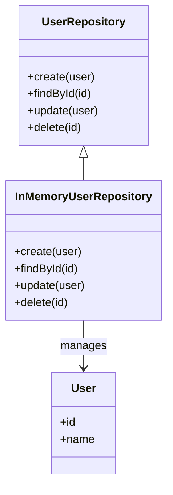

## 6.10.3 Repository Pattern

The Repository Pattern is a structural design pattern that provides an abstraction over data layers, offering a collection-like interface for accessing domain objects. This pattern is particularly useful in decoupling the application logic from the data access logic, making your code more modular, testable, and maintainable. In this section, we will delve into the implementation of the Repository Pattern in Lua, explore its use cases, and provide practical examples to illustrate its benefits.

### Intent

The primary intent of the Repository Pattern is to separate the logic that retrieves data from the underlying data source from the business logic that processes the data. By doing so, it provides a cleaner and more organized way to manage data access, allowing developers to focus on the business logic without worrying about the specifics of data retrieval.

### Key Participants

1. **Repository Interface**: Defines the methods for accessing and manipulating data.
2. **Concrete Repository**: Implements the repository interface, providing the actual data access logic.
3. **Domain Objects**: The entities that the repository manages.
4. **Data Source**: The underlying storage mechanism, such as a database or an in-memory collection.

### Applicability

Use the Repository Pattern when:

- You want to decouple the business logic from data access logic.
- You need to provide a consistent interface for data access across different data sources.
- You aim to enhance testability by using in-memory implementations for testing purposes.
- You seek to improve maintainability by organizing data access logic in a centralized location.

### Implementing Repository in Lua

#### Repositories: Objects that Mediate Between Domain and Data Mapping Layers

In Lua, a repository can be implemented as a table with functions that encapsulate the data access logic. This table acts as an interface for interacting with the data source, whether it's a database or an in-memory collection.

```lua
-- Define a simple repository interface
local UserRepository = {}

-- Function to create a new user
function UserRepository:create(user)
    -- Implementation for creating a user in the data source
end

-- Function to find a user by ID
function UserRepository:findById(id)
    -- Implementation for finding a user by ID
end

-- Function to update a user
function UserRepository:update(user)
    -- Implementation for updating a user in the data source
end

-- Function to delete a user
function UserRepository:delete(id)
    -- Implementation for deleting a user by ID
end

return UserRepository
```

#### In-memory Collections: Simulating Database Operations

In-memory collections can be used to simulate database operations, providing a lightweight and flexible way to test the repository pattern without relying on an actual database.

```lua
-- In-memory collection to simulate a database
local users = {}

-- Concrete implementation of the UserRepository
local InMemoryUserRepository = {}

function InMemoryUserRepository:create(user)
    table.insert(users, user)
    return user
end

function InMemoryUserRepository:findById(id)
    for _, user in ipairs(users) do
        if user.id == id then
            return user
        end
    end
    return nil
end

function InMemoryUserRepository:update(user)
    for i, existingUser in ipairs(users) do
        if existingUser.id == user.id then
            users[i] = user
            return user
        end
    end
    return nil
end

function InMemoryUserRepository:delete(id)
    for i, user in ipairs(users) do
        if user.id == id then
            table.remove(users, i)
            return true
        end
    end
    return false
end

return InMemoryUserRepository
```

### Use Cases and Examples

#### Testability Through In-memory Implementations

One of the significant advantages of the Repository Pattern is the ability to easily test the data access logic using in-memory implementations. This approach allows developers to write unit tests without the need for a real database, speeding up the testing process and reducing dependencies.

```lua
-- Example test case using the in-memory repository
local userRepository = require('InMemoryUserRepository')

-- Create a new user
local newUser = { id = 1, name = "John Doe" }
userRepository:create(newUser)

-- Find the user by ID
local foundUser = userRepository:findById(1)
assert(foundUser.name == "John Doe", "User should be found")

-- Update the user
newUser.name = "Jane Doe"
userRepository:update(newUser)

-- Verify the update
local updatedUser = userRepository:findById(1)
assert(updatedUser.name == "Jane Doe", "User name should be updated")

-- Delete the user
userRepository:delete(1)

-- Verify the deletion
local deletedUser = userRepository:findById(1)
assert(deletedUser == nil, "User should be deleted")
```

#### Decoupling the Application from the Data Layer

By using the Repository Pattern, you can decouple the application logic from the data access logic, making it easier to switch between different data sources or modify the data access logic without affecting the rest of the application.

### Design Considerations

- **Consistency**: Ensure that the repository provides a consistent interface for data access, regardless of the underlying data source.
- **Performance**: Consider the performance implications of using in-memory collections versus actual databases, especially for large datasets.
- **Scalability**: Design the repository to handle changes in data source or data access requirements without significant refactoring.

### Differences and Similarities

The Repository Pattern is often confused with the Data Mapper Pattern. While both patterns deal with data access, the Repository Pattern focuses on providing a collection-like interface for accessing domain objects, whereas the Data Mapper Pattern focuses on mapping domain objects to database tables.

### Visualizing the Repository Pattern



### Try It Yourself

To deepen your understanding of the Repository Pattern, try modifying the code examples provided:

- Add more methods to the `UserRepository`, such as `findAll` or `findByName`.
- Implement a different data source, such as a file-based storage, and switch between the in-memory and file-based implementations.
- Experiment with adding validation logic within the repository methods.

### Knowledge Check

- What are the key benefits of using the Repository Pattern?
- How does the Repository Pattern enhance testability?
- What are the differences between the Repository Pattern and the Data Mapper Pattern?

### Embrace the Journey

Remember, mastering design patterns like the Repository Pattern is a journey. As you continue to explore and experiment with these patterns, you'll gain a deeper understanding of how to build robust and maintainable applications. Keep experimenting, stay curious, and enjoy the journey!

## Quiz Time!



### What is the primary intent of the Repository Pattern?

- [x] To separate data access logic from business logic
- [ ] To enhance the performance of data retrieval
- [ ] To provide a user interface for data manipulation
- [ ] To enforce data validation rules

> **Explanation:** The Repository Pattern aims to separate the logic that retrieves data from the underlying data source from the business logic that processes the data.

### Which of the following is a key participant in the Repository Pattern?

- [x] Repository Interface
- [ ] User Interface
- [ ] Data Validator
- [ ] Event Handler

> **Explanation:** The Repository Interface defines the methods for accessing and manipulating data, making it a key participant in the pattern.

### How does the Repository Pattern enhance testability?

- [x] By allowing in-memory implementations for testing
- [ ] By providing built-in test cases
- [ ] By reducing the need for data validation
- [ ] By simplifying the user interface

> **Explanation:** The Repository Pattern enhances testability by allowing developers to use in-memory implementations, which can be tested without relying on a real database.

### What is a common use case for the Repository Pattern?

- [x] Decoupling application logic from data access logic
- [ ] Improving user interface design
- [ ] Enforcing security protocols
- [ ] Optimizing network communication

> **Explanation:** The Repository Pattern is commonly used to decouple application logic from data access logic, improving modularity and maintainability.

### What is a difference between the Repository Pattern and the Data Mapper Pattern?

- [x] Repository Pattern provides a collection-like interface
- [ ] Data Mapper Pattern focuses on user interface design
- [ ] Repository Pattern is used for network communication
- [ ] Data Mapper Pattern is used for data validation

> **Explanation:** The Repository Pattern provides a collection-like interface for accessing domain objects, while the Data Mapper Pattern focuses on mapping domain objects to database tables.

### Which method is typically included in a repository interface?

- [x] findById
- [ ] validateData
- [ ] renderUI
- [ ] encryptData

> **Explanation:** The `findById` method is a typical part of a repository interface, used to retrieve data by a specific identifier.

### What is a benefit of using in-memory collections in the Repository Pattern?

- [x] They allow for lightweight and flexible testing
- [ ] They enhance the security of data access
- [ ] They improve the performance of data retrieval
- [ ] They simplify user interface design

> **Explanation:** In-memory collections allow for lightweight and flexible testing, as they simulate database operations without requiring a real database.

### What should be considered when designing a repository?

- [x] Consistency of the interface
- [ ] Complexity of the user interface
- [ ] Frequency of data validation
- [ ] Number of user interactions

> **Explanation:** Consistency of the interface is important to ensure that the repository provides a uniform way to access data, regardless of the underlying data source.

### How can the Repository Pattern improve maintainability?

- [x] By organizing data access logic in a centralized location
- [ ] By reducing the need for user input
- [ ] By simplifying network communication
- [ ] By enforcing strict data validation rules

> **Explanation:** The Repository Pattern improves maintainability by organizing data access logic in a centralized location, making it easier to manage and modify.

### True or False: The Repository Pattern is only applicable to database-backed applications.

- [ ] True
- [x] False

> **Explanation:** False. The Repository Pattern can be applied to any data source, including in-memory collections, file-based storage, and more.


