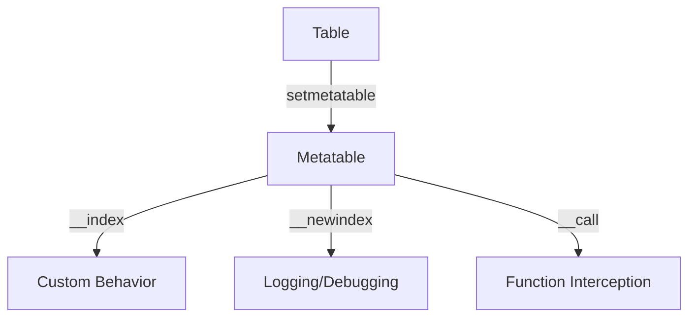

## 6.11 Effecting Large-Scale Change with Metatables

In the realm of Lua programming, metatables offer a powerful mechanism for implementing large-scale structural changes across multiple objects. By leveraging metatables, developers can dynamically modify behavior, implement shared functionalities, and introduce new capabilities without altering the underlying data structures directly. This section delves into the intricacies of using metatables for such transformations, providing insights, examples, and best practices.

### Metaprogramming for Structural Changes

Metaprogramming in Lua allows us to write code that can manipulate other code. Metatables are a cornerstone of this capability, enabling us to define custom behaviors for tables, which are the primary data structures in Lua. By using metatables, we can intercept and redefine operations on tables, such as indexing, arithmetic, and function calls.

#### Implementing Structural Changes

##### Shared Metatables

One of the most effective ways to implement structural changes is by assigning a shared metatable to multiple tables. This approach allows us to define common behaviors or properties that can be applied uniformly across different objects. 

**Example: Shared Metatable for Logging**

```lua
-- Define a metatable with a custom __index method for logging
local loggerMetatable = {
    __index = function(table, key)
        print("Accessing key:", key)
        return rawget(table, key)
    end
}

-- Create multiple tables and assign the shared metatable
local table1 = setmetatable({}, loggerMetatable)
local table2 = setmetatable({}, loggerMetatable)

-- Access elements to trigger logging
table1.name = "Table One"
print(table1.name)  -- Output: Accessing key: name

table2.age = 25
print(table2.age)   -- Output: Accessing key: age
```

In this example, both `table1` and `table2` share the same logging behavior through the `loggerMetatable`. This allows us to implement logging across multiple tables without duplicating code.

##### Dynamic Behavior Modification

Metatables enable dynamic modification of methods or properties at runtime. This flexibility is crucial for applications that require adaptability and responsiveness to changing conditions.

**Example: Dynamic Method Swapping**

```lua
-- Define a metatable with a dynamic method
local dynamicMetatable = {
    __index = function(table, key)
        if key == "greet" then
            return function()
                print("Hello, World!")
            end
        end
    end
}

-- Assign the metatable to a table
local myTable = setmetatable({}, dynamicMetatable)

-- Call the dynamically assigned method
myTable:greet()  -- Output: Hello, World!

-- Modify the method at runtime
dynamicMetatable.__index = function(table, key)
    if key == "greet" then
        return function()
            print("Greetings, Universe!")
        end
    end
end

-- Call the modified method
myTable:greet()  -- Output: Greetings, Universe!
```

Here, we dynamically change the behavior of the `greet` method by altering the metatable's `__index` function. This demonstrates how metatables can be used to adapt functionality on-the-fly.

### Use Cases and Examples

#### Adding Logging or Debugging Features Globally

Metatables can be employed to introduce logging or debugging features across an entire application. By assigning a common metatable to all relevant tables, developers can ensure consistent logging behavior without modifying individual table definitions.

**Example: Global Debugging with Metatables**

```lua
-- Define a metatable for debugging
local debugMetatable = {
    __newindex = function(table, key, value)
        print("Setting key:", key, "to value:", value)
        rawset(table, key, value)
    end
}

-- Function to apply the debugging metatable to all tables
local function applyDebugging(tables)
    for _, tbl in ipairs(tables) do
        setmetatable(tbl, debugMetatable)
    end
end

-- Create tables and apply debugging
local config = {}
local settings = {}
applyDebugging({config, settings})

-- Modify tables to trigger debugging
config.theme = "dark"  -- Output: Setting key: theme to value: dark
settings.volume = 10   -- Output: Setting key: volume to value: 10
```

This example illustrates how we can apply a debugging metatable to multiple tables, enabling global logging of changes.

#### Implementing Aspect-Oriented Programming Concepts

Aspect-Oriented Programming (AOP) focuses on separating cross-cutting concerns, such as logging and security, from the main business logic. Metatables can be used to implement AOP concepts by intercepting and modifying function calls.

**Example: Aspect-Oriented Logging**

```lua
-- Define a function to be logged
local function processData(data)
    print("Processing data:", data)
end

-- Define a metatable for logging function calls
local aspectMetatable = {
    __call = function(func, ...)
        print("Calling function:", func)
        return func(...)
    end
}

-- Wrap the function with the logging aspect
processData = setmetatable(processData, aspectMetatable)

-- Call the function
processData("Sample Data")  -- Output: Calling function: function: 0x...
                            --         Processing data: Sample Data
```

In this example, we use a metatable to log function calls, demonstrating how AOP can be implemented using Lua's metaprogramming capabilities.

#### Hot-Swapping Functionality in Running Applications

Hot-swapping refers to the ability to change code in a running application without stopping it. Metatables can facilitate hot-swapping by allowing developers to redefine functions or methods dynamically.

**Example: Hot-Swapping with Metatables**

```lua
-- Define a metatable for hot-swapping
local hotSwapMetatable = {
    __index = function(table, key)
        if key == "execute" then
            return function()
                print("Executing original function")
            end
        end
    end
}

-- Assign the metatable to a table
local module = setmetatable({}, hotSwapMetatable)

-- Call the original function
module:execute()  -- Output: Executing original function

-- Hot-swap the function
hotSwapMetatable.__index = function(table, key)
    if key == "execute" then
        return function()
            print("Executing new function")
        end
    end
end

-- Call the hot-swapped function
module:execute()  -- Output: Executing new function
```

This example showcases how metatables can be used to implement hot-swapping, allowing for seamless updates to functionality in a live application.

### Visualizing Metatable Usage

To better understand how metatables interact with tables, let's visualize the process using a diagram.



**Diagram Description:** This diagram illustrates the relationship between a table and its metatable. The metatable defines custom behaviors for indexing, new indexing, and function calls, which are applied to the table.

### Design Considerations

When using metatables for large-scale changes, it's important to consider the following:

- **Performance Impact:** Metatables can introduce overhead, especially if used extensively. Profile your application to ensure acceptable performance.
- **Complexity Management:** While metatables offer flexibility, they can also increase code complexity. Use them judiciously and document their usage clearly.
- **Compatibility:** Ensure that metatable-based changes are compatible with existing code and libraries.

### Differences and Similarities

Metatables are often compared to other metaprogramming techniques, such as reflection and dynamic proxies. While they share similarities in enabling dynamic behavior, metatables are unique to Lua and offer a lightweight, table-centric approach to metaprogramming.

### Try It Yourself

Experiment with the examples provided by modifying the metatables to introduce new behaviors or functionalities. Consider creating a metatable that logs both reads and writes to a table, or implement a metatable that restricts access to certain keys.

### Knowledge Check

- What are metatables, and how do they enable dynamic behavior in Lua?
- How can shared metatables be used to implement large-scale changes?
- What are some use cases for metatables in Lua applications?
- How can metatables facilitate hot-swapping in running applications?

### Embrace the Journey

Remember, mastering metatables is just the beginning. As you continue to explore Lua's capabilities, you'll discover even more ways to harness the power of metaprogramming. Keep experimenting, stay curious, and enjoy the journey!

## Quiz Time!



### What is a primary use of metatables in Lua?

- [x] To define custom behaviors for tables
- [ ] To create new data types
- [ ] To manage memory allocation
- [ ] To handle network communication

> **Explanation:** Metatables are used to define custom behaviors for tables, such as intercepting operations like indexing and function calls.

### How can shared metatables be beneficial?

- [x] They allow for consistent behavior across multiple tables
- [ ] They improve memory efficiency
- [ ] They simplify syntax
- [ ] They enhance security

> **Explanation:** Shared metatables enable consistent behavior across multiple tables by defining common methods or properties.

### What is a potential downside of using metatables extensively?

- [x] Increased code complexity
- [ ] Reduced code readability
- [ ] Improved performance
- [ ] Enhanced security

> **Explanation:** Extensive use of metatables can increase code complexity, making it harder to maintain and understand.

### How can metatables facilitate hot-swapping?

- [x] By allowing dynamic redefinition of functions
- [ ] By improving memory management
- [ ] By enhancing error handling
- [ ] By simplifying syntax

> **Explanation:** Metatables allow for dynamic redefinition of functions, enabling hot-swapping in running applications.

### What is Aspect-Oriented Programming?

- [x] A programming paradigm that separates cross-cutting concerns
- [ ] A method for optimizing performance
- [ ] A technique for managing memory
- [ ] A way to simplify syntax

> **Explanation:** Aspect-Oriented Programming is a paradigm that separates cross-cutting concerns, such as logging and security, from the main business logic.

### What is the role of the `__index` metamethod?

- [x] To define behavior for accessing table keys
- [ ] To manage memory allocation
- [ ] To handle network communication
- [ ] To create new data types

> **Explanation:** The `__index` metamethod defines behavior for accessing table keys, allowing for custom indexing operations.

### How can metatables be used for debugging?

- [x] By logging access and modification of table keys
- [ ] By improving memory efficiency
- [ ] By simplifying syntax
- [ ] By enhancing security

> **Explanation:** Metatables can log access and modification of table keys, providing valuable debugging information.

### What is a key consideration when using metatables?

- [x] Performance impact
- [ ] Memory allocation
- [ ] Network communication
- [ ] Syntax simplification

> **Explanation:** Metatables can introduce performance overhead, so it's important to consider their impact on application performance.

### Can metatables be used to implement new data types?

- [ ] Yes
- [x] No

> **Explanation:** Metatables are used to define custom behaviors for existing tables, not to create new data types.

### True or False: Metatables are unique to Lua.

- [x] True
- [ ] False

> **Explanation:** Metatables are a unique feature of Lua, providing a lightweight approach to metaprogramming.


