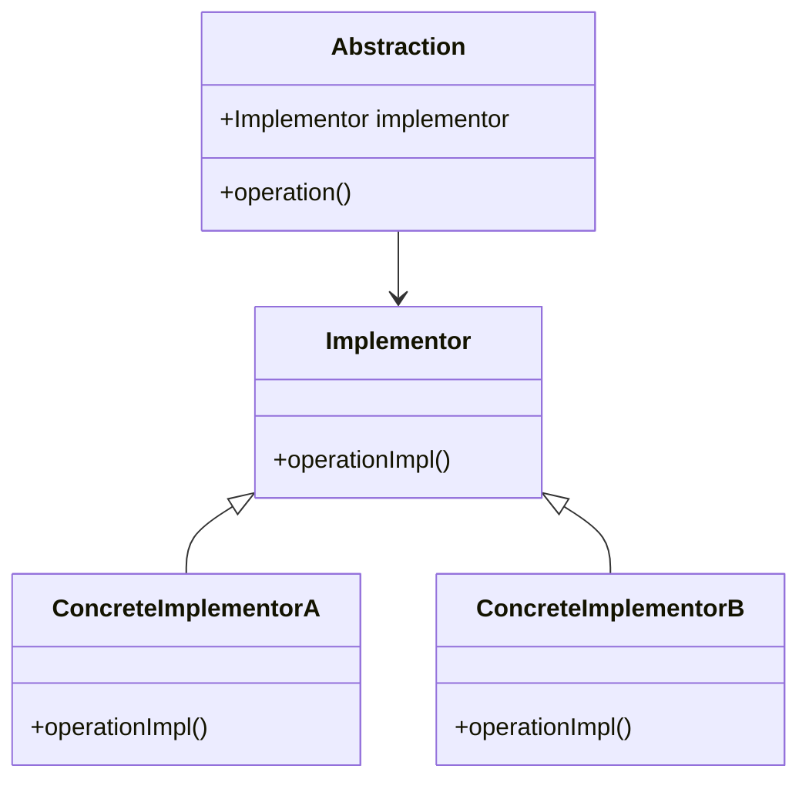

## 6.2 Bridge Pattern

The Bridge Pattern is a structural design pattern that plays a crucial role in software engineering by decoupling an abstraction from its implementation. This separation allows both the abstraction and the implementation to evolve independently, providing flexibility and scalability in software design. In this section, we will delve into the Bridge Pattern, explore its implementation in Lua, and examine its use cases and benefits.

### Intent of the Bridge Pattern

The primary intent of the Bridge Pattern is to separate an abstraction from its implementation so that the two can vary independently. This is particularly useful in scenarios where an abstraction can have multiple implementations, and you want to avoid a monolithic class hierarchy that can become unwieldy and difficult to manage.

### Key Participants

1. **Abstraction**: Defines the abstraction's interface and maintains a reference to an object of type Implementor.
2. **Refined Abstraction**: Extends the interface defined by Abstraction.
3. **Implementor**: Defines the interface for implementation classes. This interface does not need to correspond exactly to Abstraction's interface; in fact, the two interfaces can be quite different.
4. **Concrete Implementor**: Implements the Implementor interface and defines its concrete implementation.

### Implementing Bridge in Lua

In Lua, the Bridge Pattern can be effectively implemented using tables to represent both abstractions and implementors. Lua's dynamic typing and flexible table structures make it an ideal language for implementing this pattern.

#### Abstraction Tables

The abstraction in the Bridge Pattern is represented as a table that defines the high-level interface. This table maintains a reference to an implementor table, which provides the concrete implementation.

```lua
-- Abstraction
Abstraction = {}
Abstraction.__index = Abstraction

function Abstraction:new(implementor)
    local instance = setmetatable({}, self)
    instance.implementor = implementor
    return instance
end

function Abstraction:operation()
    self.implementor:operationImpl()
end
```

#### Implementor Tables

The implementor table defines the interface for the implementation classes. Concrete implementors will inherit from this table and provide specific implementations.

```lua
-- Implementor
Implementor = {}
Implementor.__index = Implementor

function Implementor:operationImpl()
    -- Default implementation (if any)
end

-- Concrete Implementor A
ConcreteImplementorA = setmetatable({}, {__index = Implementor})

function ConcreteImplementorA:operationImpl()
    print("ConcreteImplementorA operation implementation")
end

-- Concrete Implementor B
ConcreteImplementorB = setmetatable({}, {__index = Implementor})

function ConcreteImplementorB:operationImpl()
    print("ConcreteImplementorB operation implementation")
end
```

#### Composition

The Bridge Pattern leverages composition over inheritance. The abstraction table holds a reference to an implementor table, allowing it to delegate the implementation-specific behavior to the implementor.

```lua
-- Client code
local implementorA = ConcreteImplementorA
local abstractionA = Abstraction:new(implementorA)
abstractionA:operation()

local implementorB = ConcreteImplementorB
local abstractionB = Abstraction:new(implementorB)
abstractionB:operation()
```

### Visualizing the Bridge Pattern

To better understand the Bridge Pattern, let's visualize the relationship between the abstraction and implementor using a class diagram.



### Use Cases and Examples

The Bridge Pattern is particularly useful in the following scenarios:

1. **Supporting Multiple Platforms**: When developing software that needs to run on multiple platforms, the Bridge Pattern allows you to define platform-specific implementations without altering the high-level abstraction.

2. **Independent Development**: The pattern facilitates the independent development of abstraction and implementation, allowing teams to work on different parts of the system without interfering with each other.

3. **Managing Complexity**: In large systems with complex hierarchies, the Bridge Pattern helps manage complexity by decoupling the abstraction from the implementation, making the system more modular and easier to maintain.

### Design Considerations

When implementing the Bridge Pattern, consider the following:

- **Flexibility**: The pattern provides flexibility by allowing you to change the implementation without affecting the abstraction and vice versa.
- **Complexity**: While the pattern reduces complexity in large systems, it may introduce additional layers of abstraction, which can be unnecessary in simpler systems.
- **Performance**: The use of composition over inheritance can have performance implications, especially in performance-critical applications.

### Differences and Similarities

The Bridge Pattern is often confused with the Adapter Pattern. While both patterns involve interfaces, the key difference is that the Adapter Pattern is used to make incompatible interfaces work together, whereas the Bridge Pattern is used to separate an abstraction from its implementation.

### Try It Yourself

To gain a deeper understanding of the Bridge Pattern, try modifying the code examples provided:

- **Add a new concrete implementor**: Create a new implementor table and implement the `operationImpl` method with different behavior.
- **Extend the abstraction**: Add new methods to the abstraction table and see how they interact with the implementors.
- **Experiment with different compositions**: Change the implementor associated with an abstraction at runtime and observe the behavior.

### References and Links

- [Design Patterns: Elements of Reusable Object-Oriented Software](https://en.wikipedia.org/wiki/Design_Patterns)
- [Lua Programming Guide](https://www.lua.org/manual/5.4/)
- [Bridge Pattern on Refactoring.Guru](https://refactoring.guru/design-patterns/bridge)

### Knowledge Check

Before moving on, let's review some key points:

- The Bridge Pattern separates abstraction from implementation, allowing them to vary independently.
- It is implemented in Lua using tables for abstractions and implementors.
- The pattern is useful for supporting multiple platforms, independent development, and managing complexity.

### Embrace the Journey

Remember, mastering design patterns is a journey. As you continue to explore and experiment with the Bridge Pattern, you'll gain a deeper understanding of how to apply it effectively in your projects. Keep experimenting, stay curious, and enjoy the journey!

## Quiz Time!



### What is the primary intent of the Bridge Pattern?

- [x] To separate an abstraction from its implementation so that the two can vary independently.
- [ ] To make incompatible interfaces work together.
- [ ] To provide a way to create objects without specifying the exact class of object that will be created.
- [ ] To define a family of algorithms, encapsulate each one, and make them interchangeable.

> **Explanation:** The Bridge Pattern's primary intent is to separate an abstraction from its implementation, allowing them to vary independently.

### In the Bridge Pattern, what does the Abstraction maintain a reference to?

- [x] An object of type Implementor.
- [ ] A concrete class.
- [ ] A singleton instance.
- [ ] A factory method.

> **Explanation:** The Abstraction maintains a reference to an object of type Implementor, which provides the concrete implementation.

### How is the Bridge Pattern implemented in Lua?

- [x] Using tables to represent both abstractions and implementors.
- [ ] Using classes and inheritance.
- [ ] Using global variables.
- [ ] Using metatables exclusively.

> **Explanation:** In Lua, the Bridge Pattern is implemented using tables to represent both abstractions and implementors.

### What is a key difference between the Bridge Pattern and the Adapter Pattern?

- [x] The Bridge Pattern separates abstraction from implementation, while the Adapter Pattern makes incompatible interfaces work together.
- [ ] The Bridge Pattern is used for creating objects, while the Adapter Pattern is used for structuring code.
- [ ] The Bridge Pattern is only applicable to functional programming, while the Adapter Pattern is for object-oriented programming.
- [ ] The Bridge Pattern is a behavioral pattern, while the Adapter Pattern is a creational pattern.

> **Explanation:** The Bridge Pattern separates abstraction from implementation, whereas the Adapter Pattern is used to make incompatible interfaces work together.

### Which of the following is NOT a use case for the Bridge Pattern?

- [ ] Supporting multiple platforms.
- [ ] Independent development of abstraction and implementation.
- [ ] Managing complexity in large systems.
- [x] Ensuring thread safety in concurrent applications.

> **Explanation:** Ensuring thread safety in concurrent applications is not a use case for the Bridge Pattern.

### What is the role of the Implementor in the Bridge Pattern?

- [x] To define the interface for implementation classes.
- [ ] To provide a high-level interface for clients.
- [ ] To create objects without specifying the exact class.
- [ ] To manage object lifecycles.

> **Explanation:** The Implementor defines the interface for implementation classes in the Bridge Pattern.

### What is a potential drawback of using the Bridge Pattern?

- [x] It may introduce additional layers of abstraction, which can be unnecessary in simpler systems.
- [ ] It tightly couples the abstraction and implementation.
- [ ] It limits the flexibility of the system.
- [ ] It is only applicable to object-oriented programming.

> **Explanation:** A potential drawback of the Bridge Pattern is that it may introduce additional layers of abstraction, which can be unnecessary in simpler systems.

### How does the Bridge Pattern manage complexity in large systems?

- [x] By decoupling the abstraction from the implementation, making the system more modular and easier to maintain.
- [ ] By using global variables to share state across components.
- [ ] By enforcing strict inheritance hierarchies.
- [ ] By using metatables to override default behavior.

> **Explanation:** The Bridge Pattern manages complexity by decoupling the abstraction from the implementation, making the system more modular and easier to maintain.

### What is the benefit of using composition over inheritance in the Bridge Pattern?

- [x] It allows for more flexible and dynamic associations between abstractions and implementations.
- [ ] It simplifies the code by reducing the number of classes.
- [ ] It ensures that all classes have a single responsibility.
- [ ] It eliminates the need for interfaces.

> **Explanation:** Using composition over inheritance in the Bridge Pattern allows for more flexible and dynamic associations between abstractions and implementations.

### True or False: The Bridge Pattern can be used to support multiple platforms with different implementations.

- [x] True
- [ ] False

> **Explanation:** True. The Bridge Pattern can be used to support multiple platforms with different implementations by separating the abstraction from the implementation.


