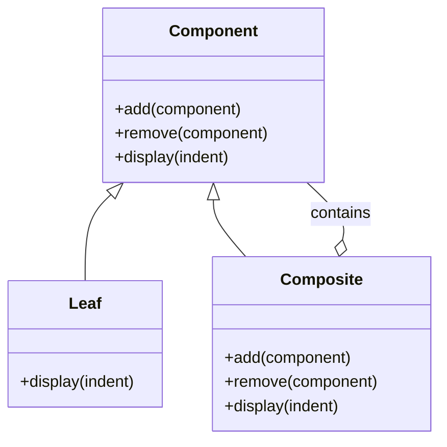

## 6.3 Composite Pattern

The Composite Pattern is a structural design pattern that allows you to compose objects into tree structures to represent part-whole hierarchies. This pattern is particularly useful when you want to treat individual objects and compositions of objects uniformly. In Lua, the Composite Pattern can be effectively used to manage complex structures like GUI components, file systems, and organizational hierarchies.

### Intent

The intent of the Composite Pattern is to allow clients to treat individual objects and compositions of objects uniformly. This pattern is especially useful when dealing with tree structures, where each node can be a composite or a leaf.

### Key Participants

1. **Component Interface**: Defines the interface for all objects in the composition.
2. **Leaf Objects**: Represents the basic elements without children.
3. **Composite Objects**: Represents elements that have children and delegate operations to them.

### Implementing Composite in Lua

To implement the Composite Pattern in Lua, we need to define a common interface for both leaf and composite objects. This interface will allow us to treat both types of objects uniformly.

#### Component Interface

The component interface defines the operations that can be performed on both leaf and composite objects. In Lua, we can use tables and metatables to define this interface.

```lua
-- Component Interface
Component = {}
Component.__index = Component

function Component:new()
    local instance = setmetatable({}, self)
    return instance
end

function Component:add(component)
    error("This method should be overridden.")
end

function Component:remove(component)
    error("This method should be overridden.")
end

function Component:display(indent)
    error("This method should be overridden.")
end
```

#### Leaf Objects

Leaf objects are the basic elements of the composition. They do not have any children and implement the component interface.

```lua
-- Leaf Object
Leaf = setmetatable({}, {__index = Component})

function Leaf:new(name)
    local instance = Component:new()
    instance.name = name
    setmetatable(instance, self)
    return instance
end

function Leaf:display(indent)
    print(string.rep("-", indent) .. self.name)
end
```

#### Composite Objects

Composite objects are elements that have children. They implement the component interface and delegate operations to their children.

```lua
-- Composite Object
Composite = setmetatable({}, {__index = Component})

function Composite:new(name)
    local instance = Component:new()
    instance.name = name
    instance.children = {}
    setmetatable(instance, self)
    return instance
end

function Composite:add(component)
    table.insert(self.children, component)
end

function Composite:remove(component)
    for i, child in ipairs(self.children) do
        if child == component then
            table.remove(self.children, i)
            break
        end
    end
end

function Composite:display(indent)
    print(string.rep("-", indent) .. self.name)
    for _, child in ipairs(self.children) do
        child:display(indent + 2)
    end
end
```

#### Recursive Functions

Recursive functions are used to traverse and operate on the tree structure. In the `Composite:display` method, we use recursion to display each child of the composite object.

### Use Cases and Examples

The Composite Pattern is versatile and can be applied to various scenarios where hierarchical structures are involved.

#### Representing UI Elements in a GUI Framework

In a GUI framework, you can use the Composite Pattern to represent UI elements. Each UI element can be a leaf or a composite, allowing you to build complex interfaces by composing simpler elements.

```lua
-- Example Usage
local root = Composite:new("Window")
local frame = Composite:new("Frame")
local button1 = Leaf:new("Button1")
local button2 = Leaf:new("Button2")

root:add(frame)
frame:add(button1)
frame:add(button2)

root:display(1)
```

#### File System Hierarchies

The Composite Pattern can represent file system hierarchies, where files are leaf nodes and directories are composite nodes.

```lua
-- File System Example
local rootDir = Composite:new("Root Directory")
local subDir = Composite:new("Sub Directory")
local file1 = Leaf:new("File1.txt")
local file2 = Leaf:new("File2.txt")

rootDir:add(subDir)
subDir:add(file1)
subDir:add(file2)

rootDir:display(1)
```

#### Organizational Structures

Organizational structures can also be modeled using the Composite Pattern, where each department or team is a composite, and individual employees are leaf nodes.

```lua
-- Organization Example
local company = Composite:new("Company")
local hrDepartment = Composite:new("HR Department")
local itDepartment = Composite:new("IT Department")
local employee1 = Leaf:new("Alice")
local employee2 = Leaf:new("Bob")

company:add(hrDepartment)
company:add(itDepartment)
hrDepartment:add(employee1)
itDepartment:add(employee2)

company:display(1)
```

### Design Considerations

- **Uniformity**: The Composite Pattern allows you to treat individual objects and compositions uniformly, simplifying client code.
- **Complexity**: While the pattern simplifies client code, it can introduce complexity in the implementation, especially when managing child components.
- **Performance**: Recursive operations on large composite structures can impact performance. Consider optimizing recursive functions if performance becomes an issue.

### Differences and Similarities

The Composite Pattern is often confused with the Decorator Pattern. While both patterns involve composition, the Composite Pattern focuses on part-whole hierarchies, whereas the Decorator Pattern focuses on adding responsibilities to objects dynamically.

### Visualizing Composite Pattern in Lua

To better understand the Composite Pattern, let's visualize the structure using a Mermaid.js diagram.



This diagram illustrates the relationship between the Component, Leaf, and Composite classes. The Composite class contains multiple Component objects, which can be either Leaf or Composite instances.

### Try It Yourself

Experiment with the Composite Pattern by modifying the code examples. Try adding new types of components or changing the hierarchy structure. Observe how the pattern allows you to manage complex structures with ease.

### References and Links

- [Design Patterns: Elements of Reusable Object-Oriented Software](https://en.wikipedia.org/wiki/Design_Patterns) - A foundational book on design patterns.
- [Lua Programming Language](https://www.lua.org/manual/5.4/) - Official Lua documentation.

### Knowledge Check

- What is the primary intent of the Composite Pattern?
- How does the Composite Pattern simplify client code?
- What are the key participants in the Composite Pattern?
- How can the Composite Pattern be used in GUI frameworks?
- What are the design considerations when implementing the Composite Pattern?

### Embrace the Journey

Remember, mastering design patterns is a journey. As you explore the Composite Pattern, you'll gain insights into managing complex structures in your applications. Keep experimenting, stay curious, and enjoy the journey!

## Quiz Time!



### What is the primary intent of the Composite Pattern?

- [x] To allow clients to treat individual objects and compositions of objects uniformly.
- [ ] To add responsibilities to objects dynamically.
- [ ] To separate the construction of a complex object from its representation.
- [ ] To define a family of algorithms and make them interchangeable.

> **Explanation:** The Composite Pattern allows clients to treat individual objects and compositions of objects uniformly, which is its primary intent.

### Which of the following is a key participant in the Composite Pattern?

- [x] Component Interface
- [ ] Singleton
- [ ] Factory
- [ ] Observer

> **Explanation:** The Component Interface is a key participant in the Composite Pattern, defining the interface for all objects in the composition.

### How does the Composite Pattern simplify client code?

- [x] By allowing clients to treat individual objects and compositions uniformly.
- [ ] By adding responsibilities to objects dynamically.
- [ ] By encapsulating a request as an object.
- [ ] By defining a family of algorithms.

> **Explanation:** The Composite Pattern simplifies client code by allowing clients to treat individual objects and compositions uniformly.

### In the Composite Pattern, what is a Leaf Object?

- [x] A basic element without children.
- [ ] An element that has children and delegates operations to them.
- [ ] A component that adds responsibilities to objects.
- [ ] A component that encapsulates a request as an object.

> **Explanation:** A Leaf Object is a basic element without children in the Composite Pattern.

### What is a Composite Object in the Composite Pattern?

- [x] An element that has children and delegates operations to them.
- [ ] A basic element without children.
- [ ] A component that adds responsibilities to objects.
- [ ] A component that encapsulates a request as an object.

> **Explanation:** A Composite Object is an element that has children and delegates operations to them in the Composite Pattern.

### Which pattern is often confused with the Composite Pattern?

- [x] Decorator Pattern
- [ ] Singleton Pattern
- [ ] Factory Pattern
- [ ] Observer Pattern

> **Explanation:** The Composite Pattern is often confused with the Decorator Pattern, although they serve different purposes.

### What is a common use case for the Composite Pattern?

- [x] Representing UI elements in a GUI framework.
- [ ] Adding responsibilities to objects dynamically.
- [ ] Separating the construction of a complex object from its representation.
- [ ] Defining a family of algorithms and making them interchangeable.

> **Explanation:** A common use case for the Composite Pattern is representing UI elements in a GUI framework.

### What is a design consideration when implementing the Composite Pattern?

- [x] Managing child components can introduce complexity.
- [ ] It is difficult to add responsibilities to objects dynamically.
- [ ] It is challenging to encapsulate a request as an object.
- [ ] It is hard to define a family of algorithms.

> **Explanation:** Managing child components can introduce complexity, which is a design consideration when implementing the Composite Pattern.

### How can the Composite Pattern be used in file system hierarchies?

- [x] By representing files as leaf nodes and directories as composite nodes.
- [ ] By adding responsibilities to files dynamically.
- [ ] By encapsulating file operations as objects.
- [ ] By defining a family of file algorithms.

> **Explanation:** The Composite Pattern can be used in file system hierarchies by representing files as leaf nodes and directories as composite nodes.

### True or False: The Composite Pattern can be used to model organizational structures.

- [x] True
- [ ] False

> **Explanation:** True. The Composite Pattern can be used to model organizational structures, where departments or teams are composites, and individual employees are leaf nodes.


