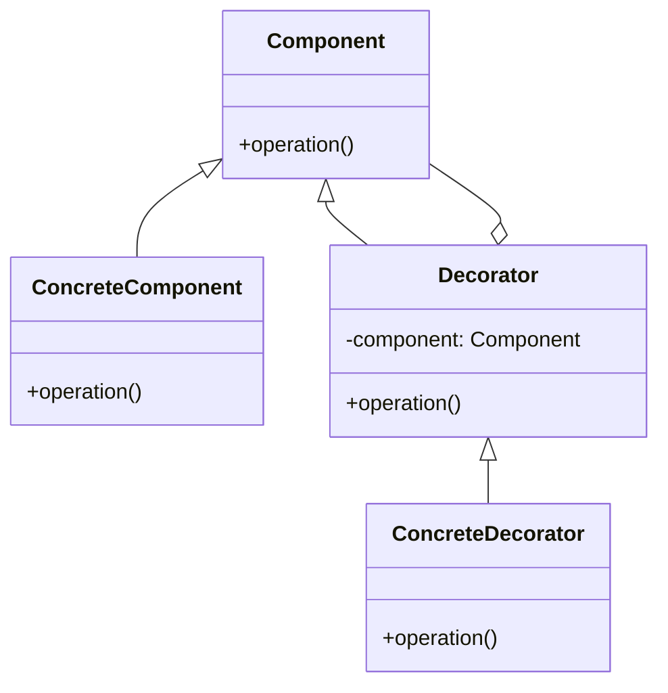

## 6.4 Decorator Pattern

The Decorator Pattern is a structural design pattern that allows behavior to be added to individual objects, either statically or dynamically, without affecting the behavior of other objects from the same class. In Lua, this pattern is particularly useful due to its dynamic nature and flexible type system. Let's delve into the intricacies of the Decorator Pattern and explore how it can be implemented in Lua.

### Intent

The primary intent of the Decorator Pattern is to attach additional responsibilities to an object dynamically. This pattern provides a flexible alternative to subclassing for extending functionality. By using decorators, we can create a variety of decorated objects, each enhancing the original object in unique ways.

### Key Participants

1. **Component**: Defines the interface for objects that can have responsibilities added to them dynamically.
2. **ConcreteComponent**: The original object to which additional responsibilities can be attached.
3. **Decorator**: Maintains a reference to a Component object and defines an interface that conforms to the Component's interface.
4. **ConcreteDecorator**: Adds responsibilities to the component.

### Implementing Decorator in Lua

Lua's flexibility allows us to implement the Decorator Pattern using various techniques, such as wrapper tables, functions, and metatables. Let's explore these methods in detail.

#### Wrapper Tables or Functions

In Lua, we can use tables or functions to wrap existing objects or functions, thereby extending their behavior.

```lua
-- Original function
local function greet(name)
    return "Hello, " .. name
end

-- Decorator function
local function greetWithTime(originalFunction)
    return function(name)
        local time = os.date("%X")
        return originalFunction(name) .. " at " .. time
    end
end

-- Using the decorator
local decoratedGreet = greetWithTime(greet)
print(decoratedGreet("Alice"))  -- Output: Hello, Alice at 14:23:45
```

In this example, `greetWithTime` is a decorator that adds the current time to the greeting message. The original `greet` function remains unchanged, demonstrating the non-intrusive nature of decorators.

#### Metatables

Metatables in Lua provide a powerful mechanism to modify the behavior of tables. By using the `__index` metamethod, we can delegate method calls to the original object, effectively creating a decorator.

```lua
-- Original object
local car = {
    speed = 100,
    drive = function(self)
        return "Driving at " .. self.speed .. " km/h"
    end
}

-- Decorator using metatables
local function turboDecorator(original)
    local decorator = {}
    setmetatable(decorator, {
        __index = function(t, k)
            if k == "drive" then
                return function(self)
                    return original:drive() .. " with turbo boost!"
                end
            end
            return original[k]
        end
    })
    return decorator
end

-- Applying the decorator
local turboCar = turboDecorator(car)
print(turboCar:drive())  -- Output: Driving at 100 km/h with turbo boost!
```

Here, the `turboDecorator` function wraps the `car` object, enhancing its `drive` method with additional functionality.

#### Chaining Decorators

One of the strengths of the Decorator Pattern is the ability to chain multiple decorators, allowing for cumulative behavior enhancements.

```lua
-- Another decorator
local function nitroDecorator(original)
    local decorator = {}
    setmetatable(decorator, {
        __index = function(t, k)
            if k == "drive" then
                return function(self)
                    return original:drive() .. " with nitro boost!"
                end
            end
            return original[k]
        end
    })
    return decorator
end

-- Chaining decorators
local turboNitroCar = nitroDecorator(turboDecorator(car))
print(turboNitroCar:drive())  -- Output: Driving at 100 km/h with turbo boost! with nitro boost!
```

By chaining the `turboDecorator` and `nitroDecorator`, we achieve a compound effect on the `drive` method.

### Use Cases and Examples

The Decorator Pattern is versatile and can be applied in various scenarios. Here are some common use cases:

#### Extending Functions with Logging or Error Handling

Decorators can be used to add logging or error handling to existing functions without modifying their code.

```lua
-- Logging decorator
local function logDecorator(originalFunction)
    return function(...)
        print("Function called with arguments: ", ...)
        local result = originalFunction(...)
        print("Function returned: ", result)
        return result
    end
end

-- Original function
local function add(a, b)
    return a + b
end

-- Applying the logging decorator
local loggedAdd = logDecorator(add)
loggedAdd(3, 4)  -- Output: Function called with arguments: 3 4
                 --         Function returned: 7
```

#### Modifying GUI Components at Runtime

In GUI applications, decorators can dynamically alter the appearance or behavior of components.

```lua
-- Original GUI component
local button = {
    label = "Submit",
    click = function(self)
        print(self.label .. " button clicked")
    end
}

-- Decorator to add a tooltip
local function tooltipDecorator(original, tooltipText)
    local decorator = {}
    setmetatable(decorator, {
        __index = function(t, k)
            if k == "click" then
                return function(self)
                    print("Tooltip: " .. tooltipText)
                    original:click()
                end
            end
            return original[k]
        end
    })
    return decorator
end

-- Applying the tooltip decorator
local tooltipButton = tooltipDecorator(button, "Click to submit your form")
tooltipButton:click()  -- Output: Tooltip: Click to submit your form
                       --         Submit button clicked
```

#### Adding Features to Game Entities

In game development, decorators can be used to add features or abilities to game entities.

```lua
-- Original game entity
local player = {
    health = 100,
    attack = function(self)
        return "Attacking with power 10"
    end
}

-- Decorator to add a shield
local function shieldDecorator(original)
    local decorator = {}
    setmetatable(decorator, {
        __index = function(t, k)
            if k == "attack" then
                return function(self)
                    return original:attack() .. " with shield protection"
                end
            end
            return original[k]
        end
    })
    return decorator
end

-- Applying the shield decorator
local shieldedPlayer = shieldDecorator(player)
print(shieldedPlayer:attack())  -- Output: Attacking with power 10 with shield protection
```

### Design Considerations

When implementing the Decorator Pattern in Lua, consider the following:

- **Performance**: Each layer of decoration adds a level of indirection, which may impact performance. Use decorators judiciously in performance-critical applications.
- **Complexity**: Excessive use of decorators can lead to complex and difficult-to-understand code. Ensure that the use of decorators enhances code readability and maintainability.
- **Flexibility**: The Decorator Pattern provides flexibility in extending object behavior without modifying existing code, making it ideal for scenarios where requirements frequently change.

### Differences and Similarities

The Decorator Pattern is often confused with the Proxy Pattern. While both patterns involve wrapping objects, the Decorator Pattern focuses on adding new behavior, whereas the Proxy Pattern controls access to the object.

### Try It Yourself

To deepen your understanding of the Decorator Pattern, try modifying the examples provided:

- **Experiment with different decorators**: Create additional decorators that modify other aspects of the objects, such as changing the speed of the car or adding new GUI features.
- **Chain multiple decorators**: Combine several decorators to see how they interact and affect the final behavior of the object.
- **Implement a real-world scenario**: Think of a practical application in your projects where the Decorator Pattern could be beneficial and implement it.

### Visualizing the Decorator Pattern

To better understand the Decorator Pattern, let's visualize it using a class diagram:



**Diagram Description**: This class diagram illustrates the relationship between the Component, ConcreteComponent, Decorator, and ConcreteDecorator. The Decorator maintains a reference to a Component and extends its behavior.

### References and Links

For further reading on the Decorator Pattern and its applications, consider the following resources:

- [Design Patterns: Elements of Reusable Object-Oriented Software](https://www.amazon.com/Design-Patterns-Elements-Reusable-Object-Oriented/dp/0201633612) - A classic book on design patterns.
- [Lua Programming Guide](https://www.lua.org/manual/5.4/) - Official Lua documentation.
- [MDN Web Docs on Design Patterns](https://developer.mozilla.org/en-US/docs/Web/JavaScript/Guide/Design_Patterns) - A comprehensive guide to design patterns.

### Knowledge Check

To reinforce your understanding of the Decorator Pattern, consider the following questions:

- How does the Decorator Pattern differ from subclassing?
- What are the advantages of using decorators over modifying existing code?
- In what scenarios would you choose the Decorator Pattern over other design patterns?

### Embrace the Journey

Remember, mastering design patterns is a journey. As you explore the Decorator Pattern, you'll gain insights into how to enhance your code's flexibility and maintainability. Keep experimenting, stay curious, and enjoy the process of learning and applying design patterns in your projects!

## Quiz Time!



### What is the primary intent of the Decorator Pattern?

- [x] To attach additional responsibilities to an object dynamically
- [ ] To create a new class hierarchy
- [ ] To simplify the interface of a complex system
- [ ] To provide a way to access the elements of an aggregate object sequentially

> **Explanation:** The Decorator Pattern is used to add responsibilities to an object dynamically without altering its structure.

### Which Lua feature is commonly used to implement the Decorator Pattern?

- [x] Metatables
- [ ] Coroutines
- [ ] Tables
- [ ] Modules

> **Explanation:** Metatables are often used in Lua to implement the Decorator Pattern by modifying the behavior of tables.

### What is a key advantage of using the Decorator Pattern?

- [x] It provides a flexible alternative to subclassing for extending functionality
- [ ] It simplifies the code by reducing the number of classes
- [ ] It ensures thread safety in concurrent applications
- [ ] It improves the performance of the application

> **Explanation:** The Decorator Pattern allows for flexible extension of functionality without the need for subclassing.

### How can decorators be chained in Lua?

- [x] By applying multiple decorators sequentially
- [ ] By using a single decorator with multiple functions
- [ ] By creating a composite decorator
- [ ] By modifying the original object directly

> **Explanation:** Decorators can be chained by applying them one after the other, allowing for cumulative behavior enhancements.

### What is a potential drawback of using the Decorator Pattern?

- [x] It can lead to complex and difficult-to-understand code
- [ ] It requires a large number of classes
- [ ] It is not compatible with object-oriented programming
- [ ] It cannot be used with dynamic languages like Lua

> **Explanation:** Excessive use of decorators can lead to complex code that is hard to understand and maintain.

### In the context of the Decorator Pattern, what is a ConcreteDecorator?

- [x] A class that adds responsibilities to the component
- [ ] The original object being decorated
- [ ] A class that defines the interface for objects that can be decorated
- [ ] A utility class used for logging

> **Explanation:** A ConcreteDecorator is responsible for adding new responsibilities to the component.

### Which of the following is NOT a use case for the Decorator Pattern?

- [ ] Extending functions with logging
- [ ] Modifying GUI components at runtime
- [ ] Adding features to game entities
- [x] Implementing a singleton pattern

> **Explanation:** The Decorator Pattern is not used for implementing a singleton pattern, which is a creational pattern.

### What is the role of the `__index` metamethod in implementing decorators?

- [x] It delegates method calls to the original object
- [ ] It initializes the decorator object
- [ ] It handles errors in the decorated object
- [ ] It manages memory allocation for the decorator

> **Explanation:** The `__index` metamethod is used to delegate method calls to the original object, allowing for behavior extension.

### True or False: The Decorator Pattern can be used to modify the interface of an object.

- [ ] True
- [x] False

> **Explanation:** The Decorator Pattern does not modify the interface of an object; it adds additional behavior while maintaining the existing interface.

### Which pattern is often confused with the Decorator Pattern?

- [x] Proxy Pattern
- [ ] Singleton Pattern
- [ ] Factory Pattern
- [ ] Observer Pattern

> **Explanation:** The Proxy Pattern is often confused with the Decorator Pattern, but they serve different purposes.


