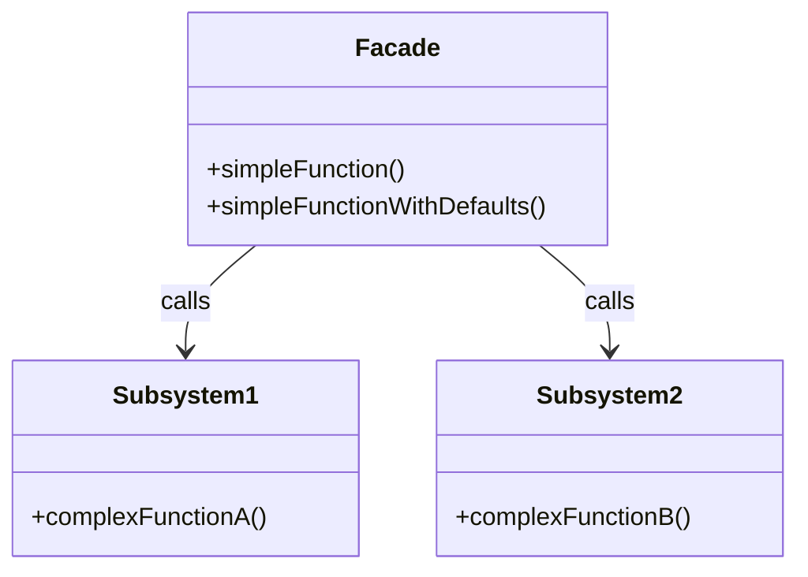

## 6.5 Facade Pattern

In the realm of software design, complexity is often an unavoidable reality. As systems grow, they tend to accumulate a multitude of components and interfaces, each with its own intricacies. The Facade Pattern emerges as a savior in such scenarios, offering a simplified interface to these complex subsystems. This pattern is particularly useful in Lua, where it can help streamline interactions and enhance code readability.

### Simplifying Interfaces

The Facade Pattern provides a unified interface to a set of interfaces in a subsystem, making it easier to use. By encapsulating the complexities of the subsystem, the facade offers a more straightforward way to interact with it. This pattern is especially beneficial in large applications where multiple subsystems are involved.

#### Key Concepts

- **Facade Table**: In Lua, a facade is typically implemented as a table that exposes high-level functions.
- **Delegating Calls**: The facade internally calls the complex subsystem functions, acting as an intermediary.
- **Simplification**: The facade hides the complexities and provides default behaviors, making the subsystem easier to use.

### Implementing Facade in Lua

Let's delve into how we can implement the Facade Pattern in Lua. We'll explore the creation of a facade table, the delegation of calls, and the simplification of complex subsystems.

#### Facade Table

In Lua, tables are versatile data structures that can be used to represent objects, modules, and more. To create a facade, we define a table that acts as the interface to the subsystem.

```lua
-- Facade.lua
local Facade = {}

-- Subsystem 1
local function complexFunctionA()
    print("Executing complex function A")
end

-- Subsystem 2
local function complexFunctionB()
    print("Executing complex function B")
end

-- High-level function exposed by the facade
function Facade.simpleFunction()
    print("Simplifying the interface")
    complexFunctionA()
    complexFunctionB()
end

return Facade
```

In this example, `Facade` is a table that exposes a high-level function `simpleFunction`. This function internally calls `complexFunctionA` and `complexFunctionB`, which are part of the complex subsystem.

#### Delegating Calls

The facade delegates calls to the underlying subsystem functions. This delegation allows the facade to control access to the subsystem and manage the interactions.

```lua
-- Client.lua
local Facade = require("Facade")

-- Client code using the facade
Facade.simpleFunction()
```

By using the facade, the client code interacts with a simplified interface, without needing to know the details of the subsystem functions.

#### Simplification

The primary goal of the facade is to simplify the interaction with the subsystem. It achieves this by providing default behaviors and hiding the complexities.

```lua
-- Facade with default behavior
function Facade.simpleFunctionWithDefaults()
    print("Executing with default settings")
    complexFunctionA()
    -- Default behavior
    if someCondition then
        complexFunctionB()
    end
end
```

In this example, `simpleFunctionWithDefaults` provides a default behavior by conditionally calling `complexFunctionB`.

### Use Cases and Examples

The Facade Pattern is widely applicable in various scenarios. Let's explore some common use cases and examples.

#### Providing a Simple API for a Complex Library

When dealing with a complex library, a facade can offer a simplified API that abstracts the intricacies of the library's functions.

```lua
-- ComplexLibrary.lua
local ComplexLibrary = {}

function ComplexLibrary.detailedFunction1()
    print("Detailed function 1")
end

function ComplexLibrary.detailedFunction2()
    print("Detailed function 2")
end

return ComplexLibrary

-- LibraryFacade.lua
local ComplexLibrary = require("ComplexLibrary")
local LibraryFacade = {}

function LibraryFacade.simpleAPI()
    print("Using simple API")
    ComplexLibrary.detailedFunction1()
    ComplexLibrary.detailedFunction2()
end

return LibraryFacade
```

In this example, `LibraryFacade` provides a simple API that abstracts the detailed functions of `ComplexLibrary`.

#### Simplifying Interactions with Subsystems in Large Applications

In large applications, multiple subsystems may need to interact. A facade can simplify these interactions by providing a unified interface.

```lua
-- Subsystem1.lua
local Subsystem1 = {}

function Subsystem1.operation1()
    print("Subsystem 1 operation 1")
end

return Subsystem1

-- Subsystem2.lua
local Subsystem2 = {}

function Subsystem2.operation2()
    print("Subsystem 2 operation 2")
end

return Subsystem2

-- ApplicationFacade.lua
local Subsystem1 = require("Subsystem1")
local Subsystem2 = require("Subsystem2")
local ApplicationFacade = {}

function ApplicationFacade.performOperations()
    print("Performing operations through facade")
    Subsystem1.operation1()
    Subsystem2.operation2()
end

return ApplicationFacade
```

Here, `ApplicationFacade` provides a unified interface to interact with `Subsystem1` and `Subsystem2`.

#### Encapsulating Network or Database Interactions

Facades can also encapsulate network or database interactions, providing a simplified interface for these operations.

```lua
-- NetworkModule.lua
local NetworkModule = {}

function NetworkModule.connect()
    print("Connecting to network")
end

function NetworkModule.disconnect()
    print("Disconnecting from network")
end

return NetworkModule

-- DatabaseModule.lua
local DatabaseModule = {}

function DatabaseModule.query()
    print("Executing database query")
end

return DatabaseModule

-- ServiceFacade.lua
local NetworkModule = require("NetworkModule")
local DatabaseModule = require("DatabaseModule")
local ServiceFacade = {}

function ServiceFacade.performService()
    print("Performing service through facade")
    NetworkModule.connect()
    DatabaseModule.query()
    NetworkModule.disconnect()
end

return ServiceFacade
```

In this example, `ServiceFacade` encapsulates the interactions with `NetworkModule` and `DatabaseModule`, providing a simplified interface for performing a service.

### Visualizing the Facade Pattern

To better understand the Facade Pattern, let's visualize the interactions between the facade and the subsystems using a class diagram.



**Diagram Description**: This class diagram illustrates the relationship between the `Facade` and the subsystems (`Subsystem1` and `Subsystem2`). The facade provides high-level functions that internally call the complex functions of the subsystems.

### Design Considerations

When implementing the Facade Pattern, consider the following design aspects:

- **When to Use**: Use the Facade Pattern when you need to simplify interactions with a complex subsystem or when you want to provide a unified interface to multiple subsystems.
- **Benefits**: The facade reduces the complexity of the client code, enhances code readability, and promotes loose coupling between the client and the subsystem.
- **Pitfalls**: Overusing facades can lead to a monolithic design. Ensure that the facade does not become a bottleneck by overloading it with too many responsibilities.

### Differences and Similarities

The Facade Pattern is often confused with other structural patterns, such as the Adapter Pattern. While both patterns provide a way to interact with a subsystem, they serve different purposes:

- **Facade vs. Adapter**: The facade provides a simplified interface to a complex subsystem, while the adapter converts the interface of a class into another interface that the client expects.
- **Facade vs. Proxy**: The proxy controls access to an object, while the facade simplifies the interface of a subsystem.

### Try It Yourself

To deepen your understanding of the Facade Pattern, try modifying the code examples provided. Experiment with adding new subsystems or changing the behavior of the facade. Consider how the facade can be extended to accommodate additional functionalities.

### Knowledge Check

- What is the primary purpose of the Facade Pattern?
- How does the facade simplify interactions with a subsystem?
- What are some common use cases for the Facade Pattern?
- How does the Facade Pattern differ from the Adapter Pattern?

### Embrace the Journey

Remember, mastering design patterns is a journey. The Facade Pattern is just one tool in your toolkit. As you continue to explore and experiment, you'll discover new ways to apply this pattern and others in your projects. Keep learning, stay curious, and enjoy the process!

## Quiz Time!



### What is the primary purpose of the Facade Pattern?

- [x] To provide a simplified interface to a complex subsystem
- [ ] To convert the interface of a class into another interface
- [ ] To control access to an object
- [ ] To encapsulate a group of individual factories

> **Explanation:** The Facade Pattern provides a simplified interface to a complex subsystem, making it easier to use.

### How does the facade simplify interactions with a subsystem?

- [x] By providing a unified interface
- [ ] By converting interfaces
- [ ] By controlling access
- [ ] By creating multiple interfaces

> **Explanation:** The facade simplifies interactions by providing a unified interface to the subsystem.

### What is a common use case for the Facade Pattern?

- [x] Simplifying interactions with complex libraries
- [ ] Converting class interfaces
- [ ] Controlling access to objects
- [ ] Creating complex subsystems

> **Explanation:** A common use case for the Facade Pattern is simplifying interactions with complex libraries.

### How does the Facade Pattern differ from the Adapter Pattern?

- [x] Facade simplifies interfaces, Adapter converts interfaces
- [ ] Facade controls access, Adapter simplifies interfaces
- [ ] Facade creates interfaces, Adapter controls access
- [ ] Facade and Adapter are the same

> **Explanation:** The Facade Pattern simplifies interfaces, while the Adapter Pattern converts interfaces.

### When should you use the Facade Pattern?

- [x] When you need to simplify interactions with a complex subsystem
- [ ] When you need to convert interfaces
- [ ] When you need to control access to an object
- [ ] When you need to encapsulate factories

> **Explanation:** Use the Facade Pattern when you need to simplify interactions with a complex subsystem.

### What is a potential pitfall of using the Facade Pattern?

- [x] Creating a monolithic design
- [ ] Overloading interfaces
- [ ] Creating too many interfaces
- [ ] Simplifying too much

> **Explanation:** A potential pitfall of using the Facade Pattern is creating a monolithic design.

### What is a benefit of using the Facade Pattern?

- [x] Enhancing code readability
- [ ] Increasing complexity
- [ ] Reducing interfaces
- [ ] Controlling access

> **Explanation:** A benefit of using the Facade Pattern is enhancing code readability.

### What does the facade delegate?

- [x] Calls to the subsystem functions
- [ ] Interface conversions
- [ ] Access control
- [ ] Object creation

> **Explanation:** The facade delegates calls to the subsystem functions.

### What is the role of the facade in a large application?

- [x] To provide a unified interface to multiple subsystems
- [ ] To convert interfaces
- [ ] To control access to objects
- [ ] To create complex subsystems

> **Explanation:** In a large application, the facade provides a unified interface to multiple subsystems.

### True or False: The Facade Pattern can encapsulate network interactions.

- [x] True
- [ ] False

> **Explanation:** True. The Facade Pattern can encapsulate network interactions, providing a simplified interface for these operations.


