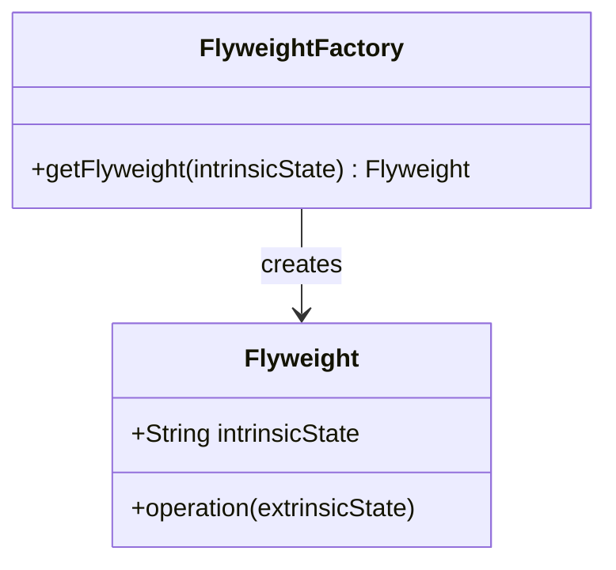

## 6.6 Flyweight Pattern

The Flyweight Pattern is a structural design pattern that focuses on minimizing memory usage by sharing as much data as possible with similar objects. This pattern is particularly useful when dealing with a large number of objects that share common data. In this section, we'll delve into how to implement the Flyweight Pattern in Lua, explore its components, and examine practical use cases.

### Understanding the Flyweight Pattern

The Flyweight Pattern is all about sharing fine-grained objects to reduce memory consumption. It achieves this by separating the intrinsic state (shared data) from the extrinsic state (context-specific data). By doing so, it allows multiple objects to share the same intrinsic state while maintaining their unique extrinsic states.

#### Key Concepts

- **Intrinsic State**: This is the part of the object that is shared among multiple instances. It is invariant and does not change across different contexts.
- **Extrinsic State**: This is the context-specific data that is unique to each instance. It is passed to the object during execution and is not stored within the flyweight.
- **Flyweight Factory**: This component manages the creation and sharing of flyweight objects. It ensures that objects with the same intrinsic state are reused rather than recreated.

### Implementing Flyweight in Lua

Let's explore how to implement the Flyweight Pattern in Lua by breaking it down into its core components.

#### Intrinsic State

The intrinsic state is the shared data among flyweight objects. In Lua, we can represent this using tables, which are the core data structures in Lua.

```lua
-- Define a Flyweight class
Flyweight = {}
Flyweight.__index = Flyweight

function Flyweight:new(intrinsicState)
    local instance = setmetatable({}, self)
    instance.intrinsicState = intrinsicState
    return instance
end

function Flyweight:getIntrinsicState()
    return self.intrinsicState
end
```

In this example, the `Flyweight` class holds the intrinsic state, which is shared among multiple instances.

#### Extrinsic State

The extrinsic state is the data that is unique to each instance and is passed during execution.

```lua
function Flyweight:operation(extrinsicState)
    print("Intrinsic State: " .. self.intrinsicState .. ", Extrinsic State: " .. extrinsicState)
end
```

The `operation` method demonstrates how the extrinsic state is used alongside the intrinsic state.

#### Factory for Flyweights

The Flyweight Factory is responsible for managing the creation and sharing of flyweight objects. It ensures that objects with the same intrinsic state are reused.

```lua
-- Define a Flyweight Factory
FlyweightFactory = {}
FlyweightFactory.__index = FlyweightFactory

function FlyweightFactory:new()
    local instance = setmetatable({}, self)
    instance.flyweights = {}
    return instance
end

function FlyweightFactory:getFlyweight(intrinsicState)
    if not self.flyweights[intrinsicState] then
        self.flyweights[intrinsicState] = Flyweight:new(intrinsicState)
    end
    return self.flyweights[intrinsicState]
end
```

The `FlyweightFactory` class maintains a table of flyweights and provides a method to retrieve or create a flyweight based on the intrinsic state.

### Use Cases and Examples

The Flyweight Pattern is particularly useful in scenarios where a large number of similar objects are required. Here are some practical use cases:

#### Rendering Large Numbers of Similar Game Objects

In game development, rendering a large number of similar objects, such as trees in a forest or enemies in a game, can be memory-intensive. The Flyweight Pattern allows you to share common data, such as textures or models, among these objects.

```lua
-- Example of using Flyweight Pattern for game objects
local factory = FlyweightFactory:new()

local tree1 = factory:getFlyweight("TreeModel")
tree1:operation("Position: (10, 20)")

local tree2 = factory:getFlyweight("TreeModel")
tree2:operation("Position: (30, 40)")

-- Both tree1 and tree2 share the same intrinsic state (TreeModel)
```

#### Caching and Reusing Object Instances

The Flyweight Pattern can be used to cache and reuse object instances, reducing the overhead of creating new objects.

#### Managing Fonts or Graphical Resources

In applications that require managing fonts or graphical resources, the Flyweight Pattern can help in sharing common resources, such as font glyphs, among different text elements.

### Visualizing the Flyweight Pattern

To better understand the Flyweight Pattern, let's visualize its components and interactions using a Mermaid.js diagram.



This diagram illustrates the relationship between the `Flyweight` and `FlyweightFactory` classes. The factory creates and manages flyweight objects, ensuring that objects with the same intrinsic state are shared.

### Design Considerations

When implementing the Flyweight Pattern, consider the following:

- **Memory vs. Performance Trade-off**: While the Flyweight Pattern reduces memory usage, it may introduce additional complexity in managing extrinsic states.
- **Granularity of Intrinsic State**: Determine the appropriate level of granularity for the intrinsic state to maximize sharing without compromising functionality.
- **Thread Safety**: If your application is multi-threaded, ensure that the Flyweight Factory is thread-safe to avoid race conditions.

### Differences and Similarities

The Flyweight Pattern is often compared to other patterns like Singleton and Prototype. While Singleton ensures a single instance of a class, Flyweight focuses on sharing parts of objects. Prototype, on the other hand, involves cloning objects, which may not necessarily reduce memory usage.

### Try It Yourself

To gain a deeper understanding of the Flyweight Pattern, try modifying the code examples provided:

- Experiment with different intrinsic and extrinsic states.
- Implement a Flyweight Pattern for a different use case, such as managing UI components.
- Explore the impact of the Flyweight Pattern on memory usage in a Lua application.

### Embrace the Journey

Remember, mastering design patterns is a journey. As you explore the Flyweight Pattern, you'll discover its potential to optimize memory usage and improve performance in your Lua applications. Keep experimenting, stay curious, and enjoy the process of learning and applying design patterns.

## Quiz Time!



### What is the primary goal of the Flyweight Pattern?

- [x] To reduce memory usage by sharing common parts of objects.
- [ ] To improve performance by parallelizing tasks.
- [ ] To simplify code by reducing the number of classes.
- [ ] To enhance security by encrypting data.

> **Explanation:** The Flyweight Pattern aims to reduce memory usage by sharing common parts of objects among multiple instances.

### What is the intrinsic state in the Flyweight Pattern?

- [x] The shared, invariant data among flyweight objects.
- [ ] The context-specific data unique to each instance.
- [ ] The method used to create flyweight objects.
- [ ] The factory that manages flyweight objects.

> **Explanation:** The intrinsic state is the shared, invariant data that does not change across different contexts.

### What is the role of the Flyweight Factory?

- [x] To manage the creation and sharing of flyweight objects.
- [ ] To store the extrinsic state of objects.
- [ ] To handle the destruction of flyweight objects.
- [ ] To provide a user interface for flyweight objects.

> **Explanation:** The Flyweight Factory manages the creation and sharing of flyweight objects, ensuring that objects with the same intrinsic state are reused.

### How does the Flyweight Pattern benefit game development?

- [x] By reducing memory usage when rendering large numbers of similar objects.
- [ ] By increasing the speed of rendering graphics.
- [ ] By simplifying the game logic.
- [ ] By enhancing the game's security features.

> **Explanation:** The Flyweight Pattern reduces memory usage by sharing common data, such as textures or models, among similar game objects.

### Which of the following is an example of extrinsic state?

- [x] Position of a game object.
- [ ] The model of a tree in a game.
- [ ] The texture used for rendering.
- [ ] The font glyphs in a text editor.

> **Explanation:** The position of a game object is an example of extrinsic state, as it is context-specific and unique to each instance.

### What is a potential drawback of the Flyweight Pattern?

- [x] It may introduce additional complexity in managing extrinsic states.
- [ ] It increases memory usage.
- [ ] It reduces the performance of the application.
- [ ] It limits the number of objects that can be created.

> **Explanation:** The Flyweight Pattern may introduce additional complexity in managing extrinsic states, as these need to be passed during execution.

### How can you ensure thread safety in a Flyweight Factory?

- [x] By using synchronization mechanisms to avoid race conditions.
- [ ] By creating a new factory for each thread.
- [ ] By storing extrinsic states within the factory.
- [ ] By limiting the number of flyweight objects.

> **Explanation:** To ensure thread safety, use synchronization mechanisms to avoid race conditions when accessing shared resources.

### What is the difference between Flyweight and Singleton patterns?

- [x] Flyweight focuses on sharing parts of objects, while Singleton ensures a single instance of a class.
- [ ] Flyweight ensures a single instance of a class, while Singleton shares parts of objects.
- [ ] Both patterns focus on reducing memory usage.
- [ ] Both patterns are used for managing object creation.

> **Explanation:** Flyweight focuses on sharing parts of objects to reduce memory usage, while Singleton ensures a single instance of a class.

### Which pattern is often compared to Flyweight due to its focus on object creation?

- [x] Prototype Pattern
- [ ] Observer Pattern
- [ ] Strategy Pattern
- [ ] Decorator Pattern

> **Explanation:** The Prototype Pattern is often compared to Flyweight due to its focus on object creation, although it involves cloning objects.

### True or False: The Flyweight Pattern is only applicable to graphical applications.

- [ ] True
- [x] False

> **Explanation:** False. The Flyweight Pattern is applicable to any scenario where a large number of similar objects are required, not just graphical applications.




