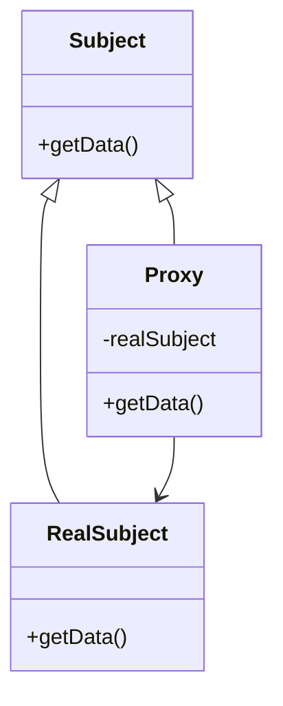

## 6.7 Proxy Pattern

The Proxy Pattern is a structural design pattern that provides a surrogate or placeholder to control access to another object. This pattern is particularly useful in scenarios where direct access to an object is either not possible or not desirable. By using a proxy, we can add an additional layer of control over the interactions with the object, such as lazy initialization, access control, or remote access.

### Intent

The primary intent of the Proxy Pattern is to control access to an object by providing a surrogate or placeholder. This can be useful for various reasons, including:

- **Lazy Initialization**: Delaying the creation and initialization of an expensive object until it is actually needed.
- **Access Control**: Restricting access to an object based on certain conditions or permissions.
- **Remote Access**: Managing communication with an object that resides in a different address space or on a different machine.

### Key Participants

1. **Subject**: Defines the common interface for RealSubject and Proxy so that a Proxy can be used anywhere a RealSubject is expected.
2. **RealSubject**: The real object that the proxy represents.
3. **Proxy**: Maintains a reference to the RealSubject and provides an interface identical to the Subject's interface. It controls access to the RealSubject and may be responsible for creating and deleting it.

### Implementing Proxy in Lua

In Lua, we can implement the Proxy Pattern using tables and metatables. Lua's dynamic nature and powerful metaprogramming capabilities make it an excellent choice for implementing proxies.

#### Proxy Tables

A proxy table is a table that mimics the interface of the original object. It intercepts operations on the table and delegates them to the original object. Here's a simple example:

```lua
-- RealSubject: The actual object we want to control access to
local RealSubject = {
    data = "Sensitive Data"
}

function RealSubject:getData()
    return self.data
end

-- Proxy: Provides controlled access to the RealSubject
local Proxy = {}
Proxy.__index = Proxy

function Proxy:new(realSubject)
    local proxy = setmetatable({}, self)
    proxy.realSubject = realSubject
    return proxy
end

function Proxy:getData()
    print("Accessing data through Proxy")
    return self.realSubject:getData()
end

-- Usage
local realSubject = RealSubject
local proxy = Proxy:new(realSubject)
print(proxy:getData())  -- Output: Accessing data through Proxy \n Sensitive Data
```

In this example, the `Proxy` table intercepts the `getData` method call and delegates it to the `RealSubject`, while also adding additional behavior (logging in this case).

#### Metatables

Metatables in Lua allow us to define custom behavior for table operations. By using metamethods, we can intercept method calls and control how they are handled. This is particularly useful for implementing proxies.

```lua
-- RealSubject: The actual object we want to control access to
local RealSubject = {
    data = "Sensitive Data"
}

function RealSubject:getData()
    return self.data
end

-- Proxy: Uses metatables to control access to the RealSubject
local Proxy = {}
Proxy.__index = function(table, key)
    print("Accessing key:", key)
    return RealSubject[key]
end

setmetatable(Proxy, Proxy)

-- Usage
print(Proxy:getData())  -- Output: Accessing key: getData \n Sensitive Data
```

In this example, the `__index` metamethod is used to intercept access to the `getData` method, allowing us to add additional behavior before delegating the call to the `RealSubject`.

### Types of Proxies

There are several types of proxies, each serving a different purpose:

#### Virtual Proxy

A Virtual Proxy is used to delay the creation and initialization of an expensive object until it is actually needed. This can be useful for improving performance and reducing resource usage.

```lua
-- Virtual Proxy: Delays creation of RealSubject until needed
local VirtualProxy = {}
VirtualProxy.__index = VirtualProxy

function VirtualProxy:new()
    local proxy = setmetatable({}, self)
    proxy.realSubject = nil
    return proxy
end

function VirtualProxy:getData()
    if not self.realSubject then
        print("Creating RealSubject")
        self.realSubject = { data = "Expensive Data" }
    end
    return self.realSubject.data
end

-- Usage
local proxy = VirtualProxy:new()
print(proxy:getData())  -- Output: Creating RealSubject \n Expensive Data
```

#### Remote Proxy

A Remote Proxy manages communication with an object that resides in a different address space or on a different machine. This can be useful for distributed systems and networked applications.

```lua
-- Remote Proxy: Simulates remote access to a RealSubject
local RemoteProxy = {}
RemoteProxy.__index = RemoteProxy

function RemoteProxy:new(remoteAddress)
    local proxy = setmetatable({}, self)
    proxy.remoteAddress = remoteAddress
    return proxy
end

function RemoteProxy:getData()
    print("Fetching data from remote address:", self.remoteAddress)
    -- Simulate remote data fetching
    return "Remote Data"
end

-- Usage
local proxy = RemoteProxy:new("http://example.com/data")
print(proxy:getData())  -- Output: Fetching data from remote address: http://example.com/data \n Remote Data
```

#### Protection Proxy

A Protection Proxy controls access to an object based on certain conditions or permissions. This can be useful for implementing security and access control mechanisms.

```lua
-- Protection Proxy: Controls access based on permissions
local ProtectionProxy = {}
ProtectionProxy.__index = ProtectionProxy

function ProtectionProxy:new(realSubject, userRole)
    local proxy = setmetatable({}, self)
    proxy.realSubject = realSubject
    proxy.userRole = userRole
    return proxy
end

function ProtectionProxy:getData()
    if self.userRole == "admin" then
        return self.realSubject:getData()
    else
        return "Access Denied"
    end
end

-- Usage
local realSubject = RealSubject
local adminProxy = ProtectionProxy:new(realSubject, "admin")
local userProxy = ProtectionProxy:new(realSubject, "user")

print(adminProxy:getData())  -- Output: Sensitive Data
print(userProxy:getData())   -- Output: Access Denied
```

### Use Cases and Examples

The Proxy Pattern is versatile and can be applied in various scenarios:

- **Lazy Loading of Resources**: Use a Virtual Proxy to delay the loading of resources until they are needed, improving performance and reducing memory usage.
- **Access Control and Authorization**: Use a Protection Proxy to restrict access to sensitive data or operations based on user roles or permissions.
- **Remote Method Invocation**: Use a Remote Proxy to manage communication with remote objects, enabling distributed systems and networked applications.

### Visualizing the Proxy Pattern

To better understand the Proxy Pattern, let's visualize the relationships between the key participants using a class diagram.



**Diagram Description**: This class diagram illustrates the Proxy Pattern. The `Subject` interface is implemented by both `RealSubject` and `Proxy`. The `Proxy` maintains a reference to the `RealSubject` and delegates method calls to it.

### Design Considerations

When implementing the Proxy Pattern in Lua, consider the following:

- **Performance**: While proxies can improve performance through lazy loading, they can also introduce overhead due to additional method calls and logic. Balance the benefits and costs when deciding to use a proxy.
- **Complexity**: Proxies can add complexity to your codebase. Ensure that the added complexity is justified by the benefits provided by the proxy.
- **Security**: When using Protection Proxies, ensure that access control logic is robust and secure to prevent unauthorized access.

### Differences and Similarities

The Proxy Pattern is often confused with other structural patterns such as the Decorator and Adapter patterns. Here are some key differences:

- **Decorator Pattern**: Adds additional behavior to an object without changing its interface. Proxies, on the other hand, control access to the object.
- **Adapter Pattern**: Converts the interface of a class into another interface that clients expect. Proxies provide the same interface as the real object but control access to it.

### Try It Yourself

To deepen your understanding of the Proxy Pattern, try modifying the code examples provided:

- Implement a Virtual Proxy that caches the result of an expensive computation.
- Create a Remote Proxy that simulates fetching data from a remote server with latency.
- Experiment with a Protection Proxy that uses different criteria for access control.

### Knowledge Check

Before moving on, let's reinforce what we've learned:

- What are the key participants in the Proxy Pattern?
- How does a Virtual Proxy improve performance?
- What are some use cases for a Protection Proxy?

### Embrace the Journey

Remember, mastering design patterns is a journey. As you continue to explore and experiment with the Proxy Pattern, you'll gain a deeper understanding of its applications and benefits. Keep experimenting, stay curious, and enjoy the journey!

## Quiz Time!



### What is the primary intent of the Proxy Pattern?

- [x] To control access to an object by providing a surrogate or placeholder.
- [ ] To add additional behavior to an object without changing its interface.
- [ ] To convert the interface of a class into another interface that clients expect.
- [ ] To encapsulate a group of individual factories with a common goal.

> **Explanation:** The Proxy Pattern provides a surrogate or placeholder to control access to another object.

### Which Lua feature is commonly used to implement proxies?

- [x] Metatables
- [ ] Coroutines
- [ ] Tables
- [ ] Functions

> **Explanation:** Metatables in Lua allow us to define custom behavior for table operations, making them ideal for implementing proxies.

### What is a Virtual Proxy used for?

- [x] Delaying the creation and initialization of an expensive object until it is needed.
- [ ] Managing communication with a remote object.
- [ ] Controlling access based on permissions.
- [ ] Adding additional behavior to an object.

> **Explanation:** A Virtual Proxy delays the creation and initialization of an expensive object until it is actually needed.

### What does a Protection Proxy do?

- [x] Controls access to an object based on certain conditions or permissions.
- [ ] Manages communication with a remote object.
- [ ] Delays the creation of an object.
- [ ] Converts the interface of a class into another interface.

> **Explanation:** A Protection Proxy controls access to an object based on certain conditions or permissions.

### Which pattern is often confused with the Proxy Pattern?

- [x] Decorator Pattern
- [x] Adapter Pattern
- [ ] Singleton Pattern
- [ ] Factory Pattern

> **Explanation:** The Proxy Pattern is often confused with the Decorator and Adapter patterns due to their structural similarities.

### What is the role of the RealSubject in the Proxy Pattern?

- [x] The actual object that the proxy represents.
- [ ] The interface that defines the common operations.
- [ ] The object that controls access to the RealSubject.
- [ ] The object that adds additional behavior to the RealSubject.

> **Explanation:** The RealSubject is the actual object that the proxy represents and controls access to.

### How does a Remote Proxy differ from a Virtual Proxy?

- [x] A Remote Proxy manages communication with a remote object, while a Virtual Proxy delays object creation.
- [ ] A Remote Proxy delays object creation, while a Virtual Proxy manages communication with a remote object.
- [ ] Both manage communication with remote objects.
- [ ] Both delay object creation.

> **Explanation:** A Remote Proxy manages communication with a remote object, while a Virtual Proxy delays object creation until needed.

### What is the benefit of using a Proxy Pattern for lazy loading?

- [x] It improves performance by delaying resource loading until necessary.
- [ ] It adds additional behavior to an object.
- [ ] It converts the interface of a class into another interface.
- [ ] It controls access based on permissions.

> **Explanation:** A Proxy Pattern for lazy loading improves performance by delaying resource loading until necessary.

### Which metamethod is commonly used in Lua to intercept method calls in a proxy?

- [x] __index
- [ ] __newindex
- [ ] __call
- [ ] __tostring

> **Explanation:** The `__index` metamethod is used to intercept method calls and access operations in Lua.

### True or False: The Proxy Pattern can be used for remote method invocation.

- [x] True
- [ ] False

> **Explanation:** The Proxy Pattern can be used for remote method invocation by managing communication with remote objects.




