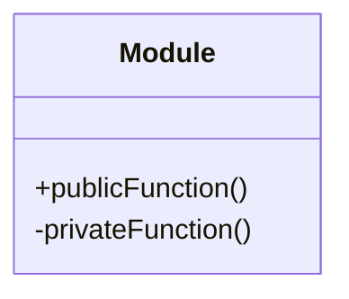

## 6.8 Module Pattern

In the realm of software design, organizing code into manageable, reusable, and encapsulated units is a fundamental practice. The Module Pattern in Lua serves this purpose by allowing developers to encapsulate related functions and data into self-contained units known as modules. This pattern not only promotes code organization but also enhances maintainability and reusability. In this section, we will delve into the intricacies of the Module Pattern in Lua, exploring its implementation, use cases, and best practices.

### Encapsulating Related Functions

The Module Pattern is a structural design pattern that focuses on organizing code into modules. These modules act as containers for related functions and data, providing a clear separation of concerns and promoting encapsulation. By encapsulating related functions, developers can create self-contained units that are easier to understand, maintain, and reuse.

#### Implementing Module Pattern in Lua

In Lua, the Module Pattern is typically implemented using tables. Tables in Lua are versatile data structures that can store various types of data, including functions. By leveraging tables, developers can create modules that encapsulate related functions and variables.

##### Tables as Modules

To implement the Module Pattern in Lua, we start by creating a table to represent the module. This table will serve as a container for the module's functions and variables. Here's a simple example:

```lua
-- Define a module table
local MyModule = {}

-- Add a function to the module
function MyModule.greet(name)
    return "Hello, " .. name
end

-- Add another function to the module
function MyModule.farewell(name)
    return "Goodbye, " .. name
end

-- Return the module table
return MyModule
```

In this example, `MyModule` is a table that encapsulates two functions: `greet` and `farewell`. By organizing these functions within a table, we create a module that can be easily imported and used in other parts of the application.

##### Local Scope

One of the key benefits of the Module Pattern is the ability to manage scope effectively. By default, variables and functions in Lua are global, which can lead to naming conflicts and unintended side effects. The Module Pattern addresses this issue by allowing developers to keep internal functions and variables private.

To achieve this, we can use the `local` keyword to define variables and functions that should remain private to the module. Here's an example:

```lua
-- Define a module table
local MyModule = {}

-- Private function (not accessible outside the module)
local function helperFunction()
    return "This is a helper function"
end

-- Public function
function MyModule.greet(name)
    return "Hello, " .. name .. ". " .. helperFunction()
end

-- Return the module table
return MyModule
```

In this example, `helperFunction` is a private function that is not accessible outside the module. It is used internally by the `greet` function to provide additional functionality. By keeping `helperFunction` private, we prevent it from being accessed or modified by external code.

##### Returning the Module Table

To provide access to the module's public interface, we return the module table at the end of the module definition. This allows other parts of the application to import and use the module's functions and variables. Here's how it works:

```lua
-- Import the module
local MyModule = require("MyModule")

-- Use the module's functions
print(MyModule.greet("Alice"))  -- Output: Hello, Alice. This is a helper function
print(MyModule.farewell("Bob")) -- Output: Goodbye, Bob
```

By returning the module table, we expose the module's public functions and variables to the rest of the application. This provides a clear and controlled interface for interacting with the module.

### Use Cases and Examples

The Module Pattern is a versatile design pattern with a wide range of use cases. Let's explore some common scenarios where the Module Pattern can be applied effectively.

#### Organizing Libraries and Reusable Code

One of the primary use cases for the Module Pattern is organizing libraries and reusable code. By encapsulating related functions and data into modules, developers can create libraries that are easy to import and use in different projects. This promotes code reuse and reduces duplication.

For example, consider a math library that provides various mathematical functions:

```lua
-- Define a math module
local MathLib = {}

-- Add a function to calculate the square of a number
function MathLib.square(x)
    return x * x
end

-- Add a function to calculate the cube of a number
function MathLib.cube(x)
    return x * x * x
end

-- Return the module table
return MathLib
```

By organizing these functions into a module, we create a reusable math library that can be easily imported and used in different projects.

#### Namespace Management to Avoid Global Variables

Another important use case for the Module Pattern is namespace management. In Lua, variables and functions are global by default, which can lead to naming conflicts and unintended side effects. The Module Pattern addresses this issue by encapsulating related functions and variables within a module, effectively creating a namespace.

For example, consider a scenario where multiple modules define a function named `init`:

```lua
-- Module A
local ModuleA = {}
function ModuleA.init()
    print("Initializing Module A")
end
return ModuleA

-- Module B
local ModuleB = {}
function ModuleB.init()
    print("Initializing Module B")
end
return ModuleB
```

By encapsulating the `init` functions within their respective modules, we avoid naming conflicts and ensure that each module's `init` function is called correctly.

#### Encapsulation and Information Hiding

The Module Pattern also promotes encapsulation and information hiding. By keeping internal functions and variables private, developers can control the module's interface and prevent external code from accessing or modifying internal implementation details.

For example, consider a module that manages a list of items:

```lua
-- Define a list module
local ListModule = {}

-- Private list variable
local items = {}

-- Public function to add an item to the list
function ListModule.addItem(item)
    table.insert(items, item)
end

-- Public function to get all items
function ListModule.getItems()
    return items
end

-- Return the module table
return ListModule
```

In this example, the `items` variable is private and cannot be accessed directly from outside the module. Instead, the module provides public functions `addItem` and `getItems` to interact with the list. This encapsulation ensures that the internal state of the module is protected and can only be modified through the provided interface.

### Visualizing the Module Pattern

To better understand the Module Pattern, let's visualize its structure using a class diagram. This diagram illustrates the relationship between the module table, public functions, and private functions.



In this diagram, the `Module` class represents the module table. The `publicFunction` is a public function that is accessible from outside the module, while the `privateFunction` is a private function that is only accessible within the module.

### Design Considerations

When implementing the Module Pattern in Lua, there are several design considerations to keep in mind:

- **Scope Management**: Use the `local` keyword to define private functions and variables, ensuring that they are not accessible from outside the module.
- **Public Interface**: Clearly define the module's public interface by returning the module table at the end of the module definition.
- **Code Organization**: Organize related functions and data into modules to promote code reuse and maintainability.
- **Namespace Management**: Use modules to create namespaces and avoid naming conflicts in the global scope.
- **Encapsulation**: Keep internal implementation details private to prevent external code from accessing or modifying them.

### Differences and Similarities

The Module Pattern is often compared to other design patterns, such as the Singleton Pattern and the Factory Pattern. While these patterns share some similarities, they serve different purposes:

- **Singleton Pattern**: The Singleton Pattern ensures that a class has only one instance and provides a global point of access to it. In contrast, the Module Pattern focuses on organizing related functions and data into self-contained units.
- **Factory Pattern**: The Factory Pattern provides an interface for creating objects, allowing subclasses to alter the type of objects that will be created. The Module Pattern, on the other hand, is primarily concerned with encapsulating related functions and data.

### Try It Yourself

To gain a deeper understanding of the Module Pattern, try modifying the code examples provided in this section. Experiment with adding new functions to the modules, creating private variables, and organizing related functions into separate modules. This hands-on approach will help reinforce the concepts covered in this section.

### Knowledge Check

To reinforce your understanding of the Module Pattern, consider the following questions:

- What is the primary purpose of the Module Pattern in Lua?
- How can you keep functions and variables private within a module?
- What are some common use cases for the Module Pattern?
- How does the Module Pattern help manage namespaces in Lua?
- What are the key differences between the Module Pattern and the Singleton Pattern?

### Embrace the Journey

Remember, mastering design patterns is a journey. As you continue to explore and apply the Module Pattern in your Lua projects, you'll gain a deeper understanding of its benefits and best practices. Keep experimenting, stay curious, and enjoy the process of becoming a more skilled and knowledgeable software engineer.

## Quiz Time!



### What is the primary purpose of the Module Pattern in Lua?

- [x] To organize related functions and data into self-contained units
- [ ] To ensure a class has only one instance
- [ ] To provide an interface for creating objects
- [ ] To manage memory allocation

> **Explanation:** The Module Pattern is used to organize related functions and data into self-contained units, promoting encapsulation and code organization.

### How can you keep functions and variables private within a module?

- [x] By using the `local` keyword
- [ ] By using the `global` keyword
- [ ] By using the `public` keyword
- [ ] By using the `private` keyword

> **Explanation:** The `local` keyword is used to define private functions and variables within a module, ensuring they are not accessible from outside the module.

### What is a common use case for the Module Pattern?

- [x] Organizing libraries and reusable code
- [ ] Creating a single instance of a class
- [ ] Managing memory allocation
- [ ] Implementing complex algorithms

> **Explanation:** The Module Pattern is commonly used to organize libraries and reusable code, promoting code reuse and maintainability.

### How does the Module Pattern help manage namespaces in Lua?

- [x] By encapsulating related functions and variables within a module
- [ ] By creating a single instance of a class
- [ ] By providing an interface for creating objects
- [ ] By managing memory allocation

> **Explanation:** The Module Pattern helps manage namespaces by encapsulating related functions and variables within a module, avoiding naming conflicts in the global scope.

### What is the key difference between the Module Pattern and the Singleton Pattern?

- [x] The Module Pattern organizes related functions and data, while the Singleton Pattern ensures a class has only one instance
- [ ] The Module Pattern provides an interface for creating objects, while the Singleton Pattern organizes related functions and data
- [ ] The Module Pattern manages memory allocation, while the Singleton Pattern provides an interface for creating objects
- [ ] The Module Pattern ensures a class has only one instance, while the Singleton Pattern organizes related functions and data

> **Explanation:** The Module Pattern focuses on organizing related functions and data, while the Singleton Pattern ensures a class has only one instance.

### What is the benefit of returning the module table at the end of the module definition?

- [x] It provides access to the module's public interface
- [ ] It ensures a class has only one instance
- [ ] It manages memory allocation
- [ ] It provides an interface for creating objects

> **Explanation:** Returning the module table at the end of the module definition provides access to the module's public interface, allowing other parts of the application to use the module's functions and variables.

### How does the Module Pattern promote encapsulation?

- [x] By keeping internal functions and variables private
- [ ] By creating a single instance of a class
- [ ] By providing an interface for creating objects
- [ ] By managing memory allocation

> **Explanation:** The Module Pattern promotes encapsulation by keeping internal functions and variables private, preventing external code from accessing or modifying them.

### What is a key design consideration when implementing the Module Pattern?

- [x] Scope management using the `local` keyword
- [ ] Ensuring a class has only one instance
- [ ] Providing an interface for creating objects
- [ ] Managing memory allocation

> **Explanation:** A key design consideration when implementing the Module Pattern is scope management using the `local` keyword to define private functions and variables.

### What is the purpose of the `require` function in Lua?

- [x] To import a module
- [ ] To create a new table
- [ ] To define a local variable
- [ ] To manage memory allocation

> **Explanation:** The `require` function in Lua is used to import a module, allowing other parts of the application to use the module's functions and variables.

### True or False: The Module Pattern can be used to create namespaces in Lua.

- [x] True
- [ ] False

> **Explanation:** True. The Module Pattern can be used to create namespaces in Lua by encapsulating related functions and variables within a module, avoiding naming conflicts in the global scope.


