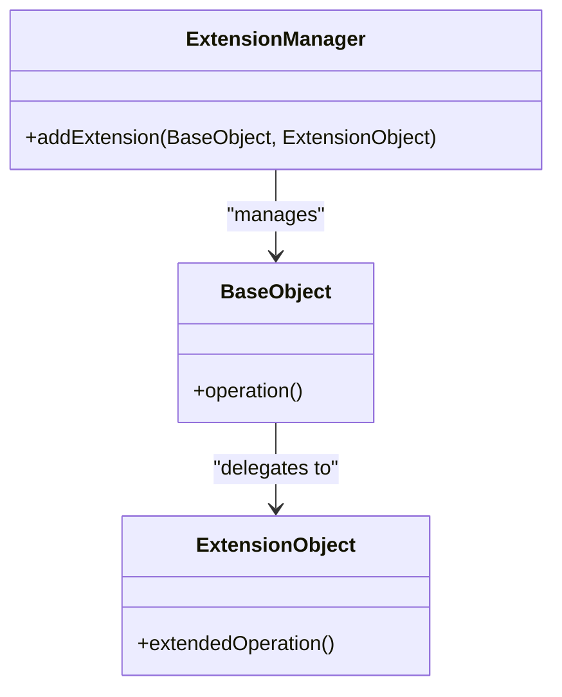

## 6.9 Extension Object Pattern

In the ever-evolving landscape of software development, the need to extend the functionality of objects dynamically without altering their structure is paramount. The Extension Object Pattern provides a robust solution to this challenge, allowing developers to add new operations to objects seamlessly. This pattern is particularly useful in scenarios where flexibility and adaptability are crucial, such as plugin systems, runtime feature toggles, and flexible object configurations.

### Intent

The primary intent of the Extension Object Pattern is to enable the dynamic addition of new behavior to objects without modifying their existing structure. This is achieved by attaching extension objects that encapsulate the new functionality, allowing the original object to remain unchanged.

### Key Participants

1. **Base Object**: The original object to which new functionality is added.
2. **Extension Object**: Encapsulates the new behavior or functionality.
3. **Extension Manager**: Manages the lifecycle and attachment of extension objects to the base object.

### Implementing Extension Object in Lua

Lua, with its dynamic nature and powerful metatables, provides an ideal environment for implementing the Extension Object Pattern. Let's explore how we can achieve dynamic attachment and delegation using Lua's features.

#### Dynamic Attachment

Dynamic attachment involves adding methods or properties to objects at runtime. In Lua, this can be accomplished using tables and metatables.

```lua
-- Define a base object
local BaseObject = {}

function BaseObject:new(o)
    o = o or {}
    setmetatable(o, self)
    self.__index = self
    return o
end

function BaseObject:operation()
    print("Base operation")
end

-- Define an extension object
local ExtensionObject = {}

function ExtensionObject:new(o)
    o = o or {}
    setmetatable(o, self)
    self.__index = self
    return o
end

function ExtensionObject:extendedOperation()
    print("Extended operation")
end

-- Attach the extension object to the base object
local base = BaseObject:new()
local extension = ExtensionObject:new()

-- Add the extension operation to the base object
base.extendedOperation = extension.extendedOperation

-- Test the dynamic attachment
base:operation() -- Output: Base operation
base:extendedOperation() -- Output: Extended operation
```

In this example, we define a `BaseObject` with a simple operation and an `ExtensionObject` with an extended operation. By dynamically attaching the `extendedOperation` method to the `BaseObject`, we enhance its functionality without altering its structure.

#### Delegation

Delegation is a powerful technique that involves forwarding calls to extension objects. In Lua, metatables can be used to achieve delegation.

```lua
-- Define a base object
local BaseObject = {}

function BaseObject:new(o)
    o = o or {}
    setmetatable(o, self)
    self.__index = self
    return o
end

function BaseObject:operation()
    print("Base operation")
end

-- Define an extension object
local ExtensionObject = {}

function ExtensionObject:extendedOperation()
    print("Extended operation")
end

-- Use metatable to delegate calls to the extension object
local base = BaseObject:new()
local extension = ExtensionObject

setmetatable(base, {
    __index = function(t, k)
        return extension[k] or BaseObject[k]
    end
})

-- Test the delegation
base:operation() -- Output: Base operation
base:extendedOperation() -- Output: Extended operation
```

Here, we use a metatable to delegate method calls to the `ExtensionObject`. If the method is not found in the `BaseObject`, the metatable forwards the call to the `ExtensionObject`.

#### Decorator vs. Extension Object

While both the Decorator and Extension Object patterns aim to add behavior to objects, they differ in their approach and use cases.

- **Decorator Pattern**: Focuses on wrapping objects to add behavior. It is more suitable for scenarios where multiple behaviors need to be combined dynamically.
- **Extension Object Pattern**: Focuses on attaching new operations to objects. It is ideal for scenarios where the object's interface needs to be extended without altering its core functionality.

### Use Cases and Examples

The Extension Object Pattern is versatile and can be applied in various scenarios:

#### Plugin Systems

In plugin systems, the ability to add new features without modifying the core application is crucial. The Extension Object Pattern allows plugins to extend the application's functionality dynamically.

```lua
-- Define a plugin interface
local Plugin = {}

function Plugin:new(o)
    o = o or {}
    setmetatable(o, self)
    self.__index = self
    return o
end

function Plugin:execute()
    print("Executing plugin")
end

-- Define an application that supports plugins
local Application = {}

function Application:new(o)
    o = o or {}
    setmetatable(o, self)
    self.__index = self
    return o
end

function Application:addPlugin(plugin)
    self.plugin = plugin
end

function Application:run()
    if self.plugin then
        self.plugin:execute()
    else
        print("No plugin to execute")
    end
end

-- Create a plugin and attach it to the application
local myPlugin = Plugin:new()
local app = Application:new()
app:addPlugin(myPlugin)

-- Run the application
app:run() -- Output: Executing plugin
```

In this example, we define a `Plugin` interface and an `Application` that supports plugins. By adding a plugin to the application, we extend its functionality dynamically.

#### Flexible Configuration of Objects

The Extension Object Pattern allows for flexible configuration of objects, enabling runtime customization of behavior.

```lua
-- Define a configurable object
local ConfigurableObject = {}

function ConfigurableObject:new(o)
    o = o or {}
    setmetatable(o, self)
    self.__index = self
    return o
end

function ConfigurableObject:configure(config)
    for k, v in pairs(config) do
        self[k] = v
    end
end

-- Create a configurable object and apply configuration
local obj = ConfigurableObject:new()
obj:configure({ color = "red", size = "large" })

-- Access the configured properties
print(obj.color) -- Output: red
print(obj.size) -- Output: large
```

Here, we define a `ConfigurableObject` that can be configured at runtime using a configuration table. This allows for flexible and dynamic customization of object properties.

#### Runtime Feature Toggles

Feature toggles are a common technique for enabling or disabling features at runtime. The Extension Object Pattern provides a mechanism for implementing feature toggles dynamically.

```lua
-- Define a feature toggle manager
local FeatureToggleManager = {}

function FeatureToggleManager:new(o)
    o = o or {}
    setmetatable(o, self)
    self.__index = self
    return o
end

function FeatureToggleManager:enableFeature(feature)
    self[feature] = true
end

function FeatureToggleManager:disableFeature(feature)
    self[feature] = false
end

function FeatureToggleManager:isFeatureEnabled(feature)
    return self[feature] or false
end

-- Create a feature toggle manager and manage features
local featureManager = FeatureToggleManager:new()
featureManager:enableFeature("darkMode")

-- Check if a feature is enabled
if featureManager:isFeatureEnabled("darkMode") then
    print("Dark mode is enabled")
else
    print("Dark mode is disabled")
end
```

In this example, we define a `FeatureToggleManager` that manages feature toggles at runtime. This allows for dynamic enabling and disabling of features based on runtime conditions.

### Design Considerations

When implementing the Extension Object Pattern, consider the following:

- **Performance**: Dynamic attachment and delegation can introduce overhead. Ensure that performance is not compromised, especially in performance-critical applications.
- **Complexity**: While the pattern provides flexibility, it can also introduce complexity. Use it judiciously and ensure that the added complexity is justified by the benefits.
- **Compatibility**: Ensure that the extension objects are compatible with the base object and do not introduce breaking changes.

### Differences and Similarities

The Extension Object Pattern is often compared to the Decorator Pattern. While both patterns aim to add behavior to objects, they differ in their approach:

- **Decorator Pattern**: Wraps objects to add behavior. Suitable for combining multiple behaviors dynamically.
- **Extension Object Pattern**: Attaches new operations to objects. Ideal for extending the object's interface without altering its core functionality.

### Visualizing the Extension Object Pattern

To better understand the Extension Object Pattern, let's visualize the relationship between the base object, extension object, and extension manager using a class diagram.



In this diagram, the `BaseObject` delegates calls to the `ExtensionObject`, while the `ExtensionManager` manages the attachment of extension objects to the base object.

### Try It Yourself

Experiment with the code examples provided in this section. Try adding new methods to the `ExtensionObject` and attaching them to the `BaseObject`. Explore different ways to use metatables for delegation and see how the behavior of the base object changes dynamically.

### Knowledge Check

- What is the primary intent of the Extension Object Pattern?
- How does dynamic attachment differ from delegation in Lua?
- In what scenarios would you prefer the Extension Object Pattern over the Decorator Pattern?
- How can the Extension Object Pattern be used to implement plugin systems?
- What are some design considerations when implementing the Extension Object Pattern?

### Embrace the Journey

Remember, mastering design patterns is a journey. As you explore the Extension Object Pattern, you'll gain a deeper understanding of how to add functionality dynamically and flexibly. Keep experimenting, stay curious, and enjoy the journey!

## Quiz Time!



### What is the primary intent of the Extension Object Pattern?

- [x] To enable the dynamic addition of new behavior to objects without modifying their existing structure.
- [ ] To wrap objects to add behavior.
- [ ] To combine multiple behaviors dynamically.
- [ ] To alter the core functionality of objects.

> **Explanation:** The primary intent of the Extension Object Pattern is to enable the dynamic addition of new behavior to objects without modifying their existing structure.

### How does dynamic attachment differ from delegation in Lua?

- [x] Dynamic attachment involves adding methods or properties to objects at runtime, while delegation involves forwarding calls to extension objects.
- [ ] Dynamic attachment involves forwarding calls to extension objects, while delegation involves adding methods or properties to objects at runtime.
- [ ] Both dynamic attachment and delegation involve adding methods or properties to objects at runtime.
- [ ] Both dynamic attachment and delegation involve forwarding calls to extension objects.

> **Explanation:** Dynamic attachment involves adding methods or properties to objects at runtime, while delegation involves forwarding calls to extension objects.

### In what scenarios would you prefer the Extension Object Pattern over the Decorator Pattern?

- [x] When the object's interface needs to be extended without altering its core functionality.
- [ ] When multiple behaviors need to be combined dynamically.
- [ ] When the object's core functionality needs to be altered.
- [ ] When performance is not a concern.

> **Explanation:** The Extension Object Pattern is preferred when the object's interface needs to be extended without altering its core functionality.

### How can the Extension Object Pattern be used to implement plugin systems?

- [x] By allowing plugins to extend the application's functionality dynamically without modifying the core application.
- [ ] By wrapping plugins to add behavior.
- [ ] By combining multiple plugins dynamically.
- [ ] By altering the core functionality of the application.

> **Explanation:** The Extension Object Pattern allows plugins to extend the application's functionality dynamically without modifying the core application.

### What are some design considerations when implementing the Extension Object Pattern?

- [x] Performance, complexity, and compatibility.
- [ ] Only performance.
- [ ] Only complexity.
- [ ] Only compatibility.

> **Explanation:** When implementing the Extension Object Pattern, consider performance, complexity, and compatibility.

### What is the role of the Extension Manager in the Extension Object Pattern?

- [x] Manages the lifecycle and attachment of extension objects to the base object.
- [ ] Encapsulates the new behavior or functionality.
- [ ] The original object to which new functionality is added.
- [ ] Wraps objects to add behavior.

> **Explanation:** The Extension Manager manages the lifecycle and attachment of extension objects to the base object.

### What is the difference between the Decorator and Extension Object patterns?

- [x] The Decorator Pattern wraps objects to add behavior, while the Extension Object Pattern attaches new operations to objects.
- [ ] Both patterns wrap objects to add behavior.
- [ ] Both patterns attach new operations to objects.
- [ ] The Decorator Pattern attaches new operations to objects, while the Extension Object Pattern wraps objects to add behavior.

> **Explanation:** The Decorator Pattern wraps objects to add behavior, while the Extension Object Pattern attaches new operations to objects.

### How can metatables be used in the Extension Object Pattern?

- [x] To delegate method calls to extension objects.
- [ ] To wrap objects to add behavior.
- [ ] To combine multiple behaviors dynamically.
- [ ] To alter the core functionality of objects.

> **Explanation:** Metatables can be used to delegate method calls to extension objects in the Extension Object Pattern.

### What is a potential drawback of using the Extension Object Pattern?

- [x] It can introduce complexity.
- [ ] It cannot be used for plugin systems.
- [ ] It cannot be used for runtime feature toggles.
- [ ] It cannot be used for flexible configuration of objects.

> **Explanation:** A potential drawback of using the Extension Object Pattern is that it can introduce complexity.

### True or False: The Extension Object Pattern is ideal for scenarios where the object's core functionality needs to be altered.

- [ ] True
- [x] False

> **Explanation:** The Extension Object Pattern is not ideal for scenarios where the object's core functionality needs to be altered; it is used to extend the object's interface without altering its core functionality.


