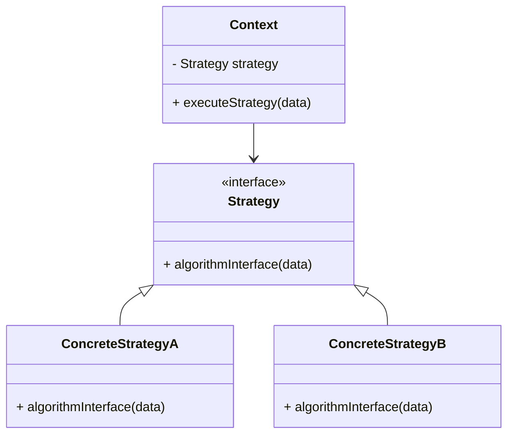

## 7.1 Strategy Pattern

In the realm of software design, flexibility and reusability are paramount. The Strategy Pattern is a behavioral design pattern that enables you to define a family of algorithms, encapsulate each one, and make them interchangeable. This pattern is particularly useful when you need to switch between different algorithms or behaviors at runtime without altering the clients that use them. In this section, we will delve into the Strategy Pattern in Lua, exploring its implementation, use cases, and benefits.

### Intent of the Strategy Pattern

The primary intent of the Strategy Pattern is to encapsulate algorithms within separate objects, allowing them to be interchangeable. This pattern promotes the open/closed principle, enabling new algorithms to be added without modifying existing code. By decoupling the algorithm from the client, the Strategy Pattern enhances flexibility and maintainability.

### Key Participants

1. **Strategy Interface**: Defines a common interface for all supported algorithms.
2. **Concrete Strategies**: Implement the strategy interface, providing specific algorithms.
3. **Context**: Maintains a reference to a strategy object and delegates the algorithm execution to the strategy.

### Implementing Strategy in Lua

Lua, with its dynamic typing and first-class functions, provides a flexible environment for implementing the Strategy Pattern. Let's explore how to create strategy objects, a context object, and switch strategies at runtime.

#### Strategy Objects

In Lua, strategy objects can be implemented as functions or tables. Each strategy encapsulates a specific algorithm.

```lua
-- Define strategy functions
local function bubbleSort(data)
    -- Implementation of bubble sort algorithm
    for i = 1, #data do
        for j = 1, #data - i do
            if data[j] > data[j + 1] then
                data[j], data[j + 1] = data[j + 1], data[j]
            end
        end
    end
    return data
end

local function quickSort(data)
    -- Implementation of quick sort algorithm
    if #data < 2 then return data end
    local pivot = data[1]
    local less, greater = {}, {}
    for i = 2, #data do
        if data[i] <= pivot then
            table.insert(less, data[i])
        else
            table.insert(greater, data[i])
        end
    end
    return quickSort(less), pivot, quickSort(greater)
end
```

#### Context Object

The context object holds a reference to a strategy and delegates the execution of the algorithm to the strategy.

```lua
-- Context object
local SortContext = {}
SortContext.__index = SortContext

function SortContext:new(strategy)
    local obj = { strategy = strategy }
    setmetatable(obj, self)
    return obj
end

function SortContext:executeStrategy(data)
    return self.strategy(data)
end
```

#### Switching Strategies

Switching strategies at runtime is straightforward in Lua. You can change the strategy by assigning a different function to the context's strategy attribute.

```lua
-- Example usage
local data = {5, 3, 8, 4, 2}

-- Create a context with bubble sort strategy
local context = SortContext:new(bubbleSort)
print("Bubble Sort:", table.concat(context:executeStrategy(data), ", "))

-- Switch to quick sort strategy
context.strategy = quickSort
print("Quick Sort:", table.concat(context:executeStrategy(data), ", "))
```

### Use Cases and Examples

The Strategy Pattern is versatile and applicable in various scenarios. Let's explore some common use cases.

#### Selecting Sorting Algorithms Based on Data Size

In applications where data size varies significantly, you can use the Strategy Pattern to select the most efficient sorting algorithm dynamically.

```lua
-- Function to choose strategy based on data size
local function chooseSortingStrategy(data)
    if #data < 10 then
        return bubbleSort
    else
        return quickSort
    end
end

-- Example usage
local data = {5, 3, 8, 4, 2}
local strategy = chooseSortingStrategy(data)
local context = SortContext:new(strategy)
print("Sorted Data:", table.concat(context:executeStrategy(data), ", "))
```

#### Configurable AI Behaviors in Games

In game development, AI behaviors can be encapsulated as strategies, allowing for dynamic changes in behavior based on game state or player actions.

```lua
-- Define AI behavior strategies
local function aggressiveAI()
    print("AI is playing aggressively.")
end

local function defensiveAI()
    print("AI is playing defensively.")
end

-- Context for AI behavior
local AIContext = {}
AIContext.__index = AIContext

function AIContext:new(strategy)
    local obj = { strategy = strategy }
    setmetatable(obj, self)
    return obj
end

function AIContext:executeStrategy()
    self.strategy()
end

-- Example usage
local aiContext = AIContext:new(aggressiveAI)
aiContext:executeStrategy()

-- Switch to defensive strategy
aiContext.strategy = defensiveAI
aiContext:executeStrategy()
```

#### Payment Processing with Different Methods

In e-commerce applications, payment processing can be handled using different strategies, such as credit card, PayPal, or cryptocurrency.

```lua
-- Define payment strategies
local function creditCardPayment(amount)
    print("Processing credit card payment of $" .. amount)
end

local function paypalPayment(amount)
    print("Processing PayPal payment of $" .. amount)
end

-- Context for payment processing
local PaymentContext = {}
PaymentContext.__index = PaymentContext

function PaymentContext:new(strategy)
    local obj = { strategy = strategy }
    setmetatable(obj, self)
    return obj
end

function PaymentContext:executeStrategy(amount)
    self.strategy(amount)
end

-- Example usage
local paymentContext = PaymentContext:new(creditCardPayment)
paymentContext:executeStrategy(100)

-- Switch to PayPal strategy
paymentContext.strategy = paypalPayment
paymentContext:executeStrategy(200)
```

### Design Considerations

When implementing the Strategy Pattern, consider the following:

- **Interface Consistency**: Ensure all strategies implement a consistent interface to facilitate easy switching.
- **Performance Overhead**: Be mindful of the performance overhead associated with strategy switching, especially in performance-critical applications.
- **Extensibility**: The Strategy Pattern is highly extensible, allowing new strategies to be added with minimal impact on existing code.

### Differences and Similarities

The Strategy Pattern is often confused with the State Pattern. While both involve changing behavior at runtime, the Strategy Pattern focuses on interchangeable algorithms, whereas the State Pattern deals with state-dependent behavior.

### Visualizing Strategy Pattern

To better understand the Strategy Pattern, let's visualize its components and interactions using a class diagram.



**Diagram Description**: The class diagram illustrates the relationship between the Context and Strategy classes. The Context holds a reference to a Strategy and delegates the algorithm execution to it. Concrete strategies implement the Strategy interface, providing specific algorithms.

### Try It Yourself

Experiment with the Strategy Pattern by modifying the code examples. Try implementing additional sorting algorithms or AI behaviors, and switch between them dynamically. Consider creating a new context for a different application, such as image processing or data compression.

### References and Links

For further reading on the Strategy Pattern and its applications, consider the following resources:

- [Design Patterns: Elements of Reusable Object-Oriented Software](https://en.wikipedia.org/wiki/Design_Patterns) by Erich Gamma, Richard Helm, Ralph Johnson, and John Vlissides.
- [Lua Programming Guide](https://www.lua.org/manual/5.4/) - Official Lua documentation.
- [Refactoring Guru: Strategy Pattern](https://refactoring.guru/design-patterns/strategy) - A comprehensive guide to the Strategy Pattern.

### Knowledge Check

To reinforce your understanding of the Strategy Pattern, consider the following questions and exercises:

- What are the key components of the Strategy Pattern?
- How does the Strategy Pattern promote flexibility and maintainability?
- Implement a new strategy for a different use case, such as data encryption or compression.
- Compare and contrast the Strategy Pattern with the State Pattern.

### Embrace the Journey

Remember, mastering design patterns is a journey. The Strategy Pattern is just one of many tools in your software design toolkit. As you continue to explore and apply design patterns, you'll gain deeper insights into creating flexible, maintainable, and efficient software solutions. Keep experimenting, stay curious, and enjoy the journey!

## Quiz Time!



### What is the primary intent of the Strategy Pattern?

- [x] To encapsulate algorithms within separate objects, allowing them to be interchangeable.
- [ ] To manage state-dependent behavior in objects.
- [ ] To provide a way to create objects without specifying their concrete classes.
- [ ] To define a one-to-many dependency between objects.

> **Explanation:** The Strategy Pattern's primary intent is to encapsulate algorithms within separate objects, making them interchangeable.

### Which of the following is a key participant in the Strategy Pattern?

- [x] Strategy Interface
- [ ] Singleton
- [ ] Observer
- [ ] Decorator

> **Explanation:** The Strategy Interface is a key participant in the Strategy Pattern, defining a common interface for all supported algorithms.

### How can strategy objects be implemented in Lua?

- [x] As functions or tables
- [ ] As classes only
- [ ] As global variables
- [ ] As constants

> **Explanation:** In Lua, strategy objects can be implemented as functions or tables, providing flexibility in encapsulating algorithms.

### What is the role of the Context object in the Strategy Pattern?

- [x] To maintain a reference to a strategy and delegate algorithm execution
- [ ] To create instances of concrete strategies
- [ ] To manage state transitions
- [ ] To observe changes in other objects

> **Explanation:** The Context object maintains a reference to a strategy and delegates the execution of the algorithm to the strategy.

### Which of the following is a use case for the Strategy Pattern?

- [x] Configurable AI behaviors in games
- [ ] Managing database connections
- [ ] Observing changes in a user interface
- [ ] Creating singleton instances

> **Explanation:** Configurable AI behaviors in games is a use case for the Strategy Pattern, allowing dynamic changes in behavior.

### How does the Strategy Pattern promote the open/closed principle?

- [x] By allowing new algorithms to be added without modifying existing code
- [ ] By ensuring all classes are open for modification
- [ ] By closing all classes to inheritance
- [ ] By preventing any changes to existing algorithms

> **Explanation:** The Strategy Pattern promotes the open/closed principle by allowing new algorithms to be added without modifying existing code.

### What is a potential performance consideration when using the Strategy Pattern?

- [x] Performance overhead associated with strategy switching
- [ ] Increased memory usage due to global variables
- [ ] Decreased readability due to complex inheritance
- [ ] Reduced flexibility due to fixed algorithms

> **Explanation:** A potential performance consideration is the overhead associated with switching strategies, especially in performance-critical applications.

### How does the Strategy Pattern differ from the State Pattern?

- [x] The Strategy Pattern focuses on interchangeable algorithms, while the State Pattern deals with state-dependent behavior.
- [ ] The Strategy Pattern manages state transitions, while the State Pattern encapsulates algorithms.
- [ ] The Strategy Pattern is used for creating objects, while the State Pattern is used for observing changes.
- [ ] The Strategy Pattern defines a one-to-many dependency, while the State Pattern defines a one-to-one dependency.

> **Explanation:** The Strategy Pattern focuses on interchangeable algorithms, whereas the State Pattern deals with state-dependent behavior.

### What is a benefit of using the Strategy Pattern?

- [x] Enhanced flexibility and maintainability
- [ ] Simplified object creation
- [ ] Reduced memory usage
- [ ] Increased coupling between objects

> **Explanation:** The Strategy Pattern enhances flexibility and maintainability by decoupling algorithms from clients.

### True or False: The Strategy Pattern can be used to switch between different payment processing methods in an e-commerce application.

- [x] True
- [ ] False

> **Explanation:** True. The Strategy Pattern can be used to switch between different payment processing methods, such as credit card, PayPal, or cryptocurrency, in an e-commerce application.


