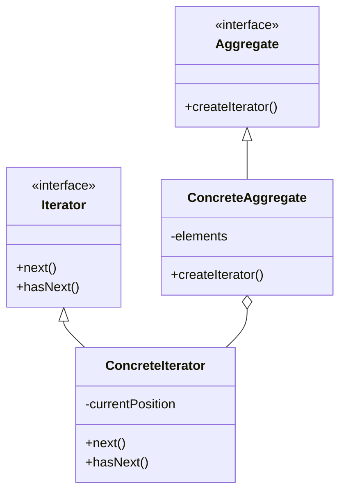

## 7.11 Iterator Pattern

In the realm of software design patterns, the Iterator Pattern stands out as a fundamental concept that facilitates sequential access to elements within an aggregate object, without exposing its underlying representation. This pattern is particularly useful in scenarios where you need to traverse complex data structures or collections in a consistent manner. In this section, we will delve into the intricacies of the Iterator Pattern in Lua, exploring its implementation, use cases, and practical examples.

### Intent of the Iterator Pattern

The primary intent of the Iterator Pattern is to provide a uniform interface for traversing different aggregate structures. By abstracting the traversal logic, the pattern allows for flexible iteration over collections without exposing the internal structure of the data. This separation of concerns enhances code maintainability and reusability.

### Key Participants

1. **Iterator**: Defines an interface for accessing and traversing elements.
2. **Concrete Iterator**: Implements the Iterator interface for a specific aggregate.
3. **Aggregate**: Defines an interface for creating an Iterator object.
4. **Concrete Aggregate**: Implements the Aggregate interface and returns an instance of the Concrete Iterator.

### Implementing Iterator in Lua

Lua, with its powerful features such as closures and coroutines, offers a unique approach to implementing the Iterator Pattern. Let's explore the various ways to create iterators in Lua.

#### Iterator Functions

In Lua, iterator functions are a common way to implement the Iterator Pattern. These functions can be created using closures or coroutines to traverse data structures.

**Using Closures**

Closures in Lua allow us to maintain state across function calls, making them ideal for implementing iterators. Here's a simple example of an iterator using closures:

```lua
-- Iterator function using closures
function rangeIterator(start, stop)
    local current = start - 1
    return function()
        current = current + 1
        if current <= stop then
            return current
        end
    end
end

-- Usage
for number in rangeIterator(1, 5) do
    print(number)  -- Output: 1 2 3 4 5
end
```

In this example, the `rangeIterator` function returns a closure that maintains the current state of iteration. Each call to the closure increments the current value and returns it until the stop condition is met.

**Using Coroutines**

Coroutines provide another powerful mechanism for implementing iterators in Lua. They allow for cooperative multitasking, enabling the suspension and resumption of functions. Here's an example using coroutines:

```lua
-- Iterator function using coroutines
function coroutineIterator(start, stop)
    return coroutine.wrap(function()
        for i = start, stop do
            coroutine.yield(i)
        end
    end)
end

-- Usage
for number in coroutineIterator(1, 5) do
    print(number)  -- Output: 1 2 3 4 5
end
```

In this example, the `coroutineIterator` function uses `coroutine.wrap` to create an iterator that yields values from start to stop. The `for` loop consumes these values until the coroutine is exhausted.

#### Built-in Iterators: `pairs` and `ipairs`

Lua provides built-in iterator functions `pairs` and `ipairs` for traversing tables. These functions are commonly used for iterating over key-value pairs and array-like tables, respectively.

**Using `pairs`**

The `pairs` function is used to iterate over all key-value pairs in a table:

```lua
local t = {a = 1, b = 2, c = 3}

for key, value in pairs(t) do
    print(key, value)  -- Output: a 1, b 2, c 3 (order may vary)
end
```

**Using `ipairs`**

The `ipairs` function is used to iterate over array-like tables with integer keys:

```lua
local t = {10, 20, 30}

for index, value in ipairs(t) do
    print(index, value)  -- Output: 1 10, 2 20, 3 30
end
```

#### Custom Iterators

For more complex data structures, you may need to define custom iterators. This involves creating a function that returns an iterator function, along with any necessary state.

**Example: Custom Iterator for a Linked List**

Let's consider a simple linked list implementation and create an iterator for it:

```lua
-- Node definition
Node = {}
Node.__index = Node

function Node:new(value, next)
    return setmetatable({value = value, next = next}, self)
end

-- Linked list definition
LinkedList = {}
LinkedList.__index = LinkedList

function LinkedList:new()
    return setmetatable({head = nil}, self)
end

function LinkedList:add(value)
    local newNode = Node:new(value, self.head)
    self.head = newNode
end

-- Custom iterator for LinkedList
function LinkedList:iterator()
    local current = self.head
    return function()
        if current then
            local value = current.value
            current = current.next
            return value
        end
    end
end

-- Usage
local list = LinkedList:new()
list:add(3)
list:add(2)
list:add(1)

for value in list:iterator() do
    print(value)  -- Output: 1 2 3
end
```

In this example, the `LinkedList` class defines an `iterator` method that returns a closure. This closure maintains the current node and iterates over the list, returning each node's value.

### Use Cases and Examples

The Iterator Pattern is versatile and can be applied in various scenarios. Let's explore some common use cases and examples.

#### Looping Over Custom Collections

Custom collections, such as linked lists or trees, often require specialized iterators to traverse their elements. By implementing the Iterator Pattern, you can provide a consistent interface for accessing these collections.

#### Streaming Data Processing

In scenarios where data is streamed or processed in chunks, iterators can be used to handle data incrementally. This approach is particularly useful for processing large datasets without loading them entirely into memory.

#### Lazy Evaluation of Large Datasets

Iterators enable lazy evaluation, allowing you to process elements on-demand. This is beneficial when dealing with large datasets, as it reduces memory consumption and improves performance.

### Visualizing the Iterator Pattern

To better understand the Iterator Pattern, let's visualize its components and interactions using a class diagram.



**Diagram Description**: This class diagram illustrates the relationship between the Iterator, Concrete Iterator, Aggregate, and Concrete Aggregate. The Iterator interface defines the methods for traversal, while the Concrete Iterator implements these methods. The Aggregate interface provides a method for creating an iterator, and the Concrete Aggregate implements this method, returning an instance of the Concrete Iterator.

### Design Considerations

When implementing the Iterator Pattern in Lua, consider the following design considerations:

- **State Management**: Ensure that the iterator maintains the necessary state to traverse the collection correctly.
- **Performance**: Evaluate the performance implications of using closures or coroutines for iteration, especially in performance-critical applications.
- **Flexibility**: Design iterators to be flexible and reusable across different collections and data structures.

### Differences and Similarities

The Iterator Pattern is often compared to other traversal patterns, such as the Visitor Pattern. While both patterns involve traversing elements, the Iterator Pattern focuses on providing a uniform interface for sequential access, whereas the Visitor Pattern allows for operations to be performed on elements without modifying their classes.

### Try It Yourself

To deepen your understanding of the Iterator Pattern in Lua, try modifying the code examples provided. Experiment with different data structures, such as trees or graphs, and implement custom iterators for them. Consider using coroutines for more complex iteration scenarios.

### Knowledge Check

- What is the primary intent of the Iterator Pattern?
- How do closures and coroutines facilitate iterator implementation in Lua?
- What are the differences between `pairs` and `ipairs` in Lua?
- How can custom iterators be beneficial for complex data structures?

### Embrace the Journey

Remember, mastering design patterns is a journey. As you explore the Iterator Pattern and its applications, you'll gain valuable insights into creating efficient and maintainable software. Keep experimenting, stay curious, and enjoy the process of learning and discovery!

## Quiz Time!



### What is the primary intent of the Iterator Pattern?

- [x] To provide a way to access elements of an aggregate object without exposing its underlying representation.
- [ ] To modify the elements of an aggregate object.
- [ ] To create a new data structure.
- [ ] To sort elements in a collection.

> **Explanation:** The Iterator Pattern is designed to provide a way to access elements of an aggregate object without exposing its underlying representation.

### Which Lua feature is commonly used to implement iterators?

- [x] Closures
- [ ] Tables
- [ ] Metatables
- [ ] Functions

> **Explanation:** Closures are commonly used in Lua to implement iterators as they allow maintaining state across function calls.

### What is the difference between `pairs` and `ipairs` in Lua?

- [x] `pairs` iterates over all key-value pairs, while `ipairs` iterates over array-like tables with integer keys.
- [ ] `pairs` iterates over array-like tables, while `ipairs` iterates over all key-value pairs.
- [ ] Both `pairs` and `ipairs` iterate over array-like tables.
- [ ] Both `pairs` and `ipairs` iterate over all key-value pairs.

> **Explanation:** `pairs` iterates over all key-value pairs in a table, while `ipairs` is used for array-like tables with integer keys.

### How do coroutines facilitate iterator implementation in Lua?

- [x] By allowing suspension and resumption of functions.
- [ ] By providing a way to create new tables.
- [ ] By modifying the elements of a collection.
- [ ] By sorting elements in a collection.

> **Explanation:** Coroutines allow for cooperative multitasking, enabling the suspension and resumption of functions, which is useful for implementing iterators.

### What is a key benefit of using iterators for large datasets?

- [x] Lazy evaluation
- [ ] Immediate evaluation
- [ ] Data duplication
- [ ] Increased memory usage

> **Explanation:** Iterators enable lazy evaluation, allowing elements to be processed on-demand, which is beneficial for large datasets.

### Which of the following is a design consideration when implementing iterators?

- [x] State Management
- [ ] Data Duplication
- [ ] Immediate Evaluation
- [ ] Sorting Elements

> **Explanation:** State management is crucial when implementing iterators to ensure correct traversal of the collection.

### What is a common use case for custom iterators?

- [x] Looping over custom collections
- [ ] Modifying elements in a collection
- [ ] Sorting elements in a collection
- [ ] Creating new data structures

> **Explanation:** Custom iterators are often used for looping over custom collections, providing a consistent interface for accessing elements.

### How can iterators be used in streaming data processing?

- [x] By handling data incrementally
- [ ] By loading all data into memory
- [ ] By modifying the data structure
- [ ] By sorting the data

> **Explanation:** Iterators can handle data incrementally, which is useful in streaming data processing scenarios.

### What is the relationship between the Iterator and Concrete Iterator in the pattern?

- [x] The Concrete Iterator implements the Iterator interface.
- [ ] The Iterator implements the Concrete Iterator interface.
- [ ] Both are unrelated.
- [ ] The Concrete Iterator modifies the Iterator.

> **Explanation:** The Concrete Iterator implements the Iterator interface, providing the specific traversal logic.

### True or False: The Iterator Pattern exposes the underlying representation of the aggregate object.

- [ ] True
- [x] False

> **Explanation:** The Iterator Pattern is designed to provide access to elements without exposing the underlying representation of the aggregate object.


