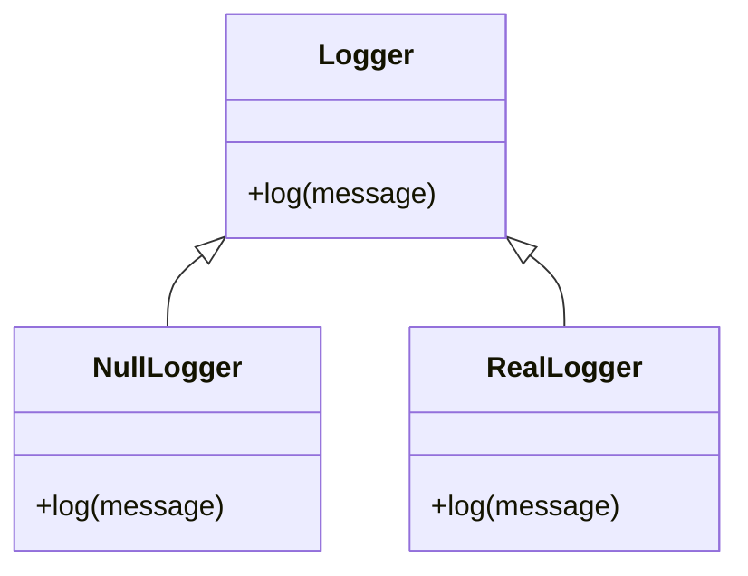

## 7.12 Null Object Pattern

The Null Object Pattern is a behavioral design pattern that provides a default behavior for objects, eliminating the need for `nil` checks in your code. This pattern is particularly useful in Lua, where `nil` is often used to represent the absence of a value. By using a Null Object, you can simplify your code and make it more robust and maintainable.

### Providing a Default Behavior

The Null Object Pattern involves creating an object that implements the same interface as the real object but provides neutral or "do nothing" behavior. This allows you to use the Null Object in place of `nil`, avoiding the need for conditional checks and reducing the risk of runtime errors.

#### Implementing Null Object in Lua

To implement the Null Object Pattern in Lua, you need to define a class or table that represents the Null Object. This object should implement all the methods of the real object but with neutral behavior.

```lua
-- Define a Null Object for a Logger
NullLogger = {
    log = function(self, message)
        -- Do nothing
    end
}

-- Define a Real Logger
RealLogger = {
    log = function(self, message)
        print("Log: " .. message)
    end
}

-- Function to demonstrate the use of Null Object
function performLogging(logger)
    logger:log("This is a log message.")
end

-- Usage
local logger = NullLogger -- or RealLogger
performLogging(logger)
```

In this example, `NullLogger` is a Null Object that implements the `log` method but does nothing. This allows you to use `NullLogger` in place of `nil`, avoiding the need for `nil` checks.

#### Avoiding `nil` Checks

One of the main benefits of the Null Object Pattern is that it eliminates the need for `nil` checks in your code. This simplifies your code and makes it easier to read and maintain.

```lua
-- Without Null Object Pattern
function performLogging(logger)
    if logger then
        logger:log("This is a log message.")
    end
end

-- With Null Object Pattern
function performLogging(logger)
    logger:log("This is a log message.")
end
```

By using a Null Object, you can remove the conditional check and rely on the Null Object to handle the case where no real object is available.

### Use Cases and Examples

The Null Object Pattern is useful in a variety of scenarios, including:

- **Default Implementations in APIs**: Providing default behavior for optional parameters in APIs.
- **Simplifying Patterns that Require Optional Behavior**: Reducing complexity in patterns that involve optional or variable behavior.
- **Placeholder Objects in Data Structures**: Using Null Objects as placeholders in data structures to avoid `nil` checks.

#### Default Implementations in APIs

In APIs, you often have optional parameters that can be `nil`. By using the Null Object Pattern, you can provide default behavior for these parameters, simplifying the API and making it easier to use.

```lua
-- Define a Null Object for a Payment Processor
NullPaymentProcessor = {
    processPayment = function(self, amount)
        -- Do nothing
    end
}

-- Define a Real Payment Processor
RealPaymentProcessor = {
    processPayment = function(self, amount)
        print("Processing payment of $" .. amount)
    end
}

-- Function to demonstrate the use of Null Object in an API
function processOrder(paymentProcessor, amount)
    paymentProcessor:processPayment(amount)
end

-- Usage
local paymentProcessor = NullPaymentProcessor -- or RealPaymentProcessor
processOrder(paymentProcessor, 100)
```

In this example, `NullPaymentProcessor` provides a default implementation for the `processPayment` method, allowing you to use it in place of `nil`.

#### Simplifying Patterns that Require Optional Behavior

The Null Object Pattern can also simplify patterns that involve optional behavior. For example, in the Strategy Pattern, you can use a Null Object as a default strategy, eliminating the need for `nil` checks.

```lua
-- Define a Null Strategy
NullStrategy = {
    execute = function(self)
        -- Do nothing
    end
}

-- Define a Real Strategy
RealStrategy = {
    execute = function(self)
        print("Executing real strategy")
    end
}

-- Function to demonstrate the use of Null Object in a Strategy Pattern
function performTask(strategy)
    strategy:execute()
end

-- Usage
local strategy = NullStrategy -- or RealStrategy
performTask(strategy)
```

In this example, `NullStrategy` provides a default implementation for the `execute` method, allowing you to use it in place of `nil`.

#### Placeholder Objects in Data Structures

In data structures, you can use Null Objects as placeholders to avoid `nil` checks. This is particularly useful in collections where you want to ensure that all elements have a consistent interface.

```lua
-- Define a Null Object for a Collection Element
NullElement = {
    process = function(self)
        -- Do nothing
    end
}

-- Define a Real Element
RealElement = {
    process = function(self)
        print("Processing real element")
    end
}

-- Function to demonstrate the use of Null Object in a collection
function processElements(elements)
    for _, element in ipairs(elements) do
        element:process()
    end
end

-- Usage
local elements = {RealElement, NullElement, RealElement}
processElements(elements)
```

In this example, `NullElement` provides a default implementation for the `process` method, allowing you to use it in place of `nil`.

### Design Considerations

When implementing the Null Object Pattern, consider the following:

- **Consistency**: Ensure that the Null Object implements the same interface as the real object.
- **Neutral Behavior**: The Null Object should provide neutral or "do nothing" behavior.
- **Performance**: Consider the performance implications of using Null Objects, especially in performance-critical code.

### Differences and Similarities

The Null Object Pattern is similar to other patterns that provide default behavior, such as the Strategy Pattern. However, the Null Object Pattern is specifically designed to eliminate `nil` checks and provide a consistent interface.

### Visualizing the Null Object Pattern

To better understand the Null Object Pattern, let's visualize it using a class diagram.



In this diagram, `Logger` is the interface that both `NullLogger` and `RealLogger` implement. `NullLogger` provides neutral behavior, while `RealLogger` provides the actual logging functionality.

### Try It Yourself

To get a better understanding of the Null Object Pattern, try modifying the code examples provided. For example, you can:

- Add additional methods to the Null Object and real object.
- Implement the Null Object Pattern in a different context, such as a user interface component.
- Experiment with different use cases to see how the Null Object Pattern can simplify your code.

### References and Links

For further reading on the Null Object Pattern and design patterns in general, consider the following resources:

- [Design Patterns: Elements of Reusable Object-Oriented Software](https://en.wikipedia.org/wiki/Design_Patterns) by Erich Gamma, Richard Helm, Ralph Johnson, and John Vlissides.
- [Lua Programming Guide](https://www.lua.org/manual/5.4/) - Official Lua documentation.
- [Refactoring to Patterns](https://www.amazon.com/Refactoring-Patterns-Joshua-Kerievsky/dp/0321213351) by Joshua Kerievsky.

### Knowledge Check

To reinforce your understanding of the Null Object Pattern, consider the following questions:

- What is the main purpose of the Null Object Pattern?
- How does the Null Object Pattern simplify code?
- In what scenarios is the Null Object Pattern particularly useful?

### Embrace the Journey

Remember, mastering design patterns is a journey. The Null Object Pattern is just one of many patterns that can help you write cleaner, more maintainable code. Keep experimenting, stay curious, and enjoy the journey!

## Quiz Time!



### What is the primary purpose of the Null Object Pattern?

- [x] To provide a default behavior and eliminate nil checks
- [ ] To enhance performance by reducing memory usage
- [ ] To implement complex algorithms
- [ ] To simplify user interface design

> **Explanation:** The Null Object Pattern provides a default behavior for objects, eliminating the need for nil checks.

### How does the Null Object Pattern simplify code?

- [x] By eliminating the need for conditional nil checks
- [ ] By reducing the number of classes in a program
- [ ] By increasing the complexity of algorithms
- [ ] By enhancing user interface design

> **Explanation:** The Null Object Pattern simplifies code by removing the need for conditional nil checks.

### In which scenario is the Null Object Pattern particularly useful?

- [x] When you want to provide default behavior for optional parameters
- [ ] When you need to implement complex algorithms
- [ ] When you want to enhance user interface design
- [ ] When you need to reduce memory usage

> **Explanation:** The Null Object Pattern is useful for providing default behavior for optional parameters.

### What is a key characteristic of a Null Object?

- [x] It provides neutral or "do nothing" behavior
- [ ] It enhances performance by reducing memory usage
- [ ] It implements complex algorithms
- [ ] It simplifies user interface design

> **Explanation:** A Null Object provides neutral or "do nothing" behavior.

### How does the Null Object Pattern relate to the Strategy Pattern?

- [x] Both provide default behavior
- [ ] Both enhance performance by reducing memory usage
- [ ] Both implement complex algorithms
- [ ] Both simplify user interface design

> **Explanation:** Both the Null Object Pattern and the Strategy Pattern provide default behavior.

### What should a Null Object implement?

- [x] The same interface as the real object
- [ ] A different interface from the real object
- [ ] Complex algorithms
- [ ] User interface design

> **Explanation:** A Null Object should implement the same interface as the real object.

### What is a potential drawback of using the Null Object Pattern?

- [x] Performance implications in performance-critical code
- [ ] Increased memory usage
- [ ] Complexity in user interface design
- [ ] Difficulty in implementing complex algorithms

> **Explanation:** The Null Object Pattern can have performance implications in performance-critical code.

### What is a benefit of using the Null Object Pattern in data structures?

- [x] It avoids nil checks
- [ ] It reduces memory usage
- [ ] It simplifies user interface design
- [ ] It implements complex algorithms

> **Explanation:** The Null Object Pattern avoids nil checks in data structures.

### What is the main difference between a Null Object and a real object?

- [x] A Null Object provides neutral behavior, while a real object provides actual functionality
- [ ] A Null Object enhances performance, while a real object reduces memory usage
- [ ] A Null Object implements complex algorithms, while a real object simplifies user interface design
- [ ] A Null Object reduces memory usage, while a real object enhances performance

> **Explanation:** A Null Object provides neutral behavior, while a real object provides actual functionality.

### True or False: The Null Object Pattern is only useful in object-oriented programming.

- [ ] True
- [x] False

> **Explanation:** The Null Object Pattern can be useful in various programming paradigms, not just object-oriented programming.


