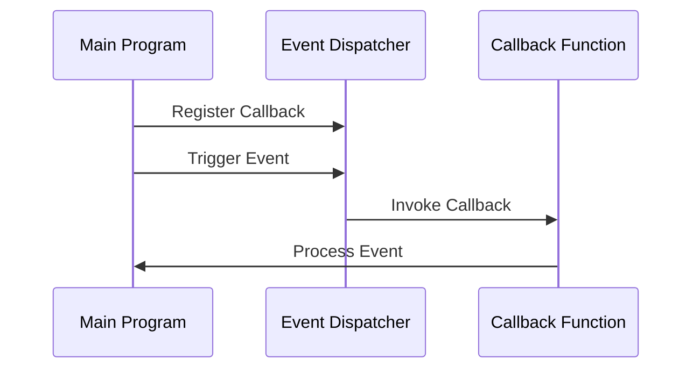

## 7.13 Event Handling and Callbacks

In the realm of software development, responding to events efficiently is crucial for creating responsive and interactive applications. Lua, with its lightweight nature and flexibility, provides powerful mechanisms for managing asynchronous events through callbacks. In this section, we will delve into the concepts of event handling and callbacks in Lua, exploring how they can be implemented and utilized in various applications.

### Responding to Events: Managing Asynchronous Events through Callbacks

Event handling is a fundamental aspect of programming that allows applications to respond to user actions, system events, or other triggers. In Lua, this is often achieved through the use of callbacks—functions that are passed as arguments to be executed when an event occurs. This approach enables asynchronous execution, allowing the program to continue running while waiting for events to be processed.

#### Implementing Event Handling in Lua

To effectively manage events in Lua, we need to understand several key components: callback functions, event dispatchers, and asynchronous execution.

##### Callback Functions

Callback functions are at the heart of event handling. They are functions that are passed as arguments to other functions and are invoked when a specific event occurs. This allows for a decoupled architecture where the event source does not need to know the details of the event handler.

**Example: Basic Callback Function**

```lua
-- Define a callback function
local function onEvent(eventData)
    print("Event occurred with data: " .. eventData)
end

-- Function that accepts a callback
local function triggerEvent(callback)
    local eventData = "Sample Data"
    callback(eventData)  -- Invoke the callback with event data
end

-- Use the callback function
triggerEvent(onEvent)
```

In this example, `onEvent` is a callback function that gets executed when `triggerEvent` is called. The event data is passed to the callback, allowing it to process the event.

##### Event Dispatchers

An event dispatcher is responsible for managing event registrations and firing events. It maintains a list of registered callbacks and invokes them when an event occurs. This pattern is particularly useful in applications where multiple components need to respond to the same event.

**Example: Event Dispatcher**

```lua
-- Event dispatcher table
local EventDispatcher = {}

-- Table to hold registered callbacks
EventDispatcher.callbacks = {}

-- Function to register a callback
function EventDispatcher:registerCallback(callback)
    table.insert(self.callbacks, callback)
end

-- Function to dispatch an event
function EventDispatcher:dispatchEvent(eventData)
    for _, callback in ipairs(self.callbacks) do
        callback(eventData)
    end
end

-- Example usage
local function onCustomEvent(data)
    print("Custom event received with data: " .. data)
end

EventDispatcher:registerCallback(onCustomEvent)
EventDispatcher:dispatchEvent("Hello, World!")
```

In this example, the `EventDispatcher` manages a list of callbacks and invokes them when `dispatchEvent` is called. This allows multiple callbacks to respond to the same event.

##### Asynchronous Execution

Asynchronous execution is crucial for non-blocking behavior, especially in applications that require responsiveness, such as GUI applications or networked systems. In Lua, coroutines can be used to achieve asynchronous execution.

**Example: Asynchronous Execution with Coroutines**

```lua
-- Coroutine-based asynchronous function
local function asyncFunction(callback)
    local co = coroutine.create(function()
        -- Simulate a long-running task
        for i = 1, 5 do
            print("Processing step " .. i)
            coroutine.yield()  -- Yield execution
        end
        callback("Task completed")
    end)

    -- Resume the coroutine
    while coroutine.status(co) ~= "dead" do
        coroutine.resume(co)
    end
end

-- Callback function
local function onTaskComplete(message)
    print(message)
end

-- Execute the asynchronous function
asyncFunction(onTaskComplete)
```

In this example, a coroutine is used to simulate a long-running task. The coroutine yields execution at each step, allowing other tasks to run concurrently. Once the task is complete, the callback function is invoked.

### Use Cases and Examples

Event handling and callbacks are widely used in various domains, including GUI applications, networking, and game development. Let's explore some practical use cases.

#### GUI Applications

In GUI applications, event handling is essential for responding to user interactions, such as button clicks or mouse movements. Lua is often used in conjunction with GUI frameworks to create interactive applications.

**Example: GUI Event Handling**

```lua
-- Simulated GUI framework
local GUI = {}

-- Button class
GUI.Button = {}
GUI.Button.__index = GUI.Button

function GUI.Button:new(label)
    local button = setmetatable({}, GUI.Button)
    button.label = label
    button.onClick = nil
    return button
end

function GUI.Button:click()
    if self.onClick then
        self.onClick(self.label)
    end
end

-- Create a button and register a click event handler
local button = GUI.Button:new("Submit")
button.onClick = function(label)
    print(label .. " button clicked")
end

-- Simulate a button click
button:click()
```

In this example, a simple GUI framework is simulated with a `Button` class. The `onClick` event handler is registered to respond to button clicks.

#### Networking and I/O Operations

Networking and I/O operations often involve waiting for data to be received or sent. Callbacks are used to handle these events without blocking the main program flow.

**Example: Networking with Callbacks**

```lua
-- Simulated network library
local Network = {}

function Network:receiveData(callback)
    -- Simulate data reception
    local data = "Received network data"
    callback(data)
end

-- Callback function for data reception
local function onDataReceived(data)
    print("Data received: " .. data)
end

-- Receive data with a callback
Network:receiveData(onDataReceived)
```

In this example, a simulated network library uses a callback to handle data reception. The callback is invoked when data is received, allowing the program to process it.

#### Game Event Systems

In game development, event systems are used to manage interactions between game entities, such as player actions or environmental changes. Lua is commonly used for scripting game logic and handling events.

**Example: Game Event System**

```lua
-- Game event system
local GameEventSystem = {}

-- Table to hold event listeners
GameEventSystem.listeners = {}

-- Function to add an event listener
function GameEventSystem:addListener(eventType, listener)
    if not self.listeners[eventType] then
        self.listeners[eventType] = {}
    end
    table.insert(self.listeners[eventType], listener)
end

-- Function to trigger an event
function GameEventSystem:triggerEvent(eventType, eventData)
    local listeners = self.listeners[eventType]
    if listeners then
        for _, listener in ipairs(listeners) do
            listener(eventData)
        end
    end
end

-- Example usage
local function onPlayerScored(points)
    print("Player scored " .. points .. " points!")
end

GameEventSystem:addListener("playerScored", onPlayerScored)
GameEventSystem:triggerEvent("playerScored", 100)
```

In this example, a game event system is implemented with a table of event listeners. The `triggerEvent` function invokes all listeners registered for a specific event type.

### Visualizing Event Handling and Callbacks

To better understand the flow of event handling and callbacks, let's visualize the process using a sequence diagram.



**Diagram Description:** This sequence diagram illustrates the interaction between the main program, the event dispatcher, and the callback function. The main program registers a callback with the dispatcher, triggers an event, and the dispatcher invokes the callback to process the event.

### Try It Yourself

Experiment with the code examples provided in this section. Try modifying the callback functions to perform different actions or add additional event types to the event dispatcher. This hands-on approach will deepen your understanding of event handling and callbacks in Lua.

### References and Links

- [Lua 5.4 Reference Manual](https://www.lua.org/manual/5.4/)
- [Programming in Lua](https://www.lua.org/pil/contents.html)
- [Coroutines in Lua](https://www.lua.org/manual/5.4/manual.html#2.6)

### Knowledge Check

- What is a callback function, and how is it used in event handling?
- How does an event dispatcher manage event registrations and firing?
- What role do coroutines play in asynchronous execution?
- How can event handling be applied in GUI applications?
- What are some common use cases for event handling and callbacks in Lua?

### Embrace the Journey

Remember, mastering event handling and callbacks is just the beginning. As you continue to explore Lua's capabilities, you'll discover more ways to create responsive and efficient applications. Keep experimenting, stay curious, and enjoy the journey!

## Quiz Time!



### What is a callback function in Lua?

- [x] A function passed as an argument to be executed later
- [ ] A function that returns another function
- [ ] A function that is called immediately
- [ ] A function that modifies global variables

> **Explanation:** A callback function is a function that is passed as an argument to another function and is executed when a specific event occurs.

### How does an event dispatcher work in Lua?

- [x] It manages event registrations and invokes callbacks
- [ ] It modifies event data before dispatching
- [ ] It only handles GUI events
- [ ] It prevents events from being fired

> **Explanation:** An event dispatcher manages event registrations and invokes registered callbacks when an event occurs.

### What is the role of coroutines in asynchronous execution?

- [x] They allow non-blocking execution by yielding control
- [ ] They execute functions in parallel
- [ ] They are used for error handling
- [ ] They optimize memory usage

> **Explanation:** Coroutines allow non-blocking execution by yielding control, enabling other tasks to run concurrently.

### In which domain is event handling commonly used?

- [x] GUI applications
- [x] Networking
- [x] Game development
- [ ] Static websites

> **Explanation:** Event handling is commonly used in GUI applications, networking, and game development to manage interactions and asynchronous events.

### What is the purpose of the `triggerEvent` function in a game event system?

- [x] To invoke all listeners for a specific event type
- [ ] To register new event types
- [ ] To modify game state directly
- [ ] To log events to a file

> **Explanation:** The `triggerEvent` function invokes all listeners registered for a specific event type, allowing them to respond to the event.

### How can you achieve non-blocking behavior in Lua?

- [x] Using coroutines
- [ ] Using global variables
- [ ] Using nested loops
- [ ] Using static functions

> **Explanation:** Non-blocking behavior can be achieved using coroutines, which allow tasks to yield control and resume later.

### What is the benefit of using callbacks in networking?

- [x] They allow data to be processed when received without blocking
- [ ] They increase network speed
- [ ] They reduce data size
- [ ] They encrypt data automatically

> **Explanation:** Callbacks allow data to be processed when received without blocking the main program flow, improving responsiveness.

### What is the main advantage of using an event dispatcher?

- [x] It decouples event sources from event handlers
- [ ] It increases code complexity
- [ ] It requires less memory
- [ ] It simplifies error handling

> **Explanation:** An event dispatcher decouples event sources from event handlers, allowing for a more modular and flexible architecture.

### True or False: Callbacks can only be used in GUI applications.

- [ ] True
- [x] False

> **Explanation:** False. Callbacks can be used in various domains, including GUI applications, networking, game development, and more.

### What should you do to deepen your understanding of event handling in Lua?

- [x] Experiment with code examples and modify them
- [ ] Only read documentation
- [ ] Avoid using callbacks
- [ ] Focus solely on GUI applications

> **Explanation:** Experimenting with code examples and modifying them helps deepen understanding and provides hands-on experience with event handling in Lua.


