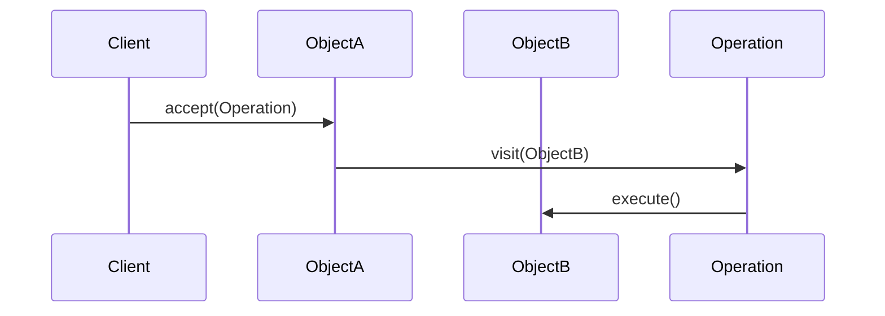

## 7.14 Double Dispatch Pattern

### Introduction

In the world of software design patterns, the Double Dispatch Pattern stands out as a sophisticated technique that allows a program to choose a method to call based on the runtime types of two objects. This pattern is particularly useful in scenarios where operations need to be performed differently depending on the combination of types involved. In this section, we will delve into the intricacies of implementing the Double Dispatch Pattern in Lua, leveraging the Visitor Pattern, type checking, and dynamic method resolution. We will also explore practical use cases such as collision handling in games, complex operation overloading, and mathematical computations.

### Understanding Double Dispatch

**Double Dispatch** is a mechanism that allows a function to be selected based on the runtime types of two objects. Unlike single dispatch, which selects a method based on the type of a single object (usually the receiver), double dispatch considers the types of both the receiver and the argument.

#### Key Concepts

- **Single Dispatch**: The method to be executed is determined by the type of the receiver object.
- **Double Dispatch**: The method is selected based on the types of both the receiver and the argument.

### Implementing Double Dispatch in Lua

Lua, being a dynamically typed language, does not natively support double dispatch. However, we can implement it using a combination of techniques such as the Visitor Pattern, type checking, and method resolution.

#### Visitor Pattern Usage

The **Visitor Pattern** is a common way to achieve double dispatch. It involves creating a visitor interface with a visit method for each type of element. Each element then implements an accept method that calls the appropriate visit method on the visitor.

```lua
-- Define the Visitor interface
Visitor = {}
function Visitor:visitCircle(circle) end
function Visitor:visitRectangle(rectangle) end

-- Define the Element interface
Element = {}
function Element:accept(visitor) end

-- Circle class
Circle = {}
function Circle:new(radius)
    local obj = {radius = radius}
    setmetatable(obj, self)
    self.__index = self
    return obj
end

function Circle:accept(visitor)
    visitor:visitCircle(self)
end

-- Rectangle class
Rectangle = {}
function Rectangle:new(width, height)
    local obj = {width = width, height = height}
    setmetatable(obj, self)
    self.__index = self
    return obj
end

function Rectangle:accept(visitor)
    visitor:visitRectangle(self)
end

-- Concrete Visitor
AreaCalculator = {}
function AreaCalculator:visitCircle(circle)
    print("Area of Circle: " .. math.pi * circle.radius^2)
end

function AreaCalculator:visitRectangle(rectangle)
    print("Area of Rectangle: " .. rectangle.width * rectangle.height)
end

-- Usage
local circle = Circle:new(5)
local rectangle = Rectangle:new(4, 6)
local calculator = AreaCalculator

circle:accept(calculator)
rectangle:accept(calculator)
```

In this example, the `AreaCalculator` acts as a visitor that calculates the area of different shapes. The `accept` method in each shape class calls the appropriate `visit` method on the visitor, achieving double dispatch.

#### Type Checking

In Lua, we can use the `type()` function or metatables to perform type checking. This is crucial for determining the types of objects involved in double dispatch.

```lua
function determineType(obj)
    if type(obj) == "table" and obj.__type then
        return obj.__type
    else
        return type(obj)
    end
end

local circle = {__type = "Circle"}
local rectangle = {__type = "Rectangle"}

print(determineType(circle)) -- Output: Circle
print(determineType(rectangle)) -- Output: Rectangle
```

By using a custom `__type` field, we can extend Lua's type system to include user-defined types, which is useful for implementing double dispatch.

#### Method Resolution

Dynamic method resolution is the process of determining which function to execute based on the types of the involved objects. In Lua, this can be achieved using tables to map type combinations to functions.

```lua
-- Define operations table
local operations = {
    Circle = {
        Circle = function(a, b) print("Handling Circle-Circle collision") end,
        Rectangle = function(a, b) print("Handling Circle-Rectangle collision") end
    },
    Rectangle = {
        Circle = function(a, b) print("Handling Rectangle-Circle collision") end,
        Rectangle = function(a, b) print("Handling Rectangle-Rectangle collision") end
    }
}

-- Function to resolve and execute the appropriate operation
function resolveAndExecute(a, b)
    local typeA = determineType(a)
    local typeB = determineType(b)
    local operation = operations[typeA][typeB]
    if operation then
        operation(a, b)
    else
        print("No operation defined for " .. typeA .. " and " .. typeB)
    end
end

-- Usage
local circle1 = {__type = "Circle"}
local rectangle1 = {__type = "Rectangle"}

resolveAndExecute(circle1, rectangle1) -- Output: Handling Circle-Rectangle collision
resolveAndExecute(rectangle1, circle1) -- Output: Handling Rectangle-Circle collision
```

In this example, we use a nested table to map type combinations to specific functions, allowing us to dynamically resolve and execute the correct operation.

### Use Cases and Examples

#### Collision Handling in Games

In game development, collision handling often requires different responses depending on the types of objects involved. Double dispatch can be used to select the appropriate collision response based on the types of the colliding objects.

```lua
-- Define game objects
Player = {__type = "Player"}
Enemy = {__type = "Enemy"}
Wall = {__type = "Wall"}

-- Define collision responses
local collisionResponses = {
    Player = {
        Enemy = function(player, enemy) print("Player takes damage from Enemy") end,
        Wall = function(player, wall) print("Player stops at Wall") end
    },
    Enemy = {
        Player = function(enemy, player) print("Enemy attacks Player") end,
        Wall = function(enemy, wall) print("Enemy bounces off Wall") end
    }
}

-- Function to handle collisions
function handleCollision(obj1, obj2)
    local type1 = determineType(obj1)
    local type2 = determineType(obj2)
    local response = collisionResponses[type1][type2]
    if response then
        response(obj1, obj2)
    else
        print("No collision response for " .. type1 .. " and " .. type2)
    end
end

-- Usage
local player = {__type = "Player"}
local enemy = {__type = "Enemy"}

handleCollision(player, enemy) -- Output: Player takes damage from Enemy
handleCollision(enemy, player) -- Output: Enemy attacks Player
```

This example demonstrates how double dispatch can be used to handle different collision scenarios in a game, providing a flexible and extensible way to manage interactions between various game objects.

#### Complex Operation Overloading

Double dispatch can also be used to implement complex operation overloading, where the behavior of an operation depends on the types of both operands.

```lua
-- Define number types
Integer = {__type = "Integer"}
Float = {__type = "Float"}

-- Define operation overloads
local operationOverloads = {
    Integer = {
        Integer = function(a, b) return a.value + b.value end,
        Float = function(a, b) return a.value + b.value end
    },
    Float = {
        Integer = function(a, b) return a.value + b.value end,
        Float = function(a, b) return a.value + b.value end
    }
}

-- Function to perform operation
function performOperation(a, b)
    local typeA = determineType(a)
    local typeB = determineType(b)
    local operation = operationOverloads[typeA][typeB]
    if operation then
        return operation(a, b)
    else
        error("No operation defined for " .. typeA .. " and " .. typeB)
    end
end

-- Usage
local int1 = {__type = "Integer", value = 5}
local float1 = {__type = "Float", value = 3.5}

print(performOperation(int1, float1)) -- Output: 8.5
print(performOperation(float1, int1)) -- Output: 8.5
```

In this example, we use double dispatch to overload addition operations for different number types, allowing for flexible and type-safe arithmetic operations.

#### Mathematical Computations with Different Types

Double dispatch can be applied to mathematical computations involving different types, such as vectors and matrices, where operations need to be performed differently depending on the types involved.

```lua
-- Define mathematical types
Vector = {__type = "Vector"}
Matrix = {__type = "Matrix"}

-- Define computation functions
local computations = {
    Vector = {
        Vector = function(v1, v2) print("Adding two vectors") end,
        Matrix = function(v, m) print("Multiplying vector by matrix") end
    },
    Matrix = {
        Vector = function(m, v) print("Multiplying matrix by vector") end,
        Matrix = function(m1, m2) print("Multiplying two matrices") end
    }
}

-- Function to perform computation
function performComputation(a, b)
    local typeA = determineType(a)
    local typeB = determineType(b)
    local computation = computations[typeA][typeB]
    if computation then
        computation(a, b)
    else
        print("No computation defined for " .. typeA .. " and " .. typeB)
    end
end

-- Usage
local vector1 = {__type = "Vector"}
local matrix1 = {__type = "Matrix"}

performComputation(vector1, matrix1) -- Output: Multiplying vector by matrix
performComputation(matrix1, vector1) -- Output: Multiplying matrix by vector
```

This example illustrates how double dispatch can be used to handle different mathematical computations involving vectors and matrices, providing a flexible and extensible framework for mathematical operations.

### Design Considerations

When implementing the Double Dispatch Pattern in Lua, consider the following:

- **Complexity**: Double dispatch can introduce complexity, especially in large systems with many types. Ensure that the benefits outweigh the added complexity.
- **Performance**: The dynamic nature of double dispatch can impact performance. Optimize where possible, and consider alternatives if performance is critical.
- **Extensibility**: Double dispatch provides a flexible framework for handling operations involving multiple types. Ensure that your implementation is easily extensible to accommodate new types and operations.

### Differences and Similarities

Double dispatch is often confused with the Visitor Pattern, as the latter is a common way to implement the former. However, they are distinct concepts:

- **Double Dispatch**: A mechanism for selecting a method based on the runtime types of two objects.
- **Visitor Pattern**: A design pattern that separates an algorithm from the objects it operates on, often used to implement double dispatch.

### Try It Yourself

To deepen your understanding of the Double Dispatch Pattern, try modifying the code examples provided:

- **Experiment with New Types**: Add new types to the collision handling or operation overloading examples and define new behaviors for these types.
- **Optimize Performance**: Explore ways to optimize the performance of your double dispatch implementation, such as caching results or using more efficient data structures.
- **Extend Functionality**: Implement additional operations or computations using double dispatch, and explore how this pattern can be applied to other domains.

### Visualizing Double Dispatch

To better understand the flow of double dispatch, consider the following sequence diagram that illustrates the interaction between objects and the resolution of methods based on their types.



This diagram shows how the client initiates the process by calling the `accept` method on `ObjectA`, which then delegates the operation to the `Operation` object, which in turn calls the appropriate method on `ObjectB`.

### Conclusion

The Double Dispatch Pattern is a powerful tool in the software engineer's toolkit, enabling flexible and extensible handling of operations involving multiple types. By leveraging the Visitor Pattern, type checking, and dynamic method resolution, we can implement double dispatch in Lua, opening up a world of possibilities for complex interactions and computations. As you continue your journey in mastering Lua design patterns, remember that the key to success lies in understanding the principles behind each pattern and applying them thoughtfully to solve real-world problems.

## Quiz Time!



### What is the primary purpose of the Double Dispatch Pattern?

- [x] To select a method based on the runtime types of two objects.
- [ ] To select a method based on the compile-time types of two objects.
- [ ] To select a method based on the runtime type of a single object.
- [ ] To select a method based on the compile-time type of a single object.

> **Explanation:** The Double Dispatch Pattern allows a method to be selected based on the runtime types of two objects, enabling more flexible and dynamic behavior.

### Which design pattern is commonly used to implement Double Dispatch?

- [x] Visitor Pattern
- [ ] Singleton Pattern
- [ ] Factory Pattern
- [ ] Observer Pattern

> **Explanation:** The Visitor Pattern is often used to implement Double Dispatch by allowing operations to be defined separately from the objects they operate on.

### How can you perform type checking in Lua for Double Dispatch?

- [x] Using the `type()` function or custom `__type` fields in tables.
- [ ] Using the `typeof()` function.
- [ ] Using the `instanceof` operator.
- [ ] Using the `class` keyword.

> **Explanation:** In Lua, type checking can be performed using the `type()` function or by defining custom `__type` fields in tables to represent user-defined types.

### What is a common use case for Double Dispatch in game development?

- [x] Collision handling between different game objects.
- [ ] Rendering graphics on the screen.
- [ ] Loading game assets.
- [ ] Saving game progress.

> **Explanation:** Double Dispatch is commonly used in game development for collision handling, where different responses are needed based on the types of colliding objects.

### What is the main advantage of using Double Dispatch?

- [x] It allows for flexible and extensible handling of operations involving multiple types.
- [ ] It simplifies the code by reducing the number of classes.
- [ ] It improves performance by reducing method calls.
- [ ] It ensures compile-time type safety.

> **Explanation:** Double Dispatch provides a flexible and extensible framework for handling operations involving multiple types, making it easier to manage complex interactions.

### Which of the following is NOT a benefit of Double Dispatch?

- [ ] Flexibility in handling multiple types.
- [ ] Extensibility for new types and operations.
- [x] Improved compile-time type safety.
- [ ] Separation of concerns.

> **Explanation:** Double Dispatch does not improve compile-time type safety, as it relies on runtime type information to select methods.

### What is the role of the `accept` method in the Visitor Pattern?

- [x] To delegate the operation to the visitor by calling the appropriate visit method.
- [ ] To perform the operation directly on the object.
- [ ] To initialize the visitor with the object's data.
- [ ] To check the type of the visitor.

> **Explanation:** The `accept` method in the Visitor Pattern delegates the operation to the visitor by calling the appropriate visit method, enabling double dispatch.

### How can you optimize the performance of a Double Dispatch implementation in Lua?

- [x] By caching results or using more efficient data structures.
- [ ] By using the `goto` statement.
- [ ] By reducing the number of visitor classes.
- [ ] By using static typing.

> **Explanation:** Performance can be optimized by caching results or using more efficient data structures to reduce the overhead of dynamic method resolution.

### What is a potential drawback of using Double Dispatch?

- [x] Increased complexity in large systems with many types.
- [ ] Reduced flexibility in handling operations.
- [ ] Difficulty in adding new types.
- [ ] Lack of support for dynamic typing.

> **Explanation:** Double Dispatch can introduce complexity, especially in large systems with many types, so it's important to weigh the benefits against the added complexity.

### True or False: Double Dispatch can be used to implement operation overloading in Lua.

- [x] True
- [ ] False

> **Explanation:** Double Dispatch can be used to implement operation overloading by selecting different methods based on the types of the operands involved.


