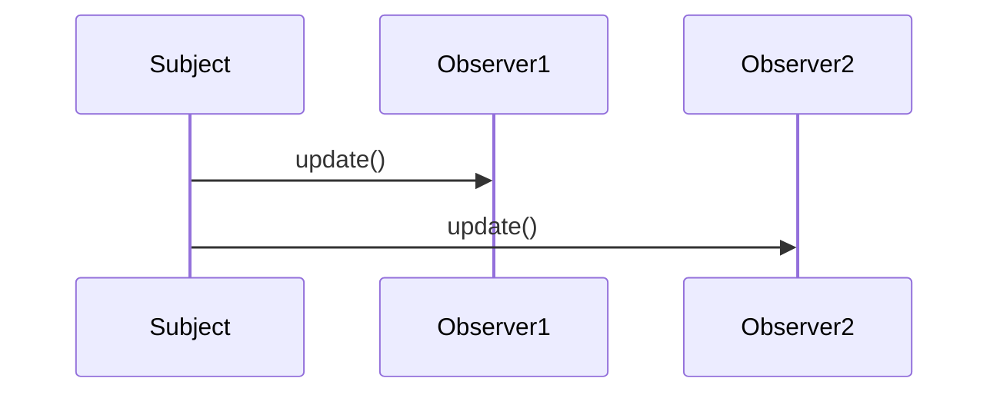

## 7.2 Observer Pattern (Publish/Subscribe)

The Observer Pattern, also known as Publish/Subscribe, is a fundamental design pattern in software engineering that facilitates event notification. It allows objects, known as observers, to be notified when a state change occurs in another object, referred to as the subject. This pattern is particularly useful in scenarios where a change in one part of an application needs to be communicated to other parts without creating tight coupling between them.

### Intent

The primary intent of the Observer Pattern is to define a one-to-many dependency between objects so that when one object changes state, all its dependents are notified and updated automatically. This pattern is widely used in event-driven systems, where it is essential to decouple the subject from its observers, allowing for a more modular and maintainable architecture.

### Key Participants

1. **Subject**: The object that holds the state and notifies observers of any changes. It maintains a list of observers and provides methods to attach and detach them.
2. **Observer**: The objects that need to be notified of changes in the subject. They define an update method that is called by the subject.
3. **ConcreteSubject**: A specific implementation of the subject that stores state and notifies observers when a change occurs.
4. **ConcreteObserver**: A specific implementation of an observer that reacts to changes in the subject.

### Applicability

The Observer Pattern is applicable in the following scenarios:

- When an abstraction has two aspects, one dependent on the other. Encapsulating these aspects in separate objects allows you to vary and reuse them independently.
- When a change to one object requires changing others, and you don't know how many objects need to be changed.
- When an object should be able to notify other objects without making assumptions about who these objects are.

### Implementing Observer in Lua

Let's delve into how we can implement the Observer Pattern in Lua. Lua's flexibility and dynamic nature make it an excellent choice for implementing this pattern.

#### Subject Object

The subject object is responsible for maintaining a list of observers and notifying them of any changes. Here's how you can implement a simple subject in Lua:

```lua
-- Subject class
Subject = {}
Subject.__index = Subject

function Subject:new()
    local instance = {
        observers = {}
    }
    setmetatable(instance, Subject)
    return instance
end

function Subject:attach(observer)
    table.insert(self.observers, observer)
end

function Subject:detach(observer)
    for i, obs in ipairs(self.observers) do
        if obs == observer then
            table.remove(self.observers, i)
            break
        end
    end
end

function Subject:notify()
    for _, observer in ipairs(self.observers) do
        observer:update()
    end
end
```

In this implementation, the `Subject` class maintains a list of observers and provides methods to attach, detach, and notify them.

#### Observer Objects

Observers define an update method that is called by the subject. Here's a simple observer implementation:

```lua
-- Observer class
Observer = {}
Observer.__index = Observer

function Observer:new(name)
    local instance = {
        name = name
    }
    setmetatable(instance, Observer)
    return instance
end

function Observer:update()
    print(self.name .. " has been notified!")
end
```

Each observer has a name and an `update` method that prints a notification message.

#### Event Handling

The subject can notify observers of changes using the `notify` method. Let's see how this works in practice:

```lua
-- Create a subject
local subject = Subject:new()

-- Create observers
local observer1 = Observer:new("Observer 1")
local observer2 = Observer:new("Observer 2")

-- Attach observers to the subject
subject:attach(observer1)
subject:attach(observer2)

-- Notify observers
subject:notify()

-- Output:
-- Observer 1 has been notified!
-- Observer 2 has been notified!
```

In this example, we create a subject and two observers. We attach the observers to the subject and then notify them, resulting in both observers being notified.

### Use Cases and Examples

The Observer Pattern is widely used in various domains. Here are some common use cases:

#### GUI Event Handling

In graphical user interfaces, the Observer Pattern is used to handle events such as button clicks, mouse movements, and keyboard inputs. Each event is a subject, and the components that need to respond to the event are observers.

#### Game Event Systems

In game development, the Observer Pattern is used to manage game events. For example, when a player scores a point, the game needs to update the score display, play a sound, and possibly trigger other game logic. Each of these actions can be handled by observers.

#### Real-Time Data Monitoring

In real-time data monitoring systems, the Observer Pattern is used to notify various components of changes in data. For example, in a stock trading application, changes in stock prices can be broadcast to multiple components that need to update their displays or perform calculations.

### Visualizing the Observer Pattern

To better understand the Observer Pattern, let's visualize the interaction between the subject and observers using a sequence diagram.



This diagram illustrates how the subject notifies each observer by calling their `update` method.

### Design Considerations

When implementing the Observer Pattern, consider the following:

- **Memory Management**: Ensure that observers are properly detached when they are no longer needed to prevent memory leaks.
- **Performance**: Notifying a large number of observers can be costly. Consider optimizing the notification process if performance is a concern.
- **Error Handling**: Ensure that errors in one observer do not prevent other observers from being notified.

### Differences and Similarities

The Observer Pattern is often confused with the Mediator Pattern. While both patterns deal with communication between objects, the Mediator Pattern centralizes communication through a mediator object, whereas the Observer Pattern allows direct communication between the subject and observers.

### Try It Yourself

To deepen your understanding of the Observer Pattern, try modifying the code examples:

- Add more observers and see how the notification process scales.
- Implement a concrete subject that changes state and notifies observers of the change.
- Experiment with different ways of notifying observers, such as passing data to the `update` method.

### Conclusion

The Observer Pattern is a powerful tool for managing event-driven systems. By decoupling the subject from its observers, it allows for a more modular and maintainable architecture. As you continue to explore Lua and design patterns, consider how the Observer Pattern can be applied to your projects to improve their structure and flexibility.

## Quiz Time!



### What is the primary intent of the Observer Pattern?

- [x] To define a one-to-many dependency between objects so that when one object changes state, all its dependents are notified and updated automatically.
- [ ] To encapsulate a request as an object, thereby allowing for parameterization of clients with queues, requests, and operations.
- [ ] To provide a surrogate or placeholder for another object to control access to it.
- [ ] To define a family of algorithms, encapsulate each one, and make them interchangeable.

> **Explanation:** The Observer Pattern's primary intent is to define a one-to-many dependency between objects, ensuring that when one object changes state, all its dependents are notified and updated automatically.

### Which of the following is NOT a key participant in the Observer Pattern?

- [ ] Subject
- [ ] Observer
- [ ] ConcreteSubject
- [x] Mediator

> **Explanation:** The Mediator is not a participant in the Observer Pattern. The key participants are Subject, Observer, ConcreteSubject, and ConcreteObserver.

### In the Observer Pattern, what is the role of the Subject?

- [x] To maintain a list of observers and notify them of any changes.
- [ ] To define an update method that is called by the subject.
- [ ] To encapsulate a request as an object.
- [ ] To provide a surrogate or placeholder for another object.

> **Explanation:** The Subject maintains a list of observers and is responsible for notifying them of any changes.

### What is a common use case for the Observer Pattern?

- [x] GUI event handling
- [ ] Sorting algorithms
- [ ] Data encryption
- [ ] Memory management

> **Explanation:** A common use case for the Observer Pattern is GUI event handling, where events such as button clicks need to notify multiple components.

### How does the Observer Pattern improve software architecture?

- [x] By decoupling the subject from its observers, allowing for a more modular and maintainable architecture.
- [ ] By centralizing communication through a mediator object.
- [ ] By encapsulating a request as an object.
- [ ] By providing a surrogate or placeholder for another object.

> **Explanation:** The Observer Pattern improves software architecture by decoupling the subject from its observers, which allows for a more modular and maintainable architecture.

### What should be considered when implementing the Observer Pattern?

- [x] Memory management, performance, and error handling.
- [ ] Sorting algorithms, data encryption, and memory management.
- [ ] Centralized communication, request encapsulation, and surrogate objects.
- [ ] GUI event handling, sorting algorithms, and data encryption.

> **Explanation:** When implementing the Observer Pattern, consider memory management, performance, and error handling to ensure efficient and reliable operation.

### What is the difference between the Observer Pattern and the Mediator Pattern?

- [x] The Observer Pattern allows direct communication between the subject and observers, while the Mediator Pattern centralizes communication through a mediator object.
- [ ] The Observer Pattern centralizes communication through a mediator object, while the Mediator Pattern allows direct communication between the subject and observers.
- [ ] The Observer Pattern encapsulates a request as an object, while the Mediator Pattern defines a family of algorithms.
- [ ] The Observer Pattern provides a surrogate or placeholder for another object, while the Mediator Pattern encapsulates a request as an object.

> **Explanation:** The Observer Pattern allows direct communication between the subject and observers, whereas the Mediator Pattern centralizes communication through a mediator object.

### What is a potential drawback of the Observer Pattern?

- [x] Notifying a large number of observers can be costly in terms of performance.
- [ ] It requires centralizing communication through a mediator object.
- [ ] It encapsulates a request as an object, which can lead to complexity.
- [ ] It provides a surrogate or placeholder for another object, which can lead to inefficiency.

> **Explanation:** A potential drawback of the Observer Pattern is that notifying a large number of observers can be costly in terms of performance.

### True or False: The Observer Pattern is only applicable in GUI applications.

- [ ] True
- [x] False

> **Explanation:** False. The Observer Pattern is applicable in various domains, including GUI applications, game development, and real-time data monitoring.

### What is the role of the ConcreteObserver in the Observer Pattern?

- [x] To react to changes in the subject by implementing the update method.
- [ ] To maintain a list of observers and notify them of any changes.
- [ ] To encapsulate a request as an object.
- [ ] To provide a surrogate or placeholder for another object.

> **Explanation:** The ConcreteObserver reacts to changes in the subject by implementing the update method, which is called by the subject.



Remember, mastering the Observer Pattern is just one step in your journey to becoming a proficient software engineer. Keep experimenting, stay curious, and enjoy the process of learning and applying design patterns in your projects.
