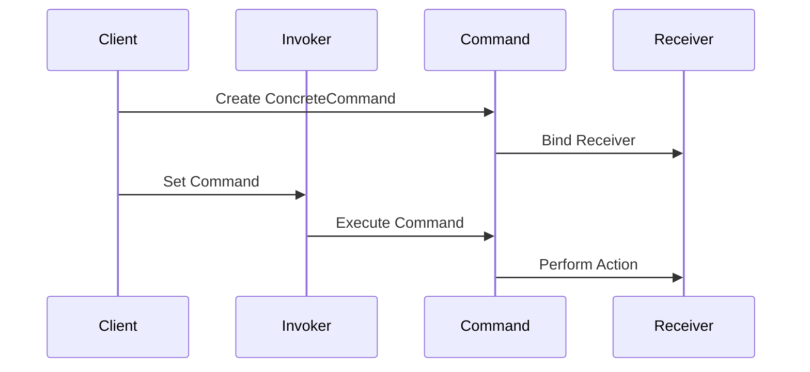

## 7.3 Command Pattern

The Command Pattern is a behavioral design pattern that turns a request into a stand-alone object containing all the information about the request. This transformation allows for parameterization of clients with queues, requests, and operations, as well as providing support for undoable operations. In Lua, the Command Pattern can be implemented using tables or functions to encapsulate actions, making it a versatile tool for software engineers and architects.

### Intent

The primary intent of the Command Pattern is to encapsulate a request as an object, thereby allowing for parameterization of clients with different requests, queuing of requests, and logging of the requests. It also provides support for undoable operations.

### Key Participants

1. **Command**: Declares an interface for executing an operation.
2. **ConcreteCommand**: Implements the Command interface, binding a receiver to an action.
3. **Invoker**: Asks the command to carry out the request.
4. **Receiver**: Knows how to perform the operations associated with carrying out a request.
5. **Client**: Creates a ConcreteCommand object and sets its receiver.

### Implementing Command in Lua

In Lua, the Command Pattern can be implemented using tables or functions to represent actions. Let's explore how to implement this pattern step-by-step.

#### Command Objects

Command objects in Lua can be represented as tables or functions. These objects encapsulate the action to be performed and any parameters required for the action.

```lua
-- Define a Command interface
Command = {}
function Command:new()
    local newObj = {execute = function() end}
    self.__index = self
    return setmetatable(newObj, self)
end

-- ConcreteCommand implementing the Command interface
ConcreteCommand = Command:new()
function ConcreteCommand:new(receiver, action)
    local newObj = {receiver = receiver, action = action}
    self.__index = self
    return setmetatable(newObj, self)
end

function ConcreteCommand:execute()
    self.receiver[self.action](self.receiver)
end
```

In this example, `ConcreteCommand` is a table that implements the `Command` interface. It holds a reference to a `receiver` and an `action` to be performed.

#### Invoker

The Invoker is responsible for executing commands and may also manage a history of executed commands to support undo/redo functionality.

```lua
-- Invoker class
Invoker = {}
function Invoker:new()
    local newObj = {commands = {}}
    self.__index = self
    return setmetatable(newObj, self)
end

function Invoker:setCommand(command)
    table.insert(self.commands, command)
end

function Invoker:executeCommands()
    for _, command in ipairs(self.commands) do
        command:execute()
    end
end
```

The `Invoker` class maintains a list of commands and provides a method to execute them.

#### Undo/Redo Functionality

Implementing undo/redo functionality involves maintaining a history of executed commands and providing methods to reverse or reapply them.

```lua
-- Adding undo functionality
function ConcreteCommand:undo()
    -- Implement undo logic here
end

function Invoker:undoLastCommand()
    local lastCommand = table.remove(self.commands)
    if lastCommand then
        lastCommand:undo()
    end
end
```

In this example, each `ConcreteCommand` can implement its own `undo` method, and the `Invoker` can call this method to reverse the last executed command.

### Use Cases and Examples

#### Implementing Undo Mechanisms

The Command Pattern is ideal for implementing undo mechanisms in applications. Each command can be undone by reversing the action it performed.

```lua
-- Receiver class
Receiver = {}
function Receiver:new()
    local newObj = {state = ""}
    self.__index = self
    return setmetatable(newObj, self)
end

function Receiver:action()
    print("Performing action")
    self.state = "Action performed"
end

function Receiver:undoAction()
    print("Undoing action")
    self.state = ""
end

-- ConcreteCommand with undo functionality
ConcreteCommandWithUndo = ConcreteCommand:new()
function ConcreteCommandWithUndo:new(receiver)
    local newObj = {receiver = receiver}
    self.__index = self
    return setmetatable(newObj, self)
end

function ConcreteCommandWithUndo:execute()
    self.receiver:action()
end

function ConcreteCommandWithUndo:undo()
    self.receiver:undoAction()
end

-- Usage
local receiver = Receiver:new()
local command = ConcreteCommandWithUndo:new(receiver)
local invoker = Invoker:new()

invoker:setCommand(command)
invoker:executeCommands()
invoker:undoLastCommand()
```

In this example, the `Receiver` class has methods for performing and undoing an action. The `ConcreteCommandWithUndo` class implements both `execute` and `undo` methods.

#### Queuing Operations for Asynchronous Execution

The Command Pattern can be used to queue operations for asynchronous execution, allowing for deferred execution of commands.

```lua
-- Asynchronous execution example
function Invoker:executeCommandsAsync()
    for _, command in ipairs(self.commands) do
        -- Simulate asynchronous execution
        coroutine.wrap(function()
            command:execute()
        end)()
    end
end

-- Usage
invoker:executeCommandsAsync()
```

In this example, commands are executed asynchronously using Lua's coroutines, allowing for non-blocking execution.

#### Macro Recording

The Command Pattern can also be used to implement macro recording, where a sequence of commands is recorded and replayed.

```lua
-- Macro recording example
MacroCommand = Command:new()
function MacroCommand:new()
    local newObj = {commands = {}}
    self.__index = self
    return setmetatable(newObj, self)
end

function MacroCommand:addCommand(command)
    table.insert(self.commands, command)
end

function MacroCommand:execute()
    for _, command in ipairs(self.commands) do
        command:execute()
    end
end

-- Usage
local macro = MacroCommand:new()
macro:addCommand(command)
macro:execute()
```

In this example, `MacroCommand` is a composite command that can execute a sequence of commands.

### Visualizing the Command Pattern

To better understand the Command Pattern, let's visualize the interaction between its components using a sequence diagram.



This diagram illustrates the sequence of interactions in the Command Pattern, from the creation of a command to its execution by the invoker.

### Design Considerations

- **When to Use**: Use the Command Pattern when you need to parameterize objects with operations, queue operations, or support undoable operations.
- **Flexibility**: The pattern decouples the object that invokes the operation from the one that knows how to perform it.
- **Complexity**: While the pattern adds flexibility, it can also increase the complexity of the codebase. Use it judiciously.

### Differences and Similarities

The Command Pattern is often confused with the Strategy Pattern. While both encapsulate actions, the Command Pattern focuses on encapsulating requests as objects, whereas the Strategy Pattern encapsulates algorithms.

### Try It Yourself

Experiment with the Command Pattern by modifying the code examples provided. Try implementing additional commands, adding more complex undo logic, or experimenting with asynchronous execution using coroutines.

### References and Links

- [Lua Programming Guide](https://www.lua.org/manual/5.4/)
- [Design Patterns: Elements of Reusable Object-Oriented Software](https://en.wikipedia.org/wiki/Design_Patterns)
- [MDN Web Docs on Design Patterns](https://developer.mozilla.org/en-US/docs/Web/JavaScript/Guide/Design_Patterns)

### Knowledge Check

- What is the primary intent of the Command Pattern?
- How does the Command Pattern support undoable operations?
- What are some use cases for the Command Pattern in Lua?

### Embrace the Journey

Remember, mastering design patterns is a journey. As you continue to explore and experiment with the Command Pattern in Lua, you'll gain a deeper understanding of its power and flexibility. Keep experimenting, stay curious, and enjoy the journey!

## Quiz Time!



### What is the primary intent of the Command Pattern?

- [x] To encapsulate a request as an object, allowing parameterization and queuing.
- [ ] To provide a way to create families of related objects.
- [ ] To define a one-to-many dependency between objects.
- [ ] To separate the construction of a complex object from its representation.

> **Explanation:** The Command Pattern encapsulates a request as an object, allowing for parameterization, queuing, and undoable operations.

### Which component in the Command Pattern is responsible for executing commands?

- [ ] Command
- [x] Invoker
- [ ] Receiver
- [ ] Client

> **Explanation:** The Invoker is responsible for executing commands and may also manage a history of executed commands.

### How can the Command Pattern support undo functionality?

- [x] By implementing an undo method in each ConcreteCommand.
- [ ] By using a separate UndoManager class.
- [ ] By storing command history in the Client.
- [ ] By using a global undo function.

> **Explanation:** Each ConcreteCommand can implement its own undo method, allowing the Invoker to reverse the last executed command.

### What is a common use case for the Command Pattern?

- [x] Implementing undo mechanisms.
- [ ] Creating complex object hierarchies.
- [ ] Managing database connections.
- [ ] Handling user authentication.

> **Explanation:** The Command Pattern is commonly used to implement undo mechanisms by encapsulating actions as objects.

### How does the Command Pattern differ from the Strategy Pattern?

- [x] The Command Pattern encapsulates requests, while the Strategy Pattern encapsulates algorithms.
- [ ] The Command Pattern is used for creating objects, while the Strategy Pattern is used for managing state.
- [ ] The Command Pattern is a structural pattern, while the Strategy Pattern is a behavioral pattern.
- [ ] The Command Pattern is used for managing dependencies, while the Strategy Pattern is used for managing resources.

> **Explanation:** The Command Pattern focuses on encapsulating requests as objects, whereas the Strategy Pattern encapsulates algorithms.

### What is the role of the Receiver in the Command Pattern?

- [x] To perform the operations associated with carrying out a request.
- [ ] To execute commands.
- [ ] To create ConcreteCommand objects.
- [ ] To manage command history.

> **Explanation:** The Receiver knows how to perform the operations associated with carrying out a request.

### How can the Command Pattern be used for asynchronous execution?

- [x] By queuing commands and executing them using coroutines.
- [ ] By using a separate thread for each command.
- [ ] By implementing a callback mechanism.
- [ ] By using a global event loop.

> **Explanation:** The Command Pattern can queue commands for asynchronous execution using Lua's coroutines.

### What is a MacroCommand in the context of the Command Pattern?

- [x] A composite command that can execute a sequence of commands.
- [ ] A command that can be executed multiple times.
- [ ] A command that can be undone and redone.
- [ ] A command that manages other commands.

> **Explanation:** A MacroCommand is a composite command that can execute a sequence of commands.

### Which of the following is a benefit of using the Command Pattern?

- [x] It decouples the object that invokes the operation from the one that knows how to perform it.
- [ ] It simplifies the codebase by reducing the number of classes.
- [ ] It improves performance by optimizing command execution.
- [ ] It provides a way to manage complex object hierarchies.

> **Explanation:** The Command Pattern decouples the invoker from the receiver, providing flexibility in executing operations.

### True or False: The Command Pattern can be used to implement macro recording.

- [x] True
- [ ] False

> **Explanation:** The Command Pattern can be used to implement macro recording by encapsulating a sequence of commands as a MacroCommand.


