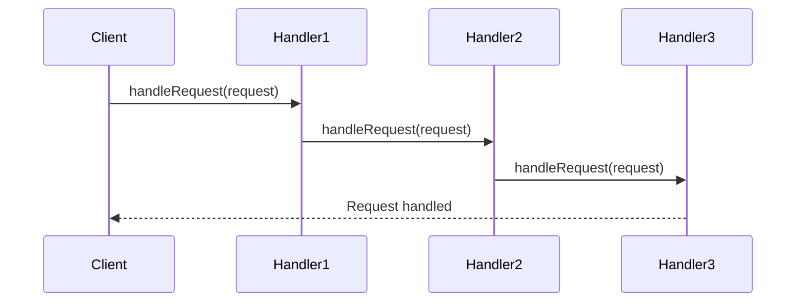

## 7.4 Chain of Responsibility Pattern

In the realm of software design patterns, the Chain of Responsibility pattern stands out as a powerful tool for managing complex request processing scenarios. This pattern allows a request to be passed along a chain of handlers, each with the opportunity to process the request or pass it on to the next handler in the chain. This approach promotes loose coupling and enhances flexibility in the design of systems where multiple objects can handle a request.

### Intent

The primary intent of the Chain of Responsibility pattern is to decouple the sender of a request from its receivers by allowing multiple objects to handle the request. This pattern provides a way to process requests without explicitly specifying the receiver, enabling a more dynamic and flexible handling mechanism.

### Key Participants

1. **Handler**: Defines an interface for handling requests and optionally maintains a reference to the next handler in the chain.
2. **ConcreteHandler**: Implements the handler interface and processes requests it is responsible for. If it cannot handle a request, it forwards the request to the next handler.
3. **Client**: Initiates the request to a handler object in the chain.

### Implementing Chain of Responsibility in Lua

In Lua, implementing the Chain of Responsibility pattern involves creating handler objects, each with a reference to the next handler. Each handler decides whether to process the request or pass it on to the next handler in the chain.

#### Handler Objects

Let's begin by defining a simple handler interface in Lua. Each handler will have a method to set the next handler and a method to process the request.

```lua
-- Define a Handler interface
Handler = {}
Handler.__index = Handler

function Handler:new()
    local instance = setmetatable({}, self)
    instance.nextHandler = nil
    return instance
end

function Handler:setNext(handler)
    self.nextHandler = handler
end

function Handler:handleRequest(request)
    -- Default implementation: pass the request to the next handler
    if self.nextHandler then
        self.nextHandler:handleRequest(request)
    end
end
```

#### Concrete Handlers

Next, we create concrete handlers that implement the `handleRequest` method. Each handler will decide whether to process the request or pass it on.

```lua
-- ConcreteHandler1 processes requests of type "Type1"
ConcreteHandler1 = setmetatable({}, {__index = Handler})

function ConcreteHandler1:handleRequest(request)
    if request.type == "Type1" then
        print("ConcreteHandler1 handled request of Type1")
    else
        Handler.handleRequest(self, request)
    end
end

-- ConcreteHandler2 processes requests of type "Type2"
ConcreteHandler2 = setmetatable({}, {__index = Handler})

function ConcreteHandler2:handleRequest(request)
    if request.type == "Type2" then
        print("ConcreteHandler2 handled request of Type2")
    else
        Handler.handleRequest(self, request)
    end
end
```

#### Client Code

Finally, we set up the chain of handlers and initiate a request.

```lua
-- Create handlers
local handler1 = ConcreteHandler1:new()
local handler2 = ConcreteHandler2:new()

-- Set up the chain
handler1:setNext(handler2)

-- Create a request
local request = {type = "Type2"}

-- Start the request processing
handler1:handleRequest(request)
```

In this example, the request of type "Type2" is passed along the chain until it is handled by `ConcreteHandler2`.

### Use Cases and Examples

The Chain of Responsibility pattern is particularly useful in scenarios where multiple objects can handle a request, and the handler is not known in advance. Here are some common use cases:

#### Event Bubbling in UI Systems

In user interface systems, events such as mouse clicks or keyboard inputs can be passed along a chain of UI components. Each component has the opportunity to handle the event or pass it on to the next component. This approach allows for flexible event handling and reduces the coupling between UI components.

#### Logging with Multiple Loggers

In logging systems, a log message can be passed along a chain of loggers, each responsible for logging messages to different destinations (e.g., console, file, network). Each logger can decide whether to log the message or pass it on to the next logger.

#### Access Control Checks

In access control systems, a request for access can be passed along a chain of security checks. Each check can decide whether to grant access or pass the request on to the next check. This approach allows for flexible and extensible access control mechanisms.

### Visualizing the Chain of Responsibility Pattern

To better understand the flow of requests in the Chain of Responsibility pattern, let's visualize it using a sequence diagram.



In this diagram, the client sends a request to `Handler1`, which passes it to `Handler2`, and then to `Handler3`, where it is finally handled.

### Design Considerations

When implementing the Chain of Responsibility pattern, consider the following:

- **Order of Handlers**: The order in which handlers are arranged in the chain can affect the outcome. Ensure the order aligns with the desired processing logic.
- **Termination**: Ensure that the chain has a termination condition to prevent infinite loops.
- **Responsibility**: Clearly define the responsibility of each handler to avoid overlap and ensure efficient processing.

### Differences and Similarities

The Chain of Responsibility pattern is often compared to other behavioral patterns such as the Command and Observer patterns. While all these patterns deal with request handling, the Chain of Responsibility pattern is unique in its ability to pass requests along a chain of handlers, allowing for dynamic and flexible processing.

### Try It Yourself

To deepen your understanding of the Chain of Responsibility pattern, try modifying the code examples provided:

- Add a new handler that processes requests of a different type.
- Change the order of handlers in the chain and observe the effect on request processing.
- Implement a logging system using the Chain of Responsibility pattern, where each logger logs messages to a different destination.

### Knowledge Check

Before moving on, let's reinforce what we've learned:

- What is the primary intent of the Chain of Responsibility pattern?
- How does the Chain of Responsibility pattern promote loose coupling?
- What are some common use cases for the Chain of Responsibility pattern?

Remember, mastering design patterns is a journey. As you continue to explore and experiment with the Chain of Responsibility pattern, you'll gain a deeper understanding of its power and flexibility. Keep experimenting, stay curious, and enjoy the journey!

## Quiz Time!



### What is the primary intent of the Chain of Responsibility pattern?

- [x] To decouple the sender of a request from its receivers by allowing multiple objects to handle the request.
- [ ] To ensure that a request is handled by a single object.
- [ ] To provide a way to execute a sequence of commands.
- [ ] To notify multiple objects of a change in state.

> **Explanation:** The Chain of Responsibility pattern aims to decouple the sender of a request from its receivers by allowing multiple objects to handle the request, promoting loose coupling and flexibility.

### In the Chain of Responsibility pattern, what is the role of a ConcreteHandler?

- [x] To implement the handler interface and process requests it is responsible for.
- [ ] To initiate the request to a handler object in the chain.
- [ ] To define an interface for handling requests.
- [ ] To maintain a reference to the next handler in the chain.

> **Explanation:** A ConcreteHandler implements the handler interface and processes requests it is responsible for. If it cannot handle a request, it forwards the request to the next handler.

### Which of the following is a common use case for the Chain of Responsibility pattern?

- [x] Event bubbling in UI systems.
- [ ] Singleton pattern implementation.
- [ ] Factory method pattern.
- [ ] Observer pattern.

> **Explanation:** Event bubbling in UI systems is a common use case for the Chain of Responsibility pattern, where events are passed along a chain of UI components.

### How does the Chain of Responsibility pattern promote loose coupling?

- [x] By allowing multiple objects to handle a request without specifying the receiver explicitly.
- [ ] By ensuring that a request is handled by a single object.
- [ ] By providing a way to execute a sequence of commands.
- [ ] By notifying multiple objects of a change in state.

> **Explanation:** The Chain of Responsibility pattern promotes loose coupling by allowing multiple objects to handle a request without specifying the receiver explicitly, enabling dynamic and flexible request processing.

### What is a key consideration when implementing the Chain of Responsibility pattern?

- [x] Order of handlers in the chain.
- [ ] Ensuring a single handler processes the request.
- [ ] Defining a single point of failure.
- [ ] Using global variables for state management.

> **Explanation:** The order of handlers in the chain is a key consideration, as it can affect the outcome of request processing. Ensure the order aligns with the desired processing logic.

### Which pattern is often compared to the Chain of Responsibility pattern?

- [x] Command pattern.
- [ ] Singleton pattern.
- [ ] Factory method pattern.
- [ ] Prototype pattern.

> **Explanation:** The Chain of Responsibility pattern is often compared to the Command pattern, as both deal with request handling, but they have different approaches and use cases.

### What is the role of the Client in the Chain of Responsibility pattern?

- [x] To initiate the request to a handler object in the chain.
- [ ] To implement the handler interface and process requests.
- [ ] To define an interface for handling requests.
- [ ] To maintain a reference to the next handler in the chain.

> **Explanation:** The Client initiates the request to a handler object in the chain, starting the request processing sequence.

### What should be ensured to prevent infinite loops in the Chain of Responsibility pattern?

- [x] Termination condition.
- [ ] Use of global variables.
- [ ] Single handler processing.
- [ ] Explicit receiver specification.

> **Explanation:** To prevent infinite loops in the Chain of Responsibility pattern, ensure that the chain has a termination condition, allowing requests to be processed efficiently.

### How can the Chain of Responsibility pattern be visualized?

- [x] Using a sequence diagram.
- [ ] Using a class diagram.
- [ ] Using a state diagram.
- [ ] Using a flowchart.

> **Explanation:** The Chain of Responsibility pattern can be visualized using a sequence diagram, which illustrates the flow of requests along the chain of handlers.

### True or False: The Chain of Responsibility pattern allows for dynamic and flexible request processing.

- [x] True
- [ ] False

> **Explanation:** True. The Chain of Responsibility pattern allows for dynamic and flexible request processing by passing requests along a chain of handlers, each with the opportunity to process the request or pass it on.


