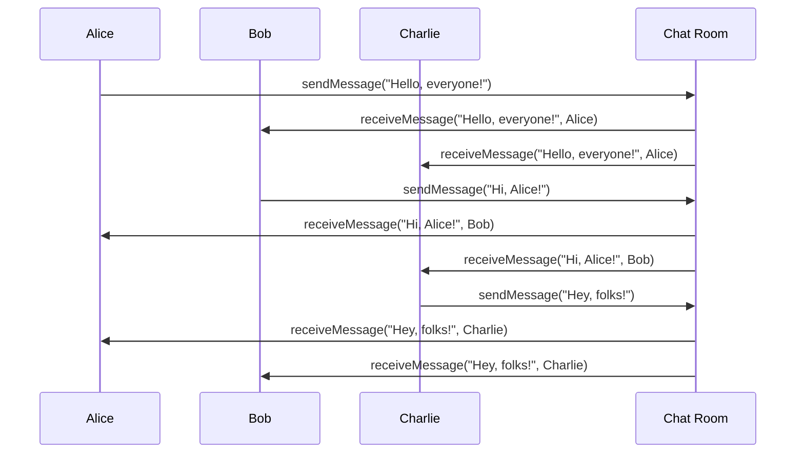

## 7.5 Mediator Pattern

In the realm of software design, managing complex communications between objects can often lead to tightly coupled systems that are difficult to maintain and extend. The Mediator Pattern offers a solution by centralizing the communication between objects, allowing them to interact indirectly through a mediator. This pattern is particularly useful in scenarios where multiple objects need to communicate with each other, but direct communication would result in a tangled web of dependencies.

### Intent

The Mediator Pattern defines an object, known as the mediator, that encapsulates how a set of objects interact. By doing so, it promotes loose coupling by preventing objects from referring to each other explicitly, allowing their interaction to be varied independently.

### Key Participants

1. **Mediator**: The interface that defines the communication between colleague objects.
2. **Concrete Mediator**: Implements the mediator interface and coordinates communication between colleague objects.
3. **Colleague Objects**: Objects that communicate with each other through the mediator.

### Applicability

Use the Mediator Pattern when:

- A set of objects communicate in well-defined but complex ways.
- Reusing an object is difficult because it refers to and communicates with many other objects.
- You want to customize a behavior that is distributed between several classes without subclassing.

### Implementing Mediator in Lua

Let's delve into how we can implement the Mediator Pattern in Lua. We'll create a simple chat room application where users (colleague objects) communicate through a chat room (mediator).

#### Mediator Object

The mediator object manages communication between colleague objects. In our example, the chat room will act as the mediator.

```lua
-- ChatRoom acts as the mediator
ChatRoom = {}

function ChatRoom:new()
    local obj = { users = {} }
    setmetatable(obj, self)
    self.__index = self
    return obj
end

function ChatRoom:registerUser(user)
    table.insert(self.users, user)
end

function ChatRoom:sendMessage(message, fromUser)
    for _, user in ipairs(self.users) do
        if user.name ~= fromUser.name then
            user:receiveMessage(message, fromUser)
        end
    end
end
```

#### Colleague Objects

Colleague objects communicate via the mediator rather than directly. In our example, users will send messages through the chat room.

```lua
-- User acts as a colleague object
User = {}

function User:new(name, chatRoom)
    local obj = { name = name, chatRoom = chatRoom }
    setmetatable(obj, self)
    self.__index = self
    chatRoom:registerUser(obj)
    return obj
end

function User:sendMessage(message)
    print(self.name .. " sends: " .. message)
    self.chatRoom:sendMessage(message, self)
end

function User:receiveMessage(message, fromUser)
    print(self.name .. " receives from " .. fromUser.name .. ": " .. message)
end
```

#### Usage Example

Let's see how we can use the above classes to simulate a chat room.

```lua
-- Create a chat room
local chatRoom = ChatRoom:new()

-- Create users
local user1 = User:new("Alice", chatRoom)
local user2 = User:new("Bob", chatRoom)
local user3 = User:new("Charlie", chatRoom)

-- Users send messages
user1:sendMessage("Hello, everyone!")
user2:sendMessage("Hi, Alice!")
user3:sendMessage("Hey, folks!")
```

### Visualizing the Mediator Pattern

To better understand the flow of communication in the Mediator Pattern, let's visualize it using a sequence diagram.



### Design Considerations

- **Decoupling**: The Mediator Pattern helps decouple the colleague objects, making the system easier to maintain and extend.
- **Complexity**: While the mediator simplifies communication, it can become complex itself if it handles too many interactions.
- **Single Point of Failure**: The mediator can become a single point of failure if not designed carefully.

### Differences and Similarities

The Mediator Pattern is often confused with the Observer Pattern. While both patterns deal with communication between objects, the Mediator Pattern centralizes communication through a mediator, whereas the Observer Pattern involves a one-to-many relationship where observers are notified of changes in a subject.

### Use Cases and Examples

#### Chat Room Implementations

The chat room example we discussed is a classic use case for the Mediator Pattern. It allows users to communicate without knowing each other's details, promoting loose coupling.

#### Decoupling Components in a GUI

In a graphical user interface, different components like buttons, text fields, and sliders can communicate through a mediator to update each other without being directly connected.

#### Managing Complex Inter-Object Relationships

In complex systems with many interdependent objects, the Mediator Pattern can simplify the relationships by centralizing communication, making the system more manageable.

### Try It Yourself

Experiment with the chat room example by adding more users or modifying the message format. Try implementing additional features like private messaging or user status updates.

### Knowledge Check

- Explain how the Mediator Pattern promotes loose coupling.
- Describe a scenario where the Mediator Pattern would be beneficial.
- What are the potential drawbacks of using the Mediator Pattern?

### Embrace the Journey

Remember, mastering design patterns is a journey. As you continue to explore and implement patterns like the Mediator, you'll gain a deeper understanding of how to build robust and maintainable systems. Keep experimenting, stay curious, and enjoy the journey!

## Quiz Time!



### What is the primary purpose of the Mediator Pattern?

- [x] To centralize communication between objects
- [ ] To create a one-to-many relationship between objects
- [ ] To encapsulate object creation
- [ ] To provide a way to access elements of an aggregate object sequentially

> **Explanation:** The Mediator Pattern centralizes communication between objects, allowing them to interact indirectly through a mediator.

### In the Mediator Pattern, what role does the mediator play?

- [x] It manages communication between colleague objects
- [ ] It acts as a colleague object
- [ ] It directly communicates with all objects
- [ ] It creates objects

> **Explanation:** The mediator manages communication between colleague objects, coordinating their interactions.

### Which of the following is a benefit of using the Mediator Pattern?

- [x] It promotes loose coupling between objects
- [ ] It increases the complexity of the system
- [ ] It makes objects dependent on each other
- [ ] It requires more memory

> **Explanation:** The Mediator Pattern promotes loose coupling by preventing objects from referring to each other explicitly.

### What is a potential drawback of the Mediator Pattern?

- [x] The mediator can become a single point of failure
- [ ] It makes the system more tightly coupled
- [ ] It reduces the number of objects in the system
- [ ] It simplifies the mediator's role

> **Explanation:** The mediator can become a single point of failure if it handles too many interactions.

### How does the Mediator Pattern differ from the Observer Pattern?

- [x] The Mediator Pattern centralizes communication through a mediator
- [ ] The Mediator Pattern involves a one-to-many relationship
- [ ] The Observer Pattern centralizes communication
- [ ] The Observer Pattern uses a mediator

> **Explanation:** The Mediator Pattern centralizes communication through a mediator, while the Observer Pattern involves a one-to-many relationship.

### In the chat room example, what role do users play?

- [x] Colleague objects
- [ ] Mediators
- [ ] Concrete mediators
- [ ] Observers

> **Explanation:** In the chat room example, users act as colleague objects that communicate through the chat room mediator.

### What is a common use case for the Mediator Pattern?

- [x] Decoupling components in a GUI
- [ ] Implementing a singleton object
- [ ] Creating a factory for objects
- [ ] Managing a collection of objects

> **Explanation:** The Mediator Pattern is commonly used to decouple components in a GUI, allowing them to communicate through a mediator.

### Which of the following is NOT a key participant in the Mediator Pattern?

- [ ] Mediator
- [ ] Concrete Mediator
- [ ] Colleague Objects
- [x] Observer

> **Explanation:** The Observer is not a key participant in the Mediator Pattern.

### What is the main advantage of using a mediator in a system?

- [x] It simplifies communication between objects
- [ ] It increases the number of dependencies
- [ ] It makes objects more complex
- [ ] It reduces the number of objects

> **Explanation:** The main advantage of using a mediator is that it simplifies communication between objects by centralizing it.

### True or False: The Mediator Pattern is useful when objects need to communicate in a well-defined but complex way.

- [x] True
- [ ] False

> **Explanation:** True. The Mediator Pattern is useful when objects need to communicate in a well-defined but complex way, centralizing the communication through a mediator.


