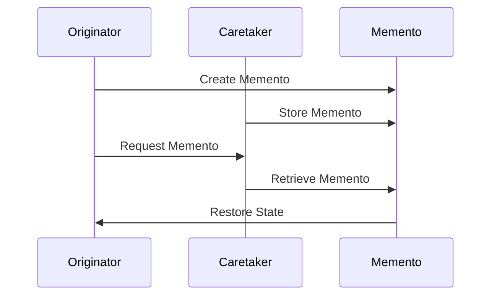

## 7.6 Memento Pattern

The Memento Pattern is a behavioral design pattern that provides the ability to capture and restore an object's state without violating encapsulation. This pattern is particularly useful in scenarios where you need to implement undo functionality, manage state checkpoints, or handle transaction management. In this section, we will explore how to implement the Memento Pattern in Lua, understand its components, and examine practical use cases.

### Intent

The primary intent of the Memento Pattern is to capture an object's internal state at a particular point in time so that it can be restored later. This is achieved without exposing the internal details of the object, thus maintaining encapsulation.

### Key Participants

1. **Originator**: The object whose state needs to be saved and restored. It creates a memento containing a snapshot of its current state.
2. **Memento**: An object that stores the state of the Originator. It is a snapshot of the Originator's state at a particular point in time.
3. **Caretaker**: Manages the memento objects. It is responsible for storing and retrieving mementos, but it does not modify the memento's content.

### Implementing Memento in Lua

Let's delve into how we can implement the Memento Pattern in Lua by defining the Originator, Memento, and Caretaker components.

#### Originator

The Originator is the object whose state we want to save and restore. It has methods to create a memento of its current state and to restore its state from a memento.

```lua
-- Originator: The object whose state needs to be saved
local Originator = {}
Originator.__index = Originator

function Originator:new(state)
    local instance = setmetatable({}, self)
    instance.state = state or ""
    return instance
end

function Originator:setState(state)
    self.state = state
end

function Originator:getState()
    return self.state
end

function Originator:createMemento()
    return { state = self.state }
end

function Originator:restoreMemento(memento)
    self.state = memento.state
end

return Originator
```

#### Memento

In Lua, the Memento is typically a simple table that holds the state of the Originator. It does not have any methods or logic.

```lua
-- Memento: A simple table to store the state
-- In this example, the memento is created as a table within the Originator
```

#### Caretaker

The Caretaker is responsible for managing the mementos. It stores and retrieves mementos but does not modify them.

```lua
-- Caretaker: Manages memento objects
local Caretaker = {}
Caretaker.__index = Caretaker

function Caretaker:new()
    local instance = setmetatable({}, self)
    instance.mementos = {}
    return instance
end

function Caretaker:addMemento(memento)
    table.insert(self.mementos, memento)
end

function Caretaker:getMemento(index)
    return self.mementos[index]
end

return Caretaker
```

### Use Cases and Examples

The Memento Pattern is versatile and can be applied in various scenarios. Let's explore some common use cases and examples.

#### Implementing Undo Functionality

One of the most common use cases for the Memento Pattern is implementing undo functionality. By capturing the state of an object before a change, you can restore it to a previous state if needed.

```lua
local Originator = require("Originator")
local Caretaker = require("Caretaker")

-- Create an Originator object
local originator = Originator:new("Initial State")

-- Create a Caretaker to manage mementos
local caretaker = Caretaker:new()

-- Save the initial state
caretaker:addMemento(originator:createMemento())

-- Change the state
originator:setState("State 1")
caretaker:addMemento(originator:createMemento())

-- Change the state again
originator:setState("State 2")
caretaker:addMemento(originator:createMemento())

-- Undo: Restore to the previous state
originator:restoreMemento(caretaker:getMemento(2))
print("Current State: " .. originator:getState()) -- Output: State 1

-- Undo: Restore to the initial state
originator:restoreMemento(caretaker:getMemento(1))
print("Current State: " .. originator:getState()) -- Output: Initial State
```

#### State Checkpoints in Games

In game development, the Memento Pattern can be used to create state checkpoints. Players can save their progress and restore it later.

```lua
-- Example of using Memento Pattern for game state checkpoints
local Game = require("Originator")
local GameCaretaker = require("Caretaker")

-- Create a Game object
local game = Game:new("Level 1")

-- Create a GameCaretaker to manage game state mementos
local gameCaretaker = GameCaretaker:new()

-- Save the initial game state
gameCaretaker:addMemento(game:createMemento())

-- Progress to the next level
game:setState("Level 2")
gameCaretaker:addMemento(game:createMemento())

-- Player wants to revert to the previous level
game:restoreMemento(gameCaretaker:getMemento(1))
print("Current Game Level: " .. game:getState()) -- Output: Level 1
```

#### Transaction Management

In applications that require transaction management, the Memento Pattern can be used to save the state before a transaction and restore it if the transaction fails.

```lua
-- Example of using Memento Pattern for transaction management
local Transaction = require("Originator")
local TransactionCaretaker = require("Caretaker")

-- Create a Transaction object
local transaction = Transaction:new("Initial Balance")

-- Create a TransactionCaretaker to manage transaction state mementos
local transactionCaretaker = TransactionCaretaker:new()

-- Save the initial transaction state
transactionCaretaker:addMemento(transaction:createMemento())

-- Perform a transaction
transaction:setState("Balance after Transaction 1")
transactionCaretaker:addMemento(transaction:createMemento())

-- Transaction fails, revert to the initial state
transaction:restoreMemento(transactionCaretaker:getMemento(1))
print("Current Balance: " .. transaction:getState()) -- Output: Initial Balance
```

### Design Considerations

When implementing the Memento Pattern, consider the following:

- **Memory Usage**: Storing multiple mementos can consume significant memory, especially if the state is large. Consider optimizing the state representation or limiting the number of mementos.
- **Encapsulation**: Ensure that the Memento does not expose the internal details of the Originator. The Memento should only be accessible to the Originator and Caretaker.
- **Performance**: Creating and restoring mementos can be computationally expensive. Optimize the process to minimize performance impact.

### Differences and Similarities

The Memento Pattern is often compared to other state management patterns, such as the Command Pattern. While both patterns deal with state changes, the Memento Pattern focuses on capturing and restoring state, whereas the Command Pattern encapsulates actions as objects.

### Try It Yourself

Experiment with the Memento Pattern by modifying the code examples. Try adding additional states, implementing a redo functionality, or integrating the pattern into a larger application.

### Visualizing the Memento Pattern

To better understand the Memento Pattern, let's visualize the interaction between the Originator, Memento, and Caretaker using a sequence diagram.



### References and Links

- [Design Patterns: Elements of Reusable Object-Oriented Software](https://en.wikipedia.org/wiki/Design_Patterns) - A foundational book on design patterns.
- [Lua Programming Language](https://www.lua.org/) - Official Lua website for more information on Lua programming.

### Knowledge Check

- What are the key components of the Memento Pattern?
- How does the Memento Pattern maintain encapsulation?
- What are some common use cases for the Memento Pattern?
- How can the Memento Pattern be optimized for performance?

### Embrace the Journey

Remember, mastering design patterns is a journey. The Memento Pattern is just one of many tools in your software development toolkit. As you continue to explore and experiment, you'll gain a deeper understanding of how to apply these patterns effectively. Keep experimenting, stay curious, and enjoy the journey!

## Quiz Time!



### What is the primary intent of the Memento Pattern?

- [x] To capture and restore an object's state without violating encapsulation.
- [ ] To encapsulate actions as objects.
- [ ] To manage object creation.
- [ ] To define a family of algorithms.

> **Explanation:** The Memento Pattern is designed to capture and restore an object's state without exposing its internal details.

### Which component of the Memento Pattern is responsible for storing and retrieving mementos?

- [ ] Originator
- [x] Caretaker
- [ ] Memento
- [ ] Observer

> **Explanation:** The Caretaker is responsible for managing memento objects, including storing and retrieving them.

### In the Memento Pattern, what does the Originator do?

- [x] Creates and restores mementos.
- [ ] Stores and retrieves mementos.
- [ ] Manages the state of other objects.
- [ ] Defines a family of algorithms.

> **Explanation:** The Originator creates mementos of its state and can restore its state from a memento.

### What is a common use case for the Memento Pattern?

- [x] Implementing undo functionality.
- [ ] Managing object creation.
- [ ] Encapsulating actions as objects.
- [ ] Defining a family of algorithms.

> **Explanation:** The Memento Pattern is often used to implement undo functionality by capturing and restoring object states.

### How does the Memento Pattern maintain encapsulation?

- [x] By not exposing the internal details of the Originator.
- [ ] By encapsulating actions as objects.
- [ ] By managing object creation.
- [ ] By defining a family of algorithms.

> **Explanation:** The Memento Pattern maintains encapsulation by ensuring that the Memento does not expose the internal details of the Originator.

### What is a potential drawback of using the Memento Pattern?

- [x] Increased memory usage.
- [ ] Difficulty in managing object creation.
- [ ] Complexity in defining algorithms.
- [ ] Lack of encapsulation.

> **Explanation:** Storing multiple mementos can consume significant memory, especially if the state is large.

### Which pattern is often compared to the Memento Pattern?

- [x] Command Pattern
- [ ] Singleton Pattern
- [ ] Factory Pattern
- [ ] Observer Pattern

> **Explanation:** The Memento Pattern is often compared to the Command Pattern, as both deal with state changes.

### What should be considered when implementing the Memento Pattern?

- [x] Memory usage and performance.
- [ ] Object creation and management.
- [ ] Algorithm definition.
- [ ] Encapsulation of actions.

> **Explanation:** When implementing the Memento Pattern, consider memory usage and performance, as creating and restoring mementos can be resource-intensive.

### True or False: The Memento Pattern can be used for transaction management.

- [x] True
- [ ] False

> **Explanation:** The Memento Pattern can be used to save the state before a transaction and restore it if the transaction fails.

### True or False: The Memento Pattern exposes the internal state of the Originator.

- [ ] True
- [x] False

> **Explanation:** The Memento Pattern maintains encapsulation by not exposing the internal state of the Originator.


