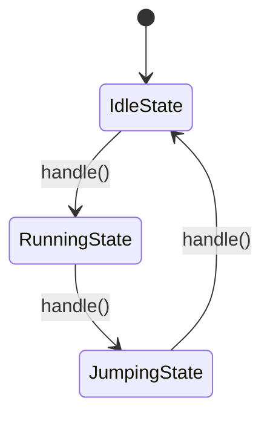

## 7.7 State Pattern

In the realm of software design, the State Pattern is a powerful tool that allows an object to change its behavior when its internal state changes. This pattern is particularly useful in scenarios where an object must exhibit different behaviors in different states, such as in game development, workflow engines, and network protocols. In this section, we will explore the State Pattern in Lua, providing a comprehensive guide on its implementation and use cases.

### **State-Dependent Behavior**

The State Pattern is a behavioral design pattern that enables an object to alter its behavior when its internal state changes. This is achieved by encapsulating the state-specific behavior into separate state objects and delegating the behavior to the current state object.

#### **Key Concepts**

- **State Objects**: These represent different states with their specific behaviors. Each state object encapsulates the behavior associated with a particular state of the context.
- **Context**: This is the object that maintains a reference to the current state and delegates behavior to it. The context interacts with the state objects to perform state transitions and execute state-specific behavior.

### **Implementing State in Lua**

To implement the State Pattern in Lua, we need to define state objects and a context that manages these states. Let's break down the implementation process step by step.

#### **1. Define State Interface**

First, we define a state interface that all state objects will implement. This interface will include methods that represent the behavior that can vary between states.

```lua
-- State Interface
State = {}
function State:new()
    local obj = {}
    setmetatable(obj, self)
    self.__index = self
    return obj
end

function State:handle(context)
    error("This method should be overridden by a concrete state")
end
```

#### **2. Create Concrete State Classes**

Next, we create concrete state classes that implement the state interface. Each concrete state class will define the behavior specific to that state.

```lua
-- Concrete State: IdleState
IdleState = State:new()

function IdleState:handle(context)
    print("Character is idle.")
    context:setState(RunningState:new())
end

-- Concrete State: RunningState
RunningState = State:new()

function RunningState:handle(context)
    print("Character is running.")
    context:setState(JumpingState:new())
end

-- Concrete State: JumpingState
JumpingState = State:new()

function JumpingState:handle(context)
    print("Character is jumping.")
    context:setState(IdleState:new())
end
```

#### **3. Implement the Context Class**

The context class maintains a reference to the current state and delegates behavior to it. It also provides a method to change the current state.

```lua
-- Context Class
Context = {}
function Context:new()
    local obj = { state = IdleState:new() }
    setmetatable(obj, self)
    self.__index = self
    return obj
end

function Context:setState(state)
    self.state = state
end

function Context:request()
    self.state:handle(self)
end
```

#### **4. Demonstrate the State Pattern**

Now, let's demonstrate the State Pattern in action by creating a context and triggering state transitions.

```lua
-- Demonstrate State Pattern
local context = Context:new()

-- Simulate state transitions
context:request()  -- Output: Character is idle.
context:request()  -- Output: Character is running.
context:request()  -- Output: Character is jumping.
context:request()  -- Output: Character is idle.
```

### **Visualizing the State Pattern**

To better understand the State Pattern, let's visualize the state transitions using a state diagram.



**Figure 1: State Diagram of Character States**

This diagram illustrates the state transitions for a character in a game. The character can transition from idle to running, from running to jumping, and from jumping back to idle.

### **Use Cases and Examples**

The State Pattern is applicable in various scenarios where an object's behavior depends on its state. Let's explore some practical use cases.

#### **1. Game Character States**

In game development, characters often have multiple states, such as idle, running, jumping, and attacking. The State Pattern allows for clean and maintainable code by encapsulating state-specific behavior in separate state objects.

#### **2. Workflow Engines**

Workflow engines manage processes that can be in different states, such as pending, approved, or rejected. The State Pattern can be used to implement state transitions and handle state-specific actions.

#### **3. Connection States in Network Protocols**

Network protocols often involve connections that can be in various states, such as connected, disconnected, or reconnecting. The State Pattern provides a structured way to manage these states and their transitions.

### **Design Considerations**

When implementing the State Pattern, consider the following design considerations:

- **State Explosion**: If an object has many states, the number of state classes can become large. Consider using a state table or other techniques to manage state complexity.
- **State Transition Logic**: Ensure that state transitions are well-defined and that the context correctly delegates behavior to the current state.
- **Performance**: While the State Pattern provides flexibility, it may introduce overhead due to frequent state transitions. Optimize state management for performance-critical applications.

### **Differences and Similarities**

The State Pattern is often compared to the Strategy Pattern. While both patterns involve encapsulating behavior, the key difference is that the State Pattern is used for state-dependent behavior, whereas the Strategy Pattern is used for interchangeable algorithms.

### **Try It Yourself**

To deepen your understanding of the State Pattern, try modifying the code examples to add new states or change the state transition logic. Experiment with different scenarios to see how the pattern can be applied in various contexts.

### **Knowledge Check**

- **Question**: What is the primary purpose of the State Pattern?
- **Challenge**: Implement a simple traffic light system using the State Pattern, with states for red, yellow, and green lights.

### **Embrace the Journey**

Remember, mastering design patterns is a journey. As you continue to explore and apply the State Pattern in different contexts, you'll gain a deeper understanding of its power and flexibility. Keep experimenting, stay curious, and enjoy the process of becoming a more skilled software engineer.

## Quiz Time!



### What is the primary purpose of the State Pattern?

- [x] To allow an object to change its behavior when its internal state changes.
- [ ] To encapsulate interchangeable algorithms.
- [ ] To manage object creation.
- [ ] To provide a way to access elements of an aggregate object sequentially.

> **Explanation:** The State Pattern is designed to allow an object to alter its behavior when its internal state changes.

### Which of the following is a key component of the State Pattern?

- [x] State Objects
- [ ] Singleton Instance
- [ ] Abstract Factory
- [ ] Observer

> **Explanation:** State Objects represent different states with their specific behaviors in the State Pattern.

### In the State Pattern, what is the role of the Context?

- [x] To maintain a reference to the current state and delegate behavior.
- [ ] To create new state objects.
- [ ] To manage object creation.
- [ ] To encapsulate interchangeable algorithms.

> **Explanation:** The Context maintains a reference to the current state and delegates behavior to it.

### What is a common use case for the State Pattern?

- [x] Game character states
- [ ] Sorting algorithms
- [ ] Object creation
- [ ] Data access

> **Explanation:** The State Pattern is commonly used for managing game character states, among other scenarios.

### How does the State Pattern differ from the Strategy Pattern?

- [x] The State Pattern is used for state-dependent behavior, while the Strategy Pattern is used for interchangeable algorithms.
- [ ] The State Pattern is used for object creation, while the Strategy Pattern is used for state-dependent behavior.
- [ ] The State Pattern is used for managing object creation, while the Strategy Pattern is used for data access.
- [ ] The State Pattern is used for data access, while the Strategy Pattern is used for object creation.

> **Explanation:** The State Pattern is used for state-dependent behavior, whereas the Strategy Pattern is used for interchangeable algorithms.

### What is a potential drawback of the State Pattern?

- [x] State Explosion
- [ ] Lack of flexibility
- [ ] Difficulty in managing object creation
- [ ] Inability to encapsulate algorithms

> **Explanation:** State Explosion can occur if an object has many states, leading to a large number of state classes.

### Which method is typically overridden in concrete state classes?

- [x] handle()
- [ ] create()
- [ ] update()
- [ ] delete()

> **Explanation:** The handle() method is typically overridden in concrete state classes to define state-specific behavior.

### What is a benefit of using the State Pattern?

- [x] It provides a structured way to manage state-specific behavior.
- [ ] It simplifies object creation.
- [ ] It enhances data access.
- [ ] It reduces the need for algorithms.

> **Explanation:** The State Pattern provides a structured way to manage state-specific behavior, making code more maintainable.

### True or False: The State Pattern can be used to manage connection states in network protocols.

- [x] True
- [ ] False

> **Explanation:** The State Pattern is well-suited for managing connection states in network protocols.

### True or False: The State Pattern is only applicable in game development.

- [ ] True
- [x] False

> **Explanation:** The State Pattern is applicable in various scenarios, including game development, workflow engines, and network protocols.




