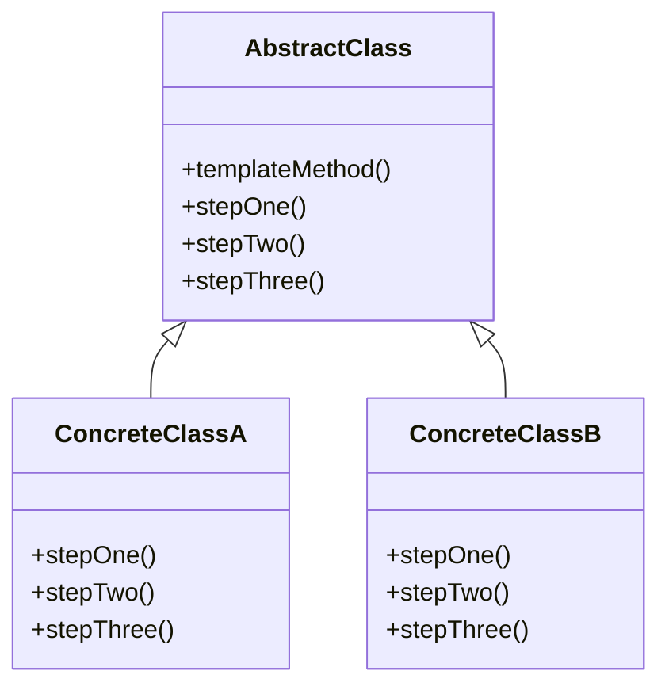

## 7.8 Template Method Pattern

The Template Method Pattern is a behavioral design pattern that defines the skeleton of an algorithm in a method, deferring some steps to subclasses. It allows subclasses to redefine certain steps of an algorithm without changing its structure. This pattern is particularly useful when you have a series of steps that are common across multiple implementations, but some steps need to be customized.

### Intent

The primary intent of the Template Method Pattern is to define the overall structure of an algorithm while allowing subclasses to implement specific steps. This promotes code reuse and flexibility, as the common logic is centralized in a single place, and variations are handled by subclasses.

### Key Participants

1. **Abstract Class (Template)**: Contains the template method and defines abstract methods for steps that need customization.
2. **Concrete Class**: Implements the abstract methods to provide specific behavior.

### Implementing Template Method in Lua

Lua, being a lightweight and flexible scripting language, allows us to implement the Template Method Pattern using tables and functions. Let's explore how to achieve this.

#### Abstract Methods

In Lua, we can define abstract methods by creating a table that represents our abstract class. This table will contain the template method and placeholders for the abstract methods.

```lua
-- Abstract class
local AbstractClass = {}

function AbstractClass:new(o, ...)
    o = o or {}
    setmetatable(o, self)
    self.__index = self
    self:init(...)
    return o
end

function AbstractClass:init(...)
    -- Initialization code
end

function AbstractClass:templateMethod()
    self:stepOne()
    self:stepTwo()
    self:stepThree()
end

function AbstractClass:stepOne()
    error("Abstract method 'stepOne' must be overridden")
end

function AbstractClass:stepTwo()
    error("Abstract method 'stepTwo' must be overridden")
end

function AbstractClass:stepThree()
    error("Abstract method 'stepThree' must be overridden")
end
```

In this example, `AbstractClass` defines a `templateMethod` that outlines the algorithm's structure. The `stepOne`, `stepTwo`, and `stepThree` methods are abstract and must be overridden by subclasses.

#### Concrete Implementations

Concrete classes inherit from the abstract class and provide specific implementations for the abstract methods.

```lua
-- Concrete class
local ConcreteClassA = AbstractClass:new()

function ConcreteClassA:stepOne()
    print("ConcreteClassA: Step One")
end

function ConcreteClassA:stepTwo()
    print("ConcreteClassA: Step Two")
end

function ConcreteClassA:stepThree()
    print("ConcreteClassA: Step Three")
end

-- Usage
local instanceA = ConcreteClassA:new()
instanceA:templateMethod()
```

In this example, `ConcreteClassA` provides specific implementations for the abstract methods. When `templateMethod` is called, it executes the steps defined in `ConcreteClassA`.

### Use Cases and Examples

The Template Method Pattern is versatile and can be applied to various scenarios. Let's explore some practical use cases.

#### Defining Workflows with Customizable Steps

Consider a scenario where you need to process different types of documents, such as PDF, Word, and Excel files. Each document type requires specific processing steps, but the overall workflow remains the same.

```lua
-- Abstract class for document processing
local DocumentProcessor = {}

function DocumentProcessor:new(o, ...)
    o = o or {}
    setmetatable(o, self)
    self.__index = self
    self:init(...)
    return o
end

function DocumentProcessor:init(...)
    -- Initialization code
end

function DocumentProcessor:processDocument()
    self:openDocument()
    self:extractContent()
    self:closeDocument()
end

function DocumentProcessor:openDocument()
    error("Abstract method 'openDocument' must be overridden")
end

function DocumentProcessor:extractContent()
    error("Abstract method 'extractContent' must be overridden")
end

function DocumentProcessor:closeDocument()
    error("Abstract method 'closeDocument' must be overridden")
end

-- Concrete class for PDF processing
local PDFProcessor = DocumentProcessor:new()

function PDFProcessor:openDocument()
    print("Opening PDF document")
end

function PDFProcessor:extractContent()
    print("Extracting content from PDF")
end

function PDFProcessor:closeDocument()
    print("Closing PDF document")
end

-- Concrete class for Word processing
local WordProcessor = DocumentProcessor:new()

function WordProcessor:openDocument()
    print("Opening Word document")
end

function WordProcessor:extractContent()
    print("Extracting content from Word")
end

function WordProcessor:closeDocument()
    print("Closing Word document")
end

-- Usage
local pdfProcessor = PDFProcessor:new()
pdfProcessor:processDocument()

local wordProcessor = WordProcessor:new()
wordProcessor:processDocument()
```

In this example, `DocumentProcessor` defines the template method `processDocument`, which outlines the steps for processing a document. `PDFProcessor` and `WordProcessor` provide specific implementations for each step.

#### Implementing Game AI with Common Patterns and Specific Actions

In game development, AI characters often follow a common pattern but require specific actions based on their type or role. The Template Method Pattern can be used to define the AI behavior.

```lua
-- Abstract class for AI behavior
local AICharacter = {}

function AICharacter:new(o, ...)
    o = o or {}
    setmetatable(o, self)
    self.__index = self
    self:init(...)
    return o
end

function AICharacter:init(...)
    -- Initialization code
end

function AICharacter:performAction()
    self:selectTarget()
    self:moveToTarget()
    self:attackTarget()
end

function AICharacter:selectTarget()
    error("Abstract method 'selectTarget' must be overridden")
end

function AICharacter:moveToTarget()
    error("Abstract method 'moveToTarget' must be overridden")
end

function AICharacter:attackTarget()
    error("Abstract method 'attackTarget' must be overridden")
end

-- Concrete class for Warrior AI
local WarriorAI = AICharacter:new()

function WarriorAI:selectTarget()
    print("Warrior selects the nearest enemy")
end

function WarriorAI:moveToTarget()
    print("Warrior charges towards the enemy")
end

function WarriorAI:attackTarget()
    print("Warrior attacks with a sword")
end

-- Concrete class for Archer AI
local ArcherAI = AICharacter:new()

function ArcherAI:selectTarget()
    print("Archer selects the enemy with the lowest health")
end

function ArcherAI:moveToTarget()
    print("Archer moves to a safe distance")
end

function ArcherAI:attackTarget()
    print("Archer shoots an arrow")
end

-- Usage
local warriorAI = WarriorAI:new()
warriorAI:performAction()

local archerAI = ArcherAI:new()
archerAI:performAction()
```

In this example, `AICharacter` defines the template method `performAction`, which outlines the AI behavior. `WarriorAI` and `ArcherAI` provide specific implementations for each action.

#### Processing Multiple Data Formats

The Template Method Pattern can be used to process different data formats, such as JSON, XML, and CSV, by defining a common processing workflow with customizable steps.

```lua
-- Abstract class for data processing
local DataProcessor = {}

function DataProcessor:new(o, ...)
    o = o or {}
    setmetatable(o, self)
    self.__index = self
    self:init(...)
    return o
end

function DataProcessor:init(...)
    -- Initialization code
end

function DataProcessor:processData()
    self:loadData()
    self:parseData()
    self:saveData()
end

function DataProcessor:loadData()
    error("Abstract method 'loadData' must be overridden")
end

function DataProcessor:parseData()
    error("Abstract method 'parseData' must be overridden")
end

function DataProcessor:saveData()
    error("Abstract method 'saveData' must be overridden")
end

-- Concrete class for JSON processing
local JSONProcessor = DataProcessor:new()

function JSONProcessor:loadData()
    print("Loading JSON data")
end

function JSONProcessor:parseData()
    print("Parsing JSON data")
end

function JSONProcessor:saveData()
    print("Saving JSON data")
end

-- Concrete class for XML processing
local XMLProcessor = DataProcessor:new()

function XMLProcessor:loadData()
    print("Loading XML data")
end

function XMLProcessor:parseData()
    print("Parsing XML data")
end

function XMLProcessor:saveData()
    print("Saving XML data")
end

-- Usage
local jsonProcessor = JSONProcessor:new()
jsonProcessor:processData()

local xmlProcessor = XMLProcessor:new()
xmlProcessor:processData()
```

In this example, `DataProcessor` defines the template method `processData`, which outlines the data processing workflow. `JSONProcessor` and `XMLProcessor` provide specific implementations for each step.

### Design Considerations

When using the Template Method Pattern, consider the following:

- **Reusability**: Centralize common logic in the abstract class to promote code reuse.
- **Flexibility**: Allow subclasses to customize specific steps without altering the overall algorithm.
- **Maintainability**: Keep the template method simple and focused on defining the algorithm's structure.
- **Complexity**: Avoid overcomplicating the pattern by introducing too many abstract methods.

### Differences and Similarities

The Template Method Pattern is often confused with the Strategy Pattern. While both patterns allow for customization, the Template Method Pattern defines the overall structure of an algorithm, whereas the Strategy Pattern focuses on selecting an algorithm at runtime.

### Visualizing the Template Method Pattern

To better understand the Template Method Pattern, let's visualize the relationship between the abstract class and concrete classes using a class diagram.



In this diagram, `AbstractClass` defines the template method and abstract methods. `ConcreteClassA` and `ConcreteClassB` inherit from `AbstractClass` and provide specific implementations for the abstract methods.

### Try It Yourself

Experiment with the Template Method Pattern by modifying the code examples. Here are some suggestions:

- Add a new concrete class for a different document type or AI character.
- Introduce additional steps in the template method and implement them in the concrete classes.
- Modify the behavior of existing concrete classes to see how it affects the overall algorithm.

### Knowledge Check

To reinforce your understanding of the Template Method Pattern, consider the following questions:

- What is the primary intent of the Template Method Pattern?
- How does the Template Method Pattern promote code reuse?
- What are the key differences between the Template Method Pattern and the Strategy Pattern?

### Embrace the Journey

Remember, mastering design patterns is a journey. The Template Method Pattern is just one of many patterns that can enhance your software design skills. Keep experimenting, stay curious, and enjoy the process of learning and applying design patterns in your projects.

## Quiz Time!



### What is the primary intent of the Template Method Pattern?

- [x] To define the skeleton of an algorithm and allow subclasses to override specific steps.
- [ ] To select an algorithm at runtime.
- [ ] To encapsulate a request as an object.
- [ ] To provide a way to access the elements of an aggregate object sequentially.

> **Explanation:** The Template Method Pattern defines the skeleton of an algorithm, allowing subclasses to override specific steps without changing the algorithm's structure.

### Which of the following is a key participant in the Template Method Pattern?

- [x] Abstract Class
- [ ] Singleton
- [ ] Proxy
- [ ] Flyweight

> **Explanation:** The Abstract Class is a key participant in the Template Method Pattern, as it contains the template method and defines abstract methods for steps that need customization.

### How does the Template Method Pattern promote code reuse?

- [x] By centralizing common logic in the abstract class.
- [ ] By allowing multiple inheritance.
- [ ] By using global variables.
- [ ] By avoiding the use of interfaces.

> **Explanation:** The Template Method Pattern promotes code reuse by centralizing common logic in the abstract class, allowing subclasses to customize specific steps.

### What is the difference between the Template Method Pattern and the Strategy Pattern?

- [x] The Template Method Pattern defines the overall structure of an algorithm, while the Strategy Pattern focuses on selecting an algorithm at runtime.
- [ ] The Template Method Pattern is used for creating objects, while the Strategy Pattern is used for structuring classes.
- [ ] The Template Method Pattern is a structural pattern, while the Strategy Pattern is a creational pattern.
- [ ] The Template Method Pattern is used for managing object lifecycles, while the Strategy Pattern is used for managing object states.

> **Explanation:** The Template Method Pattern defines the overall structure of an algorithm, whereas the Strategy Pattern focuses on selecting an algorithm at runtime.

### In the Template Method Pattern, what is the role of the concrete class?

- [x] To provide specific implementations for the abstract methods.
- [ ] To define the overall structure of the algorithm.
- [ ] To manage object lifecycles.
- [ ] To encapsulate a request as an object.

> **Explanation:** The concrete class provides specific implementations for the abstract methods defined in the abstract class.

### Which of the following is a use case for the Template Method Pattern?

- [x] Defining workflows with customizable steps.
- [ ] Managing object lifecycles.
- [ ] Encapsulating a request as an object.
- [ ] Providing a way to access the elements of an aggregate object sequentially.

> **Explanation:** The Template Method Pattern is useful for defining workflows with customizable steps, allowing subclasses to implement specific behaviors.

### What is the purpose of the template method in the Template Method Pattern?

- [x] To outline the overall structure of the algorithm.
- [ ] To provide specific implementations for abstract methods.
- [ ] To manage object lifecycles.
- [ ] To encapsulate a request as an object.

> **Explanation:** The template method outlines the overall structure of the algorithm, calling abstract methods that subclasses must implement.

### How can the Template Method Pattern improve maintainability?

- [x] By keeping the template method simple and focused on defining the algorithm's structure.
- [ ] By using global variables.
- [ ] By avoiding the use of interfaces.
- [ ] By allowing multiple inheritance.

> **Explanation:** The Template Method Pattern improves maintainability by keeping the template method simple and focused on defining the algorithm's structure.

### True or False: The Template Method Pattern is a creational design pattern.

- [ ] True
- [x] False

> **Explanation:** The Template Method Pattern is a behavioral design pattern, not a creational one.

### Which of the following is NOT a characteristic of the Template Method Pattern?

- [ ] Defines the skeleton of an algorithm.
- [ ] Allows subclasses to override specific steps.
- [ ] Centralizes common logic in the abstract class.
- [x] Provides a way to access the elements of an aggregate object sequentially.

> **Explanation:** Providing a way to access the elements of an aggregate object sequentially is a characteristic of the Iterator Pattern, not the Template Method Pattern.


