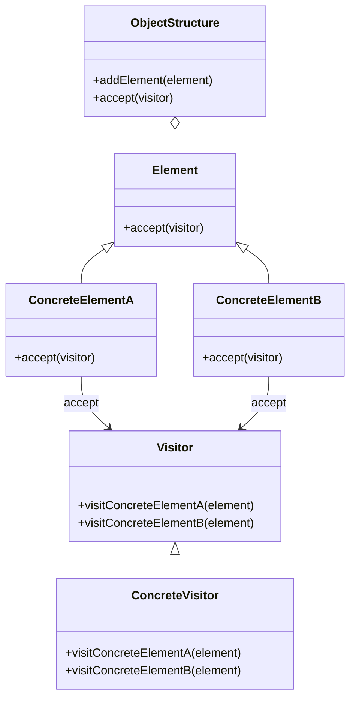

## 7.9 Visitor Pattern

The Visitor Pattern is a behavioral design pattern that allows you to add new operations to existing object structures without modifying their classes. This pattern is particularly useful when dealing with complex data structures or when you need to perform various operations across a set of objects that share a common interface. In this section, we will explore how to implement the Visitor Pattern in Lua, discuss its key participants, and examine its applicability through practical examples.

### Intent

The primary intent of the Visitor Pattern is to separate an algorithm from the object structure on which it operates. This separation allows you to define new operations without changing the classes of the elements on which it operates. This is achieved by defining a visitor class that implements a visit method for each type of element in the object structure.

### Key Participants

1. **Visitor**: An interface or abstract class that declares a visit method for each type of concrete element in the object structure.
2. **ConcreteVisitor**: A class that implements the visitor interface and defines the operations to be performed on the elements.
3. **Element**: An interface or abstract class that declares an accept method, which takes a visitor as an argument.
4. **ConcreteElement**: A class that implements the element interface and defines the accept method, which calls the visitor's visit method.
5. **ObjectStructure**: A class that can enumerate its elements and provide a high-level interface to allow the visitor to visit its elements.

### Implementing Visitor in Lua

In Lua, the Visitor Pattern can be implemented using tables and functions. Lua's dynamic nature allows us to define visitor objects as tables with functions that perform operations on elements. Let's explore how to implement the Visitor Pattern in Lua.

#### Visitor Objects

Visitor objects in Lua can be implemented as tables with functions that perform operations on elements. Each function corresponds to a visit method for a specific type of element.

```lua
-- Define a Visitor interface
Visitor = {}

function Visitor:new()
    local visitor = {}
    setmetatable(visitor, self)
    self.__index = self
    return visitor
end

function Visitor:visitConcreteElementA(element)
    -- Default implementation (can be overridden)
end

function Visitor:visitConcreteElementB(element)
    -- Default implementation (can be overridden)
end
```

#### Element Objects

Element objects in Lua are tables that implement an accept method. This method takes a visitor as an argument and calls the appropriate visit method on the visitor.

```lua
-- Define an Element interface
Element = {}

function Element:new()
    local element = {}
    setmetatable(element, self)
    self.__index = self
    return element
end

function Element:accept(visitor)
    -- Default implementation (can be overridden)
end

-- Define ConcreteElementA
ConcreteElementA = Element:new()

function ConcreteElementA:accept(visitor)
    visitor:visitConcreteElementA(self)
end

-- Define ConcreteElementB
ConcreteElementB = Element:new()

function ConcreteElementB:accept(visitor)
    visitor:visitConcreteElementB(self)
end
```

#### Concrete Visitor

A concrete visitor implements the visitor interface and defines the operations to be performed on each type of element.

```lua
-- Define a ConcreteVisitor
ConcreteVisitor = Visitor:new()

function ConcreteVisitor:visitConcreteElementA(element)
    print("ConcreteVisitor: Processing ConcreteElementA")
end

function ConcreteVisitor:visitConcreteElementB(element)
    print("ConcreteVisitor: Processing ConcreteElementB")
end
```

#### Object Structure

The object structure is responsible for holding the elements and allowing the visitor to visit them.

```lua
-- Define an ObjectStructure
ObjectStructure = {}

function ObjectStructure:new()
    local structure = {elements = {}}
    setmetatable(structure, self)
    self.__index = self
    return structure
end

function ObjectStructure:addElement(element)
    table.insert(self.elements, element)
end

function ObjectStructure:accept(visitor)
    for _, element in ipairs(self.elements) do
        element:accept(visitor)
    end
end
```

#### Usage Example

Let's see how these components work together in a practical example.

```lua
-- Create elements
local elementA = ConcreteElementA:new()
local elementB = ConcreteElementB:new()

-- Create an object structure and add elements
local structure = ObjectStructure:new()
structure:addElement(elementA)
structure:addElement(elementB)

-- Create a visitor
local visitor = ConcreteVisitor:new()

-- Let the visitor visit the elements
structure:accept(visitor)
```

### Use Cases and Examples

The Visitor Pattern is particularly useful in scenarios where you need to perform operations on a complex object structure. Here are some common use cases:

1. **Syntax Tree Processing in Compilers**: The Visitor Pattern is often used in compilers to traverse and process syntax trees. Each node in the syntax tree can accept a visitor that performs operations such as type checking, code generation, or optimization.

2. **Applying Operations Over Complex Data Structures**: When dealing with complex data structures, the Visitor Pattern allows you to define new operations without modifying the data structure classes. This is useful in scenarios where the data structure is stable, but the operations on it are subject to change.

3. **Reporting and Analytics**: In reporting and analytics applications, the Visitor Pattern can be used to traverse data structures and generate reports or perform analytics operations.

### Visualizing the Visitor Pattern

To better understand the Visitor Pattern, let's visualize its components and interactions using a class diagram.



### Design Considerations

- **When to Use**: The Visitor Pattern is ideal when you have a stable object structure but need to perform various operations on it. It allows you to add new operations without modifying the existing classes.
- **Considerations**: Be cautious when using the Visitor Pattern with a large number of element types, as it can lead to a bloated visitor interface. Additionally, the pattern can be challenging to implement if the object structure is subject to frequent changes.

### Differences and Similarities

The Visitor Pattern is often compared to the Strategy Pattern. While both patterns allow you to define new operations, the Visitor Pattern is more suited for operations that need to be performed across a set of related objects, whereas the Strategy Pattern is used to encapsulate algorithms.

### Try It Yourself

Experiment with the Visitor Pattern by modifying the code examples. Try adding new element types and visitor methods to see how the pattern can be extended. Consider implementing a simple syntax tree and using the Visitor Pattern to perform operations such as evaluation or printing.

### Knowledge Check

- What is the primary intent of the Visitor Pattern?
- How does the Visitor Pattern separate algorithms from object structures?
- What are some common use cases for the Visitor Pattern?
- How can the Visitor Pattern be implemented in Lua?
- What are the key participants in the Visitor Pattern?

### Embrace the Journey

Remember, mastering design patterns is a journey. As you explore the Visitor Pattern, you'll gain a deeper understanding of how to design flexible and maintainable software. Keep experimenting, stay curious, and enjoy the journey!

## Quiz Time!



### What is the primary intent of the Visitor Pattern?

- [x] To separate an algorithm from the object structure on which it operates.
- [ ] To encapsulate algorithms within classes.
- [ ] To allow objects to change their behavior at runtime.
- [ ] To provide a way to access the elements of an aggregate object sequentially.

> **Explanation:** The Visitor Pattern's primary intent is to separate an algorithm from the object structure on which it operates, allowing new operations to be added without modifying the classes of the elements.

### Which of the following is a key participant in the Visitor Pattern?

- [x] Visitor
- [ ] Strategy
- [ ] Singleton
- [ ] Adapter

> **Explanation:** The Visitor is a key participant in the Visitor Pattern, responsible for defining visit methods for each type of element.

### How does the Visitor Pattern handle new operations?

- [x] By defining new visitor classes.
- [ ] By modifying existing element classes.
- [ ] By using inheritance to extend element classes.
- [ ] By encapsulating operations within element classes.

> **Explanation:** The Visitor Pattern handles new operations by defining new visitor classes, allowing operations to be added without modifying existing element classes.

### What is a common use case for the Visitor Pattern?

- [x] Syntax tree processing in compilers.
- [ ] Implementing a singleton object.
- [ ] Managing object creation.
- [ ] Encapsulating algorithms.

> **Explanation:** A common use case for the Visitor Pattern is syntax tree processing in compilers, where visitors perform operations such as type checking or code generation.

### In Lua, how can visitor objects be implemented?

- [x] As tables with functions.
- [ ] As classes with methods.
- [ ] As modules with functions.
- [ ] As coroutines with functions.

> **Explanation:** In Lua, visitor objects can be implemented as tables with functions, leveraging Lua's dynamic nature.

### What method do element objects implement in the Visitor Pattern?

- [x] accept
- [ ] visit
- [ ] execute
- [ ] process

> **Explanation:** Element objects implement the accept method, which takes a visitor as an argument and calls the appropriate visit method on the visitor.

### What is a potential drawback of the Visitor Pattern?

- [x] A bloated visitor interface with many element types.
- [ ] Difficulty in encapsulating algorithms.
- [ ] Inability to add new operations.
- [ ] Tight coupling between elements and visitors.

> **Explanation:** A potential drawback of the Visitor Pattern is a bloated visitor interface when there are many element types, leading to complexity.

### How does the Visitor Pattern differ from the Strategy Pattern?

- [x] Visitor is for operations across related objects; Strategy encapsulates algorithms.
- [ ] Visitor encapsulates algorithms; Strategy is for operations across related objects.
- [ ] Visitor and Strategy are identical in purpose.
- [ ] Visitor is for object creation; Strategy is for object behavior.

> **Explanation:** The Visitor Pattern is for operations across related objects, while the Strategy Pattern encapsulates algorithms, making them distinct in purpose.

### What is the role of the ObjectStructure in the Visitor Pattern?

- [x] To hold elements and allow visitors to visit them.
- [ ] To define visit methods for each element type.
- [ ] To encapsulate algorithms within elements.
- [ ] To manage object creation and destruction.

> **Explanation:** The ObjectStructure holds elements and provides a high-level interface for visitors to visit them, facilitating the Visitor Pattern.

### True or False: The Visitor Pattern allows you to modify existing element classes to add new operations.

- [ ] True
- [x] False

> **Explanation:** False. The Visitor Pattern allows new operations to be added without modifying existing element classes, maintaining their stability.


