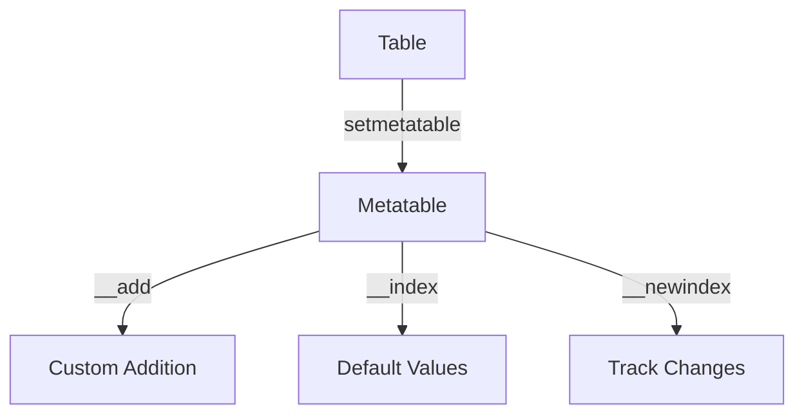

## 8.1 Metatables and Metamethods Usage

In Lua, tables are the primary data structure, and they can be incredibly flexible. However, their true power is unlocked through the use of metatables and metamethods. These features allow developers to define custom behaviors for tables, effectively extending their functionality beyond the default capabilities. In this section, we will delve into the world of metatables and metamethods, exploring how they can be used to overload operators, implement class-like structures, and track changes to tables.

### Understanding Metatables

A metatable in Lua is a table that can change the behavior of another table. By associating a metatable with a table, you can define how the table should respond to certain operations, such as arithmetic operations, comparisons, and even table access. This is achieved through metamethods, which are functions defined within the metatable.

#### Setting a Metatable

To associate a metatable with a table, Lua provides the `setmetatable` function. Here's a simple example:

```lua
local myTable = {}
local myMetatable = {}

setmetatable(myTable, myMetatable)
```

In this example, `myTable` is the table whose behavior we want to extend, and `myMetatable` is the metatable that defines the custom behavior.

#### Accessing a Metatable

To retrieve the metatable associated with a table, use the `getmetatable` function:

```lua
local mt = getmetatable(myTable)
```

This function returns the metatable of `myTable`, allowing you to inspect or modify it as needed.

### Common Metamethods

Metamethods are special keys in a metatable that define how a table should behave in response to specific operations. Let's explore some of the most commonly used metamethods.

#### Arithmetic Metamethods

Arithmetic metamethods allow you to define custom behavior for arithmetic operations. These include:

- `__add`: Addition (`+`)
- `__sub`: Subtraction (`-`)
- `__mul`: Multiplication (`*`)
- `__div`: Division (`/`)
- `__mod`: Modulus (`%`)
- `__pow`: Exponentiation (`^`)
- `__unm`: Unary minus (`-`)

Here's an example of using the `__add` metamethod to define custom addition behavior for tables:

```lua
local vector1 = {x = 1, y = 2}
local vector2 = {x = 3, y = 4}

local vectorMetatable = {
    __add = function(v1, v2)
        return {x = v1.x + v2.x, y = v1.y + v2.y}
    end
}

setmetatable(vector1, vectorMetatable)
setmetatable(vector2, vectorMetatable)

local result = vector1 + vector2
print(result.x, result.y)  -- Output: 4 6
```

In this example, we define a custom addition operation for vectors, allowing us to add two tables as if they were vectors.

#### Relational Metamethods

Relational metamethods define custom behavior for comparison operations. These include:

- `__eq`: Equality (`==`)
- `__lt`: Less than (`<`)
- `__le`: Less than or equal to (`<=`)

Here's an example of using the `__eq` metamethod to define custom equality behavior:

```lua
local point1 = {x = 1, y = 2}
local point2 = {x = 1, y = 2}

local pointMetatable = {
    __eq = function(p1, p2)
        return p1.x == p2.x and p1.y == p2.y
    end
}

setmetatable(point1, pointMetatable)
setmetatable(point2, pointMetatable)

print(point1 == point2)  -- Output: true
```

In this example, we define custom equality behavior for points, allowing us to compare two tables based on their `x` and `y` values.

#### Table Access Metamethods

Table access metamethods allow you to define custom behavior for accessing and modifying table elements. These include:

- `__index`: Custom behavior for accessing table elements.
- `__newindex`: Custom behavior for modifying table elements.

Here's an example of using the `__index` metamethod to provide default values for missing keys:

```lua
local defaults = {x = 0, y = 0}

local point = setmetatable({}, {
    __index = function(table, key)
        return defaults[key]
    end
})

print(point.x, point.y)  -- Output: 0 0
print(point.z)           -- Output: nil
```

In this example, we use the `__index` metamethod to provide default values for the `x` and `y` keys, while other keys return `nil`.

### Use Cases and Examples

Metatables and metamethods can be used in a variety of ways to extend the functionality of tables. Let's explore some common use cases.

#### Overloading Operators

As demonstrated earlier, you can use arithmetic and relational metamethods to overload operators for tables. This is particularly useful for implementing mathematical structures, such as vectors and matrices, where custom operations are needed.

#### Implementing Class-Like Structures

Lua does not have built-in support for classes, but you can use metatables to implement class-like structures. Here's a simple example:

```lua
local Person = {}
Person.__index = Person

function Person:new(name, age)
    local instance = setmetatable({}, self)
    instance.name = name
    instance.age = age
    return instance
end

function Person:greet()
    print("Hello, my name is " .. self.name)
end

local alice = Person:new("Alice", 30)
alice:greet()  -- Output: Hello, my name is Alice
```

In this example, we define a `Person` "class" using a metatable, allowing us to create instances with the `new` method and define methods like `greet`.

#### Tracking Table Changes

You can use the `__newindex` metamethod to track changes to a table. Here's an example:

```lua
local trackedTable = {}
local changes = {}

local trackerMetatable = {
    __newindex = function(table, key, value)
        changes[key] = value
        rawset(table, key, value)
    end
}

setmetatable(trackedTable, trackerMetatable)

trackedTable.a = 1
trackedTable.b = 2

for k, v in pairs(changes) do
    print(k, v)  -- Output: a 1, b 2
end
```

In this example, we use the `__newindex` metamethod to track changes to `trackedTable`, storing them in the `changes` table.

### Visualizing Metatables and Metamethods

To better understand how metatables and metamethods work, let's visualize the process using a diagram.



**Diagram Description:** This diagram illustrates how a table is associated with a metatable using `setmetatable`. The metatable defines metamethods such as `__add` for custom addition, `__index` for default values, and `__newindex` for tracking changes.

### Try It Yourself

Experiment with the examples provided by modifying the code to suit your needs. For instance, try adding more operations to the vector example, such as subtraction or multiplication. You can also extend the class-like structure example by adding more methods or properties to the `Person` class.

### References and Links

For further reading on metatables and metamethods, consider the following resources:

- [Lua 5.4 Reference Manual - Metatables and Metamethods](https://www.lua.org/manual/5.4/manual.html#2.8)
- [Programming in Lua - Metatables](https://www.lua.org/pil/13.html)

### Knowledge Check

Before moving on, let's reinforce what we've learned with a few questions.

## Quiz Time!



### What is a metatable in Lua?

- [x] A table that can change the behavior of another table.
- [ ] A function that performs arithmetic operations.
- [ ] A built-in Lua library for handling tables.
- [ ] A method for serializing tables.

> **Explanation:** A metatable is a table that can change the behavior of another table by defining metamethods.

### How do you associate a metatable with a table?

- [x] Using the `setmetatable` function.
- [ ] Using the `getmetatable` function.
- [ ] By directly assigning it to the table.
- [ ] By using the `require` function.

> **Explanation:** The `setmetatable` function is used to associate a metatable with a table.

### Which metamethod is used for custom addition behavior?

- [x] `__add`
- [ ] `__sub`
- [ ] `__mul`
- [ ] `__div`

> **Explanation:** The `__add` metamethod is used to define custom addition behavior for tables.

### What does the `__index` metamethod do?

- [x] Provides custom behavior for accessing table elements.
- [ ] Provides custom behavior for modifying table elements.
- [ ] Defines custom behavior for arithmetic operations.
- [ ] Defines custom behavior for comparison operations.

> **Explanation:** The `__index` metamethod provides custom behavior for accessing table elements.

### Which metamethod is used to track changes to a table?

- [x] `__newindex`
- [ ] `__index`
- [ ] `__eq`
- [ ] `__add`

> **Explanation:** The `__newindex` metamethod is used to track changes to a table by intercepting assignments.

### Can metatables be used to implement class-like structures in Lua?

- [x] Yes
- [ ] No

> **Explanation:** Metatables can be used to implement class-like structures by defining methods and properties within the metatable.

### Which metamethod is used for custom equality behavior?

- [x] `__eq`
- [ ] `__lt`
- [ ] `__le`
- [ ] `__add`

> **Explanation:** The `__eq` metamethod is used to define custom equality behavior for tables.

### What is the purpose of the `getmetatable` function?

- [x] To retrieve the metatable associated with a table.
- [ ] To set a metatable for a table.
- [ ] To perform arithmetic operations on tables.
- [ ] To serialize a table.

> **Explanation:** The `getmetatable` function is used to retrieve the metatable associated with a table.

### Which metamethod is used for custom subtraction behavior?

- [x] `__sub`
- [ ] `__add`
- [ ] `__mul`
- [ ] `__div`

> **Explanation:** The `__sub` metamethod is used to define custom subtraction behavior for tables.

### Metatables can only be associated with tables in Lua.

- [x] True
- [ ] False

> **Explanation:** Metatables are specifically designed to be associated with tables in Lua to extend their behavior.



Remember, this is just the beginning. As you progress, you'll discover even more ways to leverage the power of metatables and metamethods in Lua. Keep experimenting, stay curious, and enjoy the journey!
