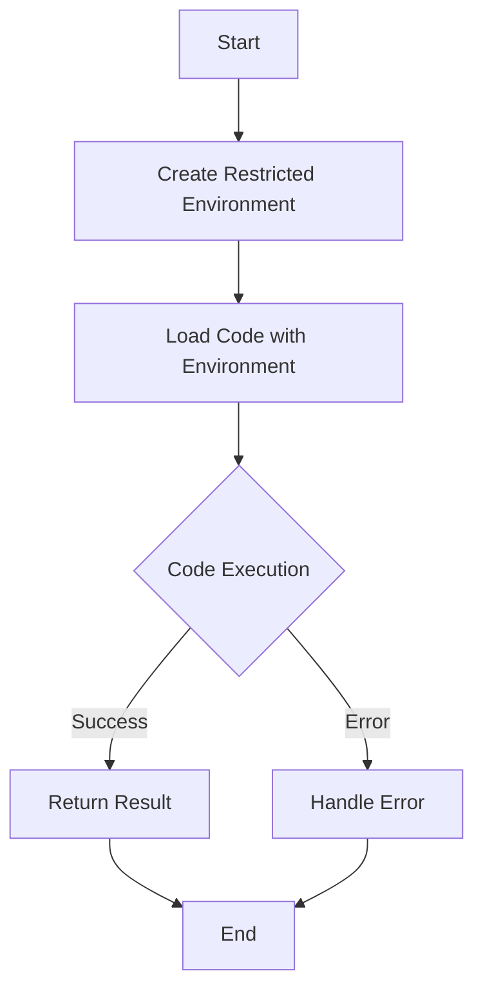

## 8.10 Sandbox Pattern for Secure Execution

In the world of software development, running untrusted code safely is a critical concern. The Sandbox Pattern is a powerful design pattern that allows developers to isolate execution environments, thereby preventing unauthorized access to sensitive resources. This section will guide you through implementing the Sandbox Pattern in Lua, a language known for its simplicity and flexibility.

### Running Untrusted Code Safely

Running untrusted code involves executing code that may not be fully trusted, such as user-generated scripts or third-party plugins. The primary goal is to ensure that this code cannot perform malicious actions, such as accessing sensitive data or altering critical system configurations.

#### Implementing Sandboxes in Lua

To implement a sandbox in Lua, we need to create a restricted environment where untrusted code can run without posing a threat to the system. This involves several key steps:

##### Restricted Environments

A restricted environment in Lua is essentially a table that acts as the global environment for the untrusted code. By controlling what this table contains, we can limit the functions and variables that the code can access.

```lua
-- Create a restricted environment
local sandbox_env = {
    print = print,  -- Allow access to the print function
    math = math,    -- Allow access to the math library
    -- Other safe functions and libraries can be added here
}

-- Function to execute code in a sandbox
function execute_in_sandbox(code)
    local func, err = load(code, "sandbox", "t", sandbox_env)
    if not func then
        return nil, err
    end
    return pcall(func)
end
```

In this example, we create a `sandbox_env` table that includes only the `print` function and the `math` library. This ensures that the untrusted code cannot access any other global functions or variables.

##### Loading Code Safely

Lua provides the `load()` and `loadstring()` functions to compile and execute Lua code. By using these functions with a custom environment, we can control the execution context of the code.

```lua
-- Example code to be executed in the sandbox
local code = [[
    print("Hello from the sandbox!")
    return math.sqrt(16)
]]

-- Execute the code in the sandbox
local success, result = execute_in_sandbox(code)
if success then
    print("Result:", result)
else
    print("Error:", result)
end
```

In this snippet, we use the `load()` function to compile the code with the `sandbox_env` as its environment. The `pcall()` function is used to safely execute the compiled function, capturing any errors that occur during execution.

##### Preventing Escapes

One of the critical challenges in sandboxing is preventing the untrusted code from escaping the restricted environment. This involves ensuring that the code cannot access sensitive functions or modify the environment.

To prevent escapes, avoid including functions like `os.execute`, `io.open`, or any other functions that can interact with the system or file system. Additionally, be cautious with functions that can modify tables, such as `setmetatable`, as they can potentially be used to alter the environment.

### Use Cases and Examples

The Sandbox Pattern is particularly useful in scenarios where you need to run code that is not fully trusted. Here are some common use cases:

#### Running User-Supplied Scripts

In applications that allow users to submit scripts, such as online coding platforms or game modding systems, sandboxes ensure that these scripts cannot perform harmful actions.

```lua
-- User-supplied script
local user_script = [[
    print("User script running")
    -- Attempt to access restricted functions
    -- os.execute("rm -rf /")  -- This will not work in the sandbox
]]

-- Execute the user script in the sandbox
local success, result = execute_in_sandbox(user_script)
if not success then
    print("Script error:", result)
end
```

#### Educational Tools

Educational tools that execute code snippets, such as interactive tutorials or coding challenges, can use sandboxes to safely run student code without risking the integrity of the system.

#### Secure Plugin Systems

Applications that support plugins can use sandboxes to ensure that third-party plugins do not have unrestricted access to the application's internals.

### Visualizing the Sandbox Pattern

To better understand how the Sandbox Pattern works, let's visualize the process using a flowchart.



**Figure 1: Flowchart of the Sandbox Pattern Execution Process**

This flowchart illustrates the steps involved in executing code within a sandbox. The process begins with creating a restricted environment, loading the code with this environment, executing the code, and finally handling the result or any errors that occur.

### Design Considerations

When implementing the Sandbox Pattern, consider the following:

- **Security**: Ensure that the sandbox environment does not include any functions that can compromise security.
- **Performance**: Sandboxing can introduce overhead. Optimize the environment to include only necessary functions.
- **Flexibility**: Design the sandbox to be easily configurable, allowing you to adjust the environment as needed.

### Differences and Similarities

The Sandbox Pattern is often compared to other security patterns, such as the Proxy Pattern. While both patterns aim to control access, the Sandbox Pattern focuses on isolating execution environments, whereas the Proxy Pattern controls access to specific objects or resources.

### Try It Yourself

To deepen your understanding of the Sandbox Pattern, try modifying the code examples provided. For instance, experiment with adding or removing functions from the `sandbox_env` table and observe how it affects the execution of the untrusted code.

### Knowledge Check

- What is the primary purpose of the Sandbox Pattern?
- How does the `load()` function contribute to sandboxing in Lua?
- Why is it important to prevent untrusted code from accessing functions like `os.execute`?

### Embrace the Journey

Remember, mastering the Sandbox Pattern is just one step in your journey to becoming a proficient Lua developer. As you continue to explore Lua's capabilities, you'll discover even more powerful patterns and techniques. Keep experimenting, stay curious, and enjoy the journey!

## Quiz Time!



### What is the primary purpose of the Sandbox Pattern?

- [x] To isolate execution environments and prevent unauthorized access
- [ ] To improve code readability
- [ ] To enhance performance
- [ ] To simplify code maintenance

> **Explanation:** The Sandbox Pattern is designed to isolate execution environments, ensuring that untrusted code cannot access sensitive resources or perform malicious actions.


### Which Lua function is used to compile and execute code within a sandbox?

- [ ] os.execute()
- [x] load()
- [ ] io.open()
- [ ] setmetatable()

> **Explanation:** The `load()` function is used to compile and execute Lua code within a specified environment, making it suitable for sandboxing.


### What should be avoided in a sandbox environment to prevent escapes?

- [x] Functions like os.execute and io.open
- [ ] The print function
- [ ] The math library
- [ ] The string library

> **Explanation:** Functions that can interact with the system or file system, such as `os.execute` and `io.open`, should be avoided in a sandbox environment to prevent escapes.


### In which scenarios is the Sandbox Pattern particularly useful?

- [x] Running user-supplied scripts
- [x] Educational tools that execute code snippets
- [x] Secure plugin systems
- [ ] Optimizing algorithm performance

> **Explanation:** The Sandbox Pattern is useful in scenarios where untrusted code needs to be executed safely, such as user-supplied scripts, educational tools, and secure plugin systems.


### What is a key consideration when designing a sandbox environment?

- [x] Security
- [ ] Code readability
- [ ] Algorithm complexity
- [ ] User interface design

> **Explanation:** Security is a key consideration when designing a sandbox environment to ensure that untrusted code cannot access sensitive resources.


### How can you handle errors that occur during code execution in a sandbox?

- [x] Use pcall() to safely execute the code and capture errors
- [ ] Use os.exit() to terminate the program
- [ ] Use io.close() to close the environment
- [ ] Use string.format() to format error messages

> **Explanation:** The `pcall()` function is used to safely execute Lua code, capturing any errors that occur during execution.


### What is a restricted environment in the context of the Sandbox Pattern?

- [x] A table that acts as the global environment for untrusted code
- [ ] A function that limits code execution time
- [ ] A library that provides additional security features
- [ ] A module that enhances performance

> **Explanation:** A restricted environment is a table that acts as the global environment for untrusted code, controlling what functions and variables the code can access.


### Which of the following is NOT a benefit of using the Sandbox Pattern?

- [ ] Enhanced security
- [ ] Controlled execution environment
- [ ] Prevention of unauthorized access
- [x] Improved algorithm efficiency

> **Explanation:** While the Sandbox Pattern enhances security and controls execution environments, it does not inherently improve algorithm efficiency.


### What is the role of the `sandbox_env` table in the Sandbox Pattern?

- [x] It defines the functions and libraries accessible to untrusted code
- [ ] It stores error messages generated during execution
- [ ] It optimizes code performance
- [ ] It logs execution details

> **Explanation:** The `sandbox_env` table defines the functions and libraries that are accessible to untrusted code, controlling the execution environment.


### True or False: The Sandbox Pattern can be used to enhance the performance of Lua applications.

- [ ] True
- [x] False

> **Explanation:** The Sandbox Pattern is primarily focused on security and controlling execution environments, not on enhancing performance.


