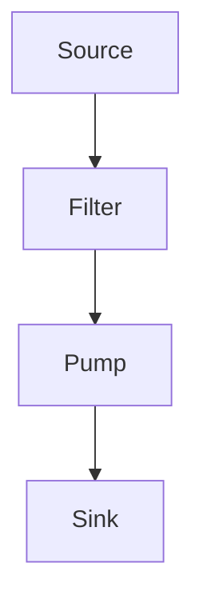

## 8.11 Filters, Sources, Sinks, and Pumps

In the realm of software engineering, the ability to process data streams efficiently is crucial. Lua, with its lightweight and flexible nature, provides an excellent platform for implementing stream-oriented processing patterns. In this section, we will delve into the concepts of Filters, Sources, Sinks, and Pumps, which are fundamental to handling data streams in a modular and reusable manner.

### Stream-Oriented Processing

Stream-oriented processing involves handling data as a continuous flow, rather than as discrete chunks. This approach is particularly useful in scenarios where data is produced and consumed incrementally, such as network data handling, real-time data processing, and building data pipelines.

#### Implementing Stream Patterns

Let's explore the core components of stream-oriented processing in Lua:

1. **Sources**: These are functions or coroutines that produce data. They act as the starting point of a data stream.
2. **Sinks**: These are consumers that accept data. They represent the endpoint of a data stream.
3. **Filters**: These transform data between sources and sinks, allowing for data manipulation and processing.
4. **Pumps**: These control the flow of data between sources and sinks, ensuring smooth data transfer.

#### Sources

Sources are responsible for generating data. In Lua, sources can be implemented as functions or coroutines that yield data incrementally. This allows for efficient data production without blocking the execution of other parts of the program.

```lua
-- Example of a simple source function
function numberSource(limit)
    local i = 1
    return function()
        if i <= limit then
            local value = i
            i = i + 1
            return value
        end
    end
end

-- Usage
local source = numberSource(5)
for i = 1, 5 do
    print(source()) -- Outputs: 1, 2, 3, 4, 5
end
```

In this example, `numberSource` is a source function that generates numbers from 1 to a specified limit. Each call to the source function produces the next number in the sequence.

#### Sinks

Sinks consume data produced by sources. They can be implemented as functions that accept data and perform operations such as storage, display, or further processing.

```lua
-- Example of a simple sink function
function printSink()
    return function(data)
        if data then
            print("Sink received:", data)
        end
    end
end

-- Usage
local sink = printSink()
sink(10) -- Outputs: Sink received: 10
```

Here, `printSink` is a sink function that prints the received data. It demonstrates how sinks can be used to handle data at the end of a stream.

#### Filters

Filters transform data as it flows from sources to sinks. They can be used to modify, validate, or enrich data before it reaches the sink.

```lua
-- Example of a simple filter function
function doubleFilter(next)
    return function(data)
        if data then
            return next(data * 2)
        end
    end
end

-- Usage
local source = numberSource(5)
local sink = printSink()
local filter = doubleFilter(sink)

for i = 1, 5 do
    filter(source()) -- Outputs: Sink received: 2, 4, 6, 8, 10
end
```

In this example, `doubleFilter` is a filter function that doubles the data before passing it to the next function in the stream, which is the sink.

#### Pumps

Pumps control the flow of data between sources and sinks. They can be used to manage the rate of data transfer, handle backpressure, or coordinate multiple streams.

```lua
-- Example of a simple pump function
function pump(source, filter, sink)
    while true do
        local data = source()
        if not data then break end
        filter(data)
    end
end

-- Usage
local source = numberSource(5)
local sink = printSink()
local filter = doubleFilter(sink)

pump(source, filter, sink) -- Outputs: Sink received: 2, 4, 6, 8, 10
```

The `pump` function in this example coordinates the flow of data from the source through the filter to the sink. It ensures that data is processed in a controlled manner.

### Use Cases and Examples

Stream-oriented processing patterns are versatile and can be applied to various scenarios:

#### Data Pipeline Processing

In data pipeline processing, data flows through a series of transformations before reaching its final destination. Filters can be chained together to create complex data processing pipelines.

```lua
-- Example of a data pipeline with multiple filters
function incrementFilter(next)
    return function(data)
        if data then
            return next(data + 1)
        end
    end
end

local source = numberSource(5)
local sink = printSink()
local filter1 = doubleFilter(incrementFilter(sink))

pump(source, filter1, sink) -- Outputs: Sink received: 4, 6, 8, 10, 12
```

In this example, data is first incremented by 1 and then doubled before reaching the sink. This demonstrates how filters can be composed to build complex data processing pipelines.

#### Network Data Handling

Stream-oriented processing is ideal for handling network data, where data is received incrementally. Sources can be implemented to read data from network sockets, and sinks can be used to send processed data back over the network.

```lua
-- Example of a network data source
function networkSource(socket)
    return function()
        return socket:receive()
    end
end

-- Example of a network data sink
function networkSink(socket)
    return function(data)
        if data then
            socket:send(data)
        end
    end
end
```

In this example, `networkSource` reads data from a network socket, and `networkSink` sends data back over the network. These functions can be used in conjunction with filters and pumps to process network data streams.

#### Building Modular and Reusable Components

By implementing stream-oriented processing patterns, you can build modular and reusable components that can be easily combined to create complex systems. Each component can be developed and tested independently, promoting code reuse and maintainability.

### Visualizing Stream-Oriented Processing

To better understand the flow of data in stream-oriented processing, let's visualize the interaction between sources, filters, sinks, and pumps using a flowchart.



This flowchart illustrates the basic flow of data from a source through a filter and a pump to a sink. Each component plays a crucial role in the stream-oriented processing pipeline.

### Key Takeaways

- **Sources** generate data and act as the starting point of a data stream.
- **Sinks** consume data and represent the endpoint of a data stream.
- **Filters** transform data as it flows from sources to sinks.
- **Pumps** control the flow of data between sources and sinks.
- Stream-oriented processing patterns are versatile and can be applied to various scenarios, including data pipeline processing and network data handling.
- Implementing these patterns in Lua promotes modularity, reusability, and maintainability.

### Try It Yourself

Experiment with the code examples provided in this section. Try modifying the source, filter, and sink functions to create your own data processing pipelines. Consider implementing additional filters to perform different transformations on the data.

### References and Links

- [Lua Programming Language](https://www.lua.org/)
- [MDN Web Docs: Streams](https://developer.mozilla.org/en-US/docs/Web/API/Streams_API)
- [W3Schools: Data Streams](https://www.w3schools.com/)

### Embrace the Journey

Remember, mastering stream-oriented processing in Lua is just the beginning. As you progress, you'll be able to build more complex and efficient data processing systems. Keep experimenting, stay curious, and enjoy the journey!

## Quiz Time!



### What is the primary role of a source in stream-oriented processing?

- [x] To generate data
- [ ] To consume data
- [ ] To transform data
- [ ] To control data flow

> **Explanation:** A source is responsible for generating data in a stream-oriented processing pipeline.

### What is the function of a sink in a data stream?

- [ ] To generate data
- [x] To consume data
- [ ] To transform data
- [ ] To control data flow

> **Explanation:** A sink consumes data and represents the endpoint of a data stream.

### How do filters operate in a data stream?

- [ ] By generating data
- [ ] By consuming data
- [x] By transforming data
- [ ] By controlling data flow

> **Explanation:** Filters transform data as it flows from sources to sinks.

### What is the purpose of a pump in stream-oriented processing?

- [ ] To generate data
- [ ] To consume data
- [ ] To transform data
- [x] To control data flow

> **Explanation:** Pumps control the flow of data between sources and sinks.

### Which Lua construct is commonly used to implement sources?

- [x] Functions or coroutines
- [ ] Tables
- [ ] Metatables
- [ ] Modules

> **Explanation:** Sources can be implemented as functions or coroutines that yield data incrementally.

### In the provided example, what does the `doubleFilter` function do?

- [ ] It halves the data
- [x] It doubles the data
- [ ] It increments the data
- [ ] It decrements the data

> **Explanation:** The `doubleFilter` function doubles the data before passing it to the next function in the stream.

### What is a common use case for stream-oriented processing patterns?

- [x] Data pipeline processing
- [ ] Static data storage
- [ ] Synchronous data handling
- [ ] Manual data entry

> **Explanation:** Stream-oriented processing patterns are commonly used in data pipeline processing.

### How can you visualize the flow of data in stream-oriented processing?

- [ ] Using a pie chart
- [x] Using a flowchart
- [ ] Using a bar graph
- [ ] Using a scatter plot

> **Explanation:** A flowchart can be used to visualize the flow of data in stream-oriented processing.

### What is the benefit of using modular components in stream-oriented processing?

- [x] Promotes code reuse and maintainability
- [ ] Increases code complexity
- [ ] Reduces code readability
- [ ] Limits code flexibility

> **Explanation:** Modular components promote code reuse and maintainability, making it easier to build complex systems.

### True or False: Stream-oriented processing is only applicable to network data handling.

- [ ] True
- [x] False

> **Explanation:** Stream-oriented processing is versatile and can be applied to various scenarios, not just network data handling.


