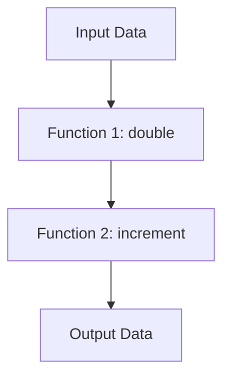

## 8.2 Functional Programming Techniques

Functional programming is a paradigm that treats computation as the evaluation of mathematical functions and avoids changing state or mutable data. In Lua, functions are first-class citizens, meaning they can be stored in variables, passed as arguments, and returned from other functions. This capability allows us to leverage functional programming techniques to write more modular, concise, and expressive code.

### Embracing Functions as First-Class Citizens

In Lua, functions are not just blocks of code but are treated as values that can be manipulated like any other data type. This opens up a world of possibilities for functional programming techniques, which we will explore in this section.

#### Higher-Order Functions

Higher-order functions are functions that can take other functions as arguments or return them as results. This is a powerful concept that allows us to abstract and generalize operations.

**Example: A Simple Higher-Order Function**

```lua
-- Define a higher-order function that applies a function to each element in a table
function map(tbl, func)
    local result = {}
    for i, v in ipairs(tbl) do
        result[i] = func(v)
    end
    return result
end

-- Define a function to square a number
function square(x)
    return x * x
end

-- Use the map function to apply the square function to each element in a table
local numbers = {1, 2, 3, 4, 5}
local squares = map(numbers, square)

-- Print the result
for i, v in ipairs(squares) do
    print(v) -- Output: 1, 4, 9, 16, 25
end
```

In this example, `map` is a higher-order function that takes a table and a function as arguments. It applies the function to each element of the table and returns a new table with the results.

#### Closures

Closures are functions that capture variables from their enclosing scope. This allows the function to "remember" the environment in which it was created, even after that environment has exited.

**Example: Using Closures to Create a Counter**

```lua
-- Define a function that returns a closure
function createCounter()
    local count = 0
    return function()
        count = count + 1
        return count
    end
end

-- Create a counter instance
local counter = createCounter()

-- Use the counter
print(counter()) -- Output: 1
print(counter()) -- Output: 2
print(counter()) -- Output: 3
```

In this example, the `createCounter` function returns a closure that captures the `count` variable. Each time the closure is called, it increments and returns the `count`, maintaining its state between calls.

#### Currying and Partial Application

Currying is the process of transforming a function that takes multiple arguments into a sequence of functions that each take a single argument. Partial application is similar but involves fixing a few arguments of a function, producing another function of smaller arity.

**Example: Currying in Lua**

```lua
-- Define a function that adds two numbers
function add(x, y)
    return x + y
end

-- Define a curried version of the add function
function curryAdd(x)
    return function(y)
        return add(x, y)
    end
end

-- Create a new function that adds 5 to its argument
local addFive = curryAdd(5)

-- Use the new function
print(addFive(10)) -- Output: 15
```

In this example, `curryAdd` is a curried version of the `add` function. It takes one argument and returns a new function that takes the second argument.

### Use Cases and Examples

Functional programming techniques can be applied in various scenarios to improve code clarity and reusability.

#### Building Pipelines for Data Transformation

Functional programming allows us to build pipelines for data transformation, where data flows through a series of functions, each transforming it in some way.

**Example: Data Transformation Pipeline**

```lua
-- Define a function to double a number
function double(x)
    return x * 2
end

-- Define a function to increment a number
function increment(x)
    return x + 1
end

-- Define a function to build a pipeline
function pipeline(...)
    local funcs = {...}
    return function(input)
        local result = input
        for _, func in ipairs(funcs) do
            result = func(result)
        end
        return result
    end
end

-- Create a pipeline that doubles and then increments a number
local transform = pipeline(double, increment)

-- Use the pipeline
print(transform(3)) -- Output: 7
```

In this example, the `pipeline` function takes a series of functions and returns a new function that applies them in sequence to an input.

#### Event Handlers and Callbacks

Functional programming is well-suited for event-driven programming, where functions are used as callbacks to handle events.

**Example: Event Handling with Callbacks**

```lua
-- Define a function to simulate an event
function onEvent(callback)
    -- Simulate an event occurring
    local eventData = "Event Data"
    -- Call the callback function with the event data
    callback(eventData)
end

-- Define a callback function
function handleEvent(data)
    print("Handling event with data: " .. data)
end

-- Register the callback
onEvent(handleEvent)
```

In this example, `onEvent` simulates an event and calls the provided callback function with event data.

#### Simplifying Complex Logic

Functional programming can simplify complex logic by breaking it down into smaller, reusable functions.

**Example: Simplifying Logic with Functions**

```lua
-- Define a function to check if a number is even
function isEven(x)
    return x % 2 == 0
end

-- Define a function to filter a table based on a predicate
function filter(tbl, predicate)
    local result = {}
    for i, v in ipairs(tbl) do
        if predicate(v) then
            table.insert(result, v)
        end
    end
    return result
end

-- Use the filter function to get even numbers from a table
local numbers = {1, 2, 3, 4, 5, 6}
local evens = filter(numbers, isEven)

-- Print the result
for i, v in ipairs(evens) do
    print(v) -- Output: 2, 4, 6
end
```

In this example, the `filter` function abstracts the logic of filtering a table based on a predicate, making the code more modular and reusable.

### Visualizing Functional Programming Concepts

To better understand functional programming concepts, let's visualize the flow of data through a pipeline using a Mermaid.js diagram.



This diagram represents a simple data transformation pipeline where input data flows through two functions, `double` and `increment`, before producing the output data.

### Try It Yourself

Experiment with the code examples provided in this section. Try modifying the `map`, `createCounter`, and `pipeline` functions to see how they behave with different inputs and functions. Consider creating your own higher-order functions and closures to solve specific problems.

### References and Links

- [Lua 5.4 Reference Manual](https://www.lua.org/manual/5.4/)
- [Functional Programming in Lua](https://www.lua.org/pil/6.1.html)
- [Higher-Order Functions](https://en.wikipedia.org/wiki/Higher-order_function)
- [Currying](https://en.wikipedia.org/wiki/Currying)

### Knowledge Check

Before moving on, take a moment to review the key concepts covered in this section. Consider how you might apply functional programming techniques in your own projects to improve code modularity and reusability.

### Embrace the Journey

Remember, this is just the beginning. As you progress, you'll discover more advanced functional programming techniques and how they can be applied to solve complex problems. Keep experimenting, stay curious, and enjoy the journey!

## Quiz Time!



### What is a higher-order function?

- [x] A function that takes other functions as arguments or returns them as results
- [ ] A function that only operates on numbers
- [ ] A function that cannot be nested
- [ ] A function that is always recursive

> **Explanation:** Higher-order functions are those that can take other functions as arguments or return them as results, allowing for greater abstraction and flexibility.

### What is a closure in Lua?

- [x] A function that captures variables from its enclosing scope
- [ ] A function that cannot be called
- [ ] A function that is defined inside another function
- [ ] A function that only operates on strings

> **Explanation:** Closures are functions that capture variables from their enclosing scope, allowing them to maintain state between calls.

### What is currying?

- [x] Transforming a function that takes multiple arguments into a sequence of functions that each take a single argument
- [ ] A technique for optimizing loops
- [ ] A method for sorting data
- [ ] A way to handle errors

> **Explanation:** Currying is the process of transforming a function that takes multiple arguments into a sequence of functions that each take a single argument.

### How can functional programming simplify complex logic?

- [x] By breaking it down into smaller, reusable functions
- [ ] By using more loops
- [ ] By increasing the number of variables
- [ ] By avoiding the use of functions

> **Explanation:** Functional programming simplifies complex logic by breaking it down into smaller, reusable functions, making the code more modular and easier to understand.

### What is the purpose of the `map` function in functional programming?

- [x] To apply a function to each element in a collection
- [ ] To sort a collection
- [ ] To find the maximum value in a collection
- [ ] To reverse a collection

> **Explanation:** The `map` function applies a given function to each element in a collection, returning a new collection with the results.

### What does the `pipeline` function do in the provided example?

- [x] It creates a sequence of functions that process data in order
- [ ] It sorts data
- [ ] It reverses data
- [ ] It finds the maximum value in data

> **Explanation:** The `pipeline` function creates a sequence of functions that process data in order, allowing for data transformation through multiple steps.

### What is partial application?

- [x] Fixing a few arguments of a function, producing another function of smaller arity
- [ ] A method for sorting data
- [ ] A technique for optimizing loops
- [ ] A way to handle errors

> **Explanation:** Partial application involves fixing a few arguments of a function, producing another function of smaller arity, which can be useful for creating specialized functions.

### How do closures help in maintaining state?

- [x] By capturing variables from their enclosing scope
- [ ] By using global variables
- [ ] By using more loops
- [ ] By avoiding the use of functions

> **Explanation:** Closures help in maintaining state by capturing variables from their enclosing scope, allowing them to "remember" the environment in which they were created.

### What is an example of a use case for higher-order functions?

- [x] Event handlers and callbacks
- [ ] Sorting data
- [ ] Reversing data
- [ ] Finding the maximum value in data

> **Explanation:** Higher-order functions are often used in event handlers and callbacks, where functions are passed as arguments to handle specific events.

### True or False: In Lua, functions are first-class citizens.

- [x] True
- [ ] False

> **Explanation:** In Lua, functions are first-class citizens, meaning they can be stored in variables, passed as arguments, and returned from other functions.


