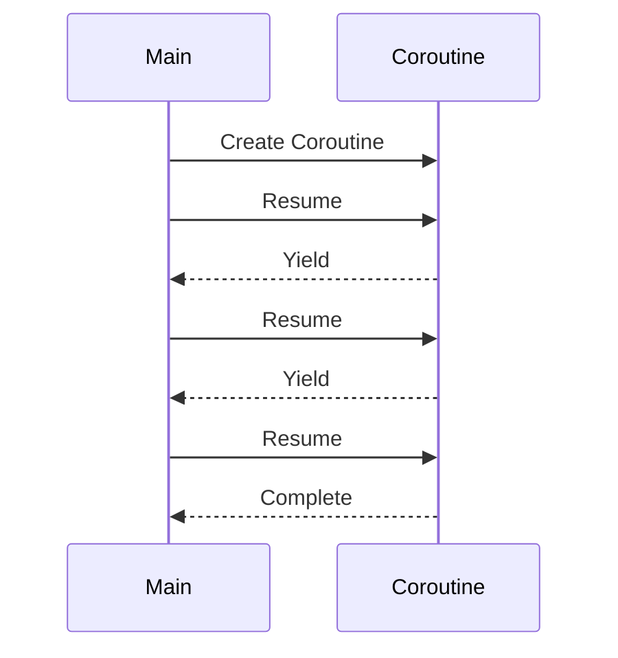

## 8.3 Coroutines and Coroutine-Based Patterns

Coroutines in Lua offer a powerful mechanism for implementing cooperative multitasking, allowing developers to manage execution flow in a non-preemptive manner. This section delves into the intricacies of coroutines, exploring their implementation, communication, and practical use cases. By mastering coroutine-based patterns, you can enhance the efficiency and responsiveness of your Lua applications.

### Cooperative Multitasking

Cooperative multitasking is a form of multitasking where tasks voluntarily yield control to allow other tasks to run. Unlike preemptive multitasking, where the operating system decides when to switch tasks, cooperative multitasking relies on the tasks themselves to yield control. This approach is particularly useful in environments where you want to maintain control over task switching, such as in embedded systems or game development.

### Implementing Coroutines in Lua

Lua's coroutine library provides a simple yet powerful API for creating and managing coroutines. Let's explore the key functions and concepts involved in implementing coroutines.

#### Creating Coroutines

Coroutines in Lua can be created using `coroutine.create()` or `coroutine.wrap()`. Both functions take a function as an argument and return a coroutine object.

- **`coroutine.create()`**: This function creates a new coroutine and returns a coroutine object. The coroutine can be resumed using `coroutine.resume()`.

```lua
-- Create a coroutine
local co = coroutine.create(function()
    print("Hello from coroutine!")
end)

-- Resume the coroutine
coroutine.resume(co)
```

- **`coroutine.wrap()`**: This function creates a coroutine and returns a function that, when called, resumes the coroutine. This is a more convenient way to work with coroutines if you don't need to manage the coroutine object directly.

```lua
-- Create a coroutine using wrap
local co = coroutine.wrap(function()
    print("Hello from wrapped coroutine!")
end)

-- Call the function to resume the coroutine
co()
```

#### Yielding and Resuming

Coroutines can yield execution using `coroutine.yield()`, allowing other coroutines to run. Execution can be resumed using `coroutine.resume()`.

- **Yielding Execution**: Use `coroutine.yield()` to pause the coroutine and return control to the caller.

```lua
local co = coroutine.create(function()
    for i = 1, 3 do
        print("Coroutine iteration:", i)
        coroutine.yield()
    end
end)

-- Resume the coroutine multiple times
coroutine.resume(co)
coroutine.resume(co)
coroutine.resume(co)
```

- **Resuming Execution**: Use `coroutine.resume()` to continue execution from where the coroutine was last yielded.

```lua
-- Resume the coroutine
coroutine.resume(co)
```

#### Coroutine Communication

Coroutines can communicate with each other by passing values during yield and resume operations. This allows for flexible data exchange between coroutines.

- **Passing Values**: You can pass values to a coroutine when resuming it, and receive values when yielding.

```lua
local co = coroutine.create(function(a, b)
    print("Received:", a, b)
    local c = coroutine.yield(a + b)
    print("Coroutine received:", c)
end)

-- Start the coroutine with initial values
coroutine.resume(co, 10, 20)

-- Resume the coroutine with a new value
coroutine.resume(co, 30)
```

### Use Cases and Examples

Coroutines are versatile and can be applied in various scenarios. Let's explore some common use cases and examples.

#### Asynchronous I/O Operations

Coroutines are ideal for handling asynchronous I/O operations, allowing you to perform non-blocking tasks while waiting for I/O to complete.

```lua
-- Simulate an asynchronous I/O operation
local function asyncIO()
    print("Starting I/O operation...")
    coroutine.yield()
    print("I/O operation completed.")
end

local co = coroutine.create(asyncIO)

-- Start the I/O operation
coroutine.resume(co)

-- Simulate other work
print("Doing other work...")

-- Resume the I/O operation
coroutine.resume(co)
```

#### Generators and Iterators

Coroutines can be used to implement generators and iterators, providing a convenient way to produce a sequence of values.

```lua
-- Generator function using coroutine
local function rangeGenerator(n)
    return coroutine.wrap(function()
        for i = 1, n do
            coroutine.yield(i)
        end
    end)
end

-- Use the generator
for value in rangeGenerator(5) do
    print("Generated value:", value)
end
```

#### Implementing Simple State Machines

Coroutines can be used to implement simple state machines, where each state is represented by a coroutine.

```lua
-- State machine using coroutines
local function stateA()
    print("State A")
    coroutine.yield(stateB)
end

local function stateB()
    print("State B")
    coroutine.yield(stateA)
end

local currentState = coroutine.create(stateA)

-- Run the state machine
for i = 1, 4 do
    local _, nextState = coroutine.resume(currentState)
    currentState = coroutine.create(nextState)
end
```

### Visualizing Coroutine Execution

To better understand how coroutines manage execution flow, let's visualize the process using a sequence diagram.



**Diagram Description**: This sequence diagram illustrates the interaction between the main program and a coroutine. The main program creates and resumes the coroutine, which yields control back to the main program at each yield point.

### Try It Yourself

Experiment with the code examples provided in this section. Try modifying the coroutine functions to perform different tasks, or create your own coroutine-based patterns. Here are some suggestions:

- Modify the asynchronous I/O example to simulate a network request.
- Create a generator that produces Fibonacci numbers.
- Implement a more complex state machine with additional states.

### Knowledge Check

- What is the difference between `coroutine.create()` and `coroutine.wrap()`?
- How do you pass values between coroutines?
- What are some common use cases for coroutines in Lua?

### Embrace the Journey

Remember, mastering coroutines is just the beginning. As you explore coroutine-based patterns, you'll unlock new possibilities for designing efficient and responsive Lua applications. Keep experimenting, stay curious, and enjoy the journey!

## Quiz Time!



### What is the primary advantage of using coroutines in Lua?

- [x] Cooperative multitasking
- [ ] Preemptive multitasking
- [ ] Automatic memory management
- [ ] Enhanced security

> **Explanation:** Coroutines in Lua provide cooperative multitasking, allowing tasks to yield control voluntarily.

### Which function is used to create a coroutine in Lua?

- [x] coroutine.create()
- [ ] coroutine.start()
- [ ] coroutine.begin()
- [ ] coroutine.init()

> **Explanation:** `coroutine.create()` is used to create a new coroutine in Lua.

### How do you pause a coroutine's execution?

- [x] coroutine.yield()
- [ ] coroutine.pause()
- [ ] coroutine.stop()
- [ ] coroutine.halt()

> **Explanation:** `coroutine.yield()` is used to pause a coroutine's execution.

### What is the purpose of `coroutine.wrap()`?

- [x] To create a coroutine and return a function to resume it
- [ ] To terminate a coroutine
- [ ] To pause a coroutine
- [ ] To duplicate a coroutine

> **Explanation:** `coroutine.wrap()` creates a coroutine and returns a function that resumes it.

### Which of the following is a use case for coroutines?

- [x] Asynchronous I/O operations
- [x] Generators and iterators
- [ ] Memory management
- [ ] Security enhancements

> **Explanation:** Coroutines are commonly used for asynchronous I/O operations and implementing generators and iterators.

### How do you resume a coroutine in Lua?

- [x] coroutine.resume()
- [ ] coroutine.continue()
- [ ] coroutine.start()
- [ ] coroutine.run()

> **Explanation:** `coroutine.resume()` is used to resume a coroutine in Lua.

### What is a common pattern implemented using coroutines?

- [x] State machines
- [ ] Memory pools
- [ ] Encryption algorithms
- [ ] Sorting algorithms

> **Explanation:** Coroutines can be used to implement state machines by representing each state as a coroutine.

### What does `coroutine.yield()` return?

- [x] Values passed to `coroutine.resume()`
- [ ] The current state of the coroutine
- [ ] The coroutine's stack trace
- [ ] The coroutine's memory usage

> **Explanation:** `coroutine.yield()` returns values passed to `coroutine.resume()`.

### Can coroutines be used for preemptive multitasking?

- [ ] True
- [x] False

> **Explanation:** Coroutines are used for cooperative multitasking, not preemptive multitasking.

### Which function allows coroutines to communicate by passing values?

- [x] coroutine.resume()
- [ ] coroutine.send()
- [ ] coroutine.transfer()
- [ ] coroutine.exchange()

> **Explanation:** `coroutine.resume()` allows coroutines to communicate by passing values.


