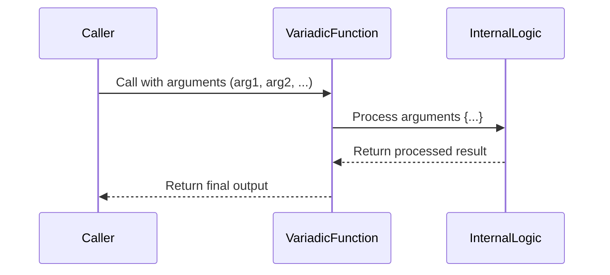

## 8.4 Variadic Functions and Flexible APIs

In the world of programming, flexibility is key to creating robust and adaptable software solutions. Lua, with its lightweight and dynamic nature, provides developers with powerful tools to achieve this flexibility. One such tool is the concept of variadic functions, which allow functions to accept a variable number of arguments. This capability is crucial for building flexible APIs that can handle diverse input scenarios. In this section, we will delve into the intricacies of variadic functions in Lua, explore their implementation, and examine practical use cases that demonstrate their utility in real-world applications.

### Understanding Variadic Functions

Variadic functions are functions that can accept a variable number of arguments. In Lua, this is achieved using the ellipsis (`...`) syntax. This feature is particularly useful when the number of inputs to a function cannot be predetermined, allowing for greater flexibility in function design.

#### Implementing Variadic Functions

To implement a variadic function in Lua, you simply include `...` in the function's parameter list. This tells Lua that the function can accept any number of additional arguments beyond those explicitly defined.

```lua
function printAll(...)
    local args = {...}  -- Collect all arguments into a table
    for i, v in ipairs(args) do
        print("Argument " .. i .. ": " .. tostring(v))
    end
end

printAll("Hello", 42, true, "Lua")
```

In this example, `printAll` is a variadic function that prints each argument it receives. The `...` captures all additional arguments, which are then stored in a table `args` for easy iteration.

#### Accessing Arguments

There are two primary ways to access the arguments passed to a variadic function:

1. **Using `{...}`**: This method collects all arguments into a table, allowing you to iterate over them or access them by index.

2. **Using `select()`**: This function provides more control over the arguments, allowing you to select specific ones or count the total number of arguments.

```lua
function sum(...)
    local total = 0
    for i = 1, select("#", ...) do
        total = total + select(i, ...)
    end
    return total
end

print(sum(1, 2, 3, 4, 5))  -- Output: 15
```

In the `sum` function, `select("#", ...)` returns the number of arguments, while `select(i, ...)` retrieves the i-th argument.

#### Forwarding Arguments

Variadic functions can also forward their arguments to other functions, maintaining the flexibility of argument handling.

```lua
function wrapper(func, ...)
    print("Calling function with arguments:")
    func(...)
end

function greet(name, age)
    print("Hello, " .. name .. "! You are " .. age .. " years old.")
end

wrapper(greet, "Alice", 30)
```

In this example, `wrapper` forwards its variadic arguments to the `greet` function, demonstrating how variadic functions can be used to create higher-order functions that manipulate or extend the behavior of other functions.

### Use Cases and Examples

Variadic functions are particularly useful in scenarios where the number of inputs can vary. Here are some common use cases:

#### Logging Functions with Flexible Message Formats

Logging is a critical aspect of software development, and variadic functions can simplify the creation of flexible logging utilities.

```lua
function log(level, ...)
    local messages = {...}
    local output = "[" .. level .. "] " .. table.concat(messages, " ")
    print(output)
end

log("INFO", "Application started at", os.date())
log("ERROR", "Failed to load configuration:", "config.lua")
```

In this logging function, `table.concat` is used to join the variadic arguments into a single string, allowing for dynamic message construction.

#### Math Functions Accepting Multiple Values

Mathematical operations often require flexibility in the number of operands. Variadic functions can elegantly handle such scenarios.

```lua
function multiply(...)
    local product = 1
    for i = 1, select("#", ...) do
        product = product * select(i, ...)
    end
    return product
end

print(multiply(2, 3, 4))  -- Output: 24
```

The `multiply` function multiplies all its arguments, demonstrating how variadic functions can simplify mathematical computations.

#### Building Flexible APIs

Variadic functions are instrumental in designing APIs that need to accommodate a wide range of input configurations.

```lua
function apiRequest(endpoint, ...)
    local params = {...}
    local queryString = table.concat(params, "&")
    print("Requesting " .. endpoint .. " with params: " .. queryString)
end

apiRequest("/getData", "user=123", "type=json", "limit=10")
```

In this API request function, variadic arguments are used to construct a query string, showcasing how variadic functions can enhance API flexibility.

### Visualizing Variadic Function Flow

To better understand the flow of variadic functions, let's visualize the process using a sequence diagram.



This diagram illustrates how a caller interacts with a variadic function, which processes the arguments internally before returning a result.

### Best Practices for Variadic Functions

When working with variadic functions, consider the following best practices:

- **Use Descriptive Names**: Clearly name your variadic functions and their parameters to convey their purpose and expected input.
- **Validate Inputs**: Implement input validation to ensure the function behaves correctly with unexpected or malformed arguments.
- **Document Usage**: Provide comprehensive documentation for variadic functions, detailing how they should be used and any constraints on their inputs.
- **Avoid Overuse**: While powerful, variadic functions can lead to complex and hard-to-maintain code if overused. Use them judiciously.

### Try It Yourself

Experiment with the provided code examples by modifying the arguments passed to the variadic functions. Try creating your own variadic functions for different use cases, such as string manipulation or data aggregation.

### Knowledge Check

To reinforce your understanding of variadic functions, consider the following questions:

- How do variadic functions enhance the flexibility of APIs?
- What are the two primary methods for accessing arguments in a variadic function?
- How can variadic functions be used to create higher-order functions?

### Embrace the Journey

Remember, mastering variadic functions is just one step in your journey to becoming a proficient Lua developer. As you continue to explore Lua's capabilities, you'll discover even more ways to harness its power for creating flexible and efficient software solutions. Keep experimenting, stay curious, and enjoy the journey!

## Quiz Time!



### What is a variadic function in Lua?

- [x] A function that can accept a variable number of arguments.
- [ ] A function that returns multiple values.
- [ ] A function that only accepts a fixed number of arguments.
- [ ] A function that does not accept any arguments.

> **Explanation:** A variadic function in Lua is designed to accept a variable number of arguments using the `...` syntax.

### How do you access all arguments passed to a variadic function in Lua?

- [x] By using `{...}` to collect them into a table.
- [ ] By using `args[]` to access them directly.
- [ ] By using `arg()` function.
- [ ] By using `args()` function.

> **Explanation:** In Lua, `{...}` is used to collect all arguments passed to a variadic function into a table for easy access.

### Which function is used to retrieve a specific argument from a variadic function?

- [x] `select()`
- [ ] `get()`
- [ ] `fetch()`
- [ ] `retrieve()`

> **Explanation:** The `select()` function is used to retrieve specific arguments from a variadic function in Lua.

### What is the purpose of the `select("#", ...)` expression in a variadic function?

- [x] To count the number of arguments passed.
- [ ] To select the first argument.
- [ ] To select the last argument.
- [ ] To concatenate all arguments.

> **Explanation:** `select("#", ...)` returns the number of arguments passed to a variadic function in Lua.

### How can variadic functions be used in logging?

- [x] By allowing flexible message formats.
- [ ] By restricting the number of log levels.
- [ ] By fixing the log message format.
- [ ] By limiting the number of log entries.

> **Explanation:** Variadic functions allow logging functions to accept flexible message formats, making them adaptable to different logging needs.

### What is a common use case for variadic functions in mathematical operations?

- [x] Performing operations on multiple values.
- [ ] Restricting operations to two values.
- [ ] Limiting operations to integers.
- [ ] Fixing the number of operands.

> **Explanation:** Variadic functions are commonly used in mathematical operations to perform calculations on multiple values.

### How can variadic functions enhance API design?

- [x] By accommodating a wide range of input configurations.
- [ ] By restricting input configurations.
- [ ] By fixing the number of API endpoints.
- [ ] By limiting the types of data processed.

> **Explanation:** Variadic functions enhance API design by allowing APIs to handle a wide range of input configurations flexibly.

### What is a best practice when using variadic functions?

- [x] Validate inputs to ensure correct behavior.
- [ ] Avoid documenting the function.
- [ ] Use them excessively for all functions.
- [ ] Ignore input constraints.

> **Explanation:** Validating inputs is a best practice to ensure variadic functions behave correctly with unexpected or malformed arguments.

### What is the role of `table.concat` in a variadic logging function?

- [x] To join variadic arguments into a single string.
- [ ] To split variadic arguments into separate strings.
- [ ] To count the number of arguments.
- [ ] To reverse the order of arguments.

> **Explanation:** `table.concat` is used to join variadic arguments into a single string in a logging function, allowing for dynamic message construction.

### True or False: Variadic functions should be used excessively in all scenarios.

- [ ] True
- [x] False

> **Explanation:** While variadic functions are powerful, they should be used judiciously to avoid complex and hard-to-maintain code.


