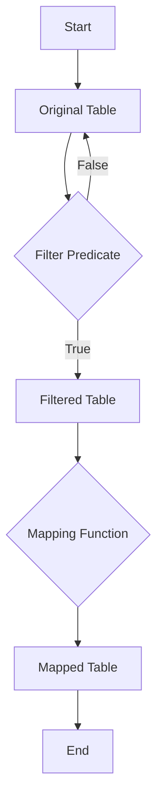

## 8.5 Table Manipulation Patterns

Tables are the cornerstone of data manipulation in Lua, serving as arrays, dictionaries, and even objects. Mastering table manipulation patterns is crucial for any Lua developer aiming to write efficient and elegant code. In this section, we will explore common techniques for working with tables, including copying, filtering, mapping, and merging. These patterns are essential for data transformation, generating new datasets, and implementing collection utilities.

### Working with Tables Efficiently

#### Common Techniques

#### Table Copying and Cloning

Copying tables in Lua can be categorized into two types: shallow copying and deep copying. Understanding the difference between these two is essential for managing data integrity and memory usage.

**Shallow Copying**

A shallow copy of a table creates a new table with references to the same elements as the original table. This means that changes to nested tables will affect both the original and the copied table.

```lua
function shallowCopy(original)
    local copy = {}
    for key, value in pairs(original) do
        copy[key] = value
    end
    return copy
end

-- Example usage
local originalTable = {1, 2, {3, 4}}
local copiedTable = shallowCopy(originalTable)

-- Modifying the nested table
copiedTable[3][1] = 5

print(originalTable[3][1]) -- Output: 5
```

**Deep Copying**

A deep copy creates a new table with copies of all nested tables, ensuring that changes to the copied table do not affect the original table.

```lua
function deepCopy(original)
    local copy
    if type(original) == 'table' then
        copy = {}
        for key, value in next, original, nil do
            copy[deepCopy(key)] = deepCopy(value)
        end
        setmetatable(copy, deepCopy(getmetatable(original)))
    else
        copy = original
    end
    return copy
end

-- Example usage
local originalTable = {1, 2, {3, 4}}
local copiedTable = deepCopy(originalTable)

-- Modifying the nested table
copiedTable[3][1] = 5

print(originalTable[3][1]) -- Output: 3
```

#### Filtering and Mapping

Filtering and mapping are powerful techniques for transforming tables. Filtering involves selecting elements that meet certain criteria, while mapping involves applying a function to each element to create a new table.

**Filtering**

```lua
function filterTable(tbl, predicate)
    local filtered = {}
    for i, value in ipairs(tbl) do
        if predicate(value) then
            table.insert(filtered, value)
        end
    end
    return filtered
end

-- Example usage
local numbers = {1, 2, 3, 4, 5}
local evenNumbers = filterTable(numbers, function(n) return n % 2 == 0 end)

for _, v in ipairs(evenNumbers) do
    print(v) -- Output: 2, 4
end
```

**Mapping**

```lua
function mapTable(tbl, func)
    local mapped = {}
    for i, value in ipairs(tbl) do
        mapped[i] = func(value)
    end
    return mapped
end

-- Example usage
local numbers = {1, 2, 3, 4, 5}
local squaredNumbers = mapTable(numbers, function(n) return n * n end)

for _, v in ipairs(squaredNumbers) do
    print(v) -- Output: 1, 4, 9, 16, 25
end
```

#### Merging Tables

Merging tables involves combining multiple tables into one. This can be useful for aggregating data from different sources or creating a unified dataset.

```lua
function mergeTables(...)
    local merged = {}
    for i = 1, select('#', ...) do
        local tbl = select(i, ...)
        for k, v in pairs(tbl) do
            merged[k] = v
        end
    end
    return merged
end

-- Example usage
local table1 = {a = 1, b = 2}
local table2 = {b = 3, c = 4}
local mergedTable = mergeTables(table1, table2)

for k, v in pairs(mergedTable) do
    print(k, v) -- Output: a 1, b 3, c 4
end
```

### Use Cases and Examples

#### Data Transformation

Table manipulation patterns are essential for transforming data into desired formats. For instance, you might need to filter out unwanted data, map values to a new format, or merge datasets from different sources.

#### Generating New Datasets

By applying filtering and mapping techniques, you can generate new datasets that meet specific criteria or formats. This is particularly useful in data analysis and processing tasks.

#### Implementing Collection Utilities

Table manipulation patterns can be used to implement utility functions for collections, such as finding the maximum or minimum value, sorting, or aggregating data.

### Visualizing Table Manipulation Patterns

To better understand how these patterns work, let's visualize the process of filtering and mapping a table using a flowchart.



This flowchart illustrates the process of filtering a table based on a predicate and then mapping the filtered results to create a new table.

### Try It Yourself

Experiment with the provided code examples by modifying the filtering and mapping functions. Try creating a function that filters out odd numbers and then maps the remaining numbers to their cube.

### References and Links

- [Lua 5.4 Reference Manual](https://www.lua.org/manual/5.4/)
- [Programming in Lua](https://www.lua.org/pil/)

### Knowledge Check

- What is the difference between shallow and deep copying?
- How can you filter a table to include only elements greater than a certain value?
- What is the result of merging two tables with overlapping keys?

### Embrace the Journey

Remember, mastering table manipulation patterns is just the beginning. As you progress, you'll be able to tackle more complex data manipulation tasks. Keep experimenting, stay curious, and enjoy the journey!

## Quiz Time!



### What is a shallow copy of a table?

- [x] A copy that shares references to the same elements as the original table.
- [ ] A copy that duplicates all nested tables.
- [ ] A copy that only includes the first level of elements.
- [ ] A copy that is immutable.

> **Explanation:** A shallow copy shares references to the same elements, meaning changes to nested tables affect both the original and the copy.

### How does a deep copy differ from a shallow copy?

- [x] It duplicates all nested tables.
- [ ] It only copies the first level of elements.
- [ ] It shares references with the original table.
- [ ] It creates an immutable copy.

> **Explanation:** A deep copy duplicates all nested tables, ensuring changes to the copy do not affect the original.

### What is the purpose of filtering a table?

- [x] To select elements that meet certain criteria.
- [ ] To duplicate elements.
- [ ] To merge elements from another table.
- [ ] To sort elements.

> **Explanation:** Filtering selects elements based on a predicate, creating a new table with only those elements.

### What does the mapTable function do?

- [x] Applies a function to each element of a table.
- [ ] Filters elements based on a predicate.
- [ ] Merges multiple tables into one.
- [ ] Sorts the elements of a table.

> **Explanation:** The mapTable function applies a given function to each element, transforming the table.

### How can you merge two tables in Lua?

- [x] By iterating over each table and inserting elements into a new table.
- [ ] By using the table.concat function.
- [ ] By using the table.insert function.
- [ ] By using the table.remove function.

> **Explanation:** Merging involves iterating over each table and inserting elements into a new table.

### What is the result of merging two tables with overlapping keys?

- [x] The last table's values overwrite the first table's values for overlapping keys.
- [ ] The first table's values are retained.
- [ ] Both values are stored in a list.
- [ ] An error occurs.

> **Explanation:** When merging, overlapping keys result in the last table's values overwriting the first's.

### What is the benefit of using table manipulation patterns?

- [x] They provide efficient ways to transform and manage data.
- [ ] They make tables immutable.
- [ ] They prevent memory leaks.
- [ ] They automatically sort tables.

> **Explanation:** Table manipulation patterns offer efficient methods for transforming and managing data.

### Which function would you use to apply a transformation to each element of a table?

- [x] mapTable
- [ ] filterTable
- [ ] mergeTables
- [ ] shallowCopy

> **Explanation:** The mapTable function applies a transformation to each element of a table.

### What is the purpose of the filterTable function?

- [x] To create a new table with elements that meet a specific condition.
- [ ] To merge two tables.
- [ ] To sort a table.
- [ ] To copy a table.

> **Explanation:** The filterTable function creates a new table with elements that meet a specific condition.

### True or False: A deep copy of a table in Lua will share references to nested tables with the original.

- [ ] True
- [x] False

> **Explanation:** A deep copy duplicates all nested tables, so it does not share references with the original.


