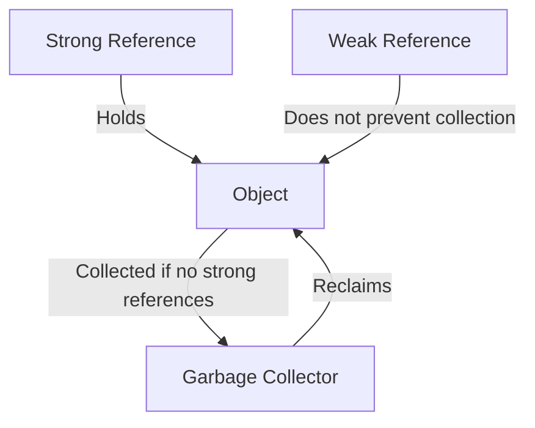

## 8.6 Weak Tables for Caching and Memoization

In the realm of Lua programming, efficient memory management is crucial for creating robust and performant applications. One of the powerful tools at our disposal is the use of weak tables, which allow us to manage memory more effectively by enabling the garbage collector to reclaim unused items. This section delves into the concept of weak tables, their implementation, and their application in caching and memoization.

### Memory Management with Weak References

Weak tables in Lua are a special kind of table that do not prevent their keys or values from being collected by the garbage collector. This feature is particularly useful for caching and memoization, where we want to store computed values for reuse without holding onto them unnecessarily.

#### Implementing Weak Tables

To create a weak table in Lua, we need to set the `__mode` field in the table's metatable. The `__mode` field can be set to `"k"`, `"v"`, or `"kv"`, indicating that the keys, values, or both are weak references, respectively.

- **Weak Keys (`"k"`)**: The keys in the table are weak references. If there are no other references to a key, it can be collected.
- **Weak Values (`"v"`)**: The values in the table are weak references. If there are no other references to a value, it can be collected.
- **Weak Keys and Values (`"kv"`)**: Both keys and values are weak references.

Here is a simple example of creating a weak table with weak values:

```lua
-- Create a table with weak values
local weakTable = setmetatable({}, { __mode = "v" })

-- Function to add an item to the weak table
local function addItem(key, value)
    weakTable[key] = value
end

-- Function to retrieve an item from the weak table
local function getItem(key)
    return weakTable[key]
end

-- Example usage
local obj = { name = "example" }
addItem("key1", obj)

-- The object can be collected if there are no other references
obj = nil
collectgarbage()

print(getItem("key1")) -- Output: nil (if the object was collected)
```

In this example, the value associated with `"key1"` is a weak reference. Once the object `obj` is no longer referenced elsewhere, it becomes eligible for garbage collection.

### Caching Data

Caching is a technique used to store the results of expensive computations so that they can be reused without recalculating. Weak tables are ideal for caching because they allow cached data to be automatically removed when it is no longer needed.

#### Memoization with Weak Tables

Memoization is a specific form of caching where the results of function calls are stored. If the function is called again with the same arguments, the cached result is returned instead of recalculating it.

Here's how we can implement memoization using weak tables:

```lua
-- Memoization function using weak tables
local function memoize(func)
    local cache = setmetatable({}, { __mode = "kv" })

    return function(...)
        local key = table.concat({...}, ",")
        if cache[key] then
            return cache[key]
        else
            local result = func(...)
            cache[key] = result
            return result
        end
    end
end

-- Example function to memoize
local function expensiveComputation(x, y)
    return x * y
end

-- Memoized version of the function
local memoizedComputation = memoize(expensiveComputation)

-- Usage
print(memoizedComputation(2, 3)) -- Output: 6
print(memoizedComputation(2, 3)) -- Output: 6 (cached result)
```

In this example, the `memoize` function creates a cache with weak keys and values. The results of `expensiveComputation` are stored in the cache, and subsequent calls with the same arguments return the cached result.

### Use Cases and Examples

Weak tables are versatile and can be used in various scenarios beyond caching and memoization. Let's explore some common use cases.

#### Managing Object Associations

In many applications, we need to associate additional data with objects without preventing the objects from being garbage collected. Weak tables allow us to create these associations without creating strong references.

```lua
-- Weak table for object associations
local associations = setmetatable({}, { __mode = "k" })

-- Function to associate data with an object
local function associateData(obj, data)
    associations[obj] = data
end

-- Function to retrieve associated data
local function getAssociatedData(obj)
    return associations[obj]
end

-- Example usage
local object = { id = 1 }
associateData(object, "some data")

-- The association is removed if the object is collected
object = nil
collectgarbage()

print(getAssociatedData(object)) -- Output: nil
```

In this example, we associate data with an object using a weak table. Once the object is no longer referenced, the association is automatically removed.

#### Implementing Observers

In the observer pattern, we often need to maintain a list of observers that should be notified of changes. Using weak tables, we can manage these observers without preventing them from being collected.

```lua
-- Weak table for observers
local observers = setmetatable({}, { __mode = "v" })

-- Function to add an observer
local function addObserver(observer)
    table.insert(observers, observer)
end

-- Function to notify observers
local function notifyObservers(message)
    for _, observer in ipairs(observers) do
        if observer then
            observer:notify(message)
        end
    end
end

-- Example observer
local observer = {
    notify = function(self, message)
        print("Received message:", message)
    end
}

-- Add and notify observer
addObserver(observer)
notifyObservers("Hello, Observer!")

-- Observer can be collected if not referenced elsewhere
observer = nil
collectgarbage()

notifyObservers("This will not be received")
```

In this example, we use a weak table to store observers. If an observer is no longer referenced elsewhere, it is collected, and we do not attempt to notify it.

### Visualizing Weak Tables

To better understand how weak tables work, let's visualize the process of garbage collection with weak references.



**Diagram Description**: This diagram illustrates the relationship between strong and weak references. A strong reference holds an object, preventing it from being collected. A weak reference does not prevent collection, allowing the garbage collector to reclaim the object if no strong references exist.

### Design Considerations

When using weak tables, there are several important considerations to keep in mind:

- **Garbage Collection**: Weak references allow objects to be collected, but the timing of collection is not deterministic. The garbage collector runs at its own discretion, so weak references may persist longer than expected.
- **Key and Value Weakness**: Choose the appropriate weakness (`"k"`, `"v"`, or `"kv"`) based on your use case. Weak keys are useful for object associations, while weak values are ideal for caching.
- **Performance**: While weak tables provide automatic memory management, they may introduce overhead. Consider the performance implications in performance-critical applications.
- **Debugging**: Debugging issues related to weak tables can be challenging due to the non-deterministic nature of garbage collection. Use logging and inspection tools to aid in debugging.

### Differences and Similarities

Weak tables are often compared to other caching mechanisms, such as strong reference caches and manual memory management. Here are some key differences and similarities:

- **Automatic vs. Manual Management**: Weak tables provide automatic memory management, while strong reference caches require manual cleanup.
- **Memory Efficiency**: Weak tables are more memory-efficient, as they allow unused items to be collected automatically.
- **Complexity**: Weak tables simplify code by reducing the need for manual memory management, but they introduce complexity in understanding garbage collection behavior.

### Try It Yourself

To deepen your understanding of weak tables, try modifying the examples provided. Experiment with different configurations of weak keys and values, and observe how the garbage collector behaves. Consider implementing a more complex caching mechanism using weak tables, and test its performance in a real-world application.

### References and Links

For further reading on weak tables and memory management in Lua, consider the following resources:

- [Lua 5.1 Reference Manual: Weak Tables](https://www.lua.org/manual/5.1/manual.html#2.10.2)
- [Programming in Lua: Weak Tables](https://www.lua.org/pil/17.html)
- [MDN Web Docs: WeakMap](https://developer.mozilla.org/en-US/docs/Web/JavaScript/Reference/Global_Objects/WeakMap) (JavaScript equivalent)

### Knowledge Check

Before moving on, take a moment to review the key concepts covered in this section. Consider the following questions:

- What is the purpose of weak tables in Lua?
- How do weak references affect garbage collection?
- In what scenarios are weak tables particularly useful?
- What are the trade-offs of using weak tables for caching?

### Embrace the Journey

Remember, mastering weak tables and memory management is just one step in your journey as a Lua developer. As you continue to explore the language, you'll discover new patterns and techniques that will enhance your ability to create efficient and maintainable applications. Keep experimenting, stay curious, and enjoy the journey!

## Quiz Time!



### What is the primary benefit of using weak tables in Lua?

- [x] They allow unused items to be collected by the garbage collector.
- [ ] They prevent memory leaks by holding strong references.
- [ ] They improve the performance of all Lua applications.
- [ ] They automatically optimize code execution.

> **Explanation:** Weak tables allow unused items to be collected by the garbage collector, which helps in managing memory efficiently.

### How do you create a weak table with weak values in Lua?

- [x] By setting the `__mode` field in the metatable to `"v"`.
- [ ] By setting the `__mode` field in the metatable to `"k"`.
- [ ] By using the `weakvalues` function.
- [ ] By setting the `__weak` field in the metatable to `"v"`.

> **Explanation:** To create a weak table with weak values, set the `__mode` field in the metatable to `"v"`.

### Which of the following is a use case for weak tables?

- [x] Memoization of function results.
- [ ] Storing configuration settings.
- [ ] Implementing a strong reference cache.
- [ ] Managing fixed-size data structures.

> **Explanation:** Weak tables are useful for memoization of function results, as they allow cached data to be collected when no longer needed.

### What happens to a weak reference when the object it references is collected?

- [x] The reference is removed from the table.
- [ ] The reference is converted to a strong reference.
- [ ] The reference remains in the table indefinitely.
- [ ] The reference is automatically reassigned to a new object.

> **Explanation:** When the object referenced by a weak reference is collected, the reference is removed from the table.

### In which scenario would you use weak keys in a weak table?

- [x] When associating data with objects that should be collected when no longer referenced.
- [ ] When caching computed values for reuse.
- [ ] When storing a list of configuration options.
- [ ] When implementing a fixed-size buffer.

> **Explanation:** Weak keys are used when associating data with objects that should be collected when no longer referenced.

### What is a potential drawback of using weak tables?

- [x] The timing of garbage collection is non-deterministic.
- [ ] They prevent all objects from being collected.
- [ ] They require manual memory management.
- [ ] They increase the complexity of strong reference management.

> **Explanation:** The timing of garbage collection is non-deterministic, which can make debugging and predicting behavior challenging.

### How can weak tables simplify code?

- [x] By reducing the need for manual memory management.
- [ ] By automatically optimizing code execution.
- [ ] By enforcing strict type checking.
- [ ] By providing built-in logging capabilities.

> **Explanation:** Weak tables simplify code by reducing the need for manual memory management, as they allow unused items to be collected automatically.

### What is the effect of setting `__mode` to `"kv"` in a weak table?

- [x] Both keys and values are weak references.
- [ ] Only keys are weak references.
- [ ] Only values are weak references.
- [ ] Neither keys nor values are weak references.

> **Explanation:** Setting `__mode` to `"kv"` makes both keys and values weak references.

### Which of the following is NOT a characteristic of weak tables?

- [x] They prevent garbage collection of all items.
- [ ] They allow automatic memory management.
- [ ] They can have weak keys, values, or both.
- [ ] They are useful for caching and memoization.

> **Explanation:** Weak tables do not prevent garbage collection; they allow it by holding weak references.

### True or False: Weak tables can help manage object associations without preventing garbage collection.

- [x] True
- [ ] False

> **Explanation:** True. Weak tables can manage object associations without preventing garbage collection, as they allow objects to be collected when no longer referenced.


