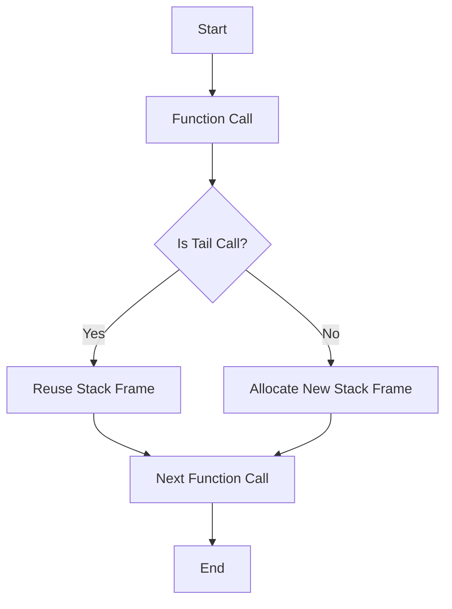

## 8.7 Tail Call Optimization

In the world of programming, recursion is a powerful tool that allows functions to call themselves to solve problems. However, recursion can lead to stack overflow if not managed properly. Lua, a lightweight and efficient scripting language, offers a solution to this problem through Tail Call Optimization (TCO). In this section, we will delve into the concept of TCO, its importance in Lua, and how to leverage it for efficient recursive calls.

### Understanding Tail Call Optimization

Tail Call Optimization is a technique used by compilers and interpreters to optimize recursive function calls. In a tail call, the function returns the result of another function call as its final action. This allows the interpreter to reuse the current function's stack frame for the next function call, effectively preventing stack growth.

#### What is a Tail Call?

A tail call occurs when a function calls another function as its last operation, and the result of this call is immediately returned. In Lua, this is known as a "proper tail call." Here's a simple example to illustrate a tail call:

```lua
function tailCallExample(x)
    return anotherFunction(x)
end
```

In this example, `tailCallExample` calls `anotherFunction` and returns its result directly. This is a tail call because there are no operations after the function call.

#### Why Use Tail Call Optimization?

Tail Call Optimization is crucial for writing efficient recursive functions. Without TCO, each recursive call would consume a new stack frame, leading to stack overflow for deep recursion. TCO allows recursive functions to execute in constant stack space, making them more efficient and less prone to errors.

### Leveraging Tail Calls in Lua

Lua's support for TCO makes it an excellent choice for implementing recursive algorithms. Let's explore how to use tail calls effectively in Lua.

#### Proper Tail Calls

To ensure a function is tail-call optimized, it must return the result of a function call directly. Here's an example of a tail-recursive function:

```lua
function factorial(n, acc)
    acc = acc or 1
    if n <= 1 then
        return acc
    else
        return factorial(n - 1, n * acc)
    end
end

print(factorial(5))  -- Output: 120
```

In this example, the `factorial` function is tail-recursive because it returns the result of the recursive call directly. The accumulator `acc` is used to store the intermediate result, allowing the function to execute in constant stack space.

#### Avoiding Stack Overflow

By using tail calls, we can avoid stack overflow in recursive functions. Consider the following non-tail-recursive function:

```lua
function nonTailRecursiveFactorial(n)
    if n <= 1 then
        return 1
    else
        return n * nonTailRecursiveFactorial(n - 1)
    end
end
```

This function is not tail-recursive because the multiplication operation occurs after the recursive call. As a result, each call consumes a new stack frame, leading to stack overflow for large values of `n`.

### Use Cases and Examples

Tail Call Optimization is particularly useful in scenarios where recursion is prevalent. Let's explore some common use cases and examples.

#### Recursive Algorithms

Recursive algorithms, such as tree traversal, can benefit significantly from TCO. Consider a binary tree traversal:

```lua
function traverseTree(node)
    if node == nil then return end
    print(node.value)
    traverseTree(node.left)
    traverseTree(node.right)
end
```

By ensuring the recursive calls are tail calls, we can traverse large trees without stack overflow.

#### State Machines

State machines can be implemented using tail-recursive functions. Each state is represented by a function, and transitions are made through tail calls:

```lua
function stateA()
    print("In State A")
    return stateB()
end

function stateB()
    print("In State B")
    return stateC()
end

function stateC()
    print("In State C")
    return stateA()
end

stateA()  -- Starts the state machine
```

In this example, the state machine transitions between states using tail calls, ensuring efficient execution.

#### Continuation-Passing Style

Continuation-passing style (CPS) is a programming style where control is passed explicitly through continuation functions. Tail calls are essential for implementing CPS efficiently:

```lua
function cpsExample(x, cont)
    if x <= 0 then
        return cont(x)
    else
        return cpsExample(x - 1, function(y) return cont(y + x) end)
    end
end

cpsExample(5, print)  -- Output: 15
```

In this example, the continuation function `cont` is passed along with the recursive call, allowing the computation to proceed without growing the stack.

### Visualizing Tail Call Optimization

To better understand how Tail Call Optimization works, let's visualize the process using a flowchart.



**Figure 1: Tail Call Optimization Process**

In this flowchart, we see that when a tail call is detected, the stack frame is reused, preventing stack growth. If it's not a tail call, a new stack frame is allocated.

### Try It Yourself

To solidify your understanding of Tail Call Optimization, try modifying the following code examples:

1. Convert the non-tail-recursive factorial function to a tail-recursive version.
2. Implement a tail-recursive version of the Fibonacci sequence.
3. Create a state machine with at least three states using tail calls.

### References and Further Reading

- [Lua 5.1 Reference Manual](https://www.lua.org/manual/5.1/)
- [MDN Web Docs: Recursion](https://developer.mozilla.org/en-US/docs/Glossary/Recursion)
- [Wikipedia: Tail Call](https://en.wikipedia.org/wiki/Tail_call)

### Knowledge Check

Before we conclude, let's summarize the key takeaways:

- Tail Call Optimization allows recursive functions to execute in constant stack space.
- Proper tail calls return the result of a function call directly.
- Tail Call Optimization is beneficial for recursive algorithms, state machines, and continuation-passing style programming.

Remember, mastering Tail Call Optimization in Lua will enhance your ability to write efficient and robust recursive functions. Keep experimenting, stay curious, and enjoy the journey!

## Quiz Time!



### What is a tail call in Lua?

- [x] A function call that is the last operation in a function.
- [ ] A function call that occurs at the beginning of a function.
- [ ] A function call that is nested within another function call.
- [ ] A function call that is used for error handling.

> **Explanation:** A tail call is a function call that is the last operation in a function, allowing for Tail Call Optimization.

### Why is Tail Call Optimization important?

- [x] It prevents stack overflow in recursive functions.
- [ ] It increases the speed of non-recursive functions.
- [ ] It reduces memory usage in all functions.
- [ ] It simplifies error handling in functions.

> **Explanation:** Tail Call Optimization prevents stack overflow by allowing recursive functions to execute in constant stack space.

### Which of the following is a proper tail call?

- [x] `return anotherFunction(x)`
- [ ] `print(anotherFunction(x))`
- [ ] `local result = anotherFunction(x)`
- [ ] `if x > 0 then return anotherFunction(x) end`

> **Explanation:** A proper tail call directly returns the result of another function call.

### What happens if a function is not tail-recursive?

- [ ] It executes faster.
- [x] It may lead to stack overflow.
- [ ] It uses less memory.
- [ ] It becomes easier to debug.

> **Explanation:** Non-tail-recursive functions can lead to stack overflow due to the accumulation of stack frames.

### How can you convert a non-tail-recursive function to a tail-recursive one?

- [x] By ensuring the recursive call is the last operation in the function.
- [ ] By adding more parameters to the function.
- [ ] By using global variables.
- [ ] By removing all return statements.

> **Explanation:** To convert a function to tail-recursive, ensure the recursive call is the last operation.

### What is a common use case for Tail Call Optimization?

- [x] Implementing recursive algorithms.
- [ ] Handling user input.
- [ ] Managing database connections.
- [ ] Formatting strings.

> **Explanation:** Tail Call Optimization is commonly used in recursive algorithms to prevent stack overflow.

### Which programming style benefits from Tail Call Optimization?

- [x] Continuation-passing style.
- [ ] Object-oriented programming.
- [ ] Event-driven programming.
- [ ] Procedural programming.

> **Explanation:** Continuation-passing style benefits from Tail Call Optimization as it involves passing control through continuation functions.

### What is the main advantage of using tail calls in state machines?

- [x] Efficient execution without stack growth.
- [ ] Simplified state transitions.
- [ ] Easier debugging.
- [ ] Reduced memory usage.

> **Explanation:** Tail calls allow state machines to execute efficiently without stack growth.

### True or False: Tail Call Optimization is only applicable to recursive functions.

- [ ] True
- [x] False

> **Explanation:** While Tail Call Optimization is most beneficial for recursive functions, it can be applied to any function where the last operation is a function call.

### Which Lua feature is essential for implementing Tail Call Optimization?

- [x] Proper tail calls.
- [ ] Metatables.
- [ ] Coroutines.
- [ ] Modules.

> **Explanation:** Proper tail calls are essential for implementing Tail Call Optimization in Lua.


