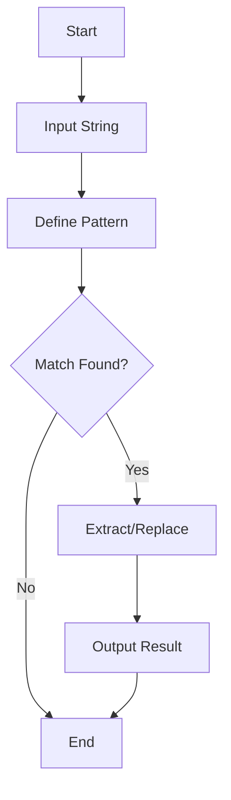

## 8.9 String Manipulation Patterns

String manipulation is a fundamental aspect of programming, and Lua provides a powerful set of tools for handling strings efficiently. In this section, we will delve into various string manipulation patterns in Lua, focusing on pattern matching, string formatting, and escaping patterns. We will explore common techniques, use cases, and provide practical examples to help you master string manipulation in Lua.

### Working with Strings Effectively

Lua's string library offers a wide range of functions for string manipulation, making it a versatile tool for text processing. Let's explore some of the key techniques and patterns for working with strings in Lua.

#### Pattern Matching

Pattern matching is a powerful feature in Lua that allows you to search, replace, and extract information from strings using patterns. Lua patterns are similar to regular expressions but have a simpler syntax. They are used in functions like `string.find`, `string.match`, `string.gmatch`, and `string.gsub`.

**Basic Pattern Matching**

Lua patterns use special characters to define patterns. Here are some common pattern elements:

- `.`: Matches any character except a newline.
- `%a`: Matches any letter.
- `%d`: Matches any digit.
- `%s`: Matches any space character.
- `*`: Matches zero or more occurrences of the previous character.
- `+`: Matches one or more occurrences of the previous character.
- `-`: Matches zero or more occurrences of the previous character, but as few as possible.
- `^`: Matches the beginning of a string.
- `$`: Matches the end of a string.

**Example: Finding a Word in a String**

```lua
local text = "Hello, Lua world!"
local pattern = "Lua"
local start_pos, end_pos = string.find(text, pattern)

if start_pos then
    print("Found '" .. pattern .. "' at position " .. start_pos)
else
    print("'" .. pattern .. "' not found.")
end
```

**Advanced Pattern Matching**

Lua patterns can be combined to create more complex patterns. For example, you can use character classes and captures to extract specific parts of a string.

**Example: Extracting Numbers from a String**

```lua
local text = "The price is 100 dollars."
local pattern = "(%d+)"
local number = string.match(text, pattern)

if number then
    print("Extracted number: " .. number)
else
    print("No number found.")
end
```

**Pattern Matching with `string.gsub`**

The `string.gsub` function is used for replacing occurrences of a pattern in a string. It takes a pattern and a replacement string or function.

**Example: Replacing Words in a String**

```lua
local text = "Hello, Lua world!"
local new_text = string.gsub(text, "Lua", "Programming")

print(new_text)  -- Output: Hello, Programming world!
```

#### String Formatting

String formatting is essential for creating formatted output. Lua provides the `string.format` function, which is similar to the `printf` function in C. It allows you to create strings with embedded variables and control their formatting.

**Example: Formatting Numbers**

```lua
local name = "Lua"
local version = 5.4
local formatted_string = string.format("Welcome to %s version %.1f!", name, version)

print(formatted_string)  -- Output: Welcome to Lua version 5.4!
```

**Formatting Options**

- `%d`: Formats an integer.
- `%f`: Formats a floating-point number.
- `%s`: Formats a string.
- `%x`: Formats an integer as a hexadecimal number.
- `%o`: Formats an integer as an octal number.

**Example: Formatting with Width and Precision**

```lua
local number = 123.456
local formatted_number = string.format("%10.2f", number)

print(formatted_number)  -- Output: "    123.46"
```

#### Escaping Patterns

When working with patterns, it's important to handle special characters correctly. Lua provides a way to escape special characters using the `%` character.

**Example: Escaping Special Characters**

```lua
local text = "Hello, (Lua) world!"
local pattern = "%(Lua%)"
local found = string.match(text, pattern)

if found then
    print("Found pattern: " .. found)
else
    print("Pattern not found.")
end
```

### Use Cases and Examples

String manipulation patterns in Lua can be applied to various use cases, including parsing text files, data validation, and building domain-specific languages.

#### Parsing Text Files

Parsing text files is a common task in many applications. Lua's string manipulation capabilities make it easy to read and process text files.

**Example: Reading and Parsing a CSV File**

```lua
local function parse_csv_line(line)
    local fields = {}
    for field in string.gmatch(line, '([^,]+)') do
        table.insert(fields, field)
    end
    return fields
end

local file = io.open("data.csv", "r")
for line in file:lines() do
    local fields = parse_csv_line(line)
    print(table.concat(fields, " | "))
end
file:close()
```

#### Data Validation

Data validation is crucial for ensuring the integrity of input data. Lua patterns can be used to validate strings against specific criteria.

**Example: Validating an Email Address**

```lua
local function is_valid_email(email)
    local pattern = "^[%w._%+-]+@[%w.-]+%.[a-zA-Z]{2,}$"
    return string.match(email, pattern) ~= nil
end

local email = "example@example.com"
if is_valid_email(email) then
    print("Valid email address.")
else
    print("Invalid email address.")
end
```

#### Building Domain-Specific Languages

Domain-specific languages (DSLs) are specialized languages tailored to specific tasks. Lua's string manipulation capabilities can be used to build simple DSLs.

**Example: A Simple Arithmetic DSL**

```lua
local function evaluate_expression(expression)
    local pattern = "(%d+)%s*([%+%-%*/])%s*(%d+)"
    local a, operator, b = string.match(expression, pattern)
    a, b = tonumber(a), tonumber(b)

    if operator == "+" then
        return a + b
    elseif operator == "-" then
        return a - b
    elseif operator == "*" then
        return a * b
    elseif operator == "/" then
        return a / b
    else
        error("Invalid operator")
    end
end

local expression = "10 + 20"
local result = evaluate_expression(expression)
print("Result: " .. result)  -- Output: Result: 30
```

### Try It Yourself

Experiment with the code examples provided in this section. Try modifying the patterns, input strings, and explore different use cases. Here are some suggestions:

- Modify the CSV parser to handle quoted fields.
- Extend the email validator to check for specific domains.
- Enhance the arithmetic DSL to support parentheses and operator precedence.

### Visualizing String Manipulation

To better understand how string manipulation works in Lua, let's visualize the process of pattern matching and replacement using a flowchart.



**Diagram Description:** This flowchart illustrates the process of string manipulation using pattern matching in Lua. It starts with an input string, defines a pattern, checks for a match, and either extracts/replaces the match or ends the process.

### References and Links

For further reading on Lua string manipulation and patterns, consider the following resources:

- [Lua 5.4 Reference Manual - String Library](https://www.lua.org/manual/5.4/manual.html#6.4)
- [Programming in Lua - String Manipulation](https://www.lua.org/pil/20.html)
- [MDN Web Docs - Regular Expressions](https://developer.mozilla.org/en-US/docs/Web/JavaScript/Guide/Regular_Expressions)

### Knowledge Check

To reinforce your understanding of string manipulation patterns in Lua, consider the following questions and exercises:

1. What are the differences between Lua patterns and regular expressions?
2. How would you modify a pattern to match a specific word at the beginning of a string?
3. Write a Lua function to count the number of words in a string.
4. Create a pattern to validate a phone number format.
5. Implement a simple template engine using Lua string patterns.

### Embrace the Journey

String manipulation is a powerful tool in any programmer's toolkit. As you continue to explore Lua's string manipulation capabilities, remember to experiment, stay curious, and enjoy the journey. The skills you develop here will be invaluable in a wide range of applications, from data processing to building complex software systems.

## Quiz Time!



### Which function is used in Lua for pattern matching?

- [x] string.match
- [ ] string.concat
- [ ] string.len
- [ ] string.sub

> **Explanation:** `string.match` is used for pattern matching in Lua, allowing you to search and extract information from strings.

### What does the `%d` pattern match in Lua?

- [x] Any digit
- [ ] Any letter
- [ ] Any space character
- [ ] Any non-digit character

> **Explanation:** `%d` matches any digit in Lua patterns.

### How do you escape special characters in Lua patterns?

- [x] Using the `%` character
- [ ] Using the `\` character
- [ ] Using the `@` character
- [ ] Using the `#` character

> **Explanation:** In Lua patterns, the `%` character is used to escape special characters.

### What is the output of `string.format("%10.2f", 123.456)`?

- [x] "    123.46"
- [ ] "123.456"
- [ ] "123.46"
- [ ] "123.4560"

> **Explanation:** The format `"%10.2f"` specifies a floating-point number with a width of 10 and 2 decimal places, resulting in "    123.46".

### Which function is used to replace occurrences of a pattern in a string?

- [x] string.gsub
- [ ] string.find
- [ ] string.len
- [ ] string.reverse

> **Explanation:** `string.gsub` is used to replace occurrences of a pattern in a string.

### What does the `+` pattern modifier do in Lua?

- [x] Matches one or more occurrences of the previous character
- [ ] Matches zero or more occurrences of the previous character
- [ ] Matches exactly one occurrence of the previous character
- [ ] Matches zero or one occurrence of the previous character

> **Explanation:** The `+` modifier matches one or more occurrences of the previous character in Lua patterns.

### How can you validate an email address using Lua patterns?

- [x] By defining a pattern that matches the email format
- [ ] By checking the length of the email string
- [ ] By converting the email to uppercase
- [ ] By reversing the email string

> **Explanation:** You can validate an email address by defining a pattern that matches the typical email format.

### What is the purpose of `string.gmatch` in Lua?

- [x] To iterate over all occurrences of a pattern in a string
- [ ] To concatenate strings
- [ ] To calculate the length of a string
- [ ] To reverse a string

> **Explanation:** `string.gmatch` is used to iterate over all occurrences of a pattern in a string.

### True or False: Lua patterns are identical to regular expressions.

- [ ] True
- [x] False

> **Explanation:** Lua patterns are similar to regular expressions but have a simpler syntax and are not identical.

### Which of the following is a valid Lua pattern for matching a word boundary?

- [x] `%f[%a]`
- [ ] `%b[]`
- [ ] `%w+`
- [ ] `%s*`

> **Explanation:** `%f[%a]` is a valid Lua pattern for matching a word boundary.


