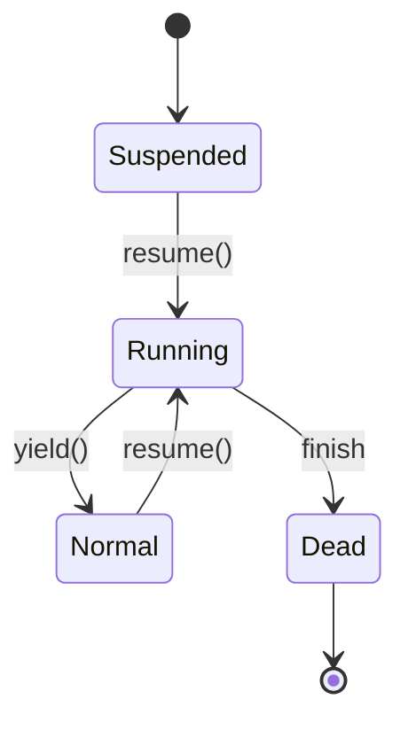
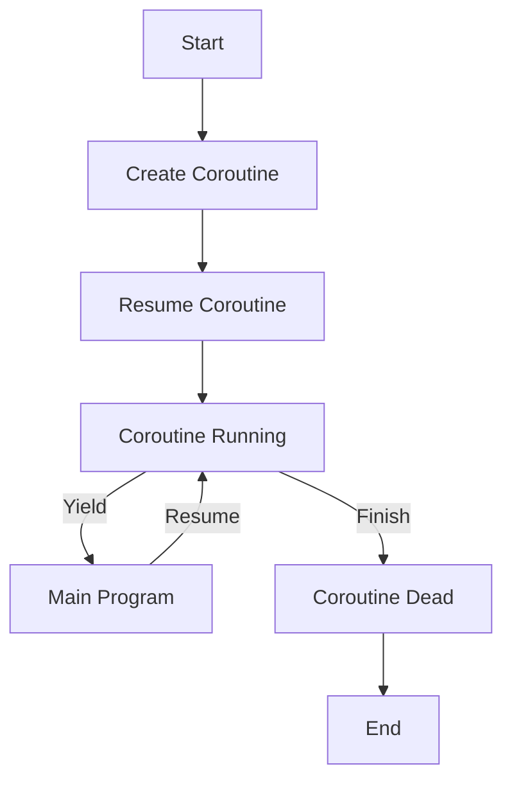

## 9.1 Understanding Coroutines

Coroutines in Lua provide a powerful mechanism for handling concurrency and asynchronous programming. Unlike traditional threads, coroutines offer a lightweight alternative that allows for cooperative multitasking. In this section, we will delve into the key concepts of coroutines, explore their lifecycle, and demonstrate their practical use cases with examples.

### Lightweight Alternative to Threads

Coroutines are a fundamental feature of Lua, enabling developers to write non-blocking code without the overhead of threads. They allow functions to be paused and resumed, making them ideal for tasks that require waiting, such as I/O operations or complex computations. Let's explore the core concepts of coroutines and how they can be leveraged in Lua.

### Key Concepts

#### Creating and Managing Coroutines

To create a coroutine in Lua, use the `coroutine.create()` function, which takes a function as an argument and returns a coroutine object. This object can then be managed using `coroutine.resume()` to start or continue execution and `coroutine.yield()` to pause execution.

```lua
-- Define a simple coroutine function
function myCoroutine()
    print("Coroutine started")
    coroutine.yield()  -- Pause execution
    print("Coroutine resumed")
end

-- Create a coroutine
local co = coroutine.create(myCoroutine)

-- Resume the coroutine
coroutine.resume(co)  -- Output: Coroutine started
coroutine.resume(co)  -- Output: Coroutine resumed
```

In the example above, `coroutine.create()` initializes the coroutine, and `coroutine.resume()` starts its execution. The `coroutine.yield()` function pauses the coroutine, allowing other code to run before resuming.

#### Lifecycle of a Coroutine

Coroutines have a well-defined lifecycle with several states: **suspended**, **running**, **normal**, and **dead**. Understanding these states is crucial for effectively managing coroutines.

- **Suspended**: The initial state after creation. The coroutine is ready to run but hasn't started yet.
- **Running**: The state when the coroutine is actively executing.
- **Normal**: A temporary state when the coroutine is yielding control back to the caller.
- **Dead**: The state after the coroutine has finished execution.



In this diagram, we visualize the state transitions of a coroutine. The coroutine starts in the **Suspended** state, transitions to **Running** when resumed, and can yield back to **Normal**. Once execution is complete, it enters the **Dead** state.

### Use Cases and Examples

Coroutines are versatile and can be used in various scenarios to simplify complex asynchronous code and implement generators or lazy iterators.

#### Simplifying Complex Asynchronous Code

Coroutines can be used to manage asynchronous operations, such as network requests or file I/O, without blocking the main program flow. By yielding control during waiting periods, coroutines allow other tasks to execute, improving efficiency.

```lua
-- Simulate an asynchronous task
function asyncTask()
    print("Task started")
    coroutine.yield()  -- Simulate waiting
    print("Task completed")
end

-- Create and manage the coroutine
local task = coroutine.create(asyncTask)
coroutine.resume(task)  -- Output: Task started
-- Perform other operations here
coroutine.resume(task)  -- Output: Task completed
```

In this example, the coroutine simulates an asynchronous task by yielding control. This allows other operations to run while waiting for the task to complete.

#### Implementing Generators and Lazy Iterators

Coroutines are ideal for creating generators and lazy iterators, which produce values on demand. This approach is memory-efficient and suitable for handling large datasets or streams.

```lua
-- Define a generator using coroutines
function rangeGenerator(start, stop)
    return coroutine.wrap(function()
        for i = start, stop do
            coroutine.yield(i)
        end
    end)
end

-- Use the generator
for number in rangeGenerator(1, 5) do
    print(number)  -- Output: 1 2 3 4 5
end
```

The `rangeGenerator` function uses a coroutine to yield numbers in a specified range. The `coroutine.wrap()` function simplifies the creation and management of the coroutine, allowing it to be used in a `for` loop.

### Visualizing Coroutine Execution

To better understand how coroutines execute, let's visualize the process using a flowchart. This diagram illustrates the flow of control between the main program and a coroutine.



In this flowchart, we see the interaction between the main program and a coroutine. The coroutine is created, resumed, and can yield control back to the main program. Once execution is complete, the coroutine transitions to the dead state.

### Try It Yourself

To deepen your understanding of coroutines, try modifying the examples provided. Experiment with different yield points, create more complex generators, or simulate real-world asynchronous tasks. This hands-on approach will help solidify your grasp of coroutine concepts.

### References and Links

For further reading on coroutines and their applications, consider exploring the following resources:

- [Lua 5.4 Reference Manual - Coroutines](https://www.lua.org/manual/5.4/manual.html#2.6)
- [Programming in Lua - Coroutines](https://www.lua.org/pil/9.html)
- [MDN Web Docs - Asynchronous Programming](https://developer.mozilla.org/en-US/docs/Learn/JavaScript/Asynchronous)

### Knowledge Check

To reinforce your understanding of coroutines, consider the following questions:

1. What are the key states in the lifecycle of a coroutine?
2. How do coroutines differ from traditional threads?
3. What are some practical use cases for coroutines in Lua?

### Embrace the Journey

As you explore the world of coroutines, remember that this is just the beginning. Coroutines offer a powerful tool for managing concurrency and asynchronous programming in Lua. Keep experimenting, stay curious, and enjoy the journey!

## Quiz Time!



### What is the initial state of a coroutine after creation?

- [x] Suspended
- [ ] Running
- [ ] Normal
- [ ] Dead

> **Explanation:** A coroutine is in the suspended state immediately after creation, ready to be resumed.

### Which function is used to pause a coroutine's execution?

- [ ] coroutine.resume()
- [x] coroutine.yield()
- [ ] coroutine.create()
- [ ] coroutine.wrap()

> **Explanation:** The `coroutine.yield()` function is used to pause a coroutine's execution.

### What is the primary advantage of using coroutines over traditional threads?

- [x] Lightweight and efficient
- [ ] More complex to manage
- [ ] Require more memory
- [ ] Only work with I/O operations

> **Explanation:** Coroutines are lightweight and efficient, providing a simpler alternative to threads for cooperative multitasking.

### How can coroutines be used in Lua?

- [x] To manage asynchronous operations
- [x] To implement generators
- [ ] To replace all functions
- [ ] To handle exceptions

> **Explanation:** Coroutines can manage asynchronous operations and implement generators, but they do not replace all functions or handle exceptions.

### Which function simplifies the creation and management of coroutines for use in loops?

- [ ] coroutine.create()
- [ ] coroutine.resume()
- [x] coroutine.wrap()
- [ ] coroutine.yield()

> **Explanation:** The `coroutine.wrap()` function simplifies the creation and management of coroutines for use in loops.

### What happens when a coroutine finishes execution?

- [ ] It returns to the suspended state
- [ ] It remains in the running state
- [x] It transitions to the dead state
- [ ] It automatically restarts

> **Explanation:** When a coroutine finishes execution, it transitions to the dead state.

### What is a practical use case for coroutines in Lua?

- [x] Simplifying asynchronous code
- [x] Implementing lazy iterators
- [ ] Handling exceptions
- [ ] Replacing all functions

> **Explanation:** Coroutines are used to simplify asynchronous code and implement lazy iterators, but they do not handle exceptions or replace all functions.

### What is the purpose of the `coroutine.wrap()` function?

- [ ] To create a new coroutine
- [ ] To pause a coroutine
- [x] To simplify coroutine management
- [ ] To terminate a coroutine

> **Explanation:** The `coroutine.wrap()` function simplifies coroutine management by creating a function that resumes the coroutine.

### True or False: Coroutines in Lua can be used for preemptive multitasking.

- [ ] True
- [x] False

> **Explanation:** Coroutines in Lua are used for cooperative multitasking, not preemptive multitasking.

### Which of the following is NOT a state in the lifecycle of a coroutine?

- [ ] Suspended
- [ ] Running
- [ ] Dead
- [x] Waiting

> **Explanation:** "Waiting" is not a state in the lifecycle of a coroutine; the correct states are suspended, running, normal, and dead.


