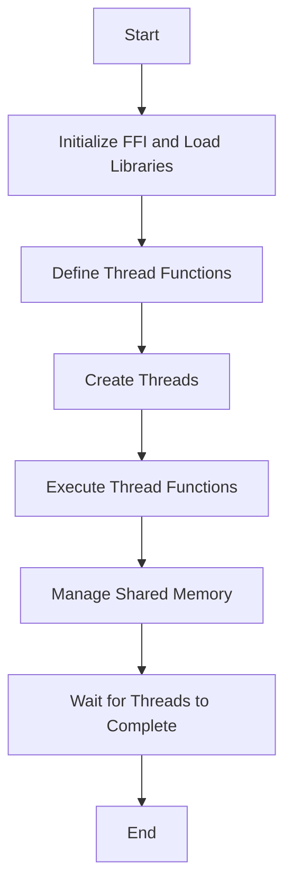

## 9.10 Patterns for Parallelism with LuaJIT and FFI

In the realm of software development, parallelism is a powerful tool that allows us to perform multiple operations simultaneously, thereby enhancing the performance and efficiency of applications. Lua, a lightweight scripting language, can achieve parallelism through LuaJIT and its Foreign Function Interface (FFI). This section will delve into how we can harness the power of LuaJIT and FFI to implement parallelism in Lua applications.

### Understanding LuaJIT and FFI

**LuaJIT** is a Just-In-Time Compiler for Lua, known for its speed and efficiency. It extends Lua's capabilities by providing a Foreign Function Interface (FFI), which allows Lua scripts to call C functions and use C data structures directly. This is particularly useful for performance-critical applications where Lua's native capabilities might fall short.

**FFI** is a mechanism that enables Lua scripts to interface with C libraries. It allows Lua to leverage the performance of C for computationally intensive tasks, making it possible to implement parallelism by calling C libraries that support threading.

### Implementing Parallelism with FFI

#### Using FFI for Threading

To implement parallelism in Lua using FFI, we need to interface with C libraries that provide threading capabilities. The `pthread` library is a common choice for this purpose. Let's explore how we can use FFI to create and manage threads in Lua.

```lua
local ffi = require("ffi")

-- Define the pthread library functions we need
ffi.cdef[[
typedef struct __pthread_t *pthread_t;
typedef struct __pthread_attr_t *pthread_attr_t;

int pthread_create(pthread_t *thread, const pthread_attr_t *attr, void *(*start_routine)(void*), void *arg);
int pthread_join(pthread_t thread, void **retval);
]]

-- Load the pthread library
local pthread = ffi.load("pthread")

-- Define a function to be executed by the thread
local function thread_function(arg)
    print("Thread started with argument:", ffi.string(arg))
    return nil
end

-- Create a thread
local thread = ffi.new("pthread_t[1]")
local arg = ffi.new("char[?]", #("Hello, World!") + 1, "Hello, World!")

local result = pthread.pthread_create(thread, nil, ffi.cast("void *(*)(void *)", thread_function), arg)
if result ~= 0 then
    error("Failed to create thread")
end

-- Wait for the thread to finish
pthread.pthread_join(thread[0], nil)
```

In this example, we use FFI to define the necessary `pthread` functions and create a thread that executes a simple function. The `pthread_create` function is used to start a new thread, and `pthread_join` waits for the thread to complete.

#### Managing Shared Memory

When implementing parallelism, managing shared memory between threads is crucial to ensure data consistency and avoid race conditions. FFI allows us to define and manipulate shared memory structures directly in Lua.

```lua
ffi.cdef[[
typedef struct {
    int counter;
    pthread_mutex_t mutex;
} shared_data_t;

int pthread_mutex_init(pthread_mutex_t *mutex, const pthread_mutexattr_t *attr);
int pthread_mutex_lock(pthread_mutex_t *mutex);
int pthread_mutex_unlock(pthread_mutex_t *mutex);
]]

-- Initialize shared data
local shared_data = ffi.new("shared_data_t")
shared_data.counter = 0
pthread.pthread_mutex_init(shared_data.mutex, nil)

-- Function to increment the counter
local function increment_counter()
    pthread.pthread_mutex_lock(shared_data.mutex)
    shared_data.counter = shared_data.counter + 1
    pthread.pthread_mutex_unlock(shared_data.mutex)
end

-- Create multiple threads to increment the counter
local threads = {}
for i = 1, 10 do
    threads[i] = ffi.new("pthread_t[1]")
    pthread.pthread_create(threads[i], nil, ffi.cast("void *(*)(void *)", increment_counter), nil)
end

-- Wait for all threads to finish
for i = 1, 10 do
    pthread.pthread_join(threads[i][0], nil)
end

print("Final counter value:", shared_data.counter)
```

In this example, we define a shared data structure with a counter and a mutex for synchronization. Each thread increments the counter while ensuring mutual exclusion using the mutex.

### Use Cases and Examples

#### Computationally Intensive Tasks

Parallelism is particularly beneficial for computationally intensive tasks, such as numerical simulations or data processing. By distributing the workload across multiple threads, we can significantly reduce execution time.

```lua
local function heavy_computation(arg)
    local result = 0
    for i = 1, 1000000 do
        result = result + math.sqrt(i)
    end
    print("Computation result:", result)
end

-- Create threads for heavy computation
local computation_threads = {}
for i = 1, 4 do
    computation_threads[i] = ffi.new("pthread_t[1]")
    pthread.pthread_create(computation_threads[i], nil, ffi.cast("void *(*)(void *)", heavy_computation), nil)
end

-- Wait for all computation threads to finish
for i = 1, 4 do
    pthread.pthread_join(computation_threads[i][0], nil)
end
```

In this example, we distribute a heavy computation task across four threads, allowing them to execute concurrently and complete the task faster.

#### Real-Time Data Analysis

In real-time data analysis, parallelism can be used to process incoming data streams concurrently, ensuring timely analysis and response.

```lua
local function analyze_data(data)
    -- Simulate data analysis
    print("Analyzing data:", ffi.string(data))
end

-- Simulate incoming data streams
local data_streams = {"Data1", "Data2", "Data3", "Data4"}

-- Create threads to analyze data streams
local analysis_threads = {}
for i, data in ipairs(data_streams) do
    analysis_threads[i] = ffi.new("pthread_t[1]")
    local data_arg = ffi.new("char[?]", #data + 1, data)
    pthread.pthread_create(analysis_threads[i], nil, ffi.cast("void *(*)(void *)", analyze_data), data_arg)
end

-- Wait for all analysis threads to finish
for i = 1, #data_streams do
    pthread.pthread_join(analysis_threads[i][0], nil)
end
```

Here, we simulate real-time data analysis by creating threads to process each data stream concurrently.

### Visualizing Parallelism with LuaJIT and FFI

To better understand how parallelism works with LuaJIT and FFI, let's visualize the process using a flowchart.



**Figure 1:** This flowchart illustrates the process of implementing parallelism with LuaJIT and FFI, from initializing FFI to managing shared memory and waiting for threads to complete.

### Design Considerations

When implementing parallelism with LuaJIT and FFI, consider the following:

- **Thread Safety**: Ensure that shared resources are accessed in a thread-safe manner using synchronization mechanisms like mutexes.
- **Performance**: While parallelism can improve performance, it also introduces overhead. Balance the number of threads with the available hardware resources.
- **Error Handling**: Implement robust error handling to manage thread creation and execution failures.

### Differences and Similarities

Parallelism with LuaJIT and FFI shares similarities with other parallel programming models, such as those in C or C++. However, the integration with Lua provides a higher-level scripting environment, making it easier to prototype and develop applications.

### Try It Yourself

Experiment with the code examples provided in this section. Try modifying the number of threads or the complexity of the tasks to observe how it affects performance. Consider implementing a real-world use case, such as parallel image processing or network packet analysis.

### References and Links

- [LuaJIT Official Website](http://luajit.org/)
- [FFI Documentation](http://luajit.org/ext_ffi.html)
- [Pthreads Tutorial](https://computing.llnl.gov/tutorials/pthreads/)

### Knowledge Check

- What is LuaJIT, and how does it enhance Lua's capabilities?
- How does FFI enable parallelism in Lua applications?
- What are the key considerations when managing shared memory between threads?

### Embrace the Journey

Remember, mastering parallelism with LuaJIT and FFI is a journey. As you explore and experiment with these concepts, you'll gain a deeper understanding of how to harness the full potential of Lua for high-performance applications. Keep experimenting, stay curious, and enjoy the journey!

## Quiz Time!



### What is LuaJIT?

- [x] A Just-In-Time Compiler for Lua
- [ ] A Lua interpreter
- [ ] A Lua debugger
- [ ] A Lua IDE

> **Explanation:** LuaJIT is a Just-In-Time Compiler for Lua, known for its speed and efficiency.

### What does FFI stand for in the context of LuaJIT?

- [x] Foreign Function Interface
- [ ] Fast Function Invocation
- [ ] Function Framework Integration
- [ ] Flexible Function Interface

> **Explanation:** FFI stands for Foreign Function Interface, allowing Lua scripts to call C functions and use C data structures.

### Which library is commonly used for threading in Lua with FFI?

- [x] pthread
- [ ] stdlib
- [ ] mathlib
- [ ] iolib

> **Explanation:** The pthread library is commonly used for threading in Lua with FFI.

### What is the purpose of `pthread_mutex_lock` in the code examples?

- [x] To ensure mutual exclusion when accessing shared resources
- [ ] To create a new thread
- [ ] To terminate a thread
- [ ] To initialize a thread

> **Explanation:** `pthread_mutex_lock` is used to ensure mutual exclusion when accessing shared resources.

### What is a key benefit of using parallelism for computationally intensive tasks?

- [x] Reduced execution time
- [ ] Increased memory usage
- [ ] Simplified code structure
- [ ] Easier debugging

> **Explanation:** Parallelism reduces execution time by distributing the workload across multiple threads.

### What is the role of `pthread_join` in thread management?

- [x] To wait for a thread to complete
- [ ] To create a new thread
- [ ] To lock a mutex
- [ ] To unlock a mutex

> **Explanation:** `pthread_join` is used to wait for a thread to complete its execution.

### What should be considered when managing shared memory between threads?

- [x] Thread safety and synchronization
- [ ] Code readability
- [ ] Function naming conventions
- [ ] Variable scope

> **Explanation:** Thread safety and synchronization are crucial when managing shared memory between threads.

### How can parallelism benefit real-time data analysis?

- [x] By processing data streams concurrently
- [ ] By reducing memory usage
- [ ] By simplifying code logic
- [ ] By increasing code complexity

> **Explanation:** Parallelism allows data streams to be processed concurrently, ensuring timely analysis and response.

### What is a potential drawback of using too many threads?

- [x] Increased overhead and resource contention
- [ ] Simplified error handling
- [ ] Improved code readability
- [ ] Enhanced debugging capabilities

> **Explanation:** Using too many threads can lead to increased overhead and resource contention.

### True or False: LuaJIT's FFI allows Lua scripts to call C functions directly.

- [x] True
- [ ] False

> **Explanation:** True. LuaJIT's FFI allows Lua scripts to call C functions directly, leveraging C's performance.


