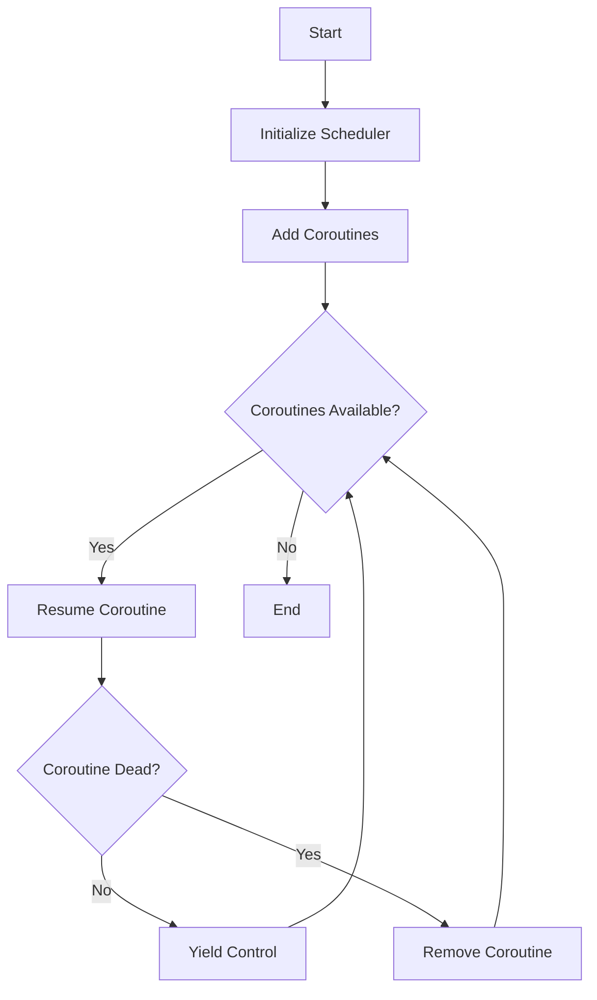

## 9.2 Cooperative Multitasking with Coroutines

In the realm of concurrent programming, cooperative multitasking plays a pivotal role in managing multiple tasks within a single thread. Lua, with its lightweight coroutines, offers a powerful mechanism for implementing cooperative multitasking. This section delves into the intricacies of cooperative multitasking using coroutines in Lua, exploring how they can be used to share execution time, manage execution order, and simulate concurrent operations effectively.

### Understanding Cooperative Multitasking

Cooperative multitasking is a concurrency model where tasks voluntarily yield control to allow other tasks to execute. Unlike preemptive multitasking, where the operating system decides when to switch tasks, cooperative multitasking relies on tasks to determine their yield points. This approach can lead to more predictable and efficient execution, especially in environments where tasks are well-behaved and can determine appropriate yield points.

### Coroutines in Lua

Coroutines in Lua are a fundamental construct that enables cooperative multitasking. They are similar to threads but are more lightweight and do not require operating system-level scheduling. Coroutines allow you to pause and resume execution at specific points, making them ideal for implementing cooperative multitasking.

#### Key Features of Coroutines

- **Lightweight**: Coroutines are not bound to operating system threads, making them resource-efficient.
- **Explicit Control**: Coroutines yield control explicitly, allowing for precise management of execution flow.
- **State Preservation**: Coroutines maintain their state between yields, enabling complex stateful computations.

### Implementing Cooperative Multitasking

To implement cooperative multitasking with coroutines in Lua, we need to focus on two main aspects: yield points and scheduler implementation.

#### Yield Points

Yield points are specific locations in the code where a coroutine can pause its execution and yield control. Determining appropriate yield points is crucial for efficient multitasking. Common yield points include:

- **I/O Operations**: Yielding during input/output operations allows other tasks to execute while waiting for data.
- **Long Computations**: Breaking long computations into smaller chunks and yielding between them prevents blocking.
- **Periodic Tasks**: Yielding at regular intervals ensures that periodic tasks run smoothly.

#### Scheduler Implementation

A scheduler manages the execution order of coroutines, ensuring that each coroutine gets a fair share of execution time. Implementing a simple round-robin scheduler in Lua involves maintaining a list of coroutines and iterating over them, yielding control as needed.

```lua
-- Simple round-robin scheduler
local coroutines = {}

function addCoroutine(co)
    table.insert(coroutines, coroutine.create(co))
end

function runScheduler()
    while #coroutines > 0 do
        for i, co in ipairs(coroutines) do
            if coroutine.status(co) == "dead" then
                table.remove(coroutines, i)
            else
                coroutine.resume(co)
            end
        end
    end
end

-- Example coroutine functions
function task1()
    for i = 1, 5 do
        print("Task 1 - Step " .. i)
        coroutine.yield()
    end
end

function task2()
    for i = 1, 3 do
        print("Task 2 - Step " .. i)
        coroutine.yield()
    end
end

-- Adding tasks to the scheduler
addCoroutine(task1)
addCoroutine(task2)

-- Running the scheduler
runScheduler()
```

In this example, `task1` and `task2` are two coroutines added to the scheduler. The scheduler iterates over the coroutines, resuming each one in turn. When a coroutine yields, the scheduler moves to the next coroutine, creating a cooperative multitasking environment.

### Use Cases and Examples

Cooperative multitasking with coroutines is particularly useful in scenarios where tasks need to share execution time without preemptive scheduling. Let's explore some practical use cases.

#### Game Loops with Multiple Actors

In game development, managing multiple actors or entities is a common requirement. Each actor may have its own logic and behavior, and coroutines can be used to simulate concurrent execution.

```lua
-- Actor coroutine example
function actor(name, steps)
    for i = 1, steps do
        print(name .. " is acting at step " .. i)
        coroutine.yield()
    end
end

-- Adding actors to the scheduler
addCoroutine(function() actor("Actor 1", 4) end)
addCoroutine(function() actor("Actor 2", 6) end)

-- Running the scheduler
runScheduler()
```

In this example, two actors are added to the scheduler, each with a different number of steps. The scheduler ensures that both actors get a chance to execute their logic, simulating concurrent behavior.

#### Simulating Concurrent Operations

Coroutines can also be used to simulate concurrent operations, such as downloading files or processing data streams. By yielding during I/O operations, coroutines allow other tasks to execute while waiting for data.

```lua
-- Simulating file download
function downloadFile(file)
    for i = 1, 5 do
        print("Downloading " .. file .. " - " .. (i * 20) .. "% complete")
        coroutine.yield()
    end
end

-- Adding download tasks to the scheduler
addCoroutine(function() downloadFile("file1.txt") end)
addCoroutine(function() downloadFile("file2.txt") end)

-- Running the scheduler
runScheduler()
```

In this example, two file download tasks are simulated using coroutines. The scheduler manages the execution of these tasks, allowing them to run concurrently without blocking each other.

### Visualizing Coroutine Execution

To better understand how coroutines manage execution flow, let's visualize the process using a flowchart.



**Figure 1: Coroutine Execution Flowchart**

This flowchart illustrates the execution flow of the coroutine scheduler. The scheduler initializes, adds coroutines, and iteratively resumes them. If a coroutine is dead, it is removed from the list. The process continues until no coroutines are left.

### Try It Yourself

Experiment with the provided code examples by modifying the number of steps for each task or adding new tasks to the scheduler. Observe how the scheduler manages execution and how changes affect the overall behavior.

### References and Further Reading

- [Lua 5.4 Reference Manual](https://www.lua.org/manual/5.4/)
- [Programming in Lua](https://www.lua.org/pil/)
- [Coroutines in Lua](https://www.lua.org/pil/9.1.html)

### Knowledge Check

- What are the key differences between cooperative and preemptive multitasking?
- How do coroutines differ from threads in terms of resource usage?
- What are some common use cases for cooperative multitasking in Lua?

### Embrace the Journey

Remember, mastering cooperative multitasking with coroutines is a journey. As you explore and experiment with coroutines, you'll gain a deeper understanding of concurrency in Lua. Keep experimenting, stay curious, and enjoy the journey!

## Quiz Time!



### What is cooperative multitasking?

- [x] A concurrency model where tasks voluntarily yield control.
- [ ] A concurrency model where the operating system preempts tasks.
- [ ] A model where tasks run in parallel on multiple cores.
- [ ] A model where tasks are scheduled based on priority.

> **Explanation:** Cooperative multitasking relies on tasks to yield control voluntarily, unlike preemptive multitasking where the operating system decides when to switch tasks.

### What is a key feature of coroutines in Lua?

- [x] They are lightweight and do not require OS-level scheduling.
- [ ] They are heavyweight and require OS-level scheduling.
- [ ] They run in parallel on multiple cores.
- [ ] They cannot maintain state between yields.

> **Explanation:** Coroutines in Lua are lightweight and do not require operating system-level scheduling, making them efficient for cooperative multitasking.

### What is a common yield point in cooperative multitasking?

- [x] During I/O operations.
- [ ] During CPU-intensive tasks.
- [ ] During memory allocation.
- [ ] During garbage collection.

> **Explanation:** Yielding during I/O operations allows other tasks to execute while waiting for data, making it a common yield point in cooperative multitasking.

### How does a round-robin scheduler manage coroutines?

- [x] By iterating over coroutines and resuming each one in turn.
- [ ] By executing coroutines based on priority.
- [ ] By executing coroutines in parallel.
- [ ] By executing coroutines based on their memory usage.

> **Explanation:** A round-robin scheduler iterates over coroutines, resuming each one in turn to ensure fair execution time distribution.

### What is a practical use case for cooperative multitasking with coroutines?

- [x] Managing multiple actors in a game loop.
- [ ] Running parallel computations on multiple cores.
- [ ] Handling real-time operating system tasks.
- [ ] Managing hardware interrupts.

> **Explanation:** Cooperative multitasking with coroutines is useful for managing multiple actors in a game loop, simulating concurrent execution.

### What is the role of a scheduler in cooperative multitasking?

- [x] To manage the execution order of coroutines.
- [ ] To allocate memory for coroutines.
- [ ] To handle hardware interrupts.
- [ ] To manage network connections.

> **Explanation:** A scheduler manages the execution order of coroutines, ensuring that each coroutine gets a fair share of execution time.

### What is the advantage of using coroutines for multitasking?

- [x] They allow explicit control over execution flow.
- [ ] They automatically handle memory management.
- [ ] They run faster than threads.
- [ ] They are easier to debug than threads.

> **Explanation:** Coroutines allow explicit control over execution flow, enabling precise management of multitasking.

### What happens when a coroutine yields?

- [x] It pauses execution and allows other coroutines to run.
- [ ] It terminates execution permanently.
- [ ] It continues execution without interruption.
- [ ] It releases all allocated resources.

> **Explanation:** When a coroutine yields, it pauses execution and allows other coroutines to run, facilitating cooperative multitasking.

### How can you experiment with the provided code examples?

- [x] By modifying the number of steps for each task.
- [ ] By changing the programming language.
- [ ] By running the code on different operating systems.
- [ ] By using a different text editor.

> **Explanation:** You can experiment with the provided code examples by modifying the number of steps for each task or adding new tasks to the scheduler.

### True or False: Coroutines in Lua can run in parallel on multiple cores.

- [ ] True
- [x] False

> **Explanation:** Coroutines in Lua do not run in parallel on multiple cores; they are designed for cooperative multitasking within a single thread.


