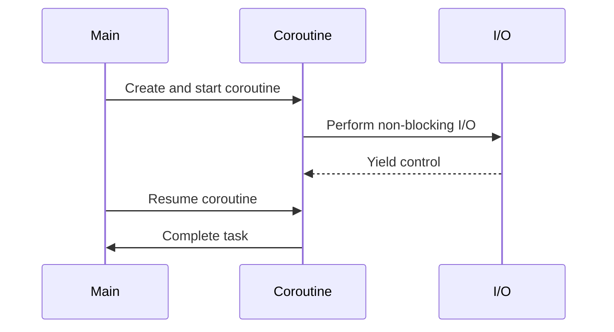

## 9.3 Coroutine-Based Asynchronous Programming

Asynchronous programming is a powerful paradigm that allows developers to write non-blocking code, enabling applications to handle multiple tasks concurrently without waiting for each task to complete before starting the next. In Lua, coroutines provide a flexible mechanism for implementing asynchronous patterns, allowing developers to manage complex workflows efficiently. In this section, we will explore how to leverage coroutines for asynchronous programming, focusing on non-blocking operations, event loop integration, and simulating async/await patterns.

### Understanding Coroutines in Lua

Coroutines in Lua are a type of control structure that allows you to pause and resume execution at certain points. Unlike threads, coroutines are not preemptive; they must yield control explicitly. This makes them ideal for implementing cooperative multitasking, where tasks voluntarily yield control to allow other tasks to run.

#### Key Concepts

- **Coroutine Creation**: Use `coroutine.create()` to create a new coroutine.
- **Coroutine Execution**: Use `coroutine.resume()` to start or resume a coroutine.
- **Yielding**: Use `coroutine.yield()` to pause a coroutine and return control to the caller.
- **Status Checking**: Use `coroutine.status()` to check the current state of a coroutine.

### Non-Blocking Operations

Non-blocking operations are essential in asynchronous programming, allowing tasks to proceed without waiting for others to complete. Coroutines enable non-blocking behavior by allowing tasks to yield control and resume later.

#### Implementing Non-Blocking I/O

Consider a scenario where you need to read data from multiple files without blocking the execution of your program. Using coroutines, you can implement a non-blocking file reader.

```lua
-- Non-blocking file reader using coroutines
function readFileAsync(filename, callback)
    local co = coroutine.create(function()
        local file = io.open(filename, "r")
        if not file then
            callback(nil, "Error opening file")
            return
        end
        local content = file:read("*a")
        file:close()
        callback(content, nil)
    end)
    coroutine.resume(co)
end

-- Usage
readFileAsync("example.txt", function(content, err)
    if err then
        print("Error:", err)
    else
        print("File content:", content)
    end
end)
```

### Implementing Asynchronous Patterns

#### Event Loop Integration

An event loop is a programming construct that waits for and dispatches events or messages in a program. In Lua, you can integrate coroutines with an event loop to handle asynchronous I/O operations efficiently.

##### Example: Simple Event Loop

```lua
-- Simple event loop using coroutines
local events = {}

function addEvent(event)
    table.insert(events, event)
end

function runEventLoop()
    while #events > 0 do
        local event = table.remove(events, 1)
        coroutine.resume(event)
    end
end

-- Example usage
local co = coroutine.create(function()
    print("Event 1: Start")
    coroutine.yield()
    print("Event 1: End")
end)

addEvent(co)
runEventLoop()
```

#### Async/Await Simulation

While Lua does not have native async/await syntax, you can simulate this pattern using coroutines to improve code readability and maintainability.

##### Example: Simulating Async/Await

```lua
-- Simulating async/await using coroutines
function async(func)
    return coroutine.create(func)
end

function await(co)
    local status, result = coroutine.resume(co)
    if not status then
        error(result)
    end
    return result
end

-- Example usage
local asyncTask = async(function()
    print("Async task started")
    coroutine.yield()
    print("Async task completed")
end)

await(asyncTask)
```

### Use Cases and Examples

#### Network Servers

Coroutines are particularly useful in network programming, where handling multiple connections concurrently is crucial. By using coroutines, you can manage each connection as a separate coroutine, yielding control when waiting for data and resuming when data is available.

##### Example: Coroutine-Based Network Server

```lua
-- Simple coroutine-based network server
local socket = require("socket")

function handleClient(client)
    client:send("Hello from server!\n")
    client:close()
end

function startServer(port)
    local server = assert(socket.bind("*", port))
    print("Server started on port " .. port)
    while true do
        local client = server:accept()
        local co = coroutine.create(function()
            handleClient(client)
        end)
        coroutine.resume(co)
    end
end

startServer(8080)
```

#### File I/O Operations

Coroutines can also be used to perform asynchronous file I/O operations, allowing your program to continue executing while waiting for file operations to complete.

##### Example: Asynchronous File Reader

```lua
-- Asynchronous file reader using coroutines
function readFileAsync(filename, callback)
    local co = coroutine.create(function()
        local file = io.open(filename, "r")
        if not file then
            callback(nil, "Error opening file")
            return
        end
        local content = file:read("*a")
        file:close()
        callback(content, nil)
    end)
    coroutine.resume(co)
end

-- Usage
readFileAsync("example.txt", function(content, err)
    if err then
        print("Error:", err)
    else
        print("File content:", content)
    end
end)
```

### Visualizing Coroutine-Based Asynchronous Programming

To better understand how coroutines work in asynchronous programming, let's visualize the flow of control using a sequence diagram.



### Try It Yourself

Experiment with the provided code examples by modifying them to suit different scenarios. For instance, try implementing a coroutine-based HTTP server or a file downloader that reads multiple files concurrently.

### References and Further Reading

- [Lua 5.4 Reference Manual](https://www.lua.org/manual/5.4/)
- [Programming in Lua](https://www.lua.org/pil/contents.html)
- [Coroutines in Lua](https://www.lua.org/manual/5.4/manual.html#2.6)

### Knowledge Check

To reinforce your understanding of coroutine-based asynchronous programming in Lua, try answering the following questions.

## Quiz Time!



### What is the primary advantage of using coroutines for asynchronous programming in Lua?

- [x] They allow non-blocking operations by yielding control.
- [ ] They provide preemptive multitasking.
- [ ] They automatically handle errors.
- [ ] They require no explicit control flow management.

> **Explanation:** Coroutines allow non-blocking operations by yielding control, enabling cooperative multitasking.

### How do you create a new coroutine in Lua?

- [x] Using `coroutine.create()`
- [ ] Using `coroutine.new()`
- [ ] Using `coroutine.start()`
- [ ] Using `coroutine.init()`

> **Explanation:** `coroutine.create()` is used to create a new coroutine in Lua.

### Which function is used to pause a coroutine and return control to the caller?

- [x] `coroutine.yield()`
- [ ] `coroutine.pause()`
- [ ] `coroutine.stop()`
- [ ] `coroutine.halt()`

> **Explanation:** `coroutine.yield()` is used to pause a coroutine and return control to the caller.

### What is an event loop in the context of asynchronous programming?

- [x] A construct that waits for and dispatches events or messages.
- [ ] A loop that runs indefinitely without stopping.
- [ ] A function that handles errors in asynchronous code.
- [ ] A mechanism for managing memory allocation.

> **Explanation:** An event loop waits for and dispatches events or messages in a program.

### How can you simulate async/await patterns in Lua?

- [x] By using coroutines to manage asynchronous tasks.
- [ ] By using threads to handle concurrent operations.
- [ ] By using timers to delay execution.
- [ ] By using callbacks exclusively.

> **Explanation:** Coroutines can be used to simulate async/await patterns by managing asynchronous tasks.

### What is the role of `coroutine.resume()` in Lua?

- [x] It starts or resumes a coroutine.
- [ ] It pauses a coroutine.
- [ ] It creates a new coroutine.
- [ ] It terminates a coroutine.

> **Explanation:** `coroutine.resume()` is used to start or resume a coroutine.

### Which of the following is a common use case for coroutine-based asynchronous programming?

- [x] Network servers
- [ ] Static file serving
- [ ] Synchronous data processing
- [ ] Simple arithmetic operations

> **Explanation:** Network servers often use coroutine-based asynchronous programming to handle multiple connections concurrently.

### What happens when a coroutine yields control?

- [x] It pauses execution and returns control to the caller.
- [ ] It terminates immediately.
- [ ] It continues executing in the background.
- [ ] It throws an error.

> **Explanation:** When a coroutine yields control, it pauses execution and returns control to the caller.

### Can coroutines be used for parallel execution in Lua?

- [x] False
- [ ] True

> **Explanation:** Coroutines in Lua are not used for parallel execution; they are used for cooperative multitasking.

### Which function is used to check the current state of a coroutine?

- [x] `coroutine.status()`
- [ ] `coroutine.state()`
- [ ] `coroutine.check()`
- [ ] `coroutine.inspect()`

> **Explanation:** `coroutine.status()` is used to check the current state of a coroutine.



Remember, mastering coroutine-based asynchronous programming in Lua is a journey. Keep experimenting, stay curious, and enjoy the process of building efficient and responsive applications!
