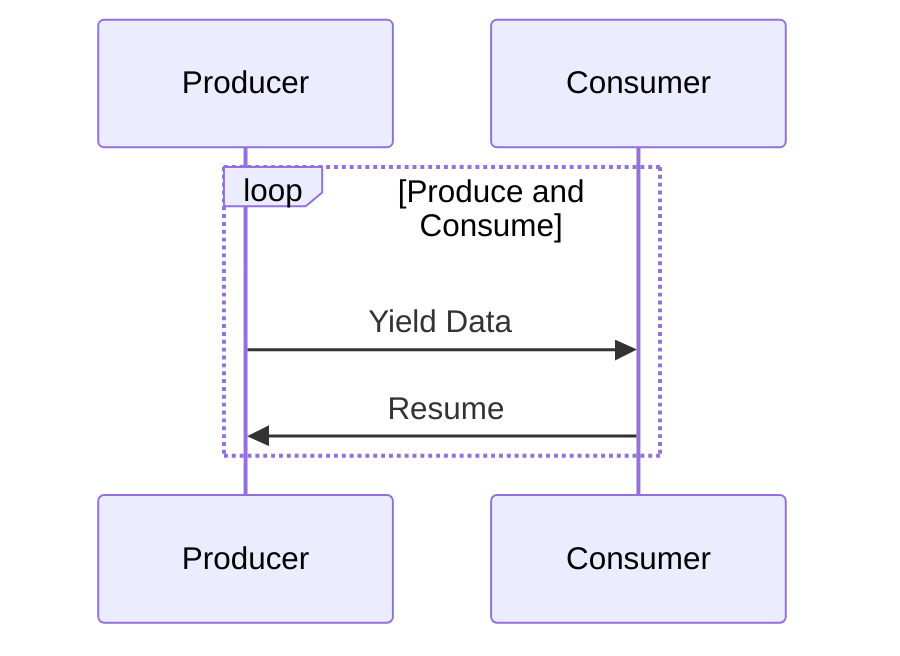

## 9.4 Enhanced Coroutines in Lua

Coroutines are a powerful feature in Lua that enable cooperative multitasking, allowing developers to write asynchronous code that is both efficient and easy to understand. In this section, we will delve into advanced coroutine techniques, focusing on enhancing control and communication between coroutines. By mastering these techniques, you can build complex systems such as state machines and task schedulers with ease.

### Understanding Coroutines

Before we dive into enhanced techniques, let's briefly revisit what coroutines are. Coroutines in Lua are similar to threads but are not preemptive. This means they yield control back to the caller explicitly, allowing for fine-grained control over execution. This makes them ideal for implementing cooperative multitasking.

```lua
-- Basic coroutine example
local co = coroutine.create(function()
    for i = 1, 5 do
        print("Coroutine iteration:", i)
        coroutine.yield()
    end
end)

while coroutine.status(co) ~= "dead" do
    coroutine.resume(co)
end
```

In this example, the coroutine yields control back to the main program after each iteration, allowing other tasks to execute.

### Advanced Coroutine Techniques

#### Coroutine Wrappers

Coroutine wrappers are a technique used to simplify the usage of coroutines. They abstract away the complexity of managing coroutine states and transitions, providing a cleaner interface for coroutine operations.

**Example: Coroutine Wrapper for Task Management**

```lua
-- Define a coroutine wrapper
local function createTask(func)
    local co = coroutine.create(func)
    return {
        resume = function(...)
            if coroutine.status(co) ~= "dead" then
                return coroutine.resume(co, ...)
            end
        end,
        status = function()
            return coroutine.status(co)
        end
    }
end

-- Usage of coroutine wrapper
local task = createTask(function()
    for i = 1, 3 do
        print("Task iteration:", i)
        coroutine.yield()
    end
end)

while task.status() ~= "dead" do
    task.resume()
end
```

In this example, the `createTask` function encapsulates the coroutine creation and provides methods to resume and check the status of the coroutine, making it easier to manage.

#### Communication Between Coroutines

Communication between coroutines is crucial for building complex systems where coroutines need to exchange data or signal events. Lua provides several mechanisms to facilitate this communication.

**Example: Passing Data Between Coroutines**

```lua
-- Coroutine communication example
local producer = coroutine.create(function()
    for i = 1, 3 do
        print("Producing:", i)
        coroutine.yield(i)
    end
end)

local consumer = coroutine.create(function()
    while true do
        local status, value = coroutine.resume(producer)
        if not status then break end
        print("Consuming:", value)
    end
end)

coroutine.resume(consumer)
```

In this example, the producer coroutine generates data and yields it to the consumer coroutine, which resumes the producer and processes the data.

**Example: Signaling Events Between Coroutines**

```lua
-- Event signaling between coroutines
local event = false

local eventProducer = coroutine.create(function()
    for i = 1, 3 do
        print("Event produced:", i)
        event = true
        coroutine.yield()
    end
end)

local eventConsumer = coroutine.create(function()
    while true do
        if event then
            print("Event consumed")
            event = false
        end
        coroutine.yield()
    end
end)

for _ = 1, 3 do
    coroutine.resume(eventProducer)
    coroutine.resume(eventConsumer)
end
```

Here, the producer sets an event flag, and the consumer checks for this flag to process the event, demonstrating a simple signaling mechanism.

### Use Cases and Examples

#### Complex State Machines

Coroutines are particularly useful for implementing state machines, where each state can be represented as a coroutine. This allows for clear and maintainable code, as each state transition is explicit.

**Example: State Machine with Coroutines**

```lua
-- State machine using coroutines
local stateA = coroutine.create(function()
    print("State A")
    coroutine.yield("toB")
end)

local stateB = coroutine.create(function()
    print("State B")
    coroutine.yield("toA")
end)

local currentState = stateA

while true do
    local status, nextState = coroutine.resume(currentState)
    if not status then break end
    if nextState == "toB" then
        currentState = stateB
    elseif nextState == "toA" then
        currentState = stateA
    end
end
```

In this state machine, the system alternates between State A and State B, with each state represented as a coroutine.

#### Scheduling and Task Management

Coroutines can be used to implement schedulers that manage multiple tasks, allowing for efficient task switching and resource utilization.

**Example: Simple Task Scheduler**

```lua
-- Simple task scheduler using coroutines
local tasks = {}

local function addTask(func)
    table.insert(tasks, coroutine.create(func))
end

local function runTasks()
    while #tasks > 0 do
        for i = #tasks, 1, -1 do
            local status = coroutine.resume(tasks[i])
            if not status or coroutine.status(tasks[i]) == "dead" then
                table.remove(tasks, i)
            end
        end
    end
end

-- Add tasks to the scheduler
addTask(function()
    for i = 1, 3 do
        print("Task 1, iteration:", i)
        coroutine.yield()
    end
end)

addTask(function()
    for i = 1, 2 do
        print("Task 2, iteration:", i)
        coroutine.yield()
    end
end)

-- Run the scheduler
runTasks()
```

This scheduler manages multiple tasks, resuming each one in turn until all tasks are complete.

### Visualizing Coroutine Communication

To better understand how coroutines communicate, let's visualize the process using a sequence diagram.



This diagram illustrates the interaction between a producer and a consumer coroutine, highlighting the data exchange process.

### Try It Yourself

Experiment with the code examples provided by modifying them to suit different scenarios. For instance, try adding more states to the state machine or implementing a more complex task scheduler with priority levels.

### References and Further Reading

- [Lua 5.4 Reference Manual](https://www.lua.org/manual/5.4/)
- [Programming in Lua](https://www.lua.org/pil/)

### Knowledge Check

- How do coroutine wrappers simplify coroutine usage?
- What are some mechanisms for communication between coroutines?
- How can coroutines be used to implement state machines?

### Embrace the Journey

Remember, mastering coroutines is a journey. As you explore these advanced techniques, you'll gain greater control over concurrency in your Lua applications. Keep experimenting, stay curious, and enjoy the process!

## Quiz Time!



### What is the primary advantage of using coroutine wrappers?

- [x] Simplifies coroutine management
- [ ] Increases execution speed
- [ ] Reduces memory usage
- [ ] Enhances security

> **Explanation:** Coroutine wrappers abstract the complexity of managing coroutine states, making it easier to use coroutines.

### How do coroutines differ from threads?

- [x] Coroutines yield control explicitly
- [ ] Coroutines run in parallel
- [ ] Coroutines are preemptive
- [ ] Coroutines require more memory

> **Explanation:** Coroutines yield control explicitly, unlike threads which can be preemptive.

### What mechanism can be used to pass data between coroutines?

- [x] Yield and resume
- [ ] Mutex locks
- [ ] Atomic operations
- [ ] Thread pools

> **Explanation:** Yield and resume allow coroutines to pass data between each other.

### In a state machine implemented with coroutines, what does each state represent?

- [x] A coroutine
- [ ] A thread
- [ ] A function
- [ ] A class

> **Explanation:** Each state in a coroutine-based state machine is represented by a coroutine.

### What is a common use case for coroutine communication?

- [x] Event signaling
- [ ] Memory management
- [ ] Security checks
- [ ] Data encryption

> **Explanation:** Coroutines can communicate by signaling events to each other.

### How can you check the status of a coroutine?

- [x] Using `coroutine.status()`
- [ ] Using `coroutine.check()`
- [ ] Using `coroutine.state()`
- [ ] Using `coroutine.info()`

> **Explanation:** `coroutine.status()` returns the current status of a coroutine.

### What is the role of a task scheduler in coroutine management?

- [x] Manages task execution order
- [ ] Increases task speed
- [ ] Reduces task memory usage
- [ ] Enhances task security

> **Explanation:** A task scheduler manages the order in which tasks are executed.

### What is the purpose of using `coroutine.yield()` in a coroutine?

- [x] To pause execution and return control
- [ ] To terminate the coroutine
- [ ] To start a new coroutine
- [ ] To increase execution speed

> **Explanation:** `coroutine.yield()` pauses the coroutine and returns control to the caller.

### What is a key benefit of using coroutines for task management?

- [x] Efficient resource utilization
- [ ] Increased parallelism
- [ ] Enhanced security
- [ ] Reduced code complexity

> **Explanation:** Coroutines allow for efficient resource utilization by managing task execution.

### True or False: Coroutines in Lua are preemptive.

- [ ] True
- [x] False

> **Explanation:** Coroutines in Lua are not preemptive; they yield control explicitly.



---
