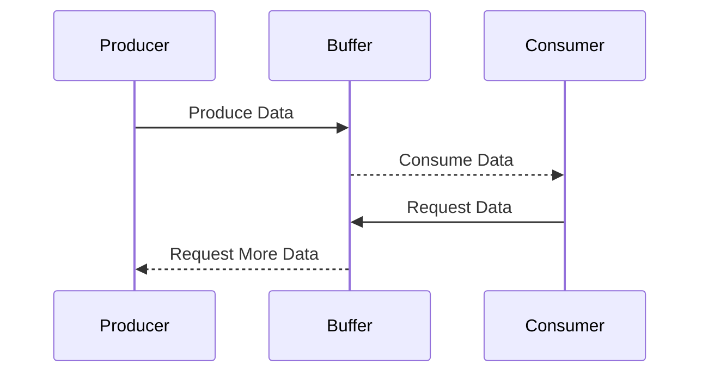

## 9.5 Implementing Producers and Consumers

In the realm of concurrent programming, the producer-consumer pattern is a classic design pattern that facilitates the efficient handling of data between processes. In Lua, this pattern can be elegantly implemented using coroutines, which allow for cooperative multitasking and asynchronous data processing. In this section, we will delve into the intricacies of implementing producers and consumers in Lua, focusing on buffering data between processes, implementing buffers, and exploring real-world use cases.

### Buffering Data Between Processes

The producer-consumer pattern involves two main entities: producers, which generate data, and consumers, which process data. The challenge lies in efficiently passing data between these entities, especially when they operate at different speeds. This is where buffering comes into play, allowing data to be temporarily stored and managed between production and consumption.

#### Using Coroutines to Model Producer-Consumer Scenarios

Coroutines in Lua provide a powerful mechanism for implementing producer-consumer scenarios. Unlike threads, coroutines are lightweight and allow for cooperative multitasking, meaning that they yield control explicitly, making them ideal for managing data flow between producers and consumers.

```lua
-- Producer coroutine
function producer(buffer)
    for i = 1, 10 do
        table.insert(buffer, i)
        print("Produced:", i)
        coroutine.yield()
    end
end

-- Consumer coroutine
function consumer(buffer)
    while true do
        if #buffer > 0 then
            local item = table.remove(buffer, 1)
            print("Consumed:", item)
        end
        coroutine.yield()
    end
end

-- Buffer to store data
local buffer = {}

-- Create coroutines
local producerCoroutine = coroutine.create(producer)
local consumerCoroutine = coroutine.create(consumer)

-- Run the coroutines
for i = 1, 10 do
    coroutine.resume(producerCoroutine, buffer)
    coroutine.resume(consumerCoroutine, buffer)
end
```

In this example, the producer coroutine generates numbers from 1 to 10 and inserts them into a buffer. The consumer coroutine removes and processes these numbers. The coroutines yield control back and forth, simulating the producer-consumer interaction.

### Implementing Buffers

Buffers are essential for managing data flow between producers and consumers. They act as intermediaries, storing data temporarily until it can be processed. Implementing efficient buffers involves creating queues and channels and ensuring synchronization to maintain data integrity.

#### Queues and Channels: Passing Data Between Coroutines

Queues are a common data structure used in producer-consumer scenarios. They allow for orderly data storage and retrieval, ensuring that data is processed in the order it was produced.

```lua
-- Queue implementation
Queue = {}
Queue.__index = Queue

function Queue:new()
    return setmetatable({items = {}}, Queue)
end

function Queue:enqueue(item)
    table.insert(self.items, item)
end

function Queue:dequeue()
    return table.remove(self.items, 1)
end

function Queue:isEmpty()
    return #self.items == 0
end

-- Producer coroutine using a queue
function producer(queue)
    for i = 1, 10 do
        queue:enqueue(i)
        print("Produced:", i)
        coroutine.yield()
    end
end

-- Consumer coroutine using a queue
function consumer(queue)
    while true do
        if not queue:isEmpty() then
            local item = queue:dequeue()
            print("Consumed:", item)
        end
        coroutine.yield()
    end
end

-- Create a queue
local queue = Queue:new()

-- Create coroutines
local producerCoroutine = coroutine.create(producer)
local consumerCoroutine = coroutine.create(consumer)

-- Run the coroutines
for i = 1, 10 do
    coroutine.resume(producerCoroutine, queue)
    coroutine.resume(consumerCoroutine, queue)
end
```

In this implementation, we define a `Queue` class with methods for enqueuing and dequeuing items. The producer and consumer coroutines interact with the queue to produce and consume data.

#### Synchronization: Managing Access and Ensuring Data Integrity

Synchronization is crucial in producer-consumer scenarios to prevent race conditions and ensure data integrity. In Lua, synchronization can be achieved using coroutines and careful management of shared resources.

```lua
-- Synchronized buffer using coroutines
function synchronizedProducer(buffer, lock)
    for i = 1, 10 do
        while lock.busy do
            coroutine.yield()
        end
        lock.busy = true
        table.insert(buffer, i)
        print("Produced:", i)
        lock.busy = false
        coroutine.yield()
    end
end

function synchronizedConsumer(buffer, lock)
    while true do
        while lock.busy or #buffer == 0 do
            coroutine.yield()
        end
        lock.busy = true
        local item = table.remove(buffer, 1)
        print("Consumed:", item)
        lock.busy = false
        coroutine.yield()
    end
end

-- Buffer and lock
local buffer = {}
local lock = {busy = false}

-- Create coroutines
local producerCoroutine = coroutine.create(synchronizedProducer)
local consumerCoroutine = coroutine.create(synchronizedConsumer)

-- Run the coroutines
for i = 1, 10 do
    coroutine.resume(producerCoroutine, buffer, lock)
    coroutine.resume(consumerCoroutine, buffer, lock)
end
```

In this example, a `lock` is used to synchronize access to the buffer. The producer and consumer coroutines check the lock status before accessing the buffer, ensuring that only one coroutine can modify the buffer at a time.

### Use Cases and Examples

The producer-consumer pattern is widely used in various applications, from data processing pipelines to streaming applications. Let's explore some real-world use cases.

#### Data Processing Pipelines

In data processing pipelines, data is often produced by one process, transformed by intermediate processes, and consumed by a final process. The producer-consumer pattern facilitates efficient data flow through the pipeline.

```lua
-- Data processing pipeline
function dataProducer(buffer)
    for i = 1, 10 do
        table.insert(buffer, i * 2)
        print("Produced:", i * 2)
        coroutine.yield()
    end
end

function dataTransformer(buffer, transformedBuffer)
    while true do
        if #buffer > 0 then
            local item = table.remove(buffer, 1)
            table.insert(transformedBuffer, item + 1)
            print("Transformed:", item + 1)
        end
        coroutine.yield()
    end
end

function dataConsumer(transformedBuffer)
    while true do
        if #transformedBuffer > 0 then
            local item = table.remove(transformedBuffer, 1)
            print("Consumed:", item)
        end
        coroutine.yield()
    end
end

-- Buffers
local buffer = {}
local transformedBuffer = {}

-- Create coroutines
local producerCoroutine = coroutine.create(dataProducer)
local transformerCoroutine = coroutine.create(dataTransformer)
local consumerCoroutine = coroutine.create(dataConsumer)

-- Run the coroutines
for i = 1, 10 do
    coroutine.resume(producerCoroutine, buffer)
    coroutine.resume(transformerCoroutine, buffer, transformedBuffer)
    coroutine.resume(consumerCoroutine, transformedBuffer)
end
```

In this pipeline, the producer generates data, the transformer modifies the data, and the consumer processes the final output. Each stage of the pipeline is implemented as a coroutine, allowing for efficient data flow.

#### Streaming Applications

Streaming applications, such as video or audio streaming, require continuous data production and consumption. The producer-consumer pattern ensures smooth data flow and prevents buffer overflow or underflow.

```lua
-- Streaming application
function streamProducer(buffer)
    for i = 1, 10 do
        table.insert(buffer, "Frame " .. i)
        print("Produced:", "Frame " .. i)
        coroutine.yield()
    end
end

function streamConsumer(buffer)
    while true do
        if #buffer > 0 then
            local frame = table.remove(buffer, 1)
            print("Consumed:", frame)
        end
        coroutine.yield()
    end
end

-- Buffer
local buffer = {}

-- Create coroutines
local producerCoroutine = coroutine.create(streamProducer)
local consumerCoroutine = coroutine.create(streamConsumer)

-- Run the coroutines
for i = 1, 10 do
    coroutine.resume(producerCoroutine, buffer)
    coroutine.resume(consumerCoroutine, buffer)
end
```

In this streaming application, the producer generates frames, and the consumer processes them. The buffer ensures that frames are produced and consumed at a manageable rate.

### Try It Yourself

Experiment with the code examples provided in this section. Try modifying the buffer size, adjusting the production and consumption rates, or adding additional stages to the data processing pipeline. By experimenting with these parameters, you can gain a deeper understanding of the producer-consumer pattern and its applications.

### Visualizing Producer-Consumer Interaction

To better understand the interaction between producers and consumers, let's visualize the process using a sequence diagram.



This diagram illustrates the flow of data between the producer, buffer, and consumer. The producer generates data and stores it in the buffer, while the consumer retrieves data from the buffer. The buffer acts as an intermediary, managing data flow and ensuring synchronization.

### Key Takeaways

- **Coroutines**: Lua's coroutines provide a lightweight mechanism for implementing producer-consumer scenarios, allowing for cooperative multitasking and efficient data flow.
- **Buffers**: Buffers act as intermediaries, storing data temporarily between producers and consumers. Implementing efficient buffers involves creating queues and ensuring synchronization.
- **Synchronization**: Managing access to shared resources is crucial for maintaining data integrity and preventing race conditions.
- **Use Cases**: The producer-consumer pattern is widely used in data processing pipelines and streaming applications, facilitating efficient data flow and processing.

### Embrace the Journey

Remember, mastering the producer-consumer pattern in Lua is just the beginning. As you continue to explore concurrency and asynchronous patterns, you'll discover new ways to optimize data flow and improve application performance. Keep experimenting, stay curious, and enjoy the journey!

## Quiz Time!



### What is the primary purpose of the producer-consumer pattern?

- [x] To manage data flow between processes operating at different speeds
- [ ] To increase the speed of data processing
- [ ] To reduce memory usage
- [ ] To simplify code structure

> **Explanation:** The producer-consumer pattern is primarily used to manage data flow between processes operating at different speeds, ensuring efficient data handling.

### How do coroutines in Lua differ from threads?

- [x] Coroutines allow for cooperative multitasking, while threads allow for preemptive multitasking
- [ ] Coroutines are faster than threads
- [ ] Coroutines require more memory than threads
- [ ] Coroutines are only used for error handling

> **Explanation:** Coroutines in Lua allow for cooperative multitasking, meaning they yield control explicitly, unlike threads which allow for preemptive multitasking.

### What is the role of a buffer in the producer-consumer pattern?

- [x] To temporarily store data between production and consumption
- [ ] To increase data processing speed
- [ ] To reduce memory usage
- [ ] To simplify code structure

> **Explanation:** A buffer temporarily stores data between production and consumption, acting as an intermediary to manage data flow.

### What is a common data structure used for implementing buffers in producer-consumer scenarios?

- [x] Queue
- [ ] Stack
- [ ] Array
- [ ] Linked List

> **Explanation:** Queues are commonly used in producer-consumer scenarios to ensure orderly data storage and retrieval.

### How can synchronization be achieved in Lua's producer-consumer pattern?

- [x] Using coroutines and careful management of shared resources
- [ ] Using threads
- [ ] Using global variables
- [ ] Using file I/O

> **Explanation:** Synchronization in Lua's producer-consumer pattern can be achieved using coroutines and careful management of shared resources to prevent race conditions.

### What is a real-world application of the producer-consumer pattern?

- [x] Data processing pipelines
- [ ] Memory management
- [ ] Error handling
- [ ] User interface design

> **Explanation:** The producer-consumer pattern is widely used in data processing pipelines to facilitate efficient data flow and processing.

### What is the benefit of using coroutines for implementing producer-consumer scenarios in Lua?

- [x] They provide lightweight and efficient cooperative multitasking
- [ ] They increase memory usage
- [ ] They simplify error handling
- [ ] They allow for preemptive multitasking

> **Explanation:** Coroutines provide lightweight and efficient cooperative multitasking, making them ideal for implementing producer-consumer scenarios in Lua.

### What is the main challenge in implementing the producer-consumer pattern?

- [x] Ensuring synchronization and data integrity
- [ ] Increasing data processing speed
- [ ] Reducing memory usage
- [ ] Simplifying code structure

> **Explanation:** The main challenge in implementing the producer-consumer pattern is ensuring synchronization and data integrity to prevent race conditions.

### What is the role of a lock in the synchronized producer-consumer pattern?

- [x] To manage access to shared resources and prevent race conditions
- [ ] To increase data processing speed
- [ ] To reduce memory usage
- [ ] To simplify code structure

> **Explanation:** A lock is used to manage access to shared resources and prevent race conditions, ensuring data integrity in the synchronized producer-consumer pattern.

### True or False: The producer-consumer pattern can only be used in data processing pipelines.

- [ ] True
- [x] False

> **Explanation:** False. The producer-consumer pattern can be used in various applications, including data processing pipelines and streaming applications.


