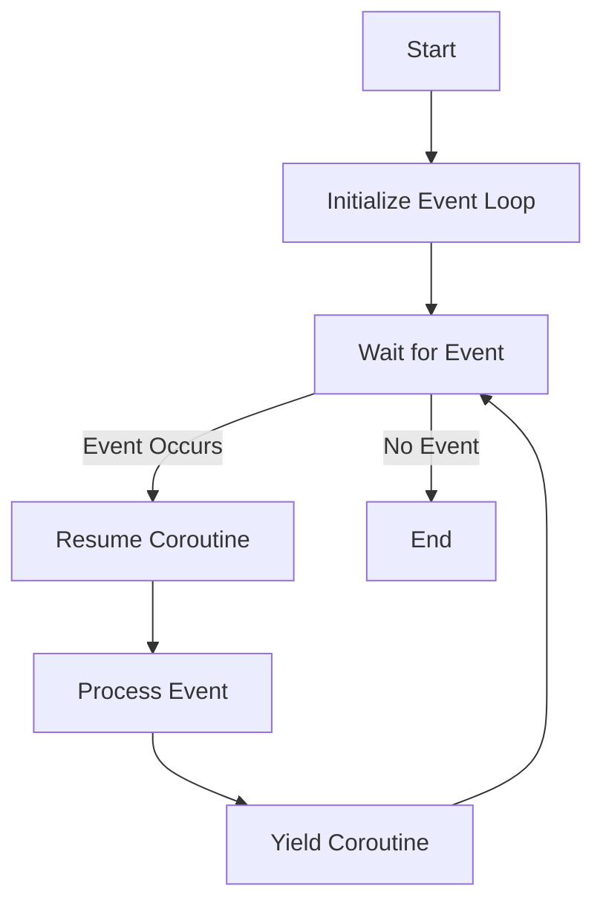

## 9.6 Event-Driven Programming with Coroutines

Event-driven programming is a powerful paradigm that allows software to respond to events or changes in state. In Lua, coroutines provide a flexible mechanism for implementing event-driven systems, enabling efficient handling of asynchronous tasks. This section explores how to combine coroutines with event loops, compares callbacks and coroutines, and demonstrates integration with libraries like LuaSocket. We will also delve into use cases such as GUI applications and real-time systems.

### Responding to Events Efficiently: Combining Coroutines with Event Loops

Event-driven programming revolves around the concept of responding to events as they occur. This approach is particularly useful in scenarios where applications need to handle multiple tasks concurrently, such as in GUI applications or network servers. Coroutines in Lua offer a lightweight and efficient way to manage these tasks without the overhead of traditional threading models.

#### Understanding Coroutines

Coroutines are a type of cooperative multitasking that allows functions to yield execution and resume later. Unlike threads, coroutines do not run concurrently but instead allow the programmer to control when execution is paused and resumed. This makes them ideal for event-driven programming, where tasks can be paused while waiting for an event and resumed when the event occurs.

```lua
function coroutineExample()
    print("Coroutine started")
    coroutine.yield()  -- Pause execution
    print("Coroutine resumed")
end

co = coroutine.create(coroutineExample)
coroutine.resume(co)  -- Output: Coroutine started
coroutine.resume(co)  -- Output: Coroutine resumed
```

In this example, the coroutine `coroutineExample` starts execution, yields, and then resumes when `coroutine.resume` is called again.

#### Event Loops and Coroutines

An event loop is a programming construct that waits for and dispatches events or messages in a program. By combining coroutines with event loops, we can efficiently manage multiple tasks that need to wait for events.

```lua
local eventQueue = {}

function addEvent(event)
    table.insert(eventQueue, event)
end

function runEventLoop()
    while #eventQueue > 0 do
        local event = table.remove(eventQueue, 1)
        coroutine.resume(event)
    end
end

function eventHandler()
    print("Handling event")
    coroutine.yield()  -- Wait for next event
end

local event = coroutine.create(eventHandler)
addEvent(event)
runEventLoop()  -- Output: Handling event
```

In this example, `eventHandler` is a coroutine that handles events. The `runEventLoop` function processes events by resuming the coroutines in the `eventQueue`.

### Implementing Event-Driven Systems

Implementing an event-driven system involves designing a mechanism to handle events efficiently. This can be achieved using either callbacks or coroutines. Let's explore both approaches.

#### Callbacks vs. Coroutines: Comparing Approaches

Callbacks are functions passed as arguments to other functions and are executed when an event occurs. While callbacks are a common way to handle events, they can lead to complex and hard-to-maintain code, especially when dealing with nested callbacks (often referred to as "callback hell").

Coroutines, on the other hand, provide a cleaner and more manageable way to handle asynchronous tasks. They allow you to write asynchronous code in a synchronous style, making it easier to read and maintain.

**Callbacks Example:**

```lua
function fetchData(callback)
    -- Simulate asynchronous operation
    print("Fetching data...")
    callback("Data received")
end

fetchData(function(data)
    print(data)  -- Output: Data received
end)
```

**Coroutines Example:**

```lua
function fetchDataCoroutine()
    print("Fetching data...")
    coroutine.yield("Data received")
end

co = coroutine.create(fetchDataCoroutine)
coroutine.resume(co)  -- Output: Fetching data...
local _, data = coroutine.resume(co)
print(data)  -- Output: Data received
```

Coroutines provide a more linear flow of control, making it easier to follow the logic of the program.

#### Integrating with Libraries: Using Libraries like LuaSocket

Libraries such as LuaSocket can be integrated with coroutines to handle network events efficiently. LuaSocket provides a set of functions for TCP/UDP communication, making it ideal for building networked applications.

```lua
local socket = require("socket")

function networkCoroutine()
    local server = assert(socket.bind("*", 12345))
    local client = server:accept()
    client:settimeout(10)
    
    while true do
        local line, err = client:receive()
        if not err then
            print("Received: " .. line)
            client:send(line .. "\n")
        else
            break
        end
        coroutine.yield()
    end
    client:close()
end

co = coroutine.create(networkCoroutine)
coroutine.resume(co)
```

In this example, a simple echo server is implemented using LuaSocket and coroutines. The server accepts connections and echoes back any received data.

### Use Cases and Examples

Event-driven programming with coroutines is applicable in various domains, including GUI applications and real-time systems.

#### GUI Applications

In GUI applications, event-driven programming is essential for handling user interactions, such as button clicks and mouse movements. Coroutines can be used to manage these events efficiently, allowing the application to remain responsive.

```lua
local gui = require("gui")

function buttonClickHandler()
    print("Button clicked")
    coroutine.yield()
end

local button = gui.createButton("Click Me", buttonClickHandler)
gui.run()
```

In this example, a button click event is handled using a coroutine, ensuring that the application remains responsive while waiting for user input.

#### Real-Time Systems

Real-time systems, such as games or simulations, require efficient handling of events to maintain performance. Coroutines can be used to manage tasks such as updating game state or processing input events.

```lua
function gameLoop()
    while true do
        updateGameState()
        processInputEvents()
        coroutine.yield()
    end
end

co = coroutine.create(gameLoop)
coroutine.resume(co)
```

In this example, a simple game loop is implemented using a coroutine, allowing the game to update its state and process input events efficiently.

### Visualizing Event-Driven Programming with Coroutines

To better understand the flow of event-driven programming with coroutines, let's visualize the process using a flowchart.



**Figure 1:** Flowchart illustrating the event-driven programming process with coroutines.

### Try It Yourself

Experiment with the code examples provided in this section. Try modifying the `eventHandler` coroutine to handle different types of events, or integrate LuaSocket to build a simple chat server. By experimenting with these examples, you'll gain a deeper understanding of how coroutines can be used to implement event-driven systems.

### References and Links

- [LuaSocket Documentation](http://w3.impa.br/~diego/software/luasocket/)
- [Coroutines in Lua](https://www.lua.org/manual/5.1/manual.html#2.11)
- [Event-Driven Programming](https://en.wikipedia.org/wiki/Event-driven_programming)

### Knowledge Check

1. What are the advantages of using coroutines over callbacks in event-driven programming?
2. How can LuaSocket be integrated with coroutines to handle network events?
3. What are some common use cases for event-driven programming with coroutines?

### Embrace the Journey

Remember, mastering event-driven programming with coroutines is a journey. As you experiment with different use cases and integrate various libraries, you'll develop a deeper understanding of how to build efficient and responsive applications. Keep exploring, stay curious, and enjoy the process!

## Quiz Time!



### What is the primary advantage of using coroutines in event-driven programming?

- [x] They allow writing asynchronous code in a synchronous style.
- [ ] They are faster than threads.
- [ ] They automatically handle errors.
- [ ] They require less memory than callbacks.

> **Explanation:** Coroutines allow writing asynchronous code in a synchronous style, making it easier to read and maintain.

### How do coroutines differ from threads?

- [x] Coroutines do not run concurrently.
- [ ] Coroutines are faster than threads.
- [ ] Coroutines are a type of preemptive multitasking.
- [ ] Coroutines automatically manage memory.

> **Explanation:** Coroutines do not run concurrently; they allow cooperative multitasking where the programmer controls execution.

### Which library is commonly used with Lua for network communication?

- [x] LuaSocket
- [ ] LuaNet
- [ ] LuaComm
- [ ] LuaNetwork

> **Explanation:** LuaSocket is a library commonly used for TCP/UDP communication in Lua.

### What is a common problem with using callbacks for event handling?

- [x] Callback hell
- [ ] Memory leaks
- [ ] Slow execution
- [ ] Lack of flexibility

> **Explanation:** Callback hell refers to complex and hard-to-maintain code due to nested callbacks.

### In the context of GUI applications, what is a key benefit of using coroutines?

- [x] They keep the application responsive.
- [ ] They reduce memory usage.
- [ ] They simplify the GUI layout.
- [ ] They automatically handle user input.

> **Explanation:** Coroutines keep the application responsive by efficiently managing user interactions.

### What does the `coroutine.yield()` function do?

- [x] Pauses the coroutine execution.
- [ ] Resumes the coroutine execution.
- [ ] Ends the coroutine execution.
- [ ] Starts the coroutine execution.

> **Explanation:** `coroutine.yield()` pauses the coroutine execution, allowing it to be resumed later.

### How can coroutines be used in real-time systems?

- [x] To manage tasks like updating game state and processing input events.
- [ ] To automatically optimize performance.
- [ ] To reduce the need for event loops.
- [ ] To eliminate the need for callbacks.

> **Explanation:** Coroutines can manage tasks like updating game state and processing input events efficiently.

### What is the role of an event loop in event-driven programming?

- [x] To wait for and dispatch events.
- [ ] To execute all tasks concurrently.
- [ ] To manage memory allocation.
- [ ] To handle error logging.

> **Explanation:** An event loop waits for and dispatches events or messages in a program.

### Which of the following is a use case for event-driven programming with coroutines?

- [x] Real-time systems
- [ ] Batch processing
- [ ] Static web pages
- [ ] Data warehousing

> **Explanation:** Real-time systems benefit from event-driven programming with coroutines for efficient event handling.

### True or False: Coroutines can automatically handle errors in Lua.

- [ ] True
- [x] False

> **Explanation:** Coroutines do not automatically handle errors; error handling must be implemented separately.


