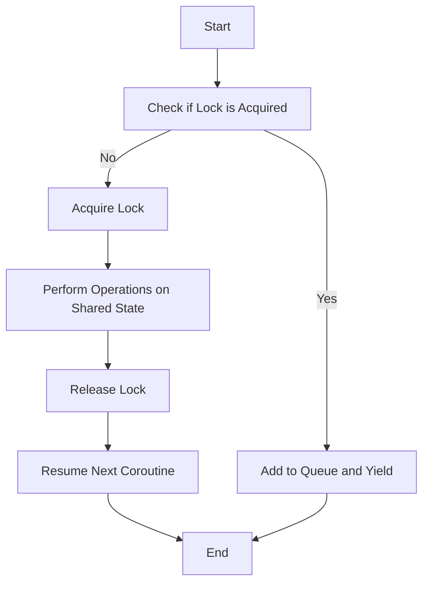

## 9.7 Managing Shared State and Avoiding Race Conditions

In the realm of concurrent programming, managing shared state and avoiding race conditions are critical challenges that developers face. Lua, with its lightweight and flexible nature, offers several strategies to handle these issues effectively. In this section, we will delve into techniques for ensuring data integrity, explore the concept of immutability, and discuss the use of locks and semaphores to coordinate access to shared resources. We will also provide practical examples and use cases to illustrate these concepts in action.

### Understanding Shared State and Race Conditions

**Shared State** refers to data that is accessible by multiple threads or processes simultaneously. When multiple entities attempt to read or modify this data concurrently, it can lead to inconsistencies and unpredictable behavior, known as **Race Conditions**. These occur when the outcome of a program depends on the sequence or timing of uncontrollable events, such as thread scheduling.

#### Key Concepts

- **Concurrency**: The ability of a program to execute multiple tasks simultaneously.
- **Race Condition**: A situation where the behavior of software depends on the relative timing of events, such as thread execution order.
- **Data Integrity**: Ensuring that data remains accurate and consistent throughout its lifecycle.

### Ensuring Data Integrity

To manage shared state safely and avoid race conditions, we must employ strategies that ensure data integrity. Let's explore some of these techniques.

#### Implementing Safe Shared State

1. **Immutability**: Using immutable data structures can prevent race conditions by ensuring that data cannot be modified once created. This eliminates the need for synchronization, as immutable data can be safely shared across threads.

2. **Locks and Semaphores**: When mutable shared state is necessary, locks and semaphores can be used to coordinate access. These mechanisms ensure that only one thread can access the shared resource at a time, preventing concurrent modifications.

#### Immutability in Lua

Immutability is a powerful concept that can simplify concurrent programming by eliminating the need for synchronization. In Lua, we can achieve immutability by using tables in a read-only manner or by creating custom immutable data structures.

```lua
-- Example of an immutable table in Lua
local function createImmutableTable(data)
    local immutable = {}
    for k, v in pairs(data) do
        immutable[k] = v
    end
    return setmetatable({}, {
        __index = immutable,
        __newindex = function()
            error("Attempt to modify immutable table")
        end
    })
end

local data = createImmutableTable({a = 1, b = 2, c = 3})
print(data.a) -- Output: 1
data.a = 10   -- Error: Attempt to modify immutable table
```

In this example, we create an immutable table by setting a metatable with a `__newindex` metamethod that raises an error if modification is attempted.

#### Locks and Semaphores

Locks and semaphores are synchronization primitives that can be used to manage access to shared resources. While Lua does not provide built-in support for these primitives, we can implement them using coroutines or leverage external libraries.

##### Implementing a Simple Lock

```lua
-- Simple lock implementation using coroutines
local Lock = {}
Lock.__index = Lock

function Lock:new()
    local obj = {locked = false, queue = {}}
    setmetatable(obj, self)
    return obj
end

function Lock:acquire()
    if self.locked then
        local co = coroutine.running()
        table.insert(self.queue, co)
        coroutine.yield()
    else
        self.locked = true
    end
end

function Lock:release()
    if #self.queue > 0 then
        local co = table.remove(self.queue, 1)
        coroutine.resume(co)
    else
        self.locked = false
    end
end

-- Usage
local lock = Lock:new()

local function criticalSection()
    lock:acquire()
    -- Perform operations on shared state
    lock:release()
end
```

In this example, we implement a simple lock using coroutines. The `acquire` method checks if the lock is already held; if so, it adds the current coroutine to a queue and yields. The `release` method resumes the next coroutine in the queue or unlocks if the queue is empty.

### Use Cases and Examples

Let's explore some practical use cases where managing shared state and avoiding race conditions are crucial.

#### Multithreaded Applications

In multithreaded applications, shared state is common, and race conditions can lead to data corruption or crashes. By using locks or immutable data structures, we can ensure that only one thread modifies the shared state at a time.

```lua
-- Example of using locks in a multithreaded application
local threads = {}
local sharedCounter = 0
local lock = Lock:new()

for i = 1, 10 do
    threads[i] = coroutine.create(function()
        for j = 1, 1000 do
            lock:acquire()
            sharedCounter = sharedCounter + 1
            lock:release()
        end
    end)
end

for _, thread in ipairs(threads) do
    coroutine.resume(thread)
end

print("Final counter value:", sharedCounter)
```

In this example, we create multiple threads that increment a shared counter. The lock ensures that only one thread can modify the counter at a time, preventing race conditions.

#### Collaborative Environments

In collaborative environments, such as real-time editing applications, managing shared state is essential to ensure consistency across users. Immutability can be particularly useful in these scenarios, as it allows for safe sharing of data without synchronization.

### Visualizing Shared State Management

To better understand the flow of managing shared state and avoiding race conditions, let's visualize the process using a flowchart.



This flowchart illustrates the process of acquiring a lock, performing operations on shared state, and releasing the lock to allow other coroutines to proceed.

### References and Links

- [Concurrency in Lua](https://www.lua.org/manual/5.4/manual.html#2.6) - Lua 5.4 Reference Manual
- [Understanding Race Conditions](https://en.wikipedia.org/wiki/Race_condition) - Wikipedia
- [Immutability in Programming](https://en.wikipedia.org/wiki/Immutable_object) - Wikipedia

### Knowledge Check

To reinforce your understanding of managing shared state and avoiding race conditions, consider the following questions:

1. What is a race condition, and why is it problematic in concurrent programming?
2. How can immutability help prevent race conditions?
3. What are the benefits of using locks and semaphores in managing shared state?
4. How does the lock implementation using coroutines work in Lua?
5. What are some practical use cases where managing shared state is crucial?

### Embrace the Journey

Remember, mastering concurrency and managing shared state is a journey. As you continue to explore Lua and its capabilities, keep experimenting with different techniques and patterns. Stay curious, and enjoy the process of building robust and efficient applications.

## Quiz Time!



### What is a race condition?

- [x] A situation where the behavior of software depends on the relative timing of events.
- [ ] A condition where a program runs faster than expected.
- [ ] A scenario where multiple threads never access shared resources.
- [ ] A situation where data is always consistent.

> **Explanation:** A race condition occurs when the behavior of software depends on the timing of events, such as thread execution order, leading to unpredictable outcomes.

### How can immutability help prevent race conditions?

- [x] By ensuring data cannot be modified once created.
- [ ] By allowing multiple threads to modify data simultaneously.
- [ ] By making data mutable and shared.
- [ ] By increasing the complexity of data structures.

> **Explanation:** Immutability prevents race conditions by ensuring data cannot be modified once created, eliminating the need for synchronization.

### What is the purpose of using locks in managing shared state?

- [x] To coordinate access to shared resources and prevent concurrent modifications.
- [ ] To allow multiple threads to access shared resources simultaneously.
- [ ] To make data immutable.
- [ ] To increase the speed of data access.

> **Explanation:** Locks coordinate access to shared resources, ensuring only one thread can modify the data at a time, preventing race conditions.

### How does the lock implementation using coroutines work in Lua?

- [x] It uses coroutines to queue and resume threads waiting for the lock.
- [ ] It uses threads to directly modify shared state.
- [ ] It makes data immutable.
- [ ] It increases the speed of data access.

> **Explanation:** The lock implementation uses coroutines to manage a queue of threads waiting for the lock, resuming them in order when the lock is released.

### What is a practical use case for managing shared state?

- [x] Multithreaded applications where data consistency is crucial.
- [ ] Single-threaded applications with no shared resources.
- [ ] Applications that do not require data integrity.
- [ ] Programs that never modify data.

> **Explanation:** In multithreaded applications, managing shared state is crucial to ensure data consistency and prevent race conditions.

### What is the main advantage of using immutable data structures?

- [x] They eliminate the need for synchronization.
- [ ] They allow data to be modified by multiple threads.
- [ ] They increase the complexity of data management.
- [ ] They require more memory.

> **Explanation:** Immutable data structures eliminate the need for synchronization, as they cannot be modified once created, making them safe for concurrent access.

### What is the role of semaphores in managing shared state?

- [x] To control access to shared resources by multiple threads.
- [ ] To make data immutable.
- [ ] To increase the speed of data access.
- [ ] To allow concurrent modifications.

> **Explanation:** Semaphores control access to shared resources, ensuring that only a limited number of threads can access the resource at a time.

### What is a key challenge in concurrent programming?

- [x] Managing shared state and avoiding race conditions.
- [ ] Increasing the speed of data access.
- [ ] Making data immutable.
- [ ] Ensuring data is always mutable.

> **Explanation:** Managing shared state and avoiding race conditions are key challenges in concurrent programming, as they can lead to data inconsistencies.

### How can we visualize the process of managing shared state?

- [x] Using flowcharts to illustrate the sequence of operations.
- [ ] By writing complex code.
- [ ] By making data mutable.
- [ ] By increasing the number of threads.

> **Explanation:** Flowcharts can be used to visualize the sequence of operations in managing shared state, making it easier to understand the process.

### True or False: Immutability eliminates the need for locks in concurrent programming.

- [x] True
- [ ] False

> **Explanation:** Immutability eliminates the need for locks because immutable data cannot be modified, making it safe for concurrent access.




