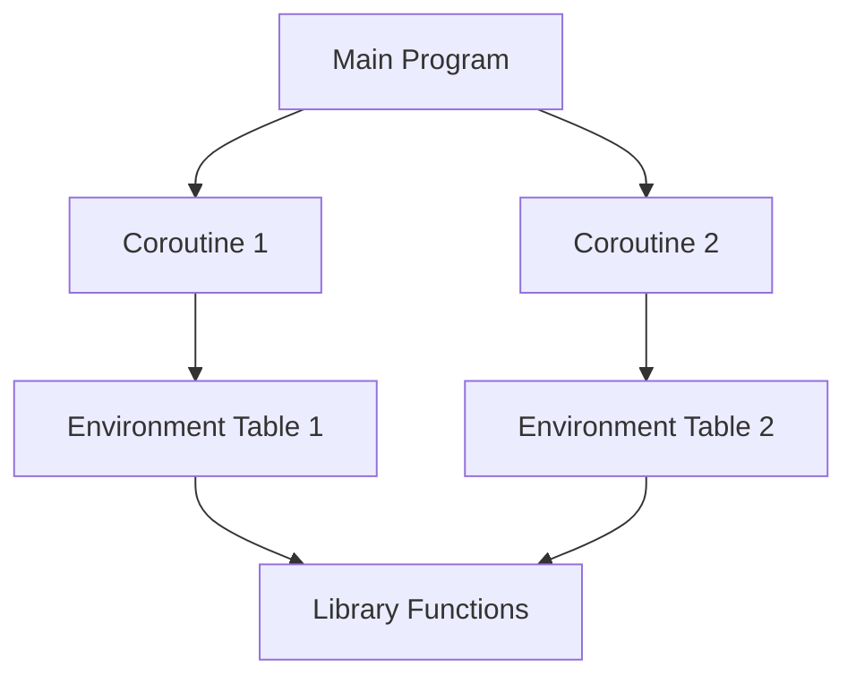

## 9.8 Lua Per-Thread Library Context

Concurrency in programming is a complex yet rewarding endeavor, and Lua provides a unique approach to handling concurrent operations through coroutines. In this section, we delve into the concept of Lua's per-thread library context, focusing on isolating libraries per coroutine to ensure each coroutine has its own context. This is crucial for maintaining state integrity and avoiding interference between coroutines, especially in multi-user applications or when sandboxing is required.

### Isolating Libraries per Coroutine

In Lua, coroutines are a powerful feature that allows for cooperative multitasking. However, when using libraries within coroutines, it's essential to ensure that each coroutine has its own context. This isolation prevents state leakage and ensures that operations in one coroutine do not inadvertently affect another.

#### Implementing Per-Thread Contexts

To implement per-thread contexts in Lua, we need to focus on two main aspects: environment tables and state management.

##### Environment Tables

Environment tables in Lua are used to define the scope in which a piece of code executes. By setting unique environments for each coroutine, we can ensure that libraries and variables are isolated.

```lua
-- Define a function to create a new environment for a coroutine
function createCoroutineWithEnv(func)
    local env = {}
    setmetatable(env, { __index = _G }) -- Inherit from the global environment
    local co = coroutine.create(function()
        setfenv(func, env) -- Set the environment for the coroutine
        func()
    end)
    return co
end

-- Example usage
local function myCoroutine()
    print("Running in coroutine with isolated environment")
end

local co = createCoroutineWithEnv(myCoroutine)
coroutine.resume(co)
```

In this example, we create a new environment for each coroutine by setting a metatable that inherits from the global environment. This allows the coroutine to access global functions while maintaining its own isolated state.

##### State Management

Managing state effectively is crucial to avoid interference between coroutines. This involves ensuring that any shared resources are accessed in a controlled manner.

```lua
-- Shared resource
local sharedCounter = 0

-- Function to safely increment the shared counter
function incrementCounter()
    sharedCounter = sharedCounter + 1
    print("Shared Counter: " .. sharedCounter)
end

-- Coroutine function
local function coroutineTask()
    for i = 1, 5 do
        incrementCounter()
        coroutine.yield()
    end
end

-- Create and run coroutines
local co1 = coroutine.create(coroutineTask)
local co2 = coroutine.create(coroutineTask)

coroutine.resume(co1)
coroutine.resume(co2)
```

In this example, we demonstrate how two coroutines can safely increment a shared counter. By yielding control back to the main program, we ensure that each coroutine operates independently without interfering with the other's state.

### Use Cases and Examples

The concept of per-thread library context is particularly useful in scenarios such as scripting in multi-user applications and sandboxing coroutines.

#### Scripting in Multi-User Applications

In multi-user applications, each user may have their own set of scripts running concurrently. By isolating the library context for each user's scripts, we can prevent one user's actions from affecting another's.

```lua
-- User-specific environment setup
function setupUserEnvironment(userId)
    local userEnv = { userId = userId }
    setmetatable(userEnv, { __index = _G })
    return userEnv
end

-- User script execution
function executeUserScript(userId, script)
    local env = setupUserEnvironment(userId)
    local func = load(script, "userScript", "t", env)
    if func then
        func()
    else
        print("Error loading script for user " .. userId)
    end
end

-- Example scripts for different users
local script1 = "print('User ' .. userId .. ' is running script 1')"
local script2 = "print('User ' .. userId .. ' is running script 2')"

executeUserScript(1, script1)
executeUserScript(2, script2)
```

Here, we create a unique environment for each user by associating a user ID with their environment. This ensures that each user's script runs in isolation, maintaining the integrity of the application.

#### Sandboxing Coroutines

Sandboxing is a technique used to execute untrusted code safely. By isolating the library context, we can restrict the operations that a coroutine can perform, enhancing security.

```lua
-- Sandbox environment with restricted access
local sandboxEnv = {
    print = print, -- Allow printing
    math = math, -- Allow math operations
    -- Restrict access to other global functions
}

-- Function to execute code in a sandbox
function executeInSandbox(code)
    local func = load(code, "sandbox", "t", sandboxEnv)
    if func then
        func()
    else
        print("Error loading sandboxed code")
    end
end

-- Example sandboxed code
local sandboxedCode = [[
    print("Executing sandboxed code")
    print("Math operation: " .. math.sqrt(16))
]]

executeInSandbox(sandboxedCode)
```

In this example, we define a sandbox environment that only allows access to specific functions, such as `print` and `math`. This ensures that the code executed within the sandbox cannot perform unauthorized operations.

### Visualizing Lua Per-Thread Library Context

To better understand the concept of per-thread library context, let's visualize how coroutines interact with their environments.



In this diagram, we see that each coroutine (Coroutine 1 and Coroutine 2) has its own environment table (Environment Table 1 and Environment Table 2). These environment tables provide access to library functions while maintaining isolation between coroutines.

### Try It Yourself

Now that we've covered the basics of Lua's per-thread library context, let's encourage you to experiment with the concepts:

- Modify the `createCoroutineWithEnv` function to include additional libraries or variables in the environment.
- Experiment with different state management techniques to see how they affect coroutine behavior.
- Create a more complex sandbox environment that includes additional restrictions or permissions.

### References and Links

For further reading on Lua coroutines and environment tables, consider exploring the following resources:

- [Lua 5.4 Reference Manual](https://www.lua.org/manual/5.4/)
- [Programming in Lua](https://www.lua.org/pil/contents.html)
- [Lua Users Wiki](http://lua-users.org/wiki/)

### Knowledge Check

Before we conclude, let's reinforce what we've learned with a few questions:

- What is the purpose of isolating libraries per coroutine in Lua?
- How do environment tables help in managing per-thread contexts?
- What are some use cases for per-thread library context in Lua?

### Embrace the Journey

Remember, mastering concurrency in Lua is a journey. As you continue to explore and experiment with these concepts, you'll gain a deeper understanding of how to build robust and efficient applications. Keep experimenting, stay curious, and enjoy the journey!

## Quiz Time!



### What is the primary purpose of isolating libraries per coroutine in Lua?

- [x] To prevent state leakage and ensure each coroutine operates independently
- [ ] To increase the execution speed of coroutines
- [ ] To reduce memory usage
- [ ] To simplify the code structure

> **Explanation:** Isolating libraries per coroutine ensures that each coroutine has its own context, preventing state leakage and interference between coroutines.

### How do environment tables contribute to per-thread contexts in Lua?

- [x] They define the scope in which a piece of code executes, allowing for isolated environments
- [ ] They increase the execution speed of coroutines
- [ ] They reduce memory usage
- [ ] They simplify the code structure

> **Explanation:** Environment tables define the scope for code execution, enabling isolated environments for each coroutine.

### What is a common use case for per-thread library context in Lua?

- [x] Scripting in multi-user applications
- [ ] Increasing execution speed
- [ ] Reducing memory usage
- [ ] Simplifying code structure

> **Explanation:** Per-thread library context is commonly used in multi-user applications to ensure each user's scripts run independently.

### What is the role of state management in per-thread contexts?

- [x] To avoid interference between coroutines by managing shared resources
- [ ] To increase execution speed
- [ ] To reduce memory usage
- [ ] To simplify code structure

> **Explanation:** State management is crucial for avoiding interference between coroutines by ensuring shared resources are accessed in a controlled manner.

### Which of the following is a benefit of sandboxing coroutines?

- [x] Enhancing security by restricting operations
- [ ] Increasing execution speed
- [ ] Reducing memory usage
- [ ] Simplifying code structure

> **Explanation:** Sandboxing enhances security by restricting the operations that a coroutine can perform, preventing unauthorized actions.

### What does the `setfenv` function do in Lua?

- [x] Sets the environment for a function or coroutine
- [ ] Increases execution speed
- [ ] Reduces memory usage
- [ ] Simplifies code structure

> **Explanation:** The `setfenv` function sets the environment for a function or coroutine, allowing for isolated execution contexts.

### How can you ensure that a coroutine has access to global functions while maintaining its own state?

- [x] By setting a metatable that inherits from the global environment
- [ ] By increasing execution speed
- [ ] By reducing memory usage
- [ ] By simplifying code structure

> **Explanation:** Setting a metatable that inherits from the global environment allows a coroutine to access global functions while maintaining its own state.

### What is a potential pitfall of not isolating libraries per coroutine?

- [x] State leakage and interference between coroutines
- [ ] Increased execution speed
- [ ] Reduced memory usage
- [ ] Simplified code structure

> **Explanation:** Not isolating libraries per coroutine can lead to state leakage and interference between coroutines, affecting application integrity.

### What is the benefit of using a sandbox environment in Lua?

- [x] Restricting access to specific functions for security
- [ ] Increasing execution speed
- [ ] Reducing memory usage
- [ ] Simplifying code structure

> **Explanation:** A sandbox environment restricts access to specific functions, enhancing security by preventing unauthorized operations.

### True or False: Environment tables can only be used for coroutines in Lua.

- [ ] True
- [x] False

> **Explanation:** Environment tables can be used for both functions and coroutines in Lua, allowing for isolated execution contexts.


