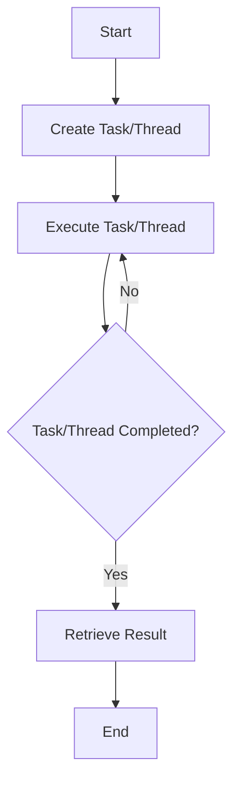

## 9.9 Concurrency Libraries in Lua

Concurrency is a fundamental aspect of modern software development, allowing applications to perform multiple tasks simultaneously, thereby improving performance and responsiveness. In Lua, a lightweight and flexible scripting language, concurrency can be achieved through various libraries that provide powerful tools for managing parallel execution. In this section, we will explore some of the most popular concurrency libraries in Lua, including LuaLanes, LuaTask, and LuaSockets, and demonstrate how they can be leveraged to build high-performance applications.

### Leveraging Existing Libraries

Concurrency in Lua can be achieved by utilizing existing libraries that provide abstractions and tools for managing concurrent tasks. These libraries simplify the process of implementing concurrency, allowing developers to focus on the logic of their applications rather than the intricacies of concurrent execution.

#### Popular Libraries

1. **LuaLanes**: LuaLanes is a library that provides multithreading capabilities in Lua. It allows developers to create and manage multiple threads, enabling parallel execution of tasks. LuaLanes is particularly useful for CPU-bound tasks that can benefit from parallel processing.

2. **LuaTask**: LuaTask is a task-based concurrency library that provides a simple and efficient way to manage concurrent tasks. It is designed to be lightweight and easy to use, making it a great choice for applications that require task-based concurrency.

3. **LuaSockets and Asynchronous I/O**: LuaSockets is a library that provides support for network communication in Lua. It includes features for asynchronous I/O, allowing applications to handle network operations without blocking the main execution thread. This is particularly useful for building high-performance network servers and applications that require real-time communication.

### LuaLanes: Multithreading with Lua

LuaLanes is a powerful library that brings multithreading capabilities to Lua. It allows developers to create and manage multiple threads, enabling parallel execution of tasks. This is particularly useful for CPU-bound tasks that can benefit from parallel processing.

#### Key Features of LuaLanes

- **Thread Management**: LuaLanes provides a simple API for creating and managing threads. Developers can create new threads using the `lanes.gen` function, which takes a Lua function as an argument and returns a new thread.

- **Data Sharing**: LuaLanes supports data sharing between threads through the use of lanes and lanes-specific data structures. This allows threads to communicate and share data efficiently.

- **Error Handling**: LuaLanes includes robust error handling mechanisms, allowing developers to catch and handle errors that occur within threads.

#### Sample Code Snippet

```lua
local lanes = require "lanes".configure()

-- Define a function to be executed in a separate thread
local function heavyComputation(x)
    local result = 0
    for i = 1, x do
        result = result + i
    end
    return result
end

-- Create a new thread using lanes
local thread = lanes.gen("*", heavyComputation)(1000000)

-- Wait for the thread to complete and get the result
local result = thread[1]
print("Result of heavy computation:", result)
```

In this example, we define a function `heavyComputation` that performs a CPU-intensive task. We then create a new thread using `lanes.gen`, passing the function as an argument. The thread executes the function in parallel, and we retrieve the result once it completes.

### LuaTask: Task-Based Concurrency

LuaTask is a lightweight library that provides task-based concurrency in Lua. It is designed to be simple and efficient, making it a great choice for applications that require task-based concurrency.

#### Key Features of LuaTask

- **Task Management**: LuaTask provides a simple API for creating and managing tasks. Developers can create new tasks using the `task.create` function, which takes a Lua function as an argument and returns a new task.

- **Synchronization**: LuaTask includes synchronization primitives such as mutexes and semaphores, allowing developers to coordinate the execution of tasks.

- **Event Handling**: LuaTask supports event-driven programming, allowing tasks to wait for and respond to events.

#### Sample Code Snippet

```lua
local task = require "task"

-- Define a function to be executed as a task
local function printNumbers()
    for i = 1, 10 do
        print("Number:", i)
        task.sleep(1) -- Sleep for 1 second
    end
end

-- Create a new task
local t = task.create(printNumbers)

-- Start the task
task.start(t)

-- Wait for the task to complete
task.wait(t)
```

In this example, we define a function `printNumbers` that prints numbers from 1 to 10, pausing for 1 second between each number. We create a new task using `task.create`, passing the function as an argument. The task is then started using `task.start`, and we wait for it to complete using `task.wait`.

### LuaSockets and Asynchronous I/O

LuaSockets is a library that provides support for network communication in Lua. It includes features for asynchronous I/O, allowing applications to handle network operations without blocking the main execution thread. This is particularly useful for building high-performance network servers and applications that require real-time communication.

#### Key Features of LuaSockets

- **Network Communication**: LuaSockets provides a comprehensive API for network communication, including support for TCP, UDP, and HTTP protocols.

- **Asynchronous I/O**: LuaSockets supports asynchronous I/O, allowing applications to perform network operations without blocking the main execution thread.

- **Event-Driven Programming**: LuaSockets includes support for event-driven programming, allowing applications to respond to network events as they occur.

#### Sample Code Snippet

```lua
local socket = require "socket"

-- Create a TCP server
local server = assert(socket.bind("*", 12345))
local ip, port = server:getsockname()

print("Server listening on " .. ip .. ":" .. port)

-- Accept a client connection
local client = server:accept()

-- Receive data from the client
local data, err = client:receive()

if not err then
    print("Received data from client:", data)
end

-- Send a response to the client
client:send("Hello from server!\n")

-- Close the client connection
client:close()
```

In this example, we create a simple TCP server using LuaSockets. The server listens for incoming connections on port 12345 and accepts a client connection. It then receives data from the client and sends a response back. This demonstrates how LuaSockets can be used to build network applications with asynchronous I/O.

### Use Cases and Examples

Concurrency libraries in Lua can be used in a variety of applications to improve performance and efficiency. Here are some common use cases and examples:

#### High-Performance Network Servers

Concurrency libraries such as LuaSockets can be used to build high-performance network servers that handle multiple client connections simultaneously. By leveraging asynchronous I/O, these servers can perform network operations without blocking the main execution thread, resulting in improved performance and responsiveness.

#### Parallel Data Processing

Libraries like LuaLanes and LuaTask can be used to perform parallel data processing, allowing applications to process large datasets more efficiently. By distributing the workload across multiple threads or tasks, these libraries can significantly reduce the time required to process data.

### Visualizing Concurrency in Lua

To better understand how concurrency libraries work in Lua, let's visualize the process of creating and managing concurrent tasks using a flowchart.



This flowchart illustrates the process of creating and managing concurrent tasks in Lua. We start by creating a task or thread, execute it, and check if it has completed. If it has, we retrieve the result; otherwise, we continue executing the task or thread.

### References and Links

- [LuaLanes Documentation](https://lualanes.github.io/)
- [LuaTask Documentation](https://luarocks.org/modules/luaforge/luatask)
- [LuaSockets Documentation](http://w3.impa.br/~diego/software/luasocket/)

### Knowledge Check

Before we conclude, let's pose a few questions to reinforce the concepts covered in this section.

1. What are the key features of LuaLanes?
2. How does LuaTask support task-based concurrency?
3. What is the advantage of using asynchronous I/O in LuaSockets?
4. How can concurrency libraries be used to improve the performance of network servers?
5. What is the purpose of synchronization primitives in LuaTask?

### Embrace the Journey

Remember, mastering concurrency in Lua is a journey. As you explore these libraries and experiment with different concurrency patterns, you'll gain a deeper understanding of how to build efficient and responsive applications. Keep experimenting, stay curious, and enjoy the journey!

## Quiz Time!



### What is the primary purpose of LuaLanes?

- [x] To provide multithreading capabilities in Lua
- [ ] To handle network communication
- [ ] To manage file I/O operations
- [ ] To create graphical user interfaces

> **Explanation:** LuaLanes is a library that provides multithreading capabilities in Lua, allowing developers to create and manage multiple threads for parallel execution.

### Which library is designed for task-based concurrency in Lua?

- [ ] LuaLanes
- [x] LuaTask
- [ ] LuaSockets
- [ ] LuaFileSystem

> **Explanation:** LuaTask is a task-based concurrency library that provides a simple and efficient way to manage concurrent tasks in Lua.

### What feature of LuaSockets allows for non-blocking network operations?

- [ ] Multithreading
- [ ] Task Management
- [x] Asynchronous I/O
- [ ] File Handling

> **Explanation:** LuaSockets supports asynchronous I/O, allowing applications to perform network operations without blocking the main execution thread.

### How can LuaLanes improve the performance of CPU-bound tasks?

- [x] By enabling parallel execution of tasks
- [ ] By optimizing memory usage
- [ ] By reducing code complexity
- [ ] By simplifying error handling

> **Explanation:** LuaLanes allows for parallel execution of tasks, which can significantly improve the performance of CPU-bound tasks by utilizing multiple threads.

### What synchronization primitive is provided by LuaTask?

- [x] Mutexes
- [ ] Threads
- [ ] Sockets
- [ ] Files

> **Explanation:** LuaTask includes synchronization primitives such as mutexes, which allow developers to coordinate the execution of tasks.

### Which library is best suited for building high-performance network servers?

- [ ] LuaLanes
- [ ] LuaTask
- [x] LuaSockets
- [ ] LuaFileSystem

> **Explanation:** LuaSockets is well-suited for building high-performance network servers due to its support for asynchronous I/O and comprehensive network communication API.

### What is the main advantage of using concurrency libraries in Lua?

- [x] Improved performance and responsiveness
- [ ] Simplified code structure
- [ ] Enhanced graphical capabilities
- [ ] Reduced memory usage

> **Explanation:** Concurrency libraries in Lua improve performance and responsiveness by allowing applications to perform multiple tasks simultaneously.

### How does LuaTask handle event-driven programming?

- [x] By allowing tasks to wait for and respond to events
- [ ] By providing graphical user interface components
- [ ] By optimizing file I/O operations
- [ ] By managing network connections

> **Explanation:** LuaTask supports event-driven programming by allowing tasks to wait for and respond to events, enabling efficient task management.

### What is a common use case for LuaLanes?

- [x] Parallel data processing
- [ ] File encryption
- [ ] User authentication
- [ ] Image rendering

> **Explanation:** LuaLanes is commonly used for parallel data processing, allowing applications to process large datasets more efficiently by distributing the workload across multiple threads.

### True or False: LuaSockets can only be used for TCP communication.

- [ ] True
- [x] False

> **Explanation:** LuaSockets supports multiple network protocols, including TCP, UDP, and HTTP, making it versatile for various network communication needs.


