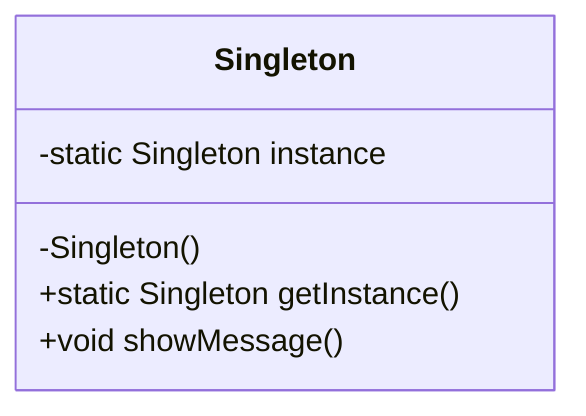

## 1.1 What Are Design Patterns?

In the realm of software development, design patterns are akin to blueprints for solving common problems. They are not finished designs that can be directly transformed into code but are templates that guide developers in crafting solutions. In this section, we will delve into the essence of design patterns, their significance in PHP development, and how they facilitate a shared understanding among developers.

### Definition of Design Patterns

Design patterns are established solutions to recurring problems in software design. They encapsulate best practices that have evolved over time, providing a framework for addressing specific challenges in a consistent and efficient manner. The concept of design patterns was popularized by the "Gang of Four" (GoF) in their seminal book, "Design Patterns: Elements of Reusable Object-Oriented Software," which introduced 23 foundational patterns.

### The Role of Design Patterns in Simplifying Complex Coding Tasks

Design patterns play a crucial role in simplifying complex coding tasks by offering a structured approach to problem-solving. They help developers avoid reinventing the wheel by providing tried-and-tested solutions that can be adapted to specific needs. By leveraging design patterns, developers can:

- **Enhance Code Reusability:** Patterns promote the reuse of code components, reducing redundancy and improving maintainability.
- **Improve Code Readability:** By following established patterns, code becomes more intuitive and easier to understand for other developers.
- **Facilitate Communication:** Patterns provide a common vocabulary, enabling developers to communicate ideas more effectively and collaborate efficiently.
- **Ensure Robustness:** Patterns often incorporate best practices that enhance the reliability and stability of the software.

### How Design Patterns Provide a Shared Language for Developers

One of the most significant benefits of design patterns is their ability to provide a shared language for developers. This shared language transcends individual coding styles and preferences, allowing developers to discuss and implement solutions with a common understanding. For instance, when a developer mentions the "Singleton Pattern," others immediately grasp the concept and its implications without needing further explanation.

### Key Components of Design Patterns

To fully understand design patterns, it's essential to grasp their key components:

- **Pattern Name:** A descriptive name that conveys the essence of the pattern.
- **Problem:** The specific issue or challenge that the pattern addresses.
- **Solution:** A general arrangement of objects and classes that solve the problem.
- **Consequences:** The trade-offs and impacts of applying the pattern, including its benefits and potential drawbacks.

### Categories of Design Patterns

Design patterns are typically categorized into three main types:

1. **Creational Patterns:** These patterns deal with object creation mechanisms, optimizing the instantiation process. Examples include Singleton, Factory Method, and Builder patterns.

2. **Structural Patterns:** These patterns focus on the composition of classes and objects, facilitating the creation of complex structures. Examples include Adapter, Composite, and Decorator patterns.

3. **Behavioral Patterns:** These patterns address communication between objects, defining how they interact and collaborate. Examples include Observer, Strategy, and Command patterns.

### Code Example: Singleton Pattern in PHP

Let's explore a simple example of the Singleton Pattern in PHP. The Singleton Pattern ensures that a class has only one instance and provides a global point of access to it.

```php
<?php

class Singleton {
    private static $instance = null;

    // Private constructor to prevent direct instantiation
    private function __construct() {}

    // Static method to get the single instance of the class
    public static function getInstance() {
        if (self::$instance === null) {
            self::$instance = new Singleton();
        }
        return self::$instance;
    }

    public function showMessage() {
        echo "Hello, I am a Singleton!";
    }
}

// Usage
$singleton = Singleton::getInstance();
$singleton->showMessage();

?>
```

**Explanation:**

- **Private Constructor:** The constructor is private to prevent direct instantiation.
- **Static Instance:** A static variable holds the single instance of the class.
- **getInstance Method:** This method checks if an instance already exists; if not, it creates one.

### Visualizing Design Patterns

To better understand the relationships and interactions within design patterns, let's visualize the Singleton Pattern using a class diagram.



**Diagram Explanation:**

- **Singleton Class:** Contains a static instance and methods to manage the singleton instance.
- **Private Constructor:** Ensures that the class cannot be instantiated directly.

### Try It Yourself

Experiment with the Singleton Pattern by modifying the code example:

- **Add a Counter:** Implement a counter to track how many times `getInstance()` is called.
- **Thread Safety:** Modify the pattern to ensure thread safety in a multi-threaded environment.

### Further Reading

For more in-depth exploration of design patterns, consider the following resources:

- [Design Patterns: Elements of Reusable Object-Oriented Software](https://en.wikipedia.org/wiki/Design_Patterns) by Erich Gamma, Richard Helm, Ralph Johnson, and John Vlissides.
- [PHP: The Right Way](https://phptherightway.com/) - A comprehensive guide to modern PHP practices.

### Knowledge Check

- **Question:** What are the three main categories of design patterns?
- **Exercise:** Implement a simple Factory Method Pattern in PHP.

### Embrace the Journey

Remember, understanding design patterns is a journey. As you continue to explore and apply these patterns, you'll gain deeper insights into software design and architecture. Keep experimenting, stay curious, and enjoy the process of mastering design patterns in PHP.

## Quiz: What Are Design Patterns?



### What is the primary purpose of design patterns in software development?

- [x] To provide reusable solutions to common problems
- [ ] To replace programming languages
- [ ] To eliminate the need for coding
- [ ] To create new programming paradigms

> **Explanation:** Design patterns offer reusable solutions to common problems, enhancing code efficiency and maintainability.

### Which of the following is NOT a category of design patterns?

- [ ] Creational
- [ ] Structural
- [x] Functional
- [ ] Behavioral

> **Explanation:** The main categories of design patterns are Creational, Structural, and Behavioral.

### What is a key benefit of using design patterns?

- [x] They enhance code readability and maintainability
- [ ] They increase code complexity
- [ ] They require more lines of code
- [ ] They are only useful for large projects

> **Explanation:** Design patterns improve code readability and maintainability by providing structured solutions.

### How do design patterns facilitate communication among developers?

- [x] By providing a shared vocabulary
- [ ] By eliminating the need for documentation
- [ ] By enforcing strict coding standards
- [ ] By automating code generation

> **Explanation:** Design patterns offer a shared vocabulary that helps developers communicate ideas effectively.

### What is the Singleton Pattern used for?

- [x] Ensuring a class has only one instance
- [ ] Creating multiple instances of a class
- [ ] Managing collections of objects
- [ ] Defining object behavior

> **Explanation:** The Singleton Pattern ensures that a class has only one instance and provides a global access point.

### In the Singleton Pattern, why is the constructor private?

- [x] To prevent direct instantiation
- [ ] To allow multiple instances
- [ ] To enhance performance
- [ ] To simplify the code

> **Explanation:** The private constructor prevents direct instantiation, ensuring only one instance is created.

### Which method is used to access the single instance in the Singleton Pattern?

- [x] getInstance()
- [ ] createInstance()
- [ ] newInstance()
- [ ] accessInstance()

> **Explanation:** The `getInstance()` method is used to access the single instance of the Singleton class.

### What is a common consequence of applying design patterns?

- [x] Improved code maintainability
- [ ] Increased code redundancy
- [ ] Reduced code readability
- [ ] Decreased code efficiency

> **Explanation:** Design patterns improve code maintainability by providing structured and reusable solutions.

### Which design pattern category focuses on object creation mechanisms?

- [x] Creational
- [ ] Structural
- [ ] Behavioral
- [ ] Functional

> **Explanation:** Creational patterns focus on optimizing object creation mechanisms.

### True or False: Design patterns can eliminate the need for coding.

- [ ] True
- [x] False

> **Explanation:** Design patterns provide templates for solving problems but do not eliminate the need for coding.


