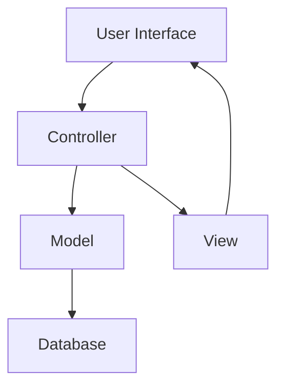

## 1.3 Importance of Design Patterns in PHP

Design patterns are a cornerstone of software engineering, providing proven solutions to common problems in software design. In PHP, as in other programming languages, design patterns play a crucial role in creating robust, maintainable, and scalable applications. This section delves into the importance of design patterns in PHP, highlighting how they enhance code readability, maintainability, and facilitate collaboration in development projects.

### Enhancing Code Readability and Maintainability

One of the primary benefits of using design patterns in PHP is the enhancement of code readability and maintainability. Design patterns provide a standard vocabulary for developers, allowing them to communicate complex ideas succinctly. When a developer mentions a "Singleton" or "Factory" pattern, other developers familiar with these patterns immediately understand the structure and intent of the code.

#### Code Readability

Design patterns improve code readability by providing a clear structure and organization. For instance, consider the Singleton pattern, which ensures a class has only one instance and provides a global point of access to it. Here's a simple implementation in PHP:

```php
<?php

class Singleton {
    private static $instance = null;

    // Private constructor to prevent direct object creation
    private function __construct() {}

    // Static method to get the single instance of the class
    public static function getInstance() {
        if (self::$instance === null) {
            self::$instance = new Singleton();
        }
        return self::$instance;
    }

    // Example method
    public function doSomething() {
        echo "Doing something!";
    }
}

// Usage
$singleton = Singleton::getInstance();
$singleton->doSomething();
?>
```

In this example, the Singleton pattern makes it immediately clear that the class is designed to have only one instance. This clarity reduces the cognitive load on developers, making it easier to understand and work with the code.

#### Code Maintainability

Design patterns also enhance maintainability by promoting best practices and reducing code duplication. By adhering to well-established patterns, developers can create code that is easier to modify and extend. For example, the Factory Method pattern allows for the creation of objects without specifying the exact class of object that will be created. This promotes loose coupling and enhances flexibility:

```php
<?php

interface Product {
    public function operation(): string;
}

class ConcreteProductA implements Product {
    public function operation(): string {
        return "Result of ConcreteProductA";
    }
}

class ConcreteProductB implements Product {
    public function operation(): string {
        return "Result of ConcreteProductB";
    }
}

abstract class Creator {
    abstract public function factoryMethod(): Product;

    public function someOperation(): string {
        $product = $this->factoryMethod();
        return "Creator: The same creator's code has just worked with " . $product->operation();
    }
}

class ConcreteCreatorA extends Creator {
    public function factoryMethod(): Product {
        return new ConcreteProductA();
    }
}

class ConcreteCreatorB extends Creator {
    public function factoryMethod(): Product {
        return new ConcreteProductB();
    }
}

// Usage
function clientCode(Creator $creator) {
    echo "Client: I'm not aware of the creator's class, but it still works.\n"
        . $creator->someOperation();
}

echo "App: Launched with the ConcreteCreatorA.\n";
clientCode(new ConcreteCreatorA());
echo "\n\n";

echo "App: Launched with the ConcreteCreatorB.\n";
clientCode(new ConcreteCreatorB());
?>
```

In this example, the Factory Method pattern allows for the creation of different products without changing the client code. This makes it easier to maintain and extend the application as new product types are added.

### Impact on Collaborative PHP Projects

In collaborative projects, design patterns serve as a common language that all team members can understand. This shared understanding is crucial for effective communication and collaboration, especially in large teams or distributed environments.

#### Facilitating Communication

Design patterns facilitate communication by providing a set of well-defined terms and concepts. When team members discuss the implementation of a pattern, they can focus on the design and functionality rather than the specifics of the code. This abstraction allows for more productive discussions and decision-making.

#### Streamlining Development Processes

By using design patterns, teams can streamline their development processes. Patterns provide a blueprint for solving common problems, reducing the time and effort required to design and implement solutions from scratch. This efficiency is particularly valuable in agile environments, where rapid iteration and delivery are essential.

### Real-World Examples of PHP Applications Benefiting from Design Patterns

Many real-world PHP applications leverage design patterns to achieve scalability, maintainability, and robustness. Let's explore a few examples:

#### Content Management Systems (CMS)

Content Management Systems like WordPress and Drupal extensively use design patterns to manage content, themes, and plugins. For instance, the Observer pattern is often used to implement event-driven architectures, allowing plugins to respond to various events within the CMS.

#### E-commerce Platforms

E-commerce platforms such as Magento and WooCommerce utilize design patterns to handle complex business logic, manage product catalogs, and process transactions. The Strategy pattern, for example, is used to implement different payment gateways, allowing the platform to switch between payment methods seamlessly.

#### Web Frameworks

PHP frameworks like Laravel and Symfony are built on a foundation of design patterns. The Model-View-Controller (MVC) pattern is a core component of these frameworks, separating concerns and promoting organized code. This separation makes it easier to develop, test, and maintain web applications.

### Visualizing the Role of Design Patterns in PHP

To better understand the role of design patterns in PHP, let's visualize how they fit into the development process. The following diagram illustrates the interaction between different components in an MVC architecture, a common design pattern used in PHP frameworks:



In this diagram, the Controller handles user input, interacts with the Model to retrieve or update data, and then updates the View to reflect any changes. This separation of concerns is a hallmark of the MVC pattern, promoting organized and maintainable code.

### Try It Yourself: Experimenting with Design Patterns

To deepen your understanding of design patterns, try modifying the code examples provided in this section. For instance, experiment with the Factory Method pattern by adding a new product type and corresponding creator class. Observe how the pattern allows you to extend the application without modifying existing code.

### Knowledge Check: Key Takeaways

- **Design patterns enhance code readability and maintainability** by providing a clear structure and reducing code duplication.
- **In collaborative projects**, design patterns facilitate communication and streamline development processes.
- **Real-world PHP applications** such as CMS, e-commerce platforms, and web frameworks benefit from design patterns to achieve scalability and robustness.

### Embrace the Journey

Remember, mastering design patterns is a journey. As you continue to explore and implement these patterns in your PHP projects, you'll gain a deeper understanding of their benefits and how they can transform your development process. Keep experimenting, stay curious, and enjoy the journey!

## Quiz: Importance of Design Patterns in PHP



### What is one of the primary benefits of using design patterns in PHP?

- [x] Enhancing code readability and maintainability
- [ ] Increasing code complexity
- [ ] Reducing the need for documentation
- [ ] Eliminating the need for testing

> **Explanation:** Design patterns enhance code readability and maintainability by providing a clear structure and reducing code duplication.

### How do design patterns facilitate communication in collaborative projects?

- [x] By providing a common language for developers
- [ ] By increasing the number of meetings
- [ ] By reducing the need for documentation
- [ ] By eliminating the need for testing

> **Explanation:** Design patterns provide a common language that all team members can understand, facilitating communication and collaboration.

### Which design pattern is commonly used in PHP frameworks to separate concerns?

- [x] Model-View-Controller (MVC)
- [ ] Singleton
- [ ] Factory Method
- [ ] Observer

> **Explanation:** The Model-View-Controller (MVC) pattern is commonly used in PHP frameworks to separate concerns and promote organized code.

### What is the role of the Controller in the MVC pattern?

- [x] Handling user input and updating the View
- [ ] Storing data in the database
- [ ] Rendering the user interface
- [ ] Managing application configuration

> **Explanation:** In the MVC pattern, the Controller handles user input, interacts with the Model, and updates the View.

### Which pattern is used to ensure a class has only one instance?

- [x] Singleton
- [ ] Factory Method
- [ ] Observer
- [ ] Strategy

> **Explanation:** The Singleton pattern ensures a class has only one instance and provides a global point of access to it.

### How does the Factory Method pattern enhance maintainability?

- [x] By allowing the creation of objects without specifying the exact class
- [ ] By increasing code complexity
- [ ] By reducing the need for testing
- [ ] By eliminating the need for documentation

> **Explanation:** The Factory Method pattern enhances maintainability by allowing the creation of objects without specifying the exact class, promoting loose coupling.

### What is a common use of the Observer pattern in PHP applications?

- [x] Implementing event-driven architectures
- [ ] Managing database connections
- [ ] Rendering user interfaces
- [ ] Handling user authentication

> **Explanation:** The Observer pattern is commonly used to implement event-driven architectures, allowing components to respond to events.

### How do design patterns streamline development processes?

- [x] By providing a blueprint for solving common problems
- [ ] By increasing the number of meetings
- [ ] By reducing the need for documentation
- [ ] By eliminating the need for testing

> **Explanation:** Design patterns streamline development processes by providing a blueprint for solving common problems, reducing the time and effort required to design solutions from scratch.

### Which PHP application type benefits from the Strategy pattern for implementing different payment gateways?

- [x] E-commerce platforms
- [ ] Content Management Systems
- [ ] Web frameworks
- [ ] Blogging platforms

> **Explanation:** E-commerce platforms benefit from the Strategy pattern for implementing different payment gateways, allowing seamless switching between payment methods.

### True or False: Design patterns eliminate the need for testing in PHP applications.

- [ ] True
- [x] False

> **Explanation:** Design patterns do not eliminate the need for testing. They enhance code readability and maintainability, but testing remains essential to ensure the correctness and reliability of the application.


