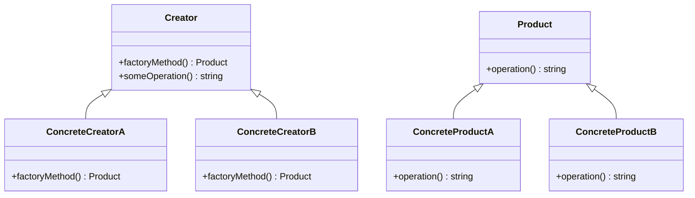
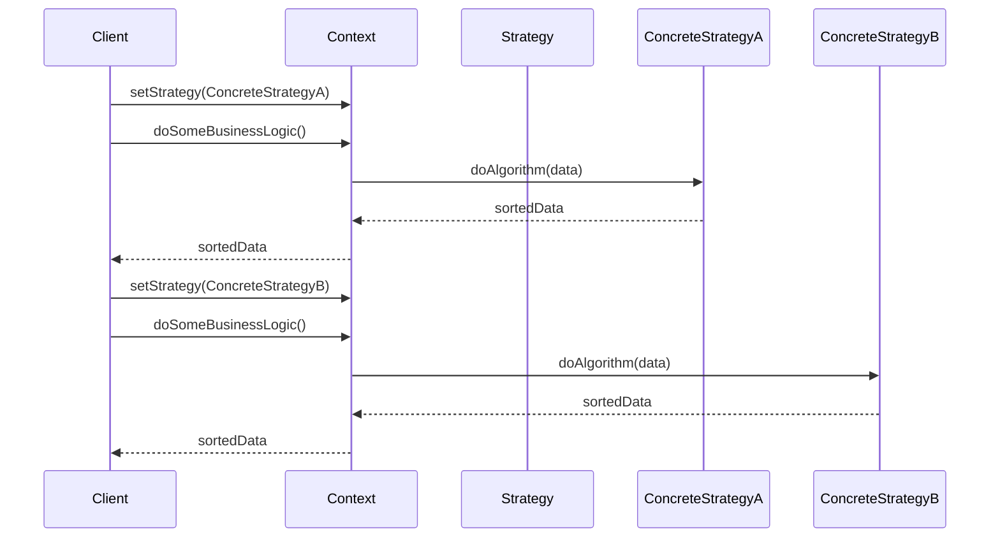

## 1.4 Benefits of Using Design Patterns in PHP

Design patterns are a cornerstone of software engineering, providing time-tested solutions to common problems. In PHP, leveraging design patterns can significantly enhance the quality and maintainability of your code. Let's delve into the myriad benefits of using design patterns in PHP, focusing on promoting best practices, facilitating code reuse, and improving scalability and flexibility in applications.

### Promoting Best Practices and Coding Standards

Design patterns encapsulate best practices that have been refined over years of software development. By adopting these patterns, PHP developers can ensure their code adheres to established standards, leading to more robust and reliable applications.

#### Consistency Across Projects

Design patterns provide a common language for developers, fostering consistency across projects. When developers use patterns, they follow a structured approach that is recognizable to others familiar with the same patterns. This consistency is crucial in collaborative environments where multiple developers contribute to the same codebase.

#### Enhancing Code Readability

Patterns improve code readability by providing clear and recognizable structures. For instance, the Singleton pattern is immediately recognizable and understood by developers, indicating a single instance of a class is used throughout the application. This clarity reduces the cognitive load on developers, making it easier to understand and maintain the code.

#### Encouraging Modularity

Design patterns encourage modularity by promoting the separation of concerns. For example, the Model-View-Controller (MVC) pattern divides an application into three interconnected components, each responsible for a specific aspect of the application. This separation makes it easier to manage and update individual components without affecting others.

### Facilitating Code Reuse and Reducing Redundancy

One of the primary advantages of design patterns is their ability to facilitate code reuse, which reduces redundancy and accelerates development.

#### Reusable Solutions

Design patterns offer reusable solutions to common problems, allowing developers to apply the same pattern across different projects. This reuse saves time and effort, as developers do not need to reinvent the wheel for every new project.

#### Reducing Code Duplication

By using design patterns, developers can reduce code duplication. Patterns like the Factory Method or Abstract Factory allow for the creation of objects without specifying the exact class of object that will be created. This abstraction reduces the need to duplicate code for object creation, leading to cleaner and more maintainable code.

#### Example: Factory Method Pattern

```php
<?php

// Define an interface for creating an object
interface Product {
    public function operation(): string;
}

// Concrete Products implement the Product interface
class ConcreteProductA implements Product {
    public function operation(): string {
        return "{Result of the ConcreteProductA}";
    }
}

class ConcreteProductB implements Product {
    public function operation(): string {
        return "{Result of the ConcreteProductB}";
    }
}

// The Creator class declares the factory method that returns new product objects
abstract class Creator {
    abstract public function factoryMethod(): Product;

    public function someOperation(): string {
        $product = $this->factoryMethod();
        return "Creator: The same creator's code has just worked with " . $product->operation();
    }
}

// Concrete Creators override the factory method to change the resulting product's type
class ConcreteCreatorA extends Creator {
    public function factoryMethod(): Product {
        return new ConcreteProductA();
    }
}

class ConcreteCreatorB extends Creator {
    public function factoryMethod(): Product {
        return new ConcreteProductB();
    }
}

// Client code
function clientCode(Creator $creator) {
    echo "Client: I'm not aware of the creator's class, but it still works.\n"
        . $creator->someOperation();
}

echo "App: Launched with the ConcreteCreatorA.\n";
clientCode(new ConcreteCreatorA());
echo "\n\n";

echo "App: Launched with the ConcreteCreatorB.\n";
clientCode(new ConcreteCreatorB());

?>
```

**Try It Yourself:** Modify the `ConcreteProductA` and `ConcreteProductB` classes to add new functionality. Observe how the Factory Method pattern allows you to extend functionality without altering the client code.

### Improving Scalability and Flexibility in Applications

Design patterns enhance the scalability and flexibility of PHP applications, making them adaptable to changing requirements.

#### Scalability Through Patterns

Patterns like the Singleton or Multiton can manage resources efficiently, ensuring that applications scale without unnecessary overhead. For instance, the Singleton pattern ensures a class has only one instance, reducing memory usage and improving performance.

#### Flexibility with Strategy Pattern

The Strategy pattern allows an application to select an algorithm at runtime, providing flexibility to adapt to different scenarios. This pattern is particularly useful in applications that require dynamic behavior changes.

#### Example: Strategy Pattern

```php
<?php

// The Strategy interface declares operations common to all supported versions of some algorithm
interface Strategy {
    public function doAlgorithm(array $data): array;
}

// Concrete Strategies implement the algorithm while following the base Strategy interface
class ConcreteStrategyA implements Strategy {
    public function doAlgorithm(array $data): array {
        sort($data);
        return $data;
    }
}

class ConcreteStrategyB implements Strategy {
    public function doAlgorithm(array $data): array {
        rsort($data);
        return $data;
    }
}

// The Context defines the interface of interest to clients
class Context {
    private $strategy;

    public function __construct(Strategy $strategy) {
        $this->strategy = $strategy;
    }

    public function setStrategy(Strategy $strategy) {
        $this->strategy = $strategy;
    }

    public function doSomeBusinessLogic(): void {
        echo "Context: Sorting data using the strategy (not sure how it'll do it)\n";
        $result = $this->strategy->doAlgorithm(["a", "b", "c", "d", "e"]);
        echo implode(",", $result) . "\n";
    }
}

// Client code
$context = new Context(new ConcreteStrategyA());
echo "Client: Strategy is set to normal sorting.\n";
$context->doSomeBusinessLogic();

echo "\n";

echo "Client: Strategy is set to reverse sorting.\n";
$context->setStrategy(new ConcreteStrategyB());
$context->doSomeBusinessLogic();

?>
```

**Try It Yourself:** Implement a new strategy that sorts data in a custom order. Notice how the Strategy pattern allows you to switch algorithms without modifying the context.

### Visualizing Design Patterns in PHP

To better understand how design patterns work, let's visualize some of the key concepts using diagrams.

#### Class Diagram: Factory Method Pattern



**Description:** This class diagram illustrates the Factory Method pattern, showing the relationship between the Creator, Concrete Creators, and Products.

#### Sequence Diagram: Strategy Pattern



**Description:** This sequence diagram demonstrates the Strategy pattern, showing how the Context interacts with different strategies to perform operations.

### References and Links

- [Design Patterns: Elements of Reusable Object-Oriented Software](https://en.wikipedia.org/wiki/Design_Patterns) - A foundational book on design patterns.
- [PHP: The Right Way](https://phptherightway.com/) - A community-driven initiative to provide best practices for PHP development.
- [MDN Web Docs: Design Patterns](https://developer.mozilla.org/en-US/docs/Web/JavaScript/Guide/Design_Patterns) - A comprehensive guide to design patterns.

### Knowledge Check

- What are the benefits of using design patterns in PHP?
- How do design patterns promote best practices and coding standards?
- Explain how design patterns facilitate code reuse and reduce redundancy.
- Describe how design patterns improve scalability and flexibility in applications.
- Provide examples of design patterns that enhance modularity.

### Embrace the Journey

Remember, mastering design patterns is a journey. As you continue to explore and apply these patterns, you'll find your PHP applications becoming more robust, maintainable, and scalable. Keep experimenting, stay curious, and enjoy the process of becoming a more proficient PHP developer!

## Quiz: Benefits of Using Design Patterns in PHP



### What is one of the primary benefits of using design patterns in PHP?

- [x] They promote best practices and coding standards.
- [ ] They make code harder to read.
- [ ] They increase redundancy in code.
- [ ] They limit the flexibility of applications.

> **Explanation:** Design patterns promote best practices and coding standards, making code more maintainable and understandable.

### How do design patterns facilitate code reuse?

- [x] By providing reusable solutions to common problems.
- [ ] By duplicating code across projects.
- [ ] By making code more complex.
- [ ] By reducing the need for documentation.

> **Explanation:** Design patterns provide reusable solutions, allowing developers to apply the same pattern across different projects, reducing redundancy.

### Which pattern is known for ensuring a class has only one instance?

- [x] Singleton Pattern
- [ ] Factory Method Pattern
- [ ] Strategy Pattern
- [ ] Observer Pattern

> **Explanation:** The Singleton pattern ensures a class has only one instance, which is useful for managing resources efficiently.

### What is the primary purpose of the Strategy pattern?

- [x] To select an algorithm at runtime.
- [ ] To create a single instance of a class.
- [ ] To duplicate code.
- [ ] To reduce code readability.

> **Explanation:** The Strategy pattern allows an application to select an algorithm at runtime, providing flexibility to adapt to different scenarios.

### How do design patterns improve scalability in applications?

- [x] By managing resources efficiently.
- [ ] By increasing code duplication.
- [ ] By making code harder to maintain.
- [ ] By reducing modularity.

> **Explanation:** Design patterns like Singleton and Multiton manage resources efficiently, ensuring applications scale without unnecessary overhead.

### What is a benefit of using the Factory Method pattern?

- [x] It reduces code duplication for object creation.
- [ ] It increases the complexity of code.
- [ ] It limits the flexibility of applications.
- [ ] It makes code harder to read.

> **Explanation:** The Factory Method pattern reduces code duplication by abstracting object creation, leading to cleaner and more maintainable code.

### How do design patterns encourage modularity?

- [x] By promoting the separation of concerns.
- [ ] By increasing code redundancy.
- [ ] By making code more complex.
- [ ] By reducing code readability.

> **Explanation:** Design patterns encourage modularity by promoting the separation of concerns, making it easier to manage and update individual components.

### What is a common language benefit of design patterns?

- [x] They provide a common language for developers.
- [ ] They make code harder to understand.
- [ ] They increase redundancy in code.
- [ ] They limit the flexibility of applications.

> **Explanation:** Design patterns provide a common language for developers, fostering consistency across projects and making collaboration easier.

### Which pattern is useful for applications that require dynamic behavior changes?

- [x] Strategy Pattern
- [ ] Singleton Pattern
- [ ] Factory Method Pattern
- [ ] Observer Pattern

> **Explanation:** The Strategy pattern is useful for applications that require dynamic behavior changes, allowing different algorithms to be selected at runtime.

### True or False: Design patterns make PHP applications less maintainable.

- [ ] True
- [x] False

> **Explanation:** Design patterns make PHP applications more maintainable by promoting best practices, facilitating code reuse, and enhancing scalability and flexibility.




