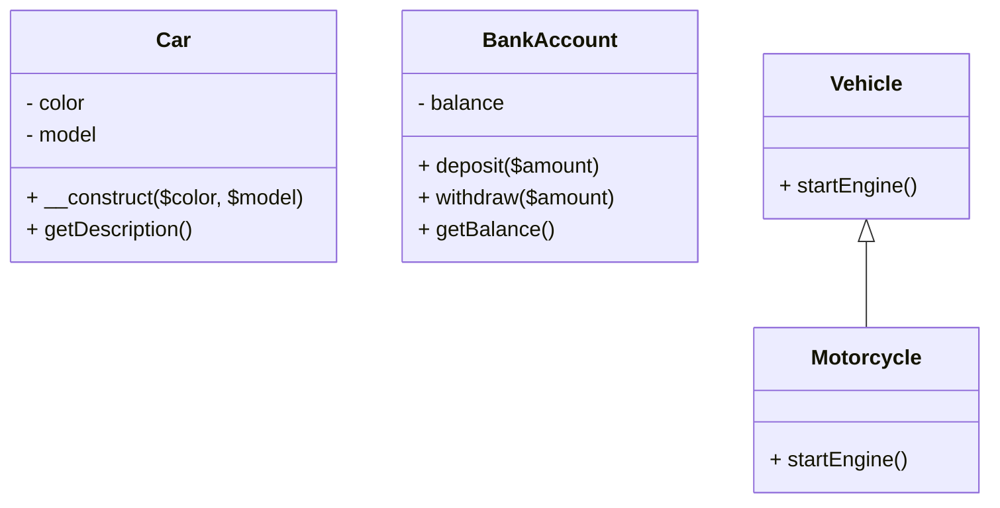

## 1.5 Overview of PHP Features Relevant to Design Patterns

Design patterns are essential tools in the arsenal of any proficient PHP developer. They provide a proven solution to common problems in software design, promoting code reusability, scalability, and maintainability. PHP, as a versatile and widely-used scripting language, offers a rich set of features that facilitate the implementation of these patterns. In this section, we will explore the key PHP features that are particularly relevant to design patterns, focusing on object-oriented programming capabilities and modern language enhancements introduced from PHP 7 onwards.

### Object-Oriented Programming in PHP

PHP's object-oriented programming (OOP) capabilities form the foundation for implementing many design patterns. Let's delve into the core OOP features that PHP provides:

#### Classes and Objects

Classes and objects are the building blocks of OOP in PHP. A class serves as a blueprint for creating objects, encapsulating data, and behavior.

```php
<?php
class Car {
    private $color;
    private $model;

    public function __construct($color, $model) {
        $this->color = $color;
        $this->model = $model;
    }

    public function getDescription() {
        return "This car is a {$this->color} {$this->model}.";
    }
}

$car = new Car('red', 'Toyota');
echo $car->getDescription(); // Outputs: This car is a red Toyota.
?>
```

**Key Takeaway:** Classes and objects allow us to encapsulate data and behavior, making it easier to implement patterns like Singleton, Factory, and Observer.

#### Encapsulation and Abstraction

Encapsulation hides the internal state of an object and requires all interaction to be performed through an object's methods. Abstraction, on the other hand, allows us to define complex systems in a simplified manner.

```php
<?php
class BankAccount {
    private $balance = 0;

    public function deposit($amount) {
        $this->balance += $amount;
    }

    public function withdraw($amount) {
        if ($amount <= $this->balance) {
            $this->balance -= $amount;
        } else {
            echo "Insufficient funds.";
        }
    }

    public function getBalance() {
        return $this->balance;
    }
}
?>
```

**Key Takeaway:** Encapsulation and abstraction are crucial for implementing patterns like Decorator and Proxy, where internal details are hidden from the client.

#### Inheritance and Polymorphism

Inheritance allows a class to inherit properties and methods from another class, while polymorphism enables objects to be treated as instances of their parent class.

```php
<?php
class Vehicle {
    public function startEngine() {
        echo "Engine started.";
    }
}

class Motorcycle extends Vehicle {
    public function startEngine() {
        echo "Motorcycle engine started.";
    }
}

$vehicle = new Motorcycle();
$vehicle->startEngine(); // Outputs: Motorcycle engine started.
?>
```

**Key Takeaway:** Inheritance and polymorphism are essential for patterns like Template Method and Strategy, where behavior can be overridden or extended.

#### Interfaces and Traits

Interfaces define a contract for classes, while traits allow for code reuse across different classes without inheritance.

```php
<?php
interface Logger {
    public function log($message);
}

class FileLogger implements Logger {
    public function log($message) {
        echo "Logging to a file: $message";
    }
}

trait SingletonTrait {
    private static $instance;

    public static function getInstance() {
        if (null === static::$instance) {
            static::$instance = new static();
        }
        return static::$instance;
    }
}
?>
```

**Key Takeaway:** Interfaces and traits are pivotal in implementing patterns like Adapter and Singleton, providing flexibility and reusability.

### Modern PHP Features (PHP 7 and Beyond)

PHP 7 introduced several language enhancements that have a significant impact on design patterns. Let's explore these features:

#### Scalar Type Declarations and Return Types

PHP 7 introduced scalar type declarations, allowing for stricter type checking, which enhances code reliability.

```php
<?php
function add(int $a, int $b): int {
    return $a + $b;
}

echo add(5, 10); // Outputs: 15
?>
```

**Key Takeaway:** Type declarations improve the robustness of patterns like Factory and Builder by ensuring correct data types.

#### Anonymous Classes and Arrow Functions

Anonymous classes provide a way to create classes without naming them, while arrow functions offer a concise syntax for writing closures.

```php
<?php
$logger = new class {
    public function log($message) {
        echo $message;
    }
};

$logger->log("Hello, World!"); // Outputs: Hello, World!

$add = fn($x, $y) => $x + $y;
echo $add(3, 4); // Outputs: 7
?>
```

**Key Takeaway:** Anonymous classes and arrow functions simplify the implementation of patterns like Command and Strategy by reducing boilerplate code.

#### Attributes (Annotations) in PHP 8

Attributes provide a way to add metadata to classes, methods, and properties, enhancing the flexibility of design patterns.

```php
<?php
#[Attribute]
class Route {
    public function __construct(public string $path) {}
}

class Controller {
    #[Route('/home')]
    public function home() {
        echo "Home page";
    }
}
?>
```

**Key Takeaway:** Attributes can be used in patterns like Decorator and Observer to add metadata-driven behavior.

#### Union Types and Nullsafe Operator

Union types allow a parameter or return value to accept multiple types, while the nullsafe operator simplifies null checks.

```php
<?php
function processInput(int|string $input) {
    echo "Processing: $input";
}

processInput(123); // Outputs: Processing: 123
processInput("abc"); // Outputs: Processing: abc

$user = null;
echo $user?->getName(); // Outputs: nothing, avoids error
?>
```

**Key Takeaway:** Union types and the nullsafe operator enhance the flexibility and safety of patterns like Factory and Builder.

#### Named Arguments and Match Expressions

Named arguments allow passing arguments based on parameter names, while match expressions provide a more powerful alternative to switch statements.

```php
<?php
function createUser(string $name, int $age) {
    echo "User: $name, Age: $age";
}

createUser(age: 25, name: "Alice"); // Outputs: User: Alice, Age: 25

$role = 'admin';
echo match ($role) {
    'admin' => 'Administrator',
    'editor' => 'Editor',
    default => 'Guest',
}; // Outputs: Administrator
?>
```

**Key Takeaway:** Named arguments and match expressions simplify the implementation of patterns like Strategy and State by improving code readability.

### PHP Unique Features for Design Patterns

PHP offers unique features that are particularly beneficial for implementing design patterns:

#### Namespaces and Autoloading

Namespaces prevent name collisions and organize code, while autoloading automatically loads classes when needed.

```php
<?php
namespace MyApp\Models;

class User {
    public function __construct() {
        echo "User model";
    }
}

spl_autoload_register(function ($class) {
    include $class . '.php';
});

$user = new \MyApp\Models\User(); // Outputs: User model
?>
```

**Key Takeaway:** Namespaces and autoloading are crucial for patterns like Singleton and Factory, ensuring organized and efficient code loading.

#### Magic Methods and Overloading

Magic methods provide hooks into object behavior, while overloading allows dynamic property and method handling.

```php
<?php
class Magic {
    private $data = [];

    public function __set($name, $value) {
        $this->data[$name] = $value;
    }

    public function __get($name) {
        return $this->data[$name] ?? null;
    }
}

$magic = new Magic();
$magic->name = "Magic Object";
echo $magic->name; // Outputs: Magic Object
?>
```

**Key Takeaway:** Magic methods and overloading are useful in patterns like Proxy and Decorator, enabling dynamic behavior.

#### Late Static Binding

Late static binding allows static methods to be called in the context of the class that was called, rather than the class where the method is defined.

```php
<?php
class Base {
    public static function who() {
        echo __CLASS__;
    }

    public static function test() {
        static::who();
    }
}

class Child extends Base {
    public static function who() {
        echo __CLASS__;
    }
}

Child::test(); // Outputs: Child
?>
```

**Key Takeaway:** Late static binding is essential for patterns like Singleton and Factory, where class context is crucial.

### Visualizing PHP Features and Design Patterns

To better understand how PHP features support design patterns, let's visualize some key concepts using Mermaid.js diagrams.



**Diagram Description:** This class diagram illustrates the relationship between classes and objects, encapsulation, inheritance, and polymorphism in PHP.

### Try It Yourself

Experiment with the code examples provided in this section. Try modifying the class properties, methods, and inheritance structures to see how PHP's OOP features interact with design patterns. Consider implementing a simple design pattern, such as Singleton or Factory, using the features discussed.

### References and Links

- [PHP Manual: Classes and Objects](https://www.php.net/manual/en/language.oop5.php)
- [PHP Manual: Anonymous Classes](https://www.php.net/manual/en/language.oop5.anonymous.php)
- [PHP Manual: Attributes](https://www.php.net/manual/en/language.attributes.php)
- [PHP Manual: Namespaces](https://www.php.net/manual/en/language.namespaces.php)

### Knowledge Check

- What are the benefits of using encapsulation in PHP?
- How do anonymous classes simplify the implementation of design patterns?
- Explain the role of namespaces in organizing PHP code.

### Embrace the Journey

Remember, this is just the beginning. As you progress, you'll discover more advanced design patterns and how PHP's features can be leveraged to implement them effectively. Keep experimenting, stay curious, and enjoy the journey!

## Quiz: Overview of PHP Features Relevant to Design Patterns



### What is the primary purpose of encapsulation in PHP?

- [x] To hide the internal state of an object and require interaction through methods
- [ ] To allow multiple inheritance
- [ ] To enable dynamic method calls
- [ ] To provide a global state

> **Explanation:** Encapsulation hides the internal state of an object and requires all interaction to be performed through an object's methods, promoting data integrity and security.

### Which PHP feature allows for stricter type checking in functions?

- [x] Scalar type declarations
- [ ] Anonymous classes
- [ ] Magic methods
- [ ] Late static binding

> **Explanation:** Scalar type declarations, introduced in PHP 7, allow for stricter type checking in function parameters and return types, enhancing code reliability.

### How do anonymous classes benefit design pattern implementation?

- [x] By reducing boilerplate code
- [ ] By enabling multiple inheritance
- [ ] By providing global state management
- [ ] By enforcing strict type checking

> **Explanation:** Anonymous classes provide a way to create classes without naming them, reducing boilerplate code and simplifying the implementation of certain design patterns.

### What is the purpose of the nullsafe operator in PHP?

- [x] To simplify null checks
- [ ] To enforce strict type checking
- [ ] To enable dynamic method calls
- [ ] To provide a global state

> **Explanation:** The nullsafe operator simplifies null checks by allowing method calls on potentially null objects without causing errors.

### Which PHP feature allows a parameter to accept multiple types?

- [x] Union types
- [ ] Anonymous classes
- [ ] Magic methods
- [ ] Late static binding

> **Explanation:** Union types, introduced in PHP 8, allow a parameter or return value to accept multiple types, enhancing flexibility in function definitions.

### What is the role of namespaces in PHP?

- [x] To prevent name collisions and organize code
- [ ] To enable multiple inheritance
- [ ] To provide global state management
- [ ] To enforce strict type checking

> **Explanation:** Namespaces prevent name collisions and organize code, making it easier to manage large codebases and implement design patterns effectively.

### How do magic methods enhance design pattern implementation?

- [x] By providing hooks into object behavior
- [ ] By enabling multiple inheritance
- [ ] By enforcing strict type checking
- [ ] By providing global state management

> **Explanation:** Magic methods provide hooks into object behavior, allowing for dynamic property and method handling, which is useful in patterns like Proxy and Decorator.

### What is the benefit of late static binding in PHP?

- [x] It allows static methods to be called in the context of the class that was called
- [ ] It enables multiple inheritance
- [ ] It provides global state management
- [ ] It enforces strict type checking

> **Explanation:** Late static binding allows static methods to be called in the context of the class that was called, rather than the class where the method is defined, which is essential for certain design patterns.

### Which PHP feature allows for adding metadata to classes and methods?

- [x] Attributes
- [ ] Anonymous classes
- [ ] Magic methods
- [ ] Late static binding

> **Explanation:** Attributes, introduced in PHP 8, provide a way to add metadata to classes, methods, and properties, enhancing the flexibility of design patterns.

### True or False: PHP's object-oriented features are essential for implementing design patterns.

- [x] True
- [ ] False

> **Explanation:** True. PHP's object-oriented features, such as classes, inheritance, and interfaces, are essential for implementing many design patterns effectively.


