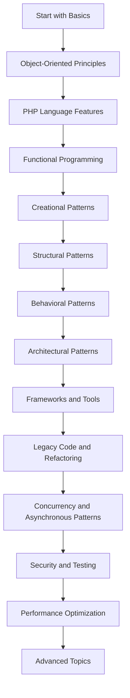

## 1.6 How to Use This Guide

Welcome to the **Classic and Modern Design Patterns in PHP | Comprehensive Guide**. This guide is meticulously crafted to help you navigate the intricate world of design patterns in PHP, enhancing your ability to write robust, maintainable, and scalable code. Whether you're a seasoned developer or just starting your journey, this guide is structured to provide you with the knowledge and tools necessary to master PHP design patterns.

### Navigating the Guide Effectively

To get the most out of this guide, it's essential to understand its structure and how to approach each section. Here's a roadmap to help you navigate through the content effectively:

#### 1. **Start with the Basics**

Begin with the **Introduction to Design Patterns in PHP**. This section lays the foundation by explaining what design patterns are, their history, and their importance in PHP development. Understanding these basics will provide you with the context needed to appreciate the more complex patterns discussed later.

#### 2. **Build on Object-Oriented Principles**

The **Principles of Object-Oriented Programming in PHP** section is crucial for grasping how design patterns are implemented. Ensure you have a solid understanding of classes, objects, encapsulation, inheritance, and polymorphism. These concepts are the building blocks of design patterns.

#### 3. **Explore PHP Language Features**

Familiarize yourself with **PHP Language Features and Best Practices**. This section covers modern PHP features, such as scalar type declarations, anonymous classes, and attributes, which are essential for implementing design patterns effectively.

#### 4. **Delve into Functional Programming**

While PHP is primarily an object-oriented language, understanding **Functional Programming in PHP** can provide you with additional tools and perspectives for solving problems. This section introduces functional programming concepts and how they can be integrated with design patterns.

#### 5. **Study Creational, Structural, and Behavioral Patterns**

The core of this guide lies in the sections on **Creational, Structural, and Behavioral Patterns**. Each pattern is explained in detail, with code examples and diagrams to illustrate their use. Take your time with these sections, as they form the backbone of design pattern knowledge.

#### 6. **Apply Patterns in Real-World Scenarios**

The sections on **Architectural Patterns**, **Dependency Injection**, and **Design Patterns for Database Interaction** demonstrate how patterns can be applied in real-world scenarios. These sections are invaluable for understanding how to structure large applications.

#### 7. **Leverage Frameworks and Tools**

Learn how to implement design patterns using popular PHP frameworks in the **Implementing Design Patterns in PHP Frameworks** section. This knowledge is crucial for modern PHP development, where frameworks like Laravel and Symfony are prevalent.

#### 8. **Address Legacy Code and Refactoring**

The **Working with Legacy Code and Refactoring** section provides strategies for introducing design patterns into existing codebases, a common challenge in professional development environments.

#### 9. **Embrace Concurrency and Asynchronous Patterns**

Understanding **Concurrency and Asynchronous Patterns in PHP** is essential for building high-performance applications. This section covers techniques for handling concurrent processes and asynchronous programming.

#### 10. **Focus on Security and Testing**

Security is paramount in software development. The sections on **Patterns for Security in PHP** and **Testing and Design Patterns in PHP** offer best practices for securing your applications and ensuring they function correctly.

#### 11. **Optimize for Performance and Scalability**

The **Performance Optimization Patterns** section provides strategies for improving the efficiency and scalability of your applications, a critical aspect of modern web development.

#### 12. **Explore Advanced Topics**

Finally, explore advanced topics such as **Microservices Design Patterns**, **Frontend Integration**, and **Internationalization and Localization** to broaden your understanding of PHP's capabilities.

### Recommended Prerequisites

To fully benefit from this guide, it's recommended that you have:

- A solid understanding of PHP syntax and basic programming concepts.
- Familiarity with object-oriented programming principles.
- Experience with PHP frameworks like Laravel or Symfony is beneficial but not required.
- A willingness to experiment and apply what you learn through practice.

### Practical Application and Further Practice

To reinforce your learning and gain practical experience, consider the following suggestions:

#### 1. **Experiment with Code Examples**

Each section includes code examples that illustrate the concepts discussed. Try modifying these examples to see how changes affect the outcome. This hands-on approach will deepen your understanding.

#### 2. **Build a Project**

Apply what you've learned by building a small project. Choose a simple application, such as a to-do list or a blog, and implement various design patterns. This exercise will help you see how patterns fit together in a real-world context.

#### 3. **Participate in Online Communities**

Join PHP development communities, such as forums or social media groups, to discuss design patterns and share your experiences. Engaging with others can provide new insights and help you overcome challenges.

#### 4. **Contribute to Open Source**

Consider contributing to open-source PHP projects. This experience will expose you to different coding styles and patterns, enhancing your skills and understanding.

#### 5. **Continue Learning**

Design patterns are just one aspect of software development. Continue to expand your knowledge by exploring related topics, such as software architecture, testing methodologies, and new PHP features.

### Visualizing Your Learning Path

To help you visualize your learning journey, here's a simple flowchart illustrating the recommended path through this guide:

### Embrace the Journey

Remember, mastering design patterns in PHP is a journey, not a destination. As you progress through this guide, you'll build a deeper understanding of how to create efficient, maintainable, and scalable applications. Stay curious, keep experimenting, and enjoy the process of learning and growing as a developer.

## Quiz: How to Use This Guide



### What is the first recommended step in using this guide effectively?

- [x] Start with the basics of design patterns in PHP.
- [ ] Jump straight to advanced topics.
- [ ] Focus only on code examples.
- [ ] Skip the introduction.

> **Explanation:** Starting with the basics provides the necessary foundation for understanding more complex topics.

### Which section is crucial for understanding the implementation of design patterns?

- [x] Principles of Object-Oriented Programming in PHP
- [ ] Functional Programming in PHP
- [ ] Concurrency and Asynchronous Patterns
- [ ] Patterns for Frontend Integration

> **Explanation:** Object-oriented principles are the building blocks for implementing design patterns.

### What is a recommended prerequisite for using this guide?

- [x] Familiarity with object-oriented programming principles.
- [ ] Extensive experience with JavaScript.
- [ ] Knowledge of Python.
- [ ] Understanding of database management.

> **Explanation:** Object-oriented programming principles are essential for understanding design patterns in PHP.

### What should you do to reinforce your learning from this guide?

- [x] Experiment with code examples.
- [ ] Only read the text.
- [ ] Avoid online communities.
- [ ] Skip building projects.

> **Explanation:** Experimenting with code examples helps deepen understanding through practical application.

### Which section provides strategies for introducing design patterns into existing codebases?

- [x] Working with Legacy Code and Refactoring
- [ ] Microservices Design Patterns
- [ ] Patterns for Security in PHP
- [ ] Testing and Design Patterns in PHP

> **Explanation:** The section on legacy code and refactoring focuses on integrating design patterns into existing code.

### What is the benefit of joining PHP development communities?

- [x] Gaining new insights and overcoming challenges.
- [ ] Avoiding collaboration.
- [ ] Limiting exposure to different coding styles.
- [ ] Focusing only on personal projects.

> **Explanation:** Engaging with communities can provide new insights and help overcome challenges.

### What is a suggested way to apply what you've learned from this guide?

- [x] Build a small project using design patterns.
- [ ] Only read about design patterns.
- [ ] Focus solely on theoretical knowledge.
- [ ] Avoid practical application.

> **Explanation:** Building a project helps apply theoretical knowledge in a practical context.

### Which section covers modern PHP features essential for implementing design patterns?

- [x] PHP Language Features and Best Practices
- [ ] Functional Programming in PHP
- [ ] Patterns for Security in PHP
- [ ] Testing and Design Patterns in PHP

> **Explanation:** This section covers modern PHP features that are crucial for implementing design patterns.

### What is the focus of the Performance Optimization Patterns section?

- [x] Strategies for improving efficiency and scalability.
- [ ] Only security best practices.
- [ ] Frontend integration techniques.
- [ ] Legacy code management.

> **Explanation:** Performance optimization focuses on improving the efficiency and scalability of applications.

### True or False: Mastering design patterns in PHP is a journey, not a destination.

- [x] True
- [ ] False

> **Explanation:** Mastering design patterns is an ongoing process of learning and growth.



By following this guide and engaging with the material, you'll be well on your way to mastering design patterns in PHP. Enjoy the journey and the growth that comes with it!
