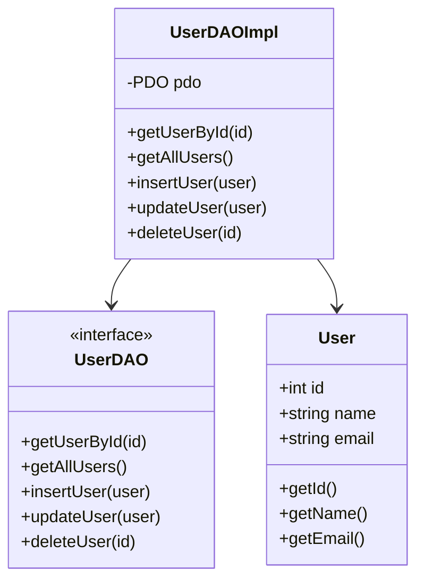

## 10.1 Data Access Object (DAO) Pattern

In the realm of software design patterns, the Data Access Object (DAO) pattern stands out as a critical tool for managing data access logic in a structured and efficient manner. This pattern is particularly useful in PHP applications where database interaction is a common requirement. By abstracting and encapsulating all access to the data source, the DAO pattern provides a simple API that promotes code reuse and maintainability.

### Intent

The primary intent of the DAO pattern is to separate the data access logic from the business logic of an application. This separation allows developers to focus on the core functionality of their application without being bogged down by the intricacies of database interactions. By providing a clear and consistent API for data access, the DAO pattern simplifies the process of performing CRUD (Create, Read, Update, Delete) operations on a database.

### Key Participants

1. **DAO Interface**: Defines the standard operations to be performed on a model object(s).
2. **Concrete DAO Class**: Implements the DAO interface and interacts with the data source.
3. **Model/Entity Class**: Represents the data structure that the DAO will manage.
4. **Client**: Uses the DAO to perform data operations.

### Applicability

The DAO pattern is applicable in scenarios where:
- You need to separate data access logic from business logic.
- You want to promote code reuse and maintainability.
- You are working with multiple data sources or databases.
- You need to implement a consistent API for data operations.

### Implementing DAO in PHP

Let's delve into the implementation of the DAO pattern in PHP. We'll create a simple application that manages a list of users in a database. This example will demonstrate how to create DAO classes for each data entity and implement CRUD operations.

#### Step 1: Define the Model Class

The model class represents the data structure that the DAO will manage. In this case, we'll create a `User` class.

```php
<?php

class User {
    private $id;
    private $name;
    private $email;

    public function __construct($id, $name, $email) {
        $this->id = $id;
        $this->name = $name;
        $this->email = $email;
    }

    public function getId() {
        return $this->id;
    }

    public function getName() {
        return $this->name;
    }

    public function getEmail() {
        return $this->email;
    }
}
```

#### Step 2: Define the DAO Interface

The DAO interface defines the standard operations to be performed on the `User` object.

```php
<?php

interface UserDAO {
    public function getUserById($id);
    public function getAllUsers();
    public function insertUser(User $user);
    public function updateUser(User $user);
    public function deleteUser($id);
}
```

#### Step 3: Implement the Concrete DAO Class

The concrete DAO class implements the DAO interface and interacts with the database. We'll use PDO (PHP Data Objects) for database interaction.

```php
<?php

class UserDAOImpl implements UserDAO {
    private $pdo;

    public function __construct(PDO $pdo) {
        $this->pdo = $pdo;
    }

    public function getUserById($id) {
        $stmt = $this->pdo->prepare("SELECT * FROM users WHERE id = :id");
        $stmt->bindParam(':id', $id, PDO::PARAM_INT);
        $stmt->execute();
        $row = $stmt->fetch(PDO::FETCH_ASSOC);

        if ($row) {
            return new User($row['id'], $row['name'], $row['email']);
        }

        return null;
    }

    public function getAllUsers() {
        $stmt = $this->pdo->query("SELECT * FROM users");
        $users = [];

        while ($row = $stmt->fetch(PDO::FETCH_ASSOC)) {
            $users[] = new User($row['id'], $row['name'], $row['email']);
        }

        return $users;
    }

    public function insertUser(User $user) {
        $stmt = $this->pdo->prepare("INSERT INTO users (name, email) VALUES (:name, :email)");
        $stmt->bindParam(':name', $user->getName());
        $stmt->bindParam(':email', $user->getEmail());
        $stmt->execute();
    }

    public function updateUser(User $user) {
        $stmt = $this->pdo->prepare("UPDATE users SET name = :name, email = :email WHERE id = :id");
        $stmt->bindParam(':name', $user->getName());
        $stmt->bindParam(':email', $user->getEmail());
        $stmt->bindParam(':id', $user->getId(), PDO::PARAM_INT);
        $stmt->execute();
    }

    public function deleteUser($id) {
        $stmt = $this->pdo->prepare("DELETE FROM users WHERE id = :id");
        $stmt->bindParam(':id', $id, PDO::PARAM_INT);
        $stmt->execute();
    }
}
```

#### Step 4: Using the DAO

Now that we have our DAO implemented, we can use it to perform data operations.

```php
<?php

// Database connection
$pdo = new PDO('mysql:host=localhost;dbname=testdb', 'username', 'password');

// Create DAO
$userDAO = new UserDAOImpl($pdo);

// Insert a new user
$newUser = new User(null, 'John Doe', 'john.doe@example.com');
$userDAO->insertUser($newUser);

// Get all users
$users = $userDAO->getAllUsers();
foreach ($users as $user) {
    echo $user->getName() . " - " . $user->getEmail() . "\n";
}

// Update a user
$existingUser = $userDAO->getUserById(1);
if ($existingUser) {
    $existingUser = new User($existingUser->getId(), 'Jane Doe', 'jane.doe@example.com');
    $userDAO->updateUser($existingUser);
}

// Delete a user
$userDAO->deleteUser(2);
```

### Design Considerations

- **When to Use**: Use the DAO pattern when you need to separate data access logic from business logic, especially in applications with complex data interactions.
- **Considerations**: Ensure that the DAO layer is well-defined and consistent. Avoid mixing business logic with data access logic within the DAO.

### PHP Unique Features

PHP offers several features that make implementing the DAO pattern straightforward:
- **PDO**: PHP Data Objects provide a consistent interface for accessing databases, making it easier to implement DAOs.
- **Type Hinting**: PHP's type hinting allows for more robust and error-free code, especially when dealing with complex data structures.

### Differences and Similarities

The DAO pattern is often confused with the Repository pattern. While both patterns deal with data access, the Repository pattern is more focused on the business logic layer and often includes domain-specific operations.

### Visualizing the DAO Pattern

To better understand the DAO pattern, let's visualize the interaction between the different components using a class diagram.



### Use Cases and Examples

The DAO pattern is widely used in applications that require a clear separation between data access and business logic. Here are some common use cases:

- **Enterprise Applications**: Large-scale applications with complex data interactions benefit from the DAO pattern's ability to simplify data access logic.
- **Web Applications**: PHP-based web applications often use the DAO pattern to manage database interactions in a structured manner.
- **Microservices**: In a microservices architecture, the DAO pattern can be used to manage data access for individual services, promoting modularity and reusability.

### Try It Yourself

Now that we've covered the basics of the DAO pattern, it's time to experiment with the code. Try modifying the `UserDAOImpl` class to add additional methods, such as searching for users by name or email. You can also experiment with different database configurations and see how the DAO pattern simplifies the process of switching between data sources.

### Knowledge Check

Before we wrap up, let's reinforce what we've learned with a few questions:

- What is the primary intent of the DAO pattern?
- How does the DAO pattern promote code reuse and maintainability?
- What are the key components of the DAO pattern?
- How does the DAO pattern differ from the Repository pattern?

### Embrace the Journey

Remember, mastering design patterns like DAO is just the beginning of your journey as a PHP developer. As you continue to explore and experiment with different patterns, you'll gain a deeper understanding of how to build robust and maintainable applications. Keep experimenting, stay curious, and enjoy the journey!

## Quiz: Data Access Object (DAO) Pattern



### What is the primary intent of the DAO pattern?

- [x] To abstract and encapsulate all access to the data source, providing a simple API.
- [ ] To integrate business logic with data access logic.
- [ ] To provide a graphical user interface for database operations.
- [ ] To replace the need for a database entirely.

> **Explanation:** The DAO pattern aims to abstract and encapsulate data access, providing a simple API for database interactions.

### Which of the following is a key participant in the DAO pattern?

- [x] DAO Interface
- [ ] Service Layer
- [ ] Controller
- [ ] View

> **Explanation:** The DAO Interface defines the standard operations to be performed on a model object(s).

### How does the DAO pattern promote code reuse?

- [x] By providing a consistent API for data operations.
- [ ] By integrating directly with the user interface.
- [ ] By storing data in multiple formats.
- [ ] By eliminating the need for a database.

> **Explanation:** The DAO pattern promotes code reuse by providing a consistent API for data operations, separating data access logic from business logic.

### What is a common use case for the DAO pattern?

- [x] Enterprise applications with complex data interactions.
- [ ] Simple static websites.
- [ ] Applications without any database.
- [ ] Real-time gaming applications.

> **Explanation:** The DAO pattern is commonly used in enterprise applications with complex data interactions to simplify data access logic.

### What PHP feature is particularly useful for implementing the DAO pattern?

- [x] PDO (PHP Data Objects)
- [ ] HTML
- [ ] CSS
- [ ] JavaScript

> **Explanation:** PDO provides a consistent interface for accessing databases, making it easier to implement DAOs in PHP.

### What is the difference between the DAO and Repository patterns?

- [x] DAO focuses on data access logic, while Repository focuses on business logic.
- [ ] DAO is used for UI components, while Repository is used for data storage.
- [ ] DAO is a type of database, while Repository is a type of server.
- [ ] DAO and Repository are the same.

> **Explanation:** DAO focuses on data access logic, while the Repository pattern is more focused on the business logic layer.

### Which method is NOT typically part of a DAO interface?

- [ ] getUserById()
- [ ] getAllUsers()
- [ ] insertUser()
- [x] renderUserView()

> **Explanation:** renderUserView() is related to UI rendering, not data access, and is not typically part of a DAO interface.

### What is a benefit of using the DAO pattern?

- [x] It separates data access logic from business logic.
- [ ] It integrates data access with the user interface.
- [ ] It eliminates the need for a database.
- [ ] It provides a graphical user interface for database operations.

> **Explanation:** The DAO pattern separates data access logic from business logic, promoting maintainability and code reuse.

### How can the DAO pattern simplify switching between data sources?

- [x] By providing a consistent API for data operations.
- [ ] By storing data in multiple formats.
- [ ] By integrating directly with the user interface.
- [ ] By eliminating the need for a database.

> **Explanation:** The DAO pattern simplifies switching between data sources by providing a consistent API for data operations.

### True or False: The DAO pattern is only applicable to PHP applications.

- [ ] True
- [x] False

> **Explanation:** The DAO pattern is not limited to PHP applications; it can be applied in any programming language that requires structured data access logic.


