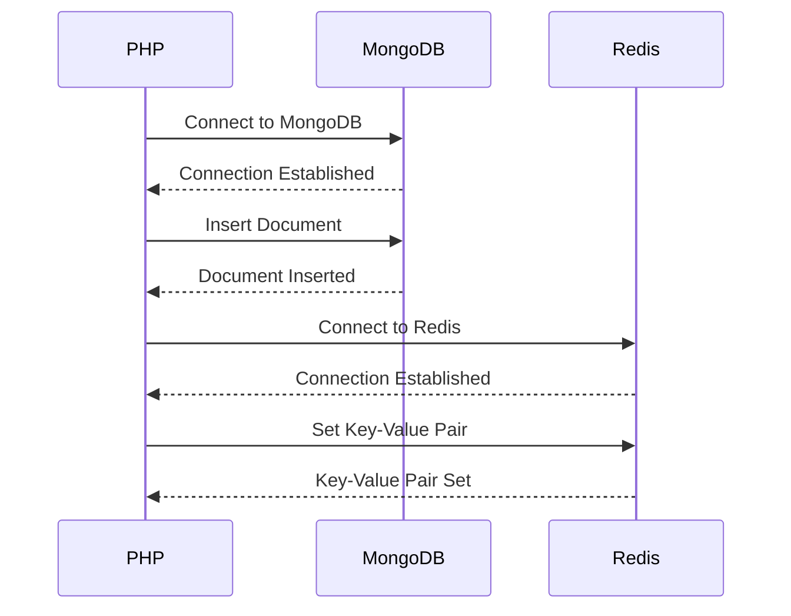

## 10.10 NoSQL Databases and PHP

In the evolving landscape of web development, the need for flexible, scalable, and high-performance data storage solutions has led to the rise of NoSQL databases. Unlike traditional relational databases, NoSQL databases offer a schema-less design, enabling developers to store and retrieve data in a more dynamic and efficient manner. In this section, we will explore how PHP, a popular server-side scripting language, can be integrated with NoSQL databases such as MongoDB and Redis. We will delve into the libraries and drivers available for PHP, discuss use cases, and provide code examples to illustrate the integration process.

### Understanding NoSQL Databases

NoSQL databases are designed to handle large volumes of data and provide high availability and scalability. They are categorized into several types, including document stores, key-value stores, column-family stores, and graph databases. Each type is optimized for specific use cases:

- **Document Stores**: Store data in JSON-like documents. MongoDB is a prime example.
- **Key-Value Stores**: Store data as a collection of key-value pairs. Redis is a popular choice.
- **Column-Family Stores**: Store data in columns rather than rows, suitable for analytical applications.
- **Graph Databases**: Store data in nodes and edges, ideal for applications with complex relationships.

### Why Use NoSQL with PHP?

PHP is widely used for web development due to its simplicity and flexibility. Integrating NoSQL databases with PHP can enhance application performance and scalability. Here are some reasons to consider using NoSQL databases with PHP:

- **Flexibility**: NoSQL databases allow for dynamic schemas, making it easier to adapt to changing data requirements.
- **Scalability**: They are designed to scale horizontally, handling large volumes of data and high traffic loads.
- **Performance**: NoSQL databases can provide faster read and write operations compared to traditional relational databases.
- **Complex Data Structures**: They can efficiently handle complex data structures and relationships.

### PHP Libraries and Drivers for NoSQL Databases

To interact with NoSQL databases, PHP developers can leverage various libraries and drivers. Let's explore some of the most popular options:

#### MongoDB PHP Library

MongoDB is a widely-used document store that allows for flexible data modeling. The MongoDB PHP Library provides a robust interface for interacting with MongoDB databases.

- **Installation**: You can install the MongoDB PHP Library using Composer:

  ```bash
  composer require mongodb/mongodb
  ```

- **Basic Usage**: Here's a simple example of connecting to a MongoDB database and performing CRUD operations:

  ```php
  <?php
  require 'vendor/autoload.php';

  use MongoDB\Client;

  // Connect to MongoDB
  $client = new Client("mongodb://localhost:27017");

  // Select a database and collection
  $collection = $client->mydatabase->mycollection;

  // Insert a document
  $insertResult = $collection->insertOne(['name' => 'Alice', 'age' => 25]);
  echo "Inserted with Object ID '{$insertResult->getInsertedId()}'";

  // Find a document
  $document = $collection->findOne(['name' => 'Alice']);
  echo "Found document: ", json_encode($document);

  // Update a document
  $updateResult = $collection->updateOne(
      ['name' => 'Alice'],
      ['$set' => ['age' => 26]]
  );
  echo "Matched {$updateResult->getMatchedCount()} document(s) and modified {$updateResult->getModifiedCount()} document(s)";

  // Delete a document
  $deleteResult = $collection->deleteOne(['name' => 'Alice']);
  echo "Deleted {$deleteResult->getDeletedCount()} document(s)";
  ```

- **Link**: [MongoDB PHP Library](https://docs.mongodb.com/php-library/)

#### Predis for Redis

Redis is an in-memory key-value store known for its speed and versatility. Predis is a popular PHP client for Redis.

- **Installation**: Install Predis using Composer:

  ```bash
  composer require predis/predis
  ```

- **Basic Usage**: Here's how you can use Predis to interact with a Redis server:

  ```php
  <?php
  require 'vendor/autoload.php';

  $client = new Predis\Client();

  // Set a key-value pair
  $client->set('name', 'Bob');

  // Get the value of a key
  $value = $client->get('name');
  echo "The value of 'name' is: $value";

  // Increment a value
  $client->incr('counter');
  echo "Counter value: ", $client->get('counter');

  // Delete a key
  $client->del(['name']);
  ```

- **Link**: [Predis - A Redis Client for PHP](https://github.com/predis/predis)

### Use Cases for NoSQL Databases with PHP

NoSQL databases are suitable for a variety of applications, particularly those requiring flexible schemas or high performance. Here are some common use cases:

- **Content Management Systems (CMS)**: NoSQL databases can store diverse content types without predefined schemas.
- **Real-Time Analytics**: They can handle large volumes of data and provide quick access for analytics.
- **E-commerce Platforms**: NoSQL databases can manage product catalogs, user profiles, and shopping carts efficiently.
- **Social Networks**: They can store and retrieve user-generated content and relationships quickly.

### Design Patterns for NoSQL Database Interaction

When integrating NoSQL databases with PHP, it's essential to follow design patterns that promote maintainability and scalability. Here are some patterns to consider:

#### Repository Pattern

The Repository Pattern provides a way to encapsulate data access logic, making it easier to manage and test.

- **Implementation**: Create a repository class that handles CRUD operations for a specific entity.

  ```php
  <?php
  class UserRepository {
      private $collection;

      public function __construct($collection) {
          $this->collection = $collection;
      }

      public function find($id) {
          return $this->collection->findOne(['_id' => new MongoDB\BSON\ObjectId($id)]);
      }

      public function save($user) {
          return $this->collection->insertOne($user);
      }

      public function update($id, $data) {
          return $this->collection->updateOne(['_id' => new MongoDB\BSON\ObjectId($id)], ['$set' => $data]);
      }

      public function delete($id) {
          return $this->collection->deleteOne(['_id' => new MongoDB\BSON\ObjectId($id)]);
      }
  }
  ```

#### Data Mapper Pattern

The Data Mapper Pattern separates the in-memory representation of data from the database schema, allowing for more flexible data manipulation.

- **Implementation**: Create a data mapper class that translates between the database and the application's data structures.

  ```php
  <?php
  class UserMapper {
      private $collection;

      public function __construct($collection) {
          $this->collection = $collection;
      }

      public function mapToEntity($document) {
          return new User($document['_id'], $document['name'], $document['email']);
      }

      public function mapToDocument($user) {
          return [
              '_id' => $user->getId(),
              'name' => $user->getName(),
              'email' => $user->getEmail()
          ];
      }
  }
  ```

### Visualizing NoSQL Database Integration

To better understand how PHP interacts with NoSQL databases, let's visualize the process using a sequence diagram.



### Try It Yourself

To deepen your understanding, try modifying the code examples provided:

- **MongoDB**: Experiment with different query operators and aggregation pipelines.
- **Redis**: Explore Redis data structures such as lists, sets, and hashes.

### Further Reading

For more information on NoSQL databases and PHP integration, consider the following resources:

- [MongoDB Documentation](https://docs.mongodb.com/)
- [Redis Documentation](https://redis.io/documentation)
- [PHP: The Right Way](https://phptherightway.com/)

### Key Takeaways

- NoSQL databases offer flexibility, scalability, and performance benefits over traditional relational databases.
- PHP provides robust libraries and drivers for integrating with NoSQL databases like MongoDB and Redis.
- Design patterns such as Repository and Data Mapper can enhance the maintainability of your codebase.

## Quiz: NoSQL Databases and PHP



### Which of the following is a document store NoSQL database?

- [x] MongoDB
- [ ] Redis
- [ ] MySQL
- [ ] PostgreSQL

> **Explanation:** MongoDB is a document store NoSQL database, while Redis is a key-value store, and MySQL and PostgreSQL are relational databases.


### What is the primary benefit of using NoSQL databases?

- [x] Flexibility and scalability
- [ ] Strict schema enforcement
- [ ] Complex joins
- [ ] Limited data types

> **Explanation:** NoSQL databases provide flexibility and scalability, allowing for dynamic schemas and horizontal scaling.


### Which PHP library is used to interact with MongoDB?

- [x] MongoDB PHP Library
- [ ] Predis
- [ ] PDO
- [ ] MySQLi

> **Explanation:** The MongoDB PHP Library is used to interact with MongoDB databases in PHP.


### What type of NoSQL database is Redis?

- [x] Key-Value Store
- [ ] Document Store
- [ ] Column-Family Store
- [ ] Graph Database

> **Explanation:** Redis is a key-value store, known for its speed and versatility.


### Which design pattern encapsulates data access logic?

- [x] Repository Pattern
- [ ] Singleton Pattern
- [ ] Observer Pattern
- [ ] Factory Pattern

> **Explanation:** The Repository Pattern encapsulates data access logic, making it easier to manage and test.


### What command is used to install the MongoDB PHP Library via Composer?

- [x] composer require mongodb/mongodb
- [ ] composer require predis/predis
- [ ] composer install mongodb
- [ ] composer update mongodb

> **Explanation:** The command `composer require mongodb/mongodb` is used to install the MongoDB PHP Library via Composer.


### Which pattern separates in-memory data representation from the database schema?

- [x] Data Mapper Pattern
- [ ] Active Record Pattern
- [ ] Singleton Pattern
- [ ] Factory Pattern

> **Explanation:** The Data Mapper Pattern separates the in-memory representation of data from the database schema.


### What is the main advantage of using Predis with Redis?

- [x] It provides a robust PHP client for Redis.
- [ ] It is used for MongoDB integration.
- [ ] It enforces strict schemas.
- [ ] It is a relational database client.

> **Explanation:** Predis provides a robust PHP client for interacting with Redis.


### True or False: NoSQL databases are designed to handle complex joins.

- [ ] True
- [x] False

> **Explanation:** NoSQL databases are not designed for complex joins; they focus on flexibility and scalability.


### Which of the following is a key feature of NoSQL databases?

- [x] Schema-less design
- [ ] Complex transactions
- [ ] Strict data types
- [ ] Limited scalability

> **Explanation:** NoSQL databases feature a schema-less design, allowing for flexible data modeling.



Remember, integrating NoSQL databases with PHP opens up a world of possibilities for building scalable and high-performance applications. Keep experimenting, stay curious, and enjoy the journey!
